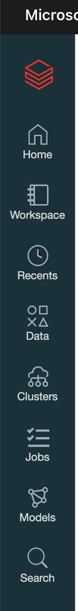
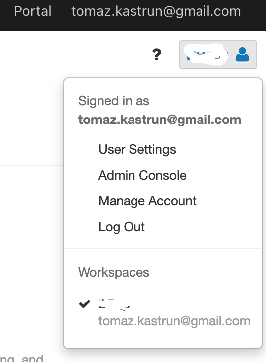

<!-- README.md was wriiten in beautiful MacDown  -->
# Dec 03 2020 - Getting to know the workspace and Azure Databricks platform

<!-- badges: start -->

<!-- badges: end -->

Azure Databricks repository is 
a set of blogposts as a Advent of 2020 present to readers for easier onboarding
to Azure Databricks! 

Series of Azure Databricks posts:

<ul><li>Dec 01: <a rel="noreferrer noopener" href="https://github.com/tomaztk/Azure-Databricks/blob/main/%20Dec%2001%202020%20-%20What%20is%20Azure%20DataBricks.md" target="_blank">What is Azure Databricks</a></li><li>Dec 02: <a href="https://github.com/tomaztk/Azure-Databricks/blob/main/%20Dec%2002%202020%20-%20How%20to%20get%20started%20with%20Azure%20Databricks.md" target="_blank" rel="noreferrer noopener">How to get started with Azure Databricks</a></li></ul>

We have learned what Azure Databricks is and looked how to get started with the platform. Now that we have this covered, let's get familiar with the workspace and the platform.

You will be re-directed to signed-in to Azure Databricks platform. And you will also see the IAM integration with Azure Active Directory Single Sign-on is done smooth. This is especially welcoming for enterprises and businesses that whole IAM policy can be federated  using AD.

On <a rel="noreferrer noopener" href="https://portal.azure.com/" target="_blank">Azure portal</a> go to Azure Databricks services and launch workspace.

On main console page of Azure Databricks you will find the following sections:

<!-- wp:list {"ordered":true} -->
<ol><li>Main vertical navigation bar, that will be available all the time and gives users simple transitions from one task (or page) to another.</li><li>Common tasks to get started immediately with one desired task</li><li>Importing &amp; Exploring data is task for Drag&amp;Dropping your external data to DBFS system</li><li>Starting new notebook or getting some additional information on Databricks documentation and Release notes</li><li>Settings for any user settings, administration of the console and management.</li></ol>
<!-- /wp:list -->

<!-- wp:paragraph -->

When you will be using Azure Databricks, the vertical navigation bar (1) and Settings (5) will always be available for you to access.

<!-- /wp:paragraph -->

### Navigation bar

Thanks to the intuitive and self-explanatory icons and names, there is no need to explain what each icon represents.

- Home - this will always get you at the console page, no matter where you are.
- Workspaces - this page is where all the collaboration will happen, where user will have data, notebooks and all the work at their disposal. Workspaces is by far - from data engineer, data scientist, machine learning engineer point of view - the most important section
- Recents - where you will find all recently used documents, data, services in Azure Databricks
- Data - is access point to all the data - databases and tables that reside on  DBFS and as files; in order to see the data, a cluster must be up and running, due to the nature of Spark data distribution
- Clusters - is a VM in the background that runs the Azure Databricks. Without the cluster up and running, the whole Azure Databricks will not work. Here you can setup new cluster, shut down a cluster, manage the cluster, attach cluster to notebook or to a job, create job cluster and setup the pools. This is the "horses" behind the code and it is the compute power, decoupled from the notebooks in order to give it scalability.
- Jobs - is a overview of scheduled (crontab) jobs that are executing and are available to user. This is the control center for job overview, job history, troubleshooting and administration of the jobs.
- Models - page that gives you overview and tracking of your machine learning models, operations over the model, artefacts, metadata and parameters for particular model or a run of a model.
- Search - is a fast, easy and user-friendly way to search your workspace.

### Settings

Here you will have overview of your service, user management and account:

- User setting - where you can setup personal access tokens for Databricks API, manage GIT integration and notebooks settings 
- Admin console - where administrator will set IAM policies, security and group access and enabling/disabling additional services as Databricks genomics, Container services, workspaces behaviour, etc.
- Manage account - will redirect you to start page on Azure dashboard for managing of the Azure account that you are using to access Azure Databricks.
- Log Out - will log out you from Azure Databricks.

This will get you around the platform. Tomorrow we will start exploring the clusters!

Complete set of code and Notebooks will be available at the Github repository.

Stay Healthy! See you tomorrow.

