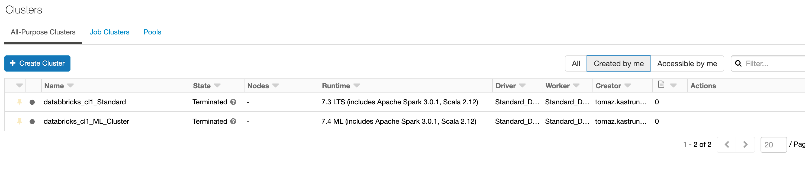
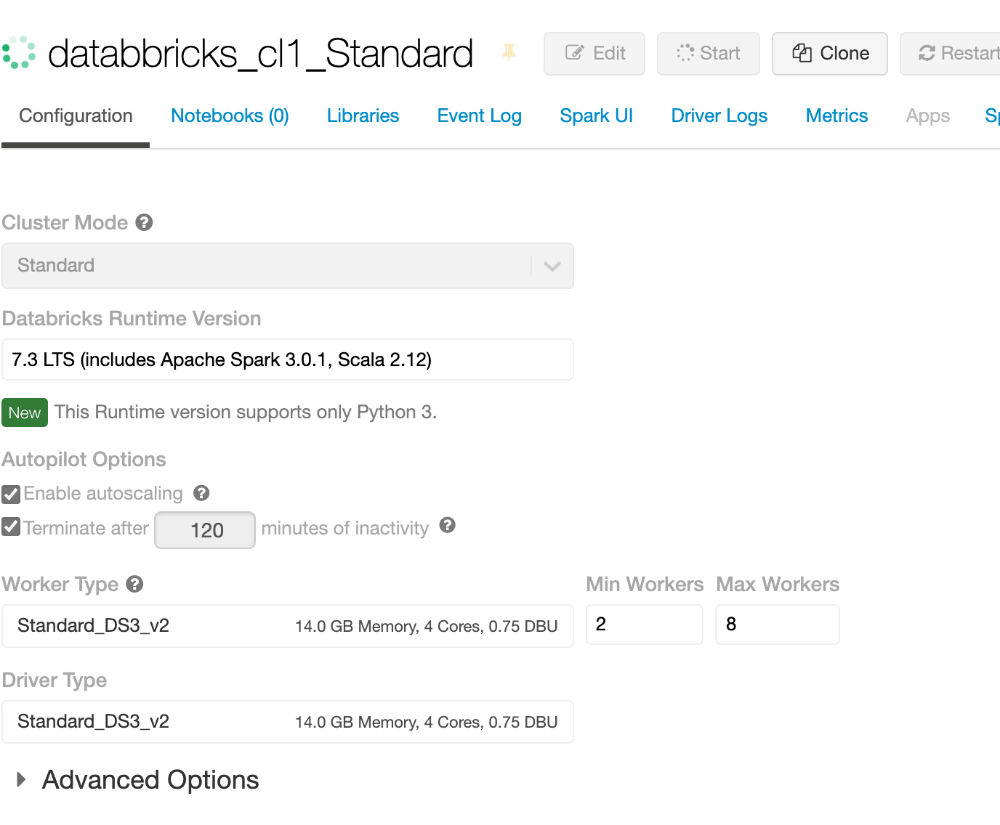
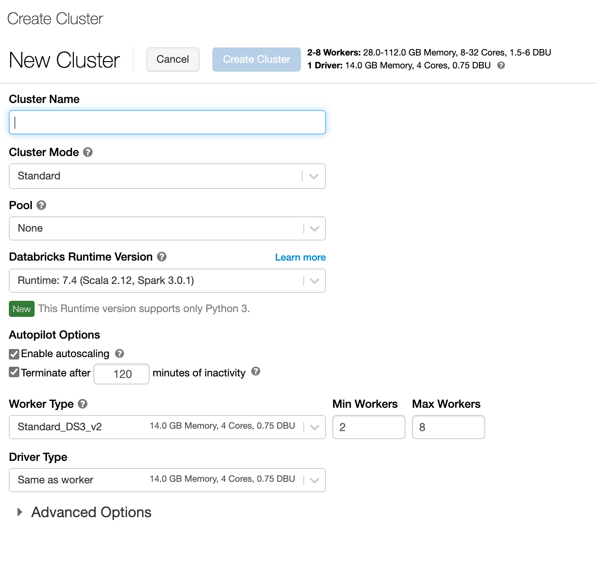
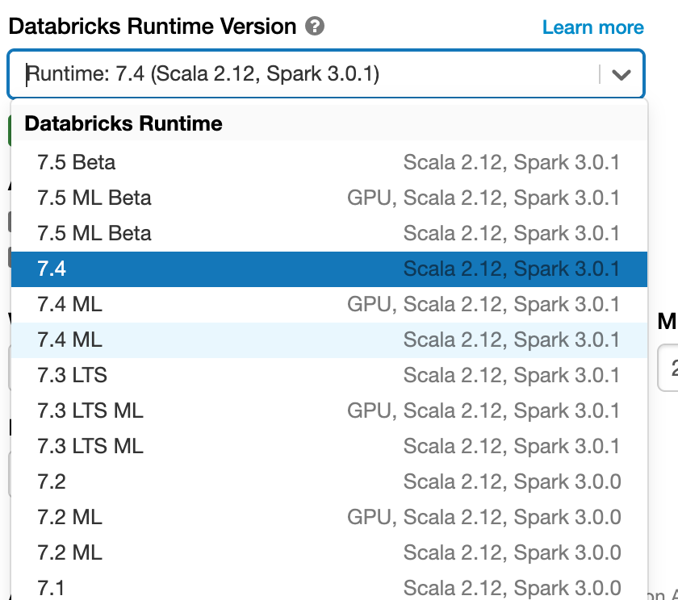
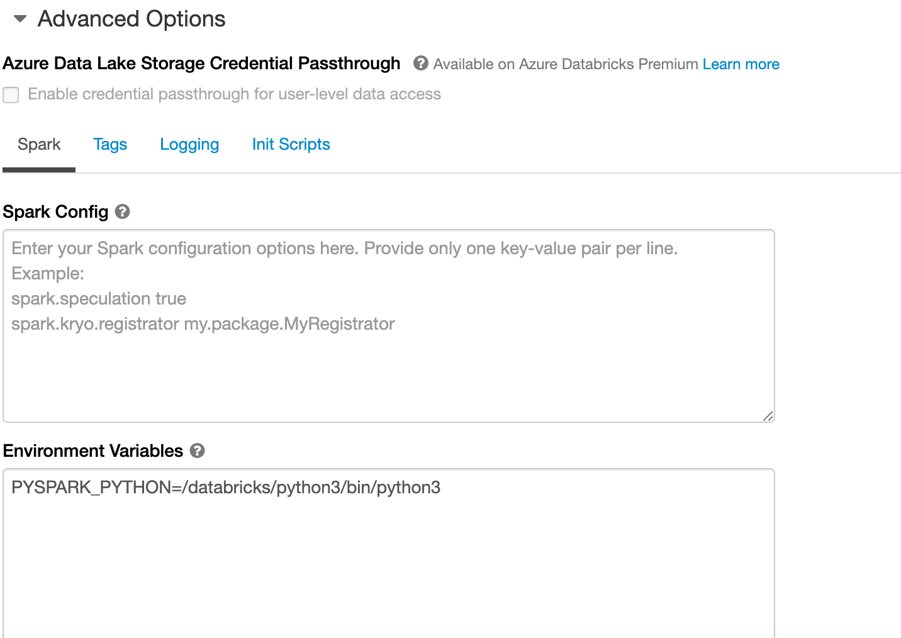

<!-- README.md was wriiten in beautiful MacDown  -->
# Dec 04 2020 - Creating your first Azure Databricks cluster

<!-- badges: start -->

<!-- badges: end -->

Azure Databricks repository is 
a set of blogposts as a Advent of 2020 present to readers for easier onboarding
to Azure Databricks! 

<!-- wp:paragraph -->

Series of Azure Databricks posts:

<!-- /wp:paragraph -->

<!-- wp:list -->
<ul><li>Dec 01: <a rel="noreferrer noopener" href="https://tomaztsql.wordpress.com/2020/12/01/advent-of-2020-day-1-what-is-azure-databricks/" target="_blank">What is Azure Databricks</a></li><li>Dec 02: <a rel="noreferrer noopener" href="https://tomaztsql.wordpress.com/2020/12/02/advent-of-2020-day-2-how-to-get-started-with-azure-databricks/" target="_blank">How to get started with Azure Databricks</a></li><li>Dec 03: <a href="https://tomaztsql.wordpress.com/2020/12/03/advent-of-2020-day-3-getting-to-know-the-workspace-and-azure-databricks-platform/" target="_blank" rel="noreferrer noopener">Getting to know the workspace and Azure Databricks platform</a></li></ul>
<!-- /wp:list -->

<!-- wp:paragraph -->

On day 4, we came so far, that we are ready to explore how to create a  Azure Databricks Cluster. We have already learned, that cluster is an Azure VM, created in the background to give compute power, storage and scalability to Azure Databricks plaform.

<!-- /wp:paragraph -->

<!-- wp:paragraph -->

On vertical navigation bar select Clusters in order to get Clusters subpage.

<!-- /wp:paragraph -->

<!-- wp:paragraph -->

This page will give you the list of existing clusters:

<!-- /wp:paragraph -->

<!-- wp:list -->
<ul><li>name of the cluster</li><li>Status (Running, Terminated, deleted, etc.)</li><li>Nodes</li><li>Runtime (Spark version installed on VM, </li><li>Driver type (Type of computer used for running this cluster)</li><li>Worker (type of VM eg.: 4 Cores, 0.90 DUB, etc..)</li><li>Creator</li><li>Actions (by hovering over, you will receive additional information)</li></ul>
<!-- /wp:list -->

<!-- wp:paragraph -->

By clicking on exists Server, you will receive the following informations, which you can configure (not all as they are grayed out as seen on the screen shoot), attach to the notebooks, install additional packages and have access to Spark UI, Driver Logs, Metrics for easier troubleshooting.

<!-- /wp:paragraph -->

<!-- wp:paragraph -->

But when selecting and creating a new Azure Databricks cluster, you will get much all attributes available for defining in order to create a cluster tailored to your needs. 

<!-- /wp:paragraph -->

<!-- wp:paragraph -->

You will need to provide the following information for creating a new cluster:

<!-- /wp:paragraph -->

1. Cluster Name - go creative, but still stick to naming convention and give a name that will also include the Worker Type, Databricks Runtime, Cluster Mode, Pool, Azure Resource Group, Project name (or task you are working on) and environment type (DEV, TEST, UAT, PROD). The more you have, the better

2. Cluster Mode - Azure Databricks support three types of clusters: Standard, High Concurrency and Single node.  Standard is the default selection and is primarily used for single-user environment, and support any workload using languages as Python, R, Scala, Spark or SQL. High Concurrency mode is designed to handle workloads for many users and is a managed cloud resource. Main benefit is that it provides Apache Spark native environment for sharing maximum resources utilisation and provide minimum query latencies. It supports languages as Python, R, Spark and SQL but not support Scala, because Scala does not support running user code in separate processes. This cluster also support TAC - table access control - for finer and grained level of access security, granting more detailed permissions on SQL tables. Single Node will give no workers and will run Spark jobs on a driver node. What does this mean in simple english: work will not be distributed among workers, resulting in poorer performances.

3. Pool - as of writing this post, this feature is still in Public preview. It will create a pool of clusters (so you need more predefined clusters) for better response and up-times. Pool keep a defined number of instances in ready-mode (idle) to reduce the cluster start time. Cluster needs to be attached to the pool (after creation of a cluster or if you already have a pool, it will automatically be available) in order to have allocated its driver and worker nodes from the pool.

 4. Databricks runtime version - is an image of Databricks version that will be created on every cluster. Images are designed for particular type of jobs (Genomics, Machine Learning, Standard workloads) and for different versions of Spark or Databricks.  When selecting the right image, remember the abbreviations and versions. Each image will have a version of Scala / Spark and  there are some significant differences General images will have up to 6 months of bug fixed and 12 months Databricks support. Unless there is LTS (Long time Support) this period will extend to 24 months of support. In addition the ML abbreviation stands for Machine Learning, bringing to image additional packages for machine learning tasks (which can also be added to general image, but out-of-the box solution will be better). And GPU will denote some optimized software for GPU tasks.

div>

<!-- wp:paragraph -->

5. Worker and driver type will give you the option to select the VM that will suit your needs.  For the first timers, keep the default selected Worker and driver type as selected. And later you can explore and change DBU (DataBricks Units) for higher performances. Three types of workloads are to be understood; All-purpose, Job Compute and Light-job Compute and many more Instances types; General,  Memory Optimized, Storage optimized, Compute optimized and GPU optimized. All come with different pricing plans and set of tiers and regions.

<!-- /wp:paragraph -->

<!-- wp:paragraph -->

All workers will have the minimum and maximum number of nodes available. More you want to scale out, give your cluster more workers. DBU will change with more workers are added.

<!-- /wp:paragraph -->

<!-- wp:paragraph -->

6. AutoScalling - is the tick option that will give you capabilites to scale automatically between minimum and maximum number of nodes (workers) based on the workload.

<!-- /wp:paragraph -->

<!-- wp:paragraph -->

7. Termination - is the timeout in minutes, when there is no work after given period, the cluster will terminate. Expect different behaviour when cluster is attached to the pool.

<!-- /wp:paragraph -->

<!-- wp:paragraph -->

Explore also the advanced options, where additional Spark configuration and runtime variables can be set. Very useful when finet-uning the behaviour of the cluster at startup. Add also Tags (as key-value pairs), to keep additional metadata on your cluster, you can also give a Init script that can be stored on DBFS and can initiate some job, load some data or models at the start time.

<!-- /wp:paragraph -->

<!-- wp:paragraph -->

Once you have selected the cluster options suited for your needs, you are ready to hit that "Create cluster" button.

<!-- /wp:paragraph -->

<!-- wp:paragraph -->

Tomorrow we will cover basics on  architecture of clusters, workers, DBFS storage and how Spark handles jobs.

<!-- /wp:paragraph -->

<!-- wp:paragraph -->

Complete set of code and Notebooks will be available at the<a rel="noreferrer noopener" href="https://github.com/tomaztk/Azure-Databricks" target="_blank">&nbsp;Github repository</a>.

<!-- /wp:paragraph -->

<!-- wp:paragraph -->

Happy Coding and Stay Healthy!

<!-- /wp:paragraph -->

Complete set of code and Notebooks will be available at the Github repository.

Stay Healthy! See you tomorrow.

