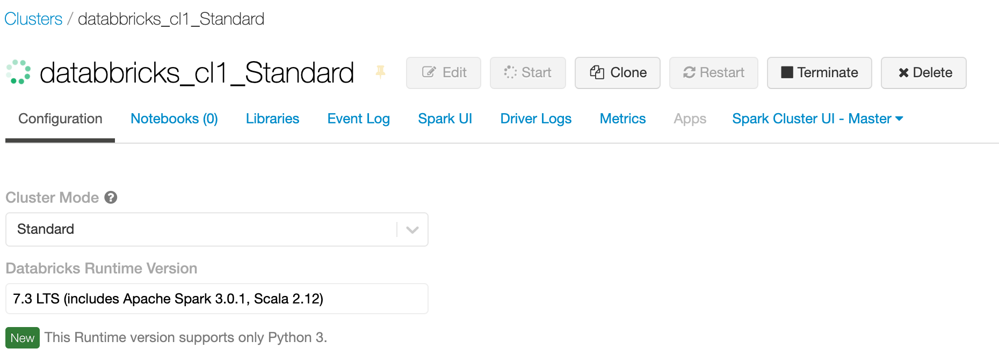
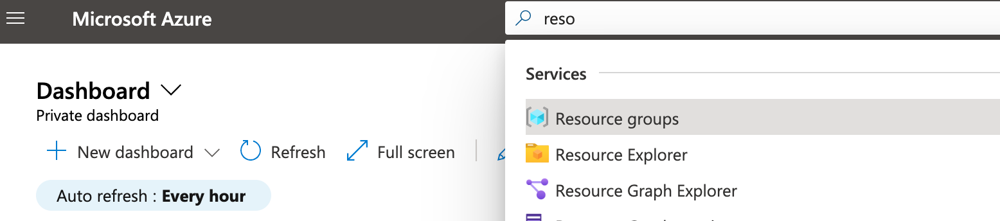
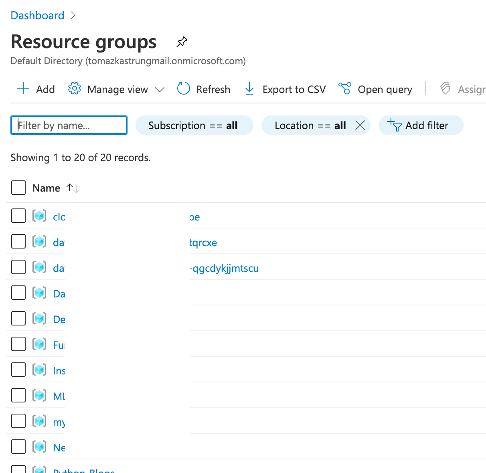
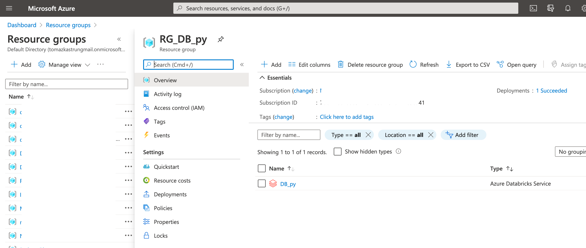

<!-- README.md was wriiten in beautiful MacDown  -->
# Dec 05 2020 - Understanding Azure Databricks cluster architecture, workers, drivers and jobs

<!-- badges: start -->

<!-- badges: end -->

Azure Databricks repository is 
a set of blogposts as a Advent of 2020 present to readers for easier onboarding
to Azure Databricks! 

<!-- wp:paragraph -->

Series of Azure Databricks posts:

<!-- /wp:paragraph -->

<!-- wp:list -->
<ul><li>Dec 01: <a rel="noreferrer noopener" href="https://tomaztsql.wordpress.com/2020/12/01/advent-of-2020-day-1-what-is-azure-databricks/" target="_blank">What is Azure Databricks</a></li><li>Dec 02: <a rel="noreferrer noopener" href="https://tomaztsql.wordpress.com/2020/12/02/advent-of-2020-day-2-how-to-get-started-with-azure-databricks/" target="_blank">How to get started with Azure Databricks</a></li><li>Dec 03: <a href="https://tomaztsql.wordpress.com/2020/12/03/advent-of-2020-day-3-getting-to-know-the-workspace-and-azure-databricks-platform/" target="_blank" rel="noreferrer noopener">Getting to know the workspace and Azure Databricks platform</a></li>
<li>Dec 04: <a href="https://tomaztsql.wordpress.com/2020/12/04/advent-of-2020-day-4-creating-your-first-azure-databricks-cluster/" target="_blank" rel="noreferrer noopener">Creating your first Azure Databricks cluster</a></li>
</ul>
<!-- /wp:list -->

<!-- wp:paragraph -->

Yesterday we have unveiled couple of concepts about the workers, drivers and how autoscaling works. In order to explore the services behind, start up the cluster, we have created yesterday (it it was automatically terminated or you have stopped it manually).

<!-- /wp:paragraph -->

Cluster is starting up (when is started, the green loading circle will become full):

<!-- wp:paragraph -->

My Cluster is Standard DS3_v2 cluster (4 cores) with Min 2 and Max 8 workers. Same applies for the driver. Once the cluster is up and running, go to Azure Portal. Look for your resource group that you have created it at the beginning (<a rel="noreferrer noopener" href="https://tomaztsql.wordpress.com/2020/12/02/advent-of-2020-day-2-how-to-get-started-with-azure-databricks/" target="_blank">Day 2</a>) when we started the Databricks Service. I have named my Resource group "RG_DB_py" (naming is importat! <strong>RG</strong> - ResourceGroup; <strong>DB</strong> - Service DataBricks; <strong>py</strong> - my project name).  Search for the correct resource:

<!-- /wp:paragraph -->

<!-- wp:paragraph -->

 And Select "Resource Groups" and find your resource group. I have a lot of resource groups, since I try to bundle the projects to a small groups that are closely related:

<!-- /wp:paragraph -->

<!-- wp:paragraph -->

Find yours and select it and you will find the Azure Databricks service that belongs to this resource group.

<!-- /wp:paragraph -->

Complete set of code and Notebooks will be available at the Github repository.

Stay Healthy! See you tomorrow.

