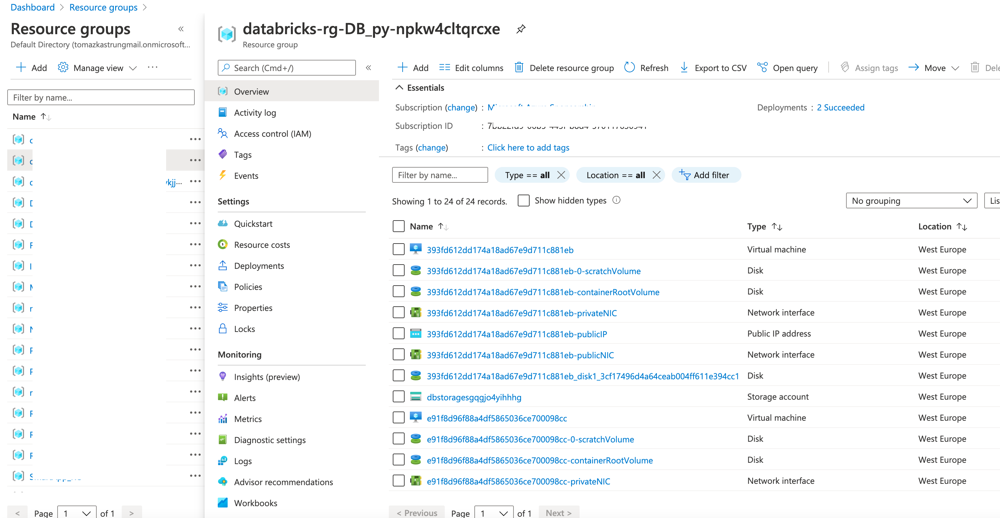
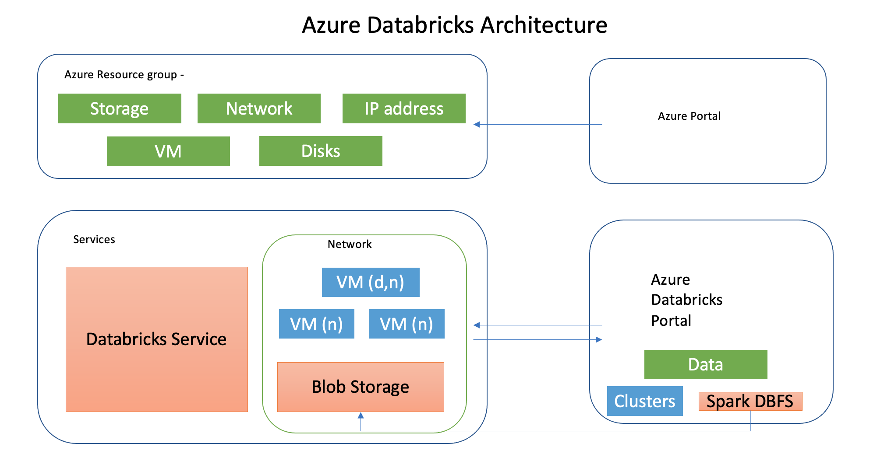
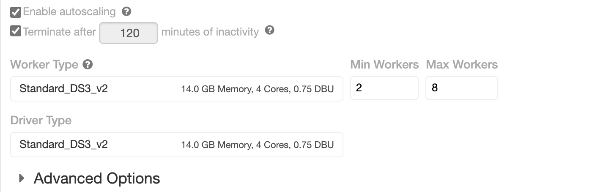
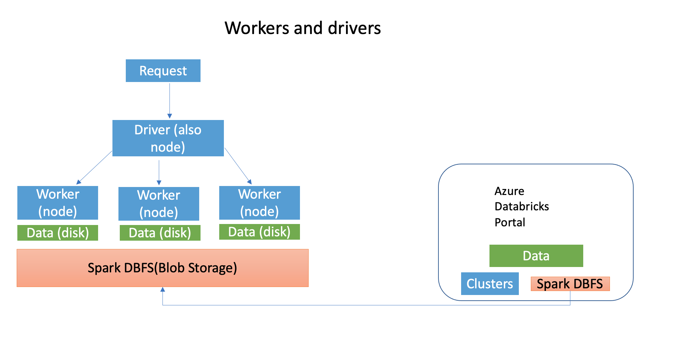

<!-- README.md was wriiten in beautiful MacDown  -->
# Dec 05 2020 - Understanding Azure Databricks cluster architecture, workers, drivers and jobs

<!-- badges: start -->

<!-- badges: end -->

Azure Databricks repository is 
a set of blogposts as a Advent of 2020 present to readers for easier onboarding
to Azure Databricks! 

<!-- wp:paragraph -->

Series of Azure Databricks posts:

<!-- /wp:paragraph -->

<!-- wp:list -->
<ul><li>Dec 01: <a rel="noreferrer noopener" href="https://tomaztsql.wordpress.com/2020/12/01/advent-of-2020-day-1-what-is-azure-databricks/" target="_blank">What is Azure Databricks</a></li><li>Dec 02: <a rel="noreferrer noopener" href="https://tomaztsql.wordpress.com/2020/12/02/advent-of-2020-day-2-how-to-get-started-with-azure-databricks/" target="_blank">How to get started with Azure Databricks</a></li><li>Dec 03: <a href="https://tomaztsql.wordpress.com/2020/12/03/advent-of-2020-day-3-getting-to-know-the-workspace-and-azure-databricks-platform/" target="_blank" rel="noreferrer noopener">Getting to know the workspace and Azure Databricks platform</a></li>
<li>Dec 04: <a href="https://tomaztsql.wordpress.com/2020/12/04/advent-of-2020-day-4-creating-your-first-azure-databricks-cluster/" target="_blank" rel="noreferrer noopener">Creating your first Azure Databricks cluster</a></li>
</ul>
<!-- /wp:list -->

<!-- wp:paragraph -->

Yesterday we have unveiled couple of concepts about the workers, drivers and how autoscaling works. In order to explore the services behind, start up the cluster, we have created yesterday (it it was automatically terminated or you have stopped it manually).

<!-- /wp:paragraph -->

Cluster is starting up (when is started, the green loading circle will become full):

<!-- wp:paragraph -->

My Cluster is Standard DS3_v2 cluster (4 cores) with Min 2 and Max 8 workers. Same applies for the driver. Once the cluster is up and running, go to Azure Portal. Look for your resource group that you have created it at the beginning (<a rel="noreferrer noopener" href="https://tomaztsql.wordpress.com/2020/12/02/advent-of-2020-day-2-how-to-get-started-with-azure-databricks/" target="_blank">Day 2</a>) when we started the Databricks Service. I have named my Resource group "RG_DB_py" (naming is importat! <strong>RG</strong> - ResourceGroup; <strong>DB</strong> - Service DataBricks; <strong>py</strong> - my project name).  Search for the correct resource:

<!-- /wp:paragraph -->

<!-- wp:paragraph -->

 And Select "Resource Groups" and find your resource group. I have a lot of resource groups, since I try to bundle the projects to a small groups that are closely related:

<!-- /wp:paragraph -->

<!-- wp:paragraph -->

Find yours and select it and you will find the Azure Databricks service that belongs to this resource group.

<!-- /wp:paragraph -->

<!-- wp:paragraph -->

Databricks creates additional (automatically generated) resource group to hold all the services (storage, VM, network, etc.). Follow the naming convention:

<!-- /wp:paragraph -->

<!-- wp:paragraph -->

<strong>RG_DB_py</strong> - is my resource group. What Azure does in this case, it prefixes and suffices your resource group name as:  <em>databricks</em>_<strong>rg_DB_py</strong>_<em>npkw4cltqrcxe</em>. Prefix will always be "databricks_rg" and suffix will be 13-characters random string for uniqueness. In my case: <em>npkw4cltqrcxe</em>. Why separate resource group? It used to be under the same resource group, but decoupling and having services in separate group makes it easier to start/stop services, manage IAM, create pool and scale.  Find your resource group and see what is insight:

<!-- /wp:paragraph -->

<!-- wp:paragraph -->

In detail list you will find following resources (in accordance with my standard DS3_v2 Cluster): 

<!-- /wp:paragraph -->

<!-- wp:list -->
<ul><li>Disk (9x Resources)</li><li>Network Interface (3x resources)</li><li>Network Security group (1x resource)</li><li>Public IP address (3x resources)</li><li>Storage account (1x resource)</li><li>Virtual Machine (3x resources)</li><li>Virtual network (1x resource)</li></ul>
<!-- /wp:list -->

<!-- wp:paragraph -->

Inspect the naming of these resources, you can see that the names are guid based, but the names are repeating through different resources and can easily be bundled together. Drawing the components together to get a full picture of it:

<!-- /wp:paragraph -->

<!-- wp:paragraph -->

At a high level, the Azure  Databricks service manages worker nodes and driver node in the separate resource group, that is tight to the same Azure subscription (for easier scalability and management). The platform or "appliance" or "managed service" is deployed as an set of Azure resources and Databricks manages all other aspects. The additional VNet, Security groups, IP addresses, and storage accounts are ready to be used for end user and managed through Azure Databricks Portal (UI). Storage is also replicated (geo redundant replication) for disaster scenarios and fault tolerance. Even when cluster is turned off, the data is persisted in storage.

<!-- /wp:paragraph -->

<!-- wp:paragraph -->

Cluster is a virtual machine that has a blob storage attached to it. Virtual machine is rocking Linux Ubuntu (16.04 as of writing this) and it has 4 vCPUs and 14GiB of RAM. The workers are using two Virtual Machines. And the same Virtual machine is reserved for the driver.  This is what we have set on Day 2.

<!-- /wp:paragraph -->

<!-- wp:paragraph -->

Since each VM machine is the same (for Worker and Driver), the workers can be scaled up based on the vCPU. Two VM for Workers, with 4 cores each, is maximum 8 workers. So each vCPU / Core is considered one worker.  And the Driver machine (also VM with Linux Ubuntu) is a manager machine for load distribution among the workers. 

<!-- /wp:paragraph -->

<!-- wp:paragraph -->

Each Virtual machine is set with public and private sub-net and all are mapped together in Virtual network (VNet) for secure connectivity and communication of work loads and data results. And Each VM has a dedicated public IP address for communication with other services or Databricks Connect tools (I will talk about this in later posts).

<!-- /wp:paragraph -->

<!-- wp:paragraph -->

Disks are also bundled in three types, each for one VM. These types are:

<!-- /wp:paragraph -->

<!-- wp:list -->
<ul><li>Scratch Volume</li><li>Container Root Volume</li><li>Standard Volume</li></ul>
<!-- /wp:list -->

<!-- wp:paragraph -->

Each type has a specific function but all are designed for optimised performance data caching, especially for delta caching. This means for faster data reading, creating copies of remote files in nodes’ local storage using and using a  fast intermediate data format. The data is cached automatically.  Even when file has to be fetched from a remote location. This performs well also for repetitive and successive reads. Delta caching (as part of Spark caching) 

<!-- /wp:paragraph -->

<!-- wp:paragraph -->

This is supported for reading only Parquet files in DBFS, HDFS, Azure Blob storage, Azure Data Lake Storage Gen1, and Azure Data Lake Storage Gen2.  Optimized storage (Spark caching) does not uspport file types as CSV, JSON, TXT, ORC, XML.

<!-- /wp:paragraph -->

<!-- wp:paragraph -->

When request is pushed from the Databricks Portal (UI) the main driver accepts the requests and by using spark jobs, pushes the workload down to each node. Each node has a shards and copies of the data or it it gets through DBFS from Blob Storage and executes the job. After execution the summary / results of each worker node is summed and gathered again by driver. Driver node returns the results in fashionable manner back to UI.

<!-- /wp:paragraph -->

<!-- wp:paragraph -->

The more worker nodes you have, the more "parallel" the request can be executed. And the more workers you have available (or in ready mode) the more you can "scale" your workloads.

<!-- /wp:paragraph -->

<!-- wp:paragraph -->

Tomorrow we will start with working our way up to importing and storing the data and see how it is stored on blob storage and explore different type of storages that Azure Databricks provides.

<!-- /wp:paragraph -->

<!-- wp:paragraph -->

Complete set of code and Notebooks will be available at the<a rel="noreferrer noopener" href="https://github.com/tomaztk/Azure-Databricks" target="_blank">&nbsp;Github repository</a>.

<!-- /wp:paragraph -->

<!-- wp:paragraph -->

Happy Coding and Stay Healthy!

<!-- /wp:paragraph -->

