<!-- README.md was wriiten in beautiful MacDown  -->
# Dec 06 2020 - Importing and storing data to Azure Databricks

<!-- badges: start -->

<!-- badges: end -->

Azure Databricks repository is 
a set of blogposts as a Advent of 2020 present to readers for easier onboarding
to Azure Databricks! 

<!-- wp:paragraph -->

Series of Azure Databricks posts:

<!-- /wp:paragraph -->

<!-- wp:list -->
<ul><li>Dec 01: <a rel="noreferrer noopener" href="https://tomaztsql.wordpress.com/2020/12/01/advent-of-2020-day-1-what-is-azure-databricks/" target="_blank">What is Azure Databricks</a></li><li>Dec 02: <a rel="noreferrer noopener" href="https://tomaztsql.wordpress.com/2020/12/02/advent-of-2020-day-2-how-to-get-started-with-azure-databricks/" target="_blank">How to get started with Azure Databricks</a></li><li>Dec 03: <a href="https://tomaztsql.wordpress.com/2020/12/03/advent-of-2020-day-3-getting-to-know-the-workspace-and-azure-databricks-platform/" target="_blank" rel="noreferrer noopener">Getting to know the workspace and Azure Databricks platform</a></li>
<li>Dec 04: <a href="https://tomaztsql.wordpress.com/2020/12/04/advent-of-2020-day-4-creating-your-first-azure-databricks-cluster/" target="_blank" rel="noreferrer noopener">Creating your first Azure Databricks cluster</a></li>
<li>Dec 05: <a href="https://tomaztsql.wordpress.com/2020/12/05/advent-of-2020-day-5-understanding-azure-databricks-cluster-architecture-workers-drivers-and-jobs/" target="_blank" rel="noreferrer noopener">Understanding Azure Databricks cluster architecture, workers, drivers and jobs</a></li>
</ul>
<!-- /wp:list -->

<!-- wp:paragraph -->

Yesterday we started exploring the Azure services that are created when using Azure Databricks. One of the service, that I would like to explore today is storage and especially how to import and how to store data.

<!-- /wp:paragraph -->

<!-- wp:paragraph -->

Log in to Azure Databricks and on the main (home) site select "Create Table" under recommended common task. Don't start your cluster yet (if it's running, please terminate it for now).

<!-- /wp:paragraph -->

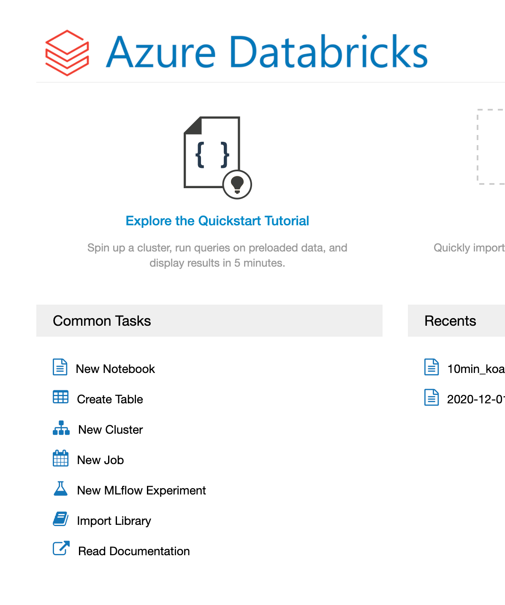

<!-- wp:paragraph -->

This will prompt you a variety of actions on importing data to DBFS or connecting Azure Databricks with other services.

<!-- /wp:paragraph -->

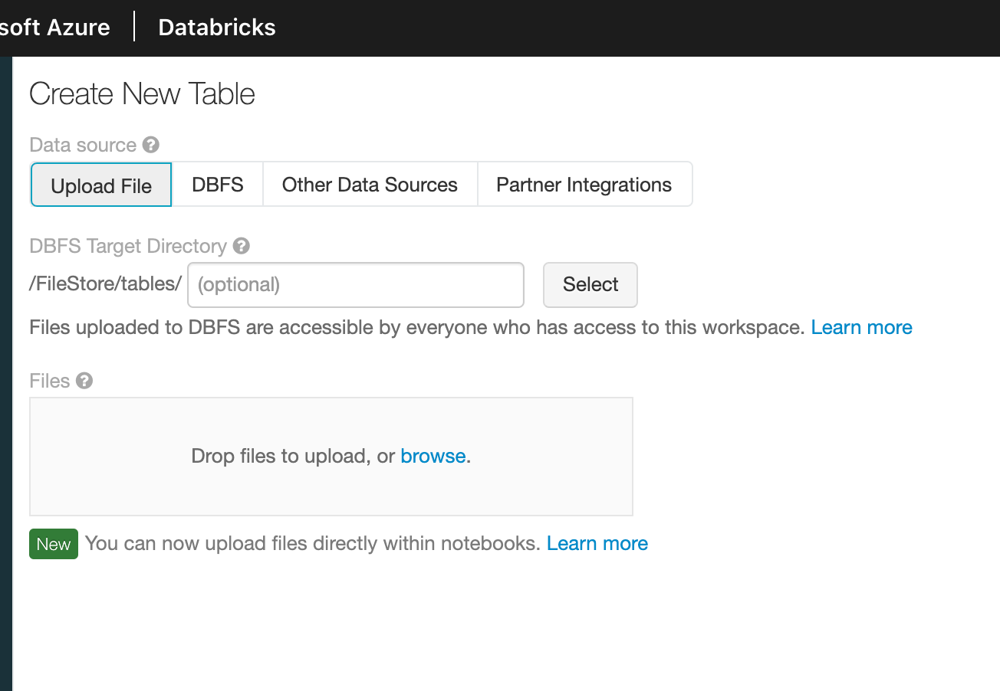

<!-- wp:paragraph -->

Drag the data file (available on <a rel="noreferrer noopener" href="https://github.com/tomaztk/Azure-Databricks/tree/main/data" target="_blank">Github in data folder</a>) named Day6data.csv to square for upload.  For easier understanding, let's check the CSV file schema (simple one, three columns: 1. Date (datetime format), 2. Temperature (integer format), 3. City (string format)).

<!-- /wp:paragraph -->

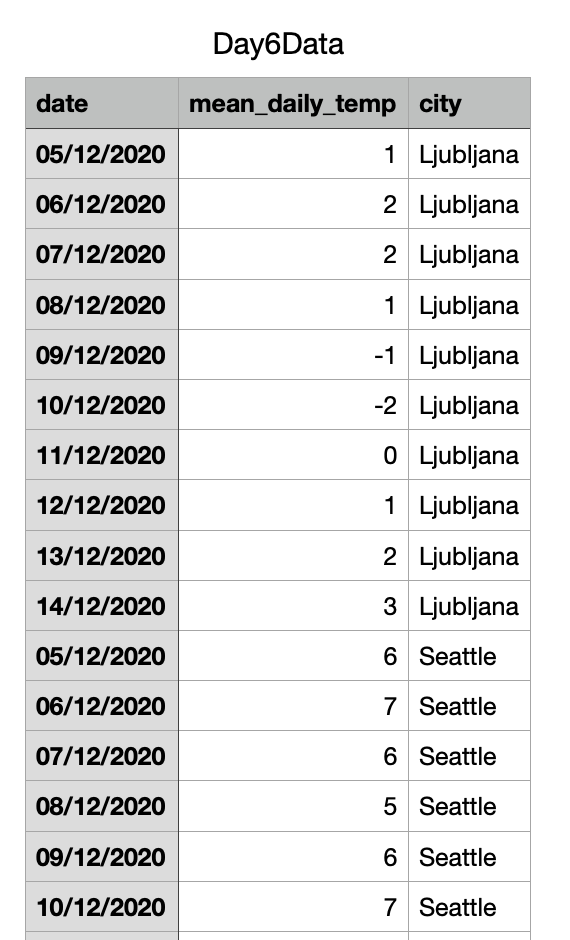

<!-- wp:paragraph -->

But before you start with uploading the data, let's check the Azure resource group. I have not yet started any Databricks cluster in my workspace. And here you can see that Vnet, Storage and Network Security group will always be available for Azure Databricks service. Only when you start the cluster, additional services (IP addresses, disks, VM,...) will appear.

<!-- /wp:paragraph -->

<!-- wp:paragraph -->

This gives us better idea where and how data is persisted. Your data will always be available and stored on blob storage. Meaning, even if you decide - not only to terminate the cluster, but to delete the cluster as well, your data will always be safely stored. Only when you add new cluster to same workspace, cluster will automatically retrieved the data from blob storage.

<!-- /wp:paragraph -->

## 1. Import

<!-- wp:paragraph -->

Drag and drop the csv file in the "Drop zone" as discussed previously. And is should looked like this:

<!-- /wp:paragraph -->

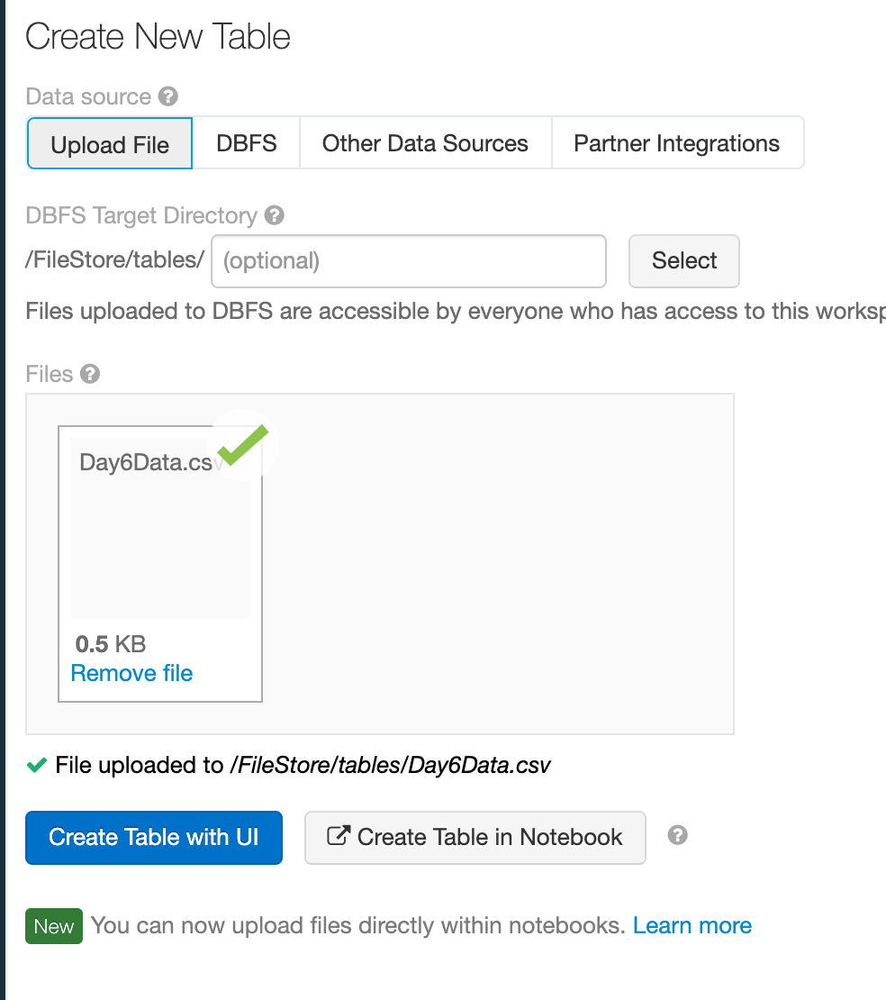

<!-- wp:paragraph -->

You have now two options:

<!-- /wp:paragraph -->

<!-- wp:list -->
<ul><li>create table with UI</li><li>create table in Notebook</li></ul>
<!-- /wp:list -->

<!-- wp:paragraph -->

Select the "Create table with UI". Only now you will be asked to select the cluster:

<!-- /wp:paragraph -->

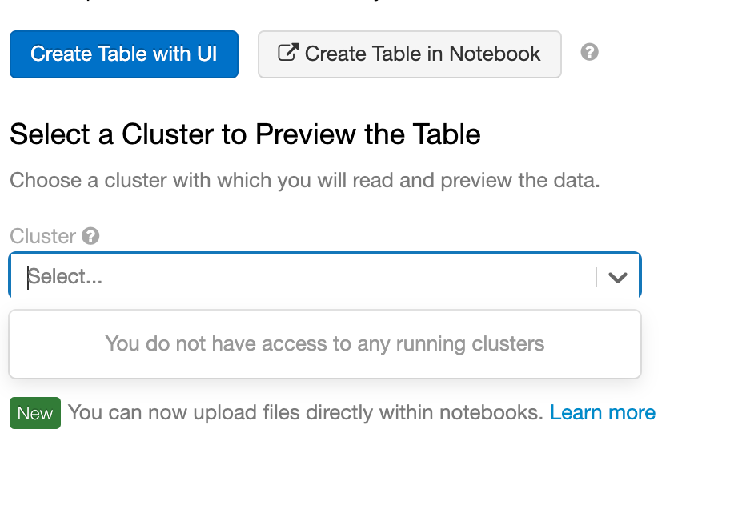

<!-- wp:paragraph -->

Now select the "Create table in Notebook" and Databricks will create a first Notebook for you using Spark language to upload the data to DBFS.

<!-- /wp:paragraph -->

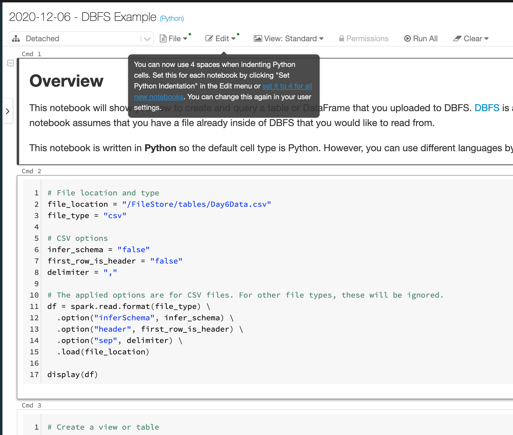

<!-- wp:paragraph -->

In case I want to run this notebook, I will need to have my cluster up and running. So let's start a cluster. On your left vertical navigation bar, select Cluster Icon. You will get the list of all the clusters you are using. Select the one we have created on <a rel="noreferrer noopener" href="https://tomaztsql.wordpress.com/2020/12/04/advent-of-2020-day-4-creating-your-first-azure-databricks-cluster/" target="_blank">Day 4</a>. 

<!-- /wp:paragraph -->

<!-- wp:paragraph -->

If you want, check the resource group for your Azure Databricks to see all the running VM, disks and VNets. 

<!-- /wp:paragraph -->

<!-- wp:paragraph -->

Now insert the data using the import method, by drag and drop the CSV file in the "Drop Zone" (repeat the process) and hit "Create Table with UI". Now you should have Cluster available. Select it and preview the Table.

<!-- /wp:paragraph -->

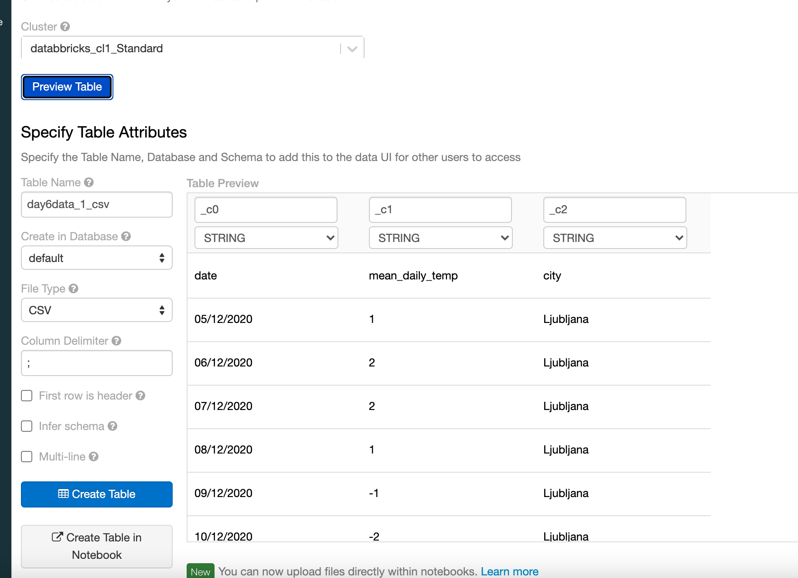

<!-- wp:paragraph -->

You can see that table name is propagated from filename, the file Type is automatically selected, Column delimiter is automatically selected. Only "First row in header" should be selected in order to have columns properly named and data types corrected, respectively. 

<!-- /wp:paragraph -->

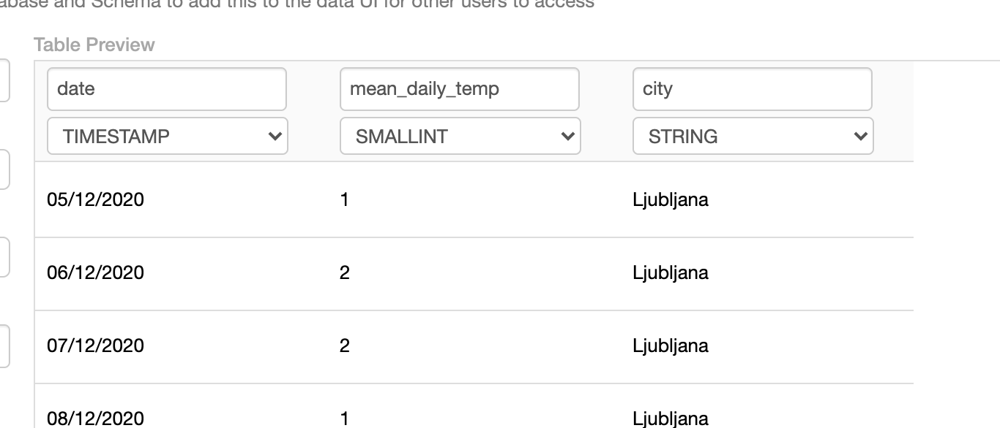

<!-- wp:paragraph -->

Now we can create a table. After Databricks will finish, the report will be presented with recap of the table location (yes, location!), Schema and overview of sample data.

<!-- /wp:paragraph -->

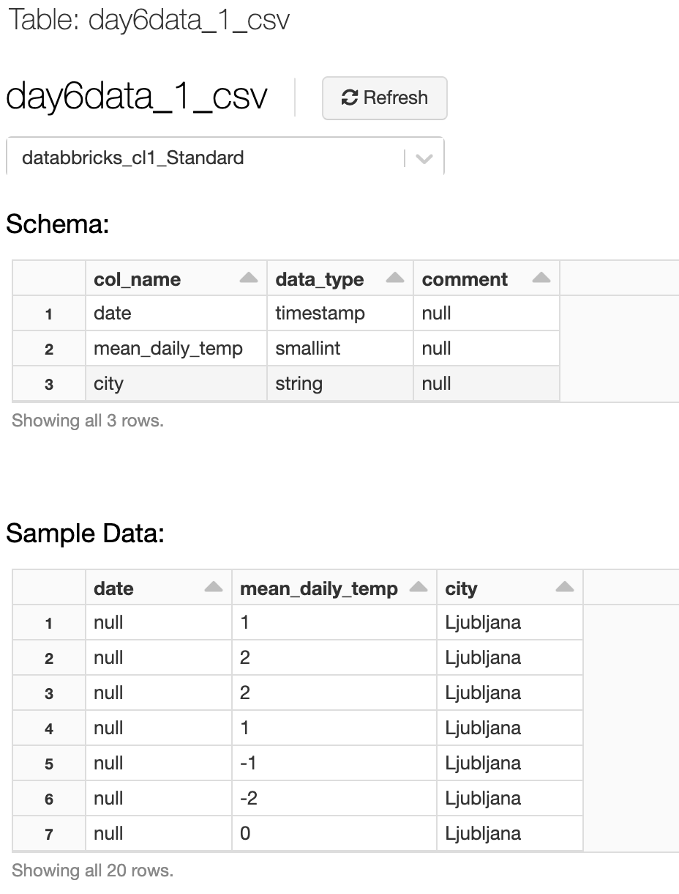

<!-- wp:paragraph -->

This table is now available on my Cluster. What does this mean? This table is now persistent on your cluster, but not only on cluster, but on your Azure Databricks Workspace. This is important to understand how and where data is stored. Go to Data icon on left vertical navigation bar.

<!-- /wp:paragraph -->

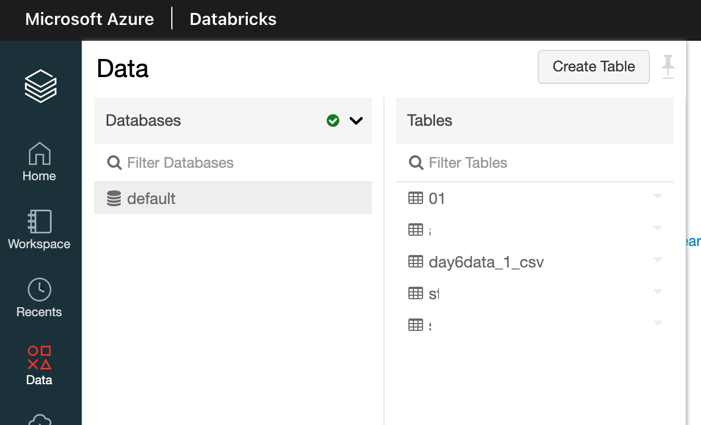

<!-- wp:paragraph -->

This database is attached to my Cluster. If I terminate my cluster, will I loose my data? Trying stoping the cluster and check data again. And bam... Database is not available, since there is no cluster "attached" to it.

<!-- /wp:paragraph -->

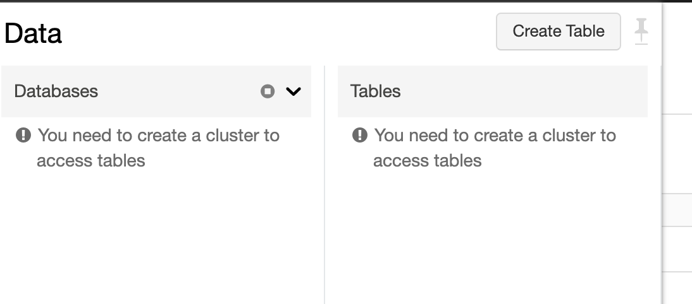

<!-- wp:paragraph -->

But hold your horses. Data is still available on blob storage, just not seen to DBFS. Database will be visible again, when you start your cluster. 

<!-- /wp:paragraph -->

## 2. Storing data to DBFS

<!-- wp:paragraph -->

<strong>DBFS - Databricks File System</strong> is a distrubuted file system mounted into an enclosed Azure Databricks workspace. DBFS is available on selected cluster through UI or Notebooks. In this way, DBFS is decoupled data layer (or abstraction layer) on top of Azure object storage

<!-- /wp:paragraph -->

<!-- wp:paragraph -->

is a distributed file system mounted into an Azure Databricks workspace and available on Azure Databricks clusters. DBFS is an abstraction on top of scalable object storage and offers the following benefits:

<!-- /wp:paragraph -->

<!-- wp:list -->
<ul><li>easy communication and interaction with object storage using bash / CLI command line</li><li>data is always persistent </li><li>mounting storage objects is easy and accessing it done seamlessly</li><li>No additional credentials are needed, since you are "locked" in azure workspace.</li></ul>
<!-- /wp:list -->

<!-- wp:paragraph -->

Storage is located as root and there are some folders created with following locations:

<!-- /wp:paragraph -->

<!-- wp:list -->
<ul><li>dbfs:/root - is a root folder</li><li>dbfs:/filestore - folder that holds imported data files, generated plots, tables, and uploaded libraries</li><li>dbfs:/databricks - folder for mlflow, init scripts, sample public datasets, etc.</li><li>dbfs:/user/hive - data and metadata to hive (SQL) tables</li></ul>
<!-- /wp:list -->

<!-- wp:paragraph -->

You will find many other folder that will be generated though notebooks.

<!-- /wp:paragraph -->

<!-- wp:paragraph -->

Before we begin, let's make your life easier. Go to admin console setting, select advanced tab and find "<strong>DBFS File browser</strong>". By default, this option is disabled, so let's enable it.

<!-- /wp:paragraph -->

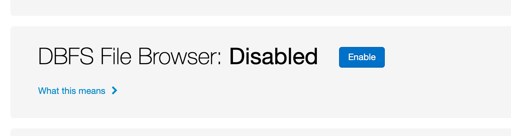

<!-- wp:paragraph -->

This will enable you to view the data through DBFS structure, give you the upload option and search option. 

<!-- /wp:paragraph -->

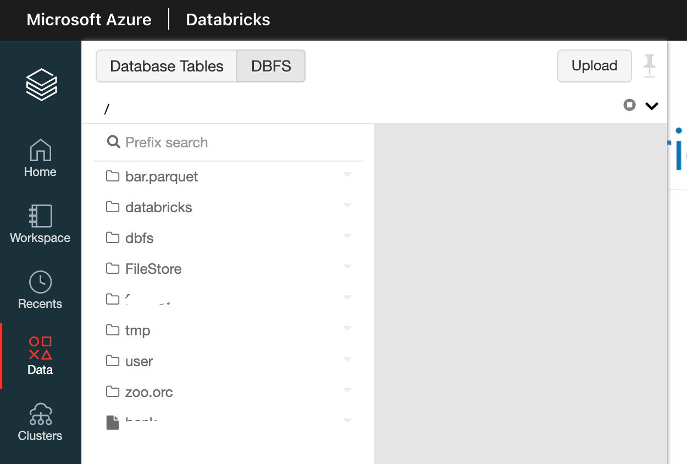

<!-- wp:paragraph -->

Uploading files will be now easier and would be seen immediately in FileStore. There is same file prefixed Day6Data_dbfs.csv in <a rel="noreferrer noopener" href="https://github.com/tomaztk/Azure-Databricks/tree/main/data" target="_blank">github data folder</a>, that you can upload manually and it would be seen in FileStore:

<!-- /wp:paragraph -->

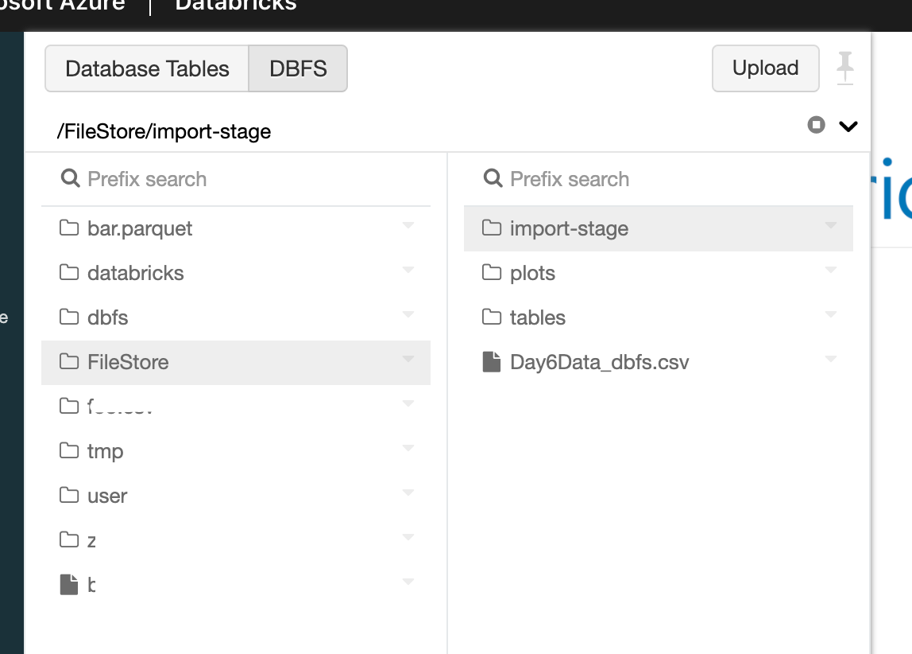

<!-- wp:paragraph -->

Tomorrow we will explore  how we can use Notebook to access this file in different commands (CLI, Bash, Utils, Python, R, Spark). And since we will be using notebooks for the first time, we will do a little exploration of notebooks as well.

<!-- /wp:paragraph -->

<!-- wp:paragraph -->

Complete set of code and Notebooks will be available at the<a rel="noreferrer noopener" href="https://github.com/tomaztk/Azure-Databricks" target="_blank">&nbsp;Github repository</a>.

<!-- /wp:paragraph -->

<!-- wp:paragraph -->

Happy Coding and Stay Healthy!

<!-- /wp:paragraph -->

