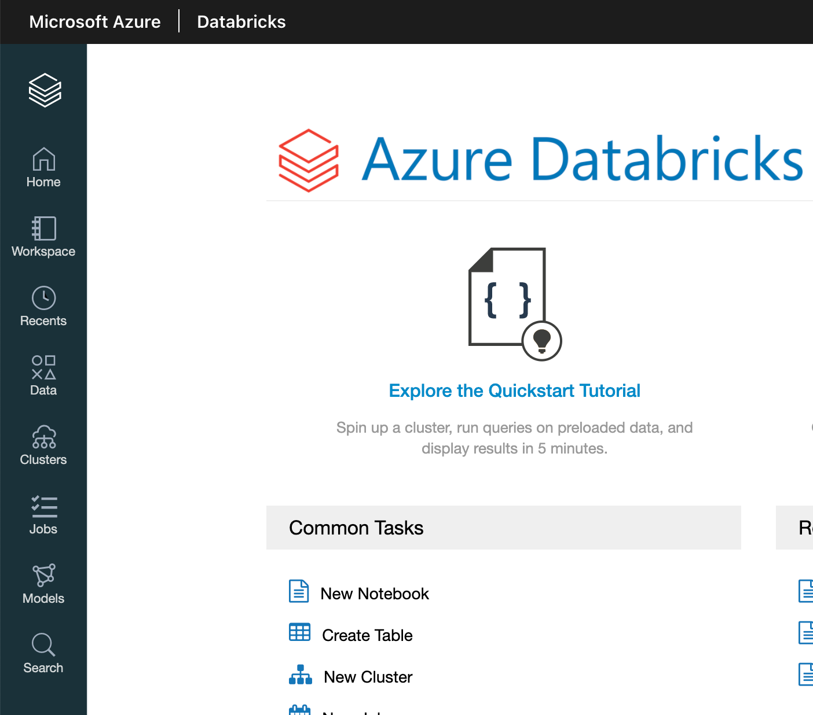
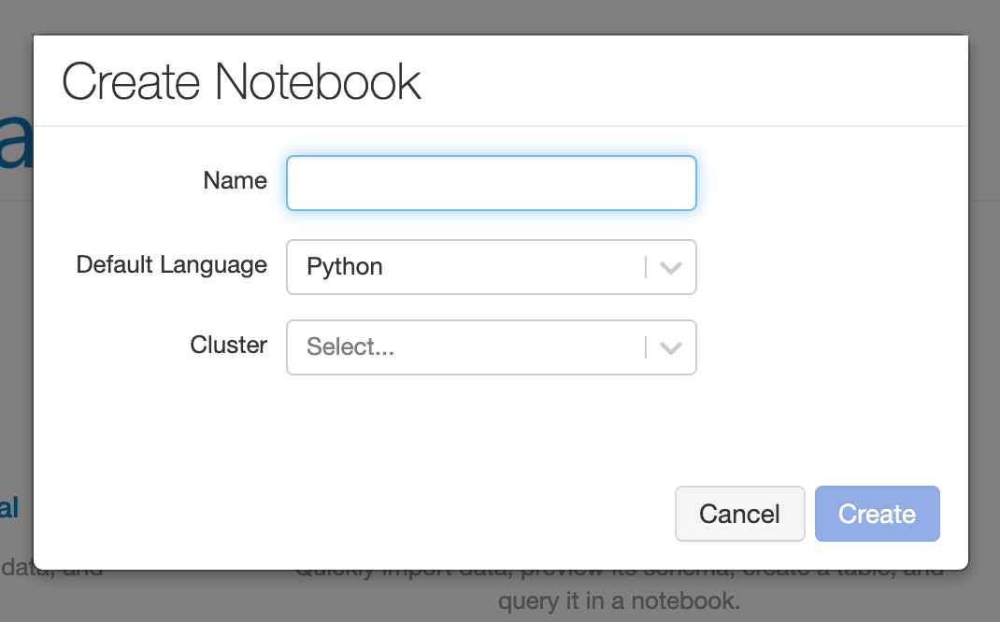
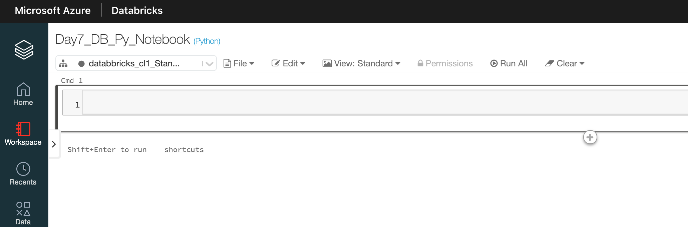
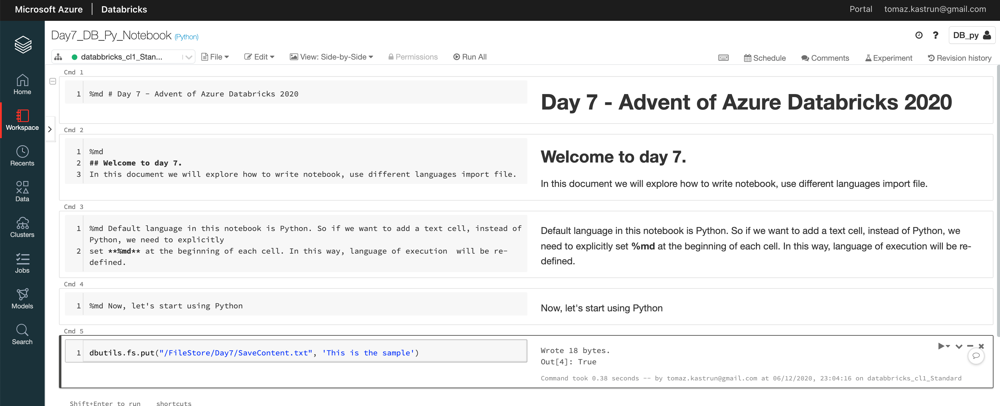
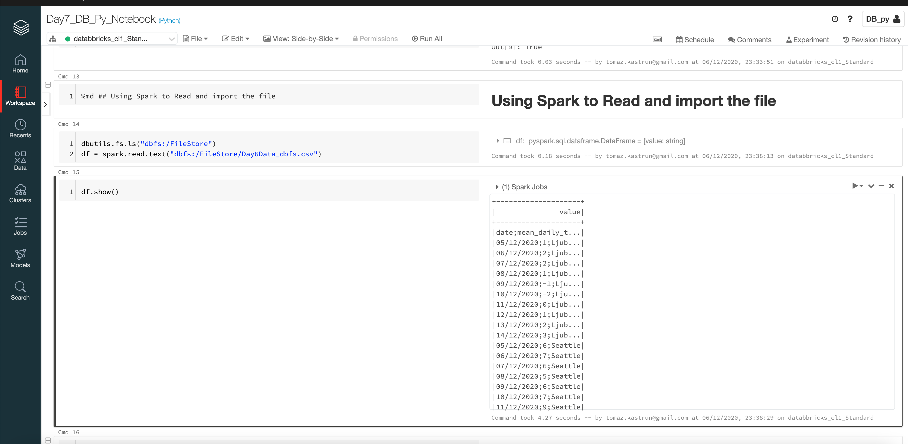
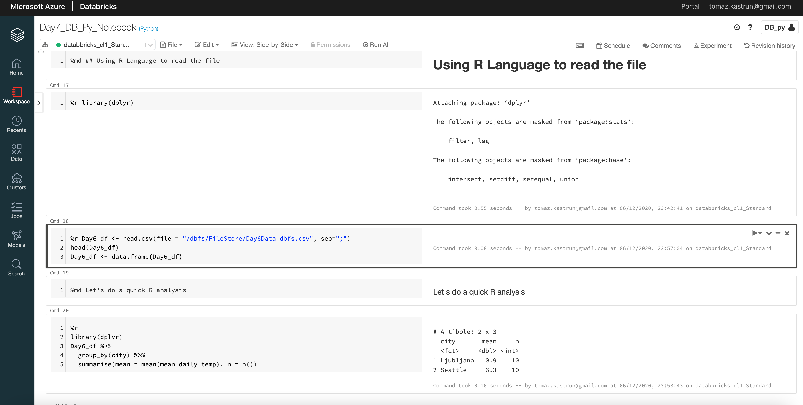

<!-- README.md was wriiten in beautiful MacDown  -->
# Dec 07 2020 - Starting with Databricks notebooks and loading data to DBFS

<!-- badges: start -->

<!-- badges: end -->

Azure Databricks repository is 
a set of blogposts as a Advent of 2020 present to readers for easier onboarding
to Azure Databricks! 

<!-- wp:paragraph -->

Series of Azure Databricks posts:

<!-- /wp:paragraph -->

<!-- wp:list -->
<ul><li>Dec 01: <a rel="noreferrer noopener" href="https://tomaztsql.wordpress.com/2020/12/01/advent-of-2020-day-1-what-is-azure-databricks/" target="_blank">What is Azure Databricks</a></li><li>Dec 02: <a rel="noreferrer noopener" href="https://tomaztsql.wordpress.com/2020/12/02/advent-of-2020-day-2-how-to-get-started-with-azure-databricks/" target="_blank">How to get started with Azure Databricks</a></li><li>Dec 03: <a href="https://tomaztsql.wordpress.com/2020/12/03/advent-of-2020-day-3-getting-to-know-the-workspace-and-azure-databricks-platform/" target="_blank" rel="noreferrer noopener">Getting to know the workspace and Azure Databricks platform</a></li>
<li>Dec 04: <a href="https://tomaztsql.wordpress.com/2020/12/04/advent-of-2020-day-4-creating-your-first-azure-databricks-cluster/" target="_blank" rel="noreferrer noopener">Creating your first Azure Databricks cluster</a></li>
<li>Dec 05: <a href="https://tomaztsql.wordpress.com/2020/12/05/advent-of-2020-day-5-understanding-azure-databricks-cluster-architecture-workers-drivers-and-jobs/" target="_blank" rel="noreferrer noopener">Understanding Azure Databricks cluster architecture, workers, drivers and jobs</a></li>
<li>Dec 06: <a href="https://tomaztsql.wordpress.com/2020/12/06/advent-of-2020-day-6-importing-and-storing-data-to-azure-databricks/" target="_blank" rel="noreferrer noopener">Importing and storing data to Azure Databricks</a></li>

</ul>
<!-- /wp:list -->

<!-- wp:paragraph -->

Yesterday we started working towards data import and how to use drop zone to import data to DBFS. We have also created our first Notebook and this is where I would like to start today. With a light introduction to notebooks.

<!-- /wp:paragraph -->

<!-- wp:paragraph -->
### What are Notebooks?

<!-- wp:paragraph -->

Notebook is a powerful text document that integrated interactive computing environment for data engineers, data scientists and machine learning engineers. It supports multiple kernels (compute environments) and multiple languages. Most common Notebook is Jupyter Notebook, name suggesting and providing acronyms for Julia, Python and R. Usually a notebook will consist of a text, rich text, HTML, figures, photos, videos, and all sorts of engineering blocks of code or text. These blocks of code can be executed, since the notebooks are part of client-server web application.  Azure Databricks notebooks are type of ipynb notebooks, same format as the Jupyter notebooks. Databricks environment provides client and server and you do not have to worry about installation not setup. Once the Databrick cluster is up and running, you are good to go.

<!-- /wp:paragraph -->

<!-- wp:paragraph -->

On your home screen, select "New Notebook"

<!-- /wp:paragraph -->

<!-- wp:paragraph -->

and give it a Name, Language and Cluster.

<!-- /wp:paragraph -->

<!-- wp:paragraph -->

Databricks notebooks are support multi languages and you can seaminglessly switch the language in the notebook, without the need to switching the languange. If the notebooks are instructions of operations and what to do, is the cluster the engine that will execute all the instructions. Select cluster, that you have created on <a rel="noreferrer noopener" href="https://tomaztsql.wordpress.com/2020/12/04/advent-of-2020-day-4-creating-your-first-azure-databricks-cluster/" target="_blank">Day 4</a>. I am inserting following:

<!-- /wp:paragraph -->

<!-- wp:table -->
<figure class="wp-block-table"><table><tbody><tr><td>Name:</td><td>Day7_DB_Py_Notebook</td></tr><tr><td>Default Language:</td><td>Python</td></tr><tr><td>Cluster:</td><td>databricks_cl1_standard</td></tr></tbody></table></figure>
<!-- /wp:table -->

<!-- wp:paragraph -->

If your clusters are not started, you can still create a notebook and later attach selected cluster to notebook.

<!-- /wp:paragraph -->

<!-- wp:paragraph -->

Notebook consists of cells that can be either formatted text or code. Notebooks are saved automatically. Under File, you will find useful functions to manage your notebooks, as: Move, Clone, Rename, Upload, Export.  Under menu Edit, you will be able to work with cells, and code blocks. Run all is a quick function to execute all cells at one time (or if you prefer you can run a cell one by one, or selected cell all below or above). Once you start writing formatted text (Markdown, HTML, others), Databricks will automatically start building <em>Table of content</em>, giving you better overview of your content.

<!-- /wp:paragraph -->

<!-- wp:paragraph -->

Let's start with Markdown and write the title and some text to notebook and adding some Python code. I have inserted:

<!-- /wp:paragraph -->

<!-- wp:syntaxhighlighter/code -->
<pre class="wp-block-syntaxhighlighter-code">%md # Day 7 - Advent of Azure Databricks 2020

%md 
## Welcome to day 7.
In this document we will explore how to write notebook, use different languages import file.

%md Default language in this notebook is Python. So if we want to add a text cell, instead of Python, we need to explicitly
set **%md** at the beginning of each cell. In this way, language of execution  will be re-defined.

%md Now, let's start using Python

dbutils.fs.put("/FileStore/Day7/SaveContent.txt", 'This is the sample')</pre>
<!-- /wp:syntaxhighlighter/code -->

<!-- wp:paragraph -->

And the result was a perfect Notebook with Heading, subtitle and text. In the middle the Table of content is generated automatically.

<!-- /wp:paragraph -->

<!-- wp:paragraph -->

Under view, changing from Standard to side-by-side and you can see the code and converted code as notebook on the other-side. Useful for copying, changing or debugging the code.

<!-- /wp:paragraph -->

<!-- wp:paragraph -->

Each cell text has <strong>%md</strong> at the beginning, for converting text to rich text - Markdown. The last cell is Python

<!-- /wp:paragraph -->

<!-- wp:syntaxhighlighter/code -->
<pre class="wp-block-syntaxhighlighter-code">dbutils.fs.put("/FileStore/Day7/SaveContent.txt", 'This is the sample')</pre>
<!-- /wp:syntaxhighlighter/code -->

<!-- wp:paragraph -->

That generated a txt file to Filestore. File can be also seen in the left pane. <a rel="noreferrer noopener" href="https://docs.databricks.com/dev-tools/databricks-utils.html" target="_blank">DbUtils - Databricks utils</a> is a set of utility tools for efficiently working with object storage. dbUtils are available in R, Python and Scala.

<!-- /wp:paragraph -->

### Importing file

<!-- wp:paragraph -->

In Notebook we have the ability to use multiple languages. Mixing Python with Bash and Spark and R is something common. But in this case, we will use DbUtils - powerful set of functions. Learn to like it, because it will be utterly helpful. 

<!-- /wp:paragraph -->

<!-- wp:paragraph -->

Let us explore the Bash and R to import the file into data.frame.

<!-- /wp:paragraph -->

<!-- wp:syntaxhighlighter/code -->
<pre class="wp-block-syntaxhighlighter-code">dbutils.fs.ls("dbfs:/FileStore")
df = spark.read.text("dbfs:/FileStore/Day6Data_dbfs.csv")

df.show()</pre>
<!-- /wp:syntaxhighlighter/code -->

<!-- wp:paragraph -->

And the results is:

<!-- /wp:paragraph -->

<!-- wp:paragraph -->

And do the same for R Language:

<!-- /wp:paragraph -->

<!-- wp:syntaxhighlighter/code -->
<pre class="wp-block-syntaxhighlighter-code">%r library(dplyr)

%r Day6_df &lt;- read.csv(file = "/dbfs/FileStore/Day6Data_dbfs.csv", sep=";")
head(Day6_df)
Day6_df &lt;- data.frame(Day6_df)

%md Let's do a quick R analysis

%r 
library(dplyr)
Day6_df %>%
  group_by(city) %>%
  summarise(mean = mean(mean_daily_temp), n = n())</pre>
<!-- /wp:syntaxhighlighter/code -->

<!-- wp:paragraph -->

And the result is the same, just using R Language.

<!-- /wp:paragraph -->

<!-- wp:paragraph -->

Tomorrow we will use Databricks CLI and DBFS API to upload the files from e.g.: your client machine to filestore. In this way, you will be able to migrate and upload file to Azure Databricks in no time.

<!-- /wp:paragraph -->

<!-- wp:paragraph -->

Complete set of code and Notebooks will be available at the<a rel="noreferrer noopener" href="https://github.com/tomaztk/Azure-Databricks" target="_blank">&nbsp;Github repository</a>.

<!-- /wp:paragraph -->

<!-- wp:paragraph -->

Happy Coding and Stay Healthy!

<!-- /wp:paragraph -->

