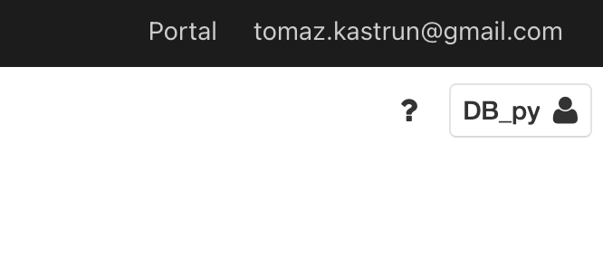
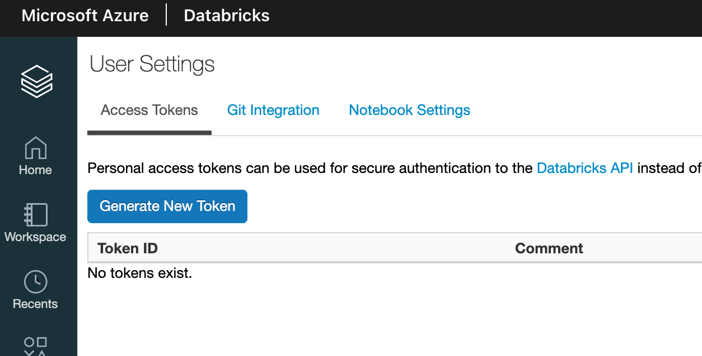
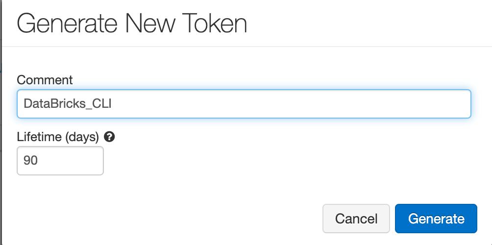
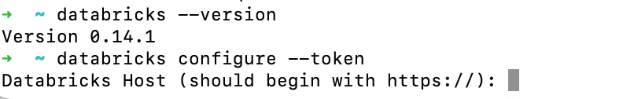
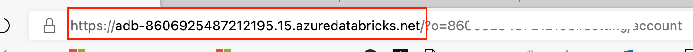
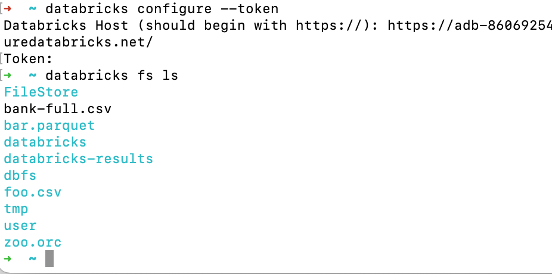
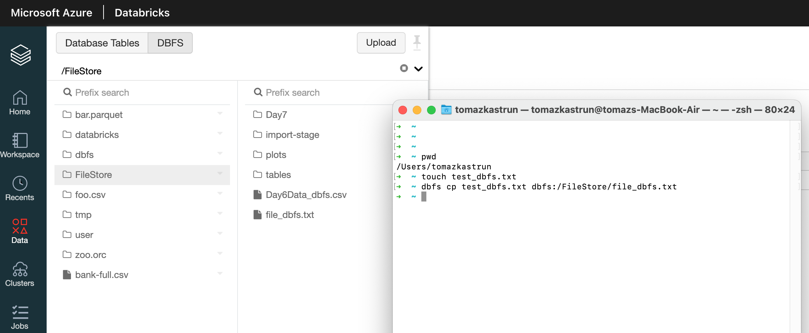

<!-- README.md was wriiten in beautiful MacDown  -->
# Dec 08 2020 - Using Databricks CLI and DBFS CLI for file upload

<!-- badges: start -->

<!-- badges: end -->

Azure Databricks repository is 
a set of blogposts as a Advent of 2020 present to readers for easier onboarding
to Azure Databricks! 

<!-- wp:paragraph -->

Series of Azure Databricks posts:

<!-- /wp:paragraph -->

<!-- wp:list -->
<ul><li>Dec 01: <a rel="noreferrer noopener" href="https://tomaztsql.wordpress.com/2020/12/01/advent-of-2020-day-1-what-is-azure-databricks/" target="_blank">What is Azure Databricks</a></li><li>Dec 02: <a rel="noreferrer noopener" href="https://tomaztsql.wordpress.com/2020/12/02/advent-of-2020-day-2-how-to-get-started-with-azure-databricks/" target="_blank">How to get started with Azure Databricks</a></li><li>Dec 03: <a href="https://tomaztsql.wordpress.com/2020/12/03/advent-of-2020-day-3-getting-to-know-the-workspace-and-azure-databricks-platform/" target="_blank" rel="noreferrer noopener">Getting to know the workspace and Azure Databricks platform</a></li>
<li>Dec 04: <a href="https://tomaztsql.wordpress.com/2020/12/04/advent-of-2020-day-4-creating-your-first-azure-databricks-cluster/" target="_blank" rel="noreferrer noopener">Creating your first Azure Databricks cluster</a></li>
<li>Dec 05: <a href="https://tomaztsql.wordpress.com/2020/12/05/advent-of-2020-day-5-understanding-azure-databricks-cluster-architecture-workers-drivers-and-jobs/" target="_blank" rel="noreferrer noopener">Understanding Azure Databricks cluster architecture, workers, drivers and jobs</a></li>
<li>Dec 06: <a href="https://tomaztsql.wordpress.com/2020/12/06/advent-of-2020-day-6-importing-and-storing-data-to-azure-databricks/" target="_blank" rel="noreferrer noopener">Importing and storing data to Azure Databricks</a></li>

<li>Dec 07: <a href="https://tomaztsql.wordpress.com/2020/12/07/advent-of-2020-day-7-starting-with-databricks-notebooks-and-loading-data-to-dbfs/" target="_blank" rel="noreferrer noopener">Starting with Databricks notebooks and loading data to DBFS</a></li>

</ul>
<!-- /wp:list -->

<!-- wp:paragraph -->

Yesterday we worked toward using notebooks and how to read data using notebooks.

<!-- /wp:paragraph -->

<!-- wp:paragraph -->

Today we will check Databricks CLI and look into how you can use CLI to upload (copy) files from your remote server to DBFS.

<!-- /wp:paragraph -->

<!-- wp:paragraph -->

Databricks CLI is a command-line interface (CLI)  that provides an easy-to-use interface to the Databricks platform. Databricks CLI is from group of developer tools and should be easy to setup and straightforward to use. You can automate many of the tasks with CLI.

<!-- /wp:paragraph -->

<!-- wp:paragraph -->
### 1.Installing the CLI

<!-- wp:paragraph -->

Using Python 3.6 (or above), run the following pip command in CMD:

<!-- /wp:paragraph -->

<!-- wp:syntaxhighlighter/code -->
<pre class="wp-block-syntaxhighlighter-code">pip3 install databricks-cli</pre>
<!-- /wp:syntaxhighlighter/code -->

<!-- wp:paragraph -->

But before using CLI, Personal access token needs to be created for authentication.

<!-- /wp:paragraph -->

### 2. Authentication with Personal Access Token

<!-- wp:paragraph -->

On your Azure  Databricks Workspace home screen go to settings:

<!-- /wp:paragraph -->

<!-- wp:paragraph -->

And select User settings to get the list of Access Tokens.

<!-- /wp:paragraph -->

<!-- wp:paragraph -->

Click on Generate New Token and in dialog window, give a token name and lifetime.

<!-- /wp:paragraph -->

<!-- wp:paragraph -->

After the token is generated, make sure to copy, because you will not be able to see it later. Token can be revoked (when needed), otherwise it has a expiry date (in my case 90 days). So make sure to remember to renew it after the lifetime period!

<!-- /wp:paragraph -->

### 3. Working with CLI

<!-- wp:paragraph -->

Go back to CMD and run the following:

<!-- /wp:paragraph -->

<!-- wp:syntaxhighlighter/code -->
<pre class="wp-block-syntaxhighlighter-code">databricks --version</pre>
<!-- /wp:syntaxhighlighter/code -->

<!-- wp:paragraph -->

will give you the current version you are rocking. After that, let's configure the connectivity.

<!-- /wp:paragraph -->

<!-- wp:syntaxhighlighter/code -->
<pre class="wp-block-syntaxhighlighter-code">databricks configure --token</pre>
<!-- /wp:syntaxhighlighter/code -->

<!-- wp:paragraph -->

and you will be prompted to insert two information (!)

<!-- /wp:paragraph -->

<!-- wp:list -->
<ul><li>the host ( in my case: https://adb-8606925487212195.15.azuredatabricks.net/)</li><li> the token </li></ul>
<!-- /wp:list -->

<!-- wp:paragraph -->

Host is is available for you in your browser. Go to Azure databricks tab/Browser and copy paste the URL:

<!-- /wp:paragraph -->

<!-- wp:paragraph -->

And the token, that  has been generated for you in step two. Token should look like: <em>dapib166345f2938xxxxxxxxxxxxxxc</em>.

<!-- /wp:paragraph -->

<!-- wp:paragraph -->

 Once you insert both information,  the connection is set!

<!-- /wp:paragraph -->

<!-- wp:paragraph -->

By using bash commands, now you can work with DBFS from your local machine / server using CLI. For example:

<!-- /wp:paragraph -->

<!-- wp:syntaxhighlighter/code -->
<pre class="wp-block-syntaxhighlighter-code">databricks fs ls</pre>
<!-- /wp:syntaxhighlighter/code -->

<!-- wp:paragraph -->

will list all the files on root folder of DBFS of your Azure Databricks

<!-- /wp:paragraph -->

<!-- wp:paragraph -->
### 4. Uploading file using DBFS CLI
<!-- /wp:paragraph -->

<!-- wp:paragraph -->

Databricks has already shorthanded / aliased <em>databricks fs </em>command to simply <em>dbfs</em>. Essentially following commands are equivalent:

<!-- /wp:paragraph -->

<!-- wp:syntaxhighlighter/code -->
<pre class="wp-block-syntaxhighlighter-code">databricks fs ls
dbfs ls</pre>
<!-- /wp:syntaxhighlighter/code -->

<!-- wp:paragraph -->

so using DBFS CLI means in otherwords using Databricks FileStore CLI. And with this, we can start copying a file. So copying from my local machine to Azure Databricks should look like:

<!-- /wp:paragraph -->

<!-- wp:syntaxhighlighter/code -->
<pre class="wp-block-syntaxhighlighter-code">dbfs cp /mymachine/test_dbfs.txt dbfs:/FileStore/file_dbfs.txt</pre>
<!-- /wp:syntaxhighlighter/code -->

<!-- wp:paragraph -->

My complete bash code (as seen on the screen shot) is:

<!-- /wp:paragraph -->

<!-- wp:syntaxhighlighter/code -->
<pre class="wp-block-syntaxhighlighter-code">pwd
touch test_dbfs.txt
dbfs cp test_dbfs.txt dbfs:/FileStore/file_dbfs.txt</pre>
<!-- /wp:syntaxhighlighter/code -->

<!-- wp:paragraph -->

And after refreshing the data on my Databricks workspace, you can see that the file is there. Commands pwd and touch are here merely for demonstration.

<!-- /wp:paragraph -->

<!-- wp:paragraph -->

This approach can be heavily automated for daily data loads to Azure Databricks, delta uploads, data migration or any other data engineering and data movement task. And also note, that Databricks CLI is a powerful tool with broader usage. 

<!-- /wp:paragraph -->

<!-- wp:paragraph -->

Tomorrow we will check how to connect Azure Blob storage with Azure Databricks and how to read data from Blob Storage in Notebooks.

<!-- /wp:paragraph -->

<!-- wp:paragraph -->

Complete set of code and Notebooks will be available at the<a rel="noreferrer noopener" href="https://github.com/tomaztk/Azure-Databricks" target="_blank">&nbsp;Github repository</a>.

<!-- /wp:paragraph -->

<!-- wp:paragraph -->

Happy Coding and Stay Healthy!

<!-- /wp:paragraph -->