<!-- README.md was wriiten in beautiful MacDown  -->
# Dec 09 2020 - Connect to Azure Blob storage using Notebooks in  Azure Databricks

<!-- badges: start -->

<!-- badges: end -->

Azure Databricks repository is 
a set of blogposts as a Advent of 2020 present to readers for easier onboarding
to Azure Databricks! 

<!-- wp:paragraph -->

Series of Azure Databricks posts:

<!-- /wp:paragraph -->

<!-- wp:list -->
<ul><li>Dec 01: <a rel="noreferrer noopener" href="https://tomaztsql.wordpress.com/2020/12/01/advent-of-2020-day-1-what-is-azure-databricks/" target="_blank">What is Azure Databricks</a></li><li>Dec 02: <a rel="noreferrer noopener" href="https://tomaztsql.wordpress.com/2020/12/02/advent-of-2020-day-2-how-to-get-started-with-azure-databricks/" target="_blank">How to get started with Azure Databricks</a></li><li>Dec 03: <a href="https://tomaztsql.wordpress.com/2020/12/03/advent-of-2020-day-3-getting-to-know-the-workspace-and-azure-databricks-platform/" target="_blank" rel="noreferrer noopener">Getting to know the workspace and Azure Databricks platform</a></li>
<li>Dec 04: <a href="https://tomaztsql.wordpress.com/2020/12/04/advent-of-2020-day-4-creating-your-first-azure-databricks-cluster/" target="_blank" rel="noreferrer noopener">Creating your first Azure Databricks cluster</a></li>
<li>Dec 05: <a href="https://tomaztsql.wordpress.com/2020/12/05/advent-of-2020-day-5-understanding-azure-databricks-cluster-architecture-workers-drivers-and-jobs/" target="_blank" rel="noreferrer noopener">Understanding Azure Databricks cluster architecture, workers, drivers and jobs</a></li>
<li>Dec 06: <a href="https://tomaztsql.wordpress.com/2020/12/06/advent-of-2020-day-6-importing-and-storing-data-to-azure-databricks/" target="_blank" rel="noreferrer noopener">Importing and storing data to Azure Databricks</a></li>

<li>Dec 07: <a href="https://tomaztsql.wordpress.com/2020/12/07/advent-of-2020-day-7-starting-with-databricks-notebooks-and-loading-data-to-dbfs/" target="_blank" rel="noreferrer noopener">Starting with Databricks notebooks and loading data to DBFS</a></li>

<li>Dec 08: <a href="https://tomaztsql.wordpress.com/2020/12/09/advent-of-2020-day-9-connect-to-azure-blob-storage-using-notebooks-in-azure-databricks/" target="_blank" rel="noreferrer noopener">Connect to Azure Blob storage using Notebooks in  Azure Databricks</a></li>

</ul>
<!-- /wp:list -->

<!-- wp:paragraph -->

Yesterday we introduced the Databricks CLI and how to upload the file from "anywhere" to Databricks. Today we will look how to use Azure Blob Storage for storing files and accessing the data using Azure Databricks notebooks.

<!-- /wp:paragraph -->

<!-- wp:list {"ordered":true} -->
### 1. Create Azure Storage account
<!-- /wp:list -->

<!-- wp:paragraph -->

We will need to go outside of Azure Databricks to Azure portal. And search for Storage accounts.

<!-- /wp:paragraph -->

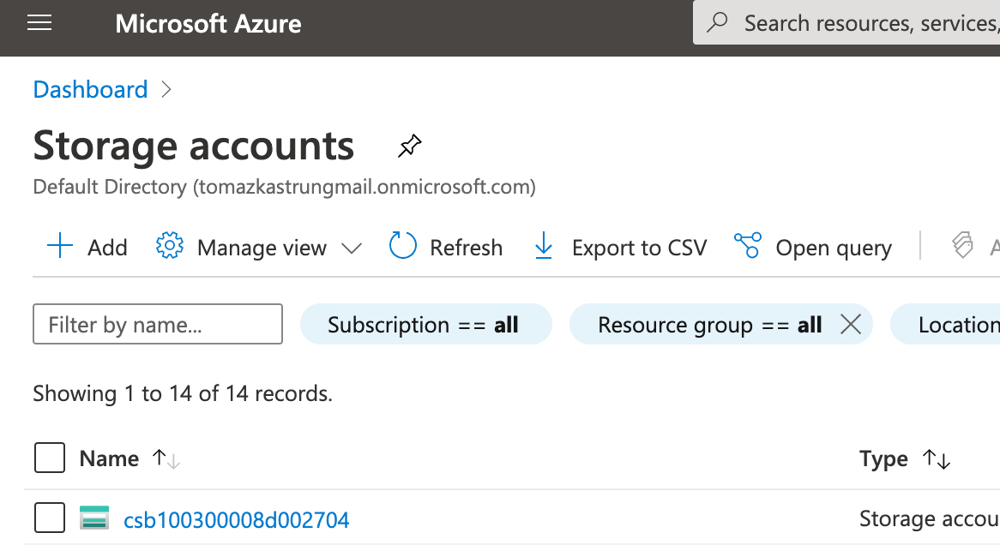

<!-- wp:paragraph -->

And create a new Storage account by clicking on "+ Add". And select the subscription, Resource group, Storage account name, location, account type and replication.

<!-- /wp:paragraph -->

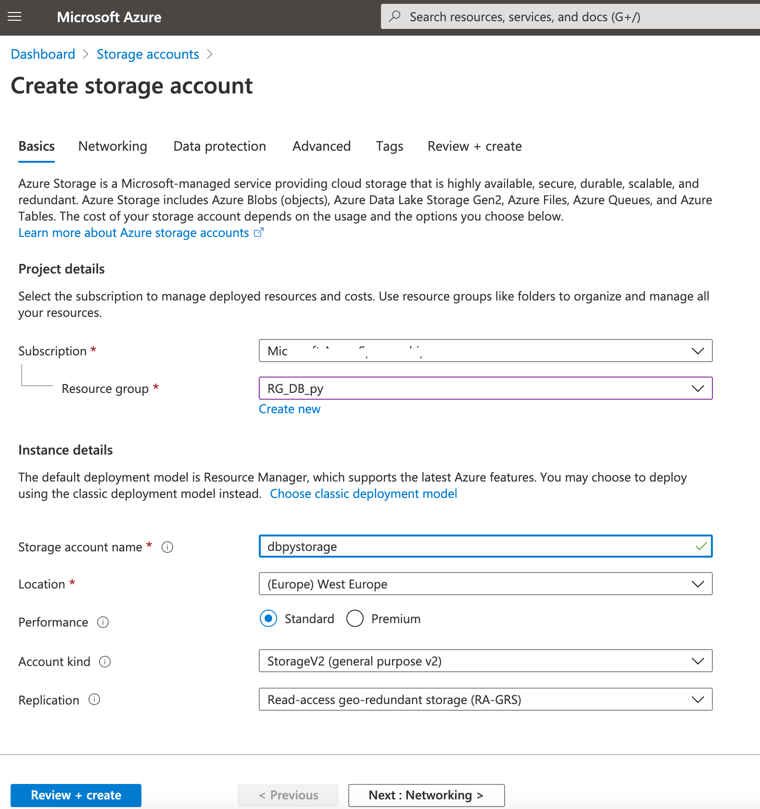

<!-- wp:paragraph -->

Continue to set up networking, data protection, advance settings and create the storage account. When you are finished with storage account, we will create a storage itself. Note that General Purpose v2 Storage accounts support latest Azure Storage features and all functionality of general purpose v1 and Blob Storage accounts. General purpose v2 accounts bring lowest per-gigabyte capacity prices for Azure storege and support following Azure Storage services:

<!-- /wp:paragraph -->

<!-- wp:list -->
<ul><li>Blobs (all types: Block, Append, Page)</li><li>Data Lake Gen2</li><li>Files</li><li>Disks</li><li>Queues</li><li>Tables</li></ul>
<!-- /wp:list -->

<!-- wp:paragraph -->

Once the Account is ready to be used, select it and choose "Container".

<!-- /wp:paragraph -->

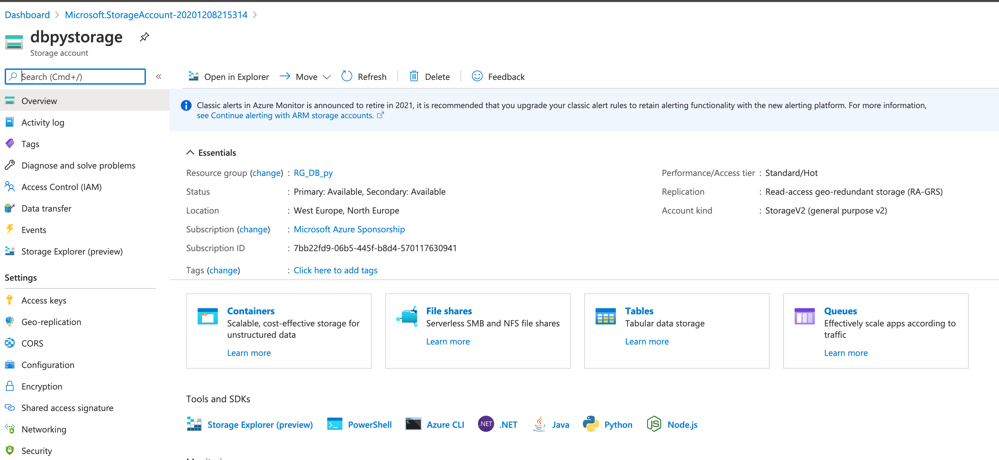

<!-- wp:paragraph -->

Container is a blob storage for unstructured data and will communicate with Azure Databricks DBFS perfectly. When in Container part, select "+ Container" to add new container and give a container a name.

<!-- /wp:paragraph -->

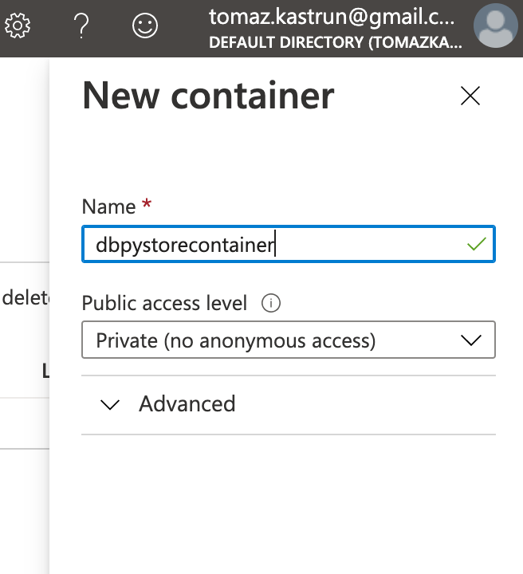

<!-- wp:paragraph -->

Once the container is created, click on the container to get additional details.

<!-- /wp:paragraph -->

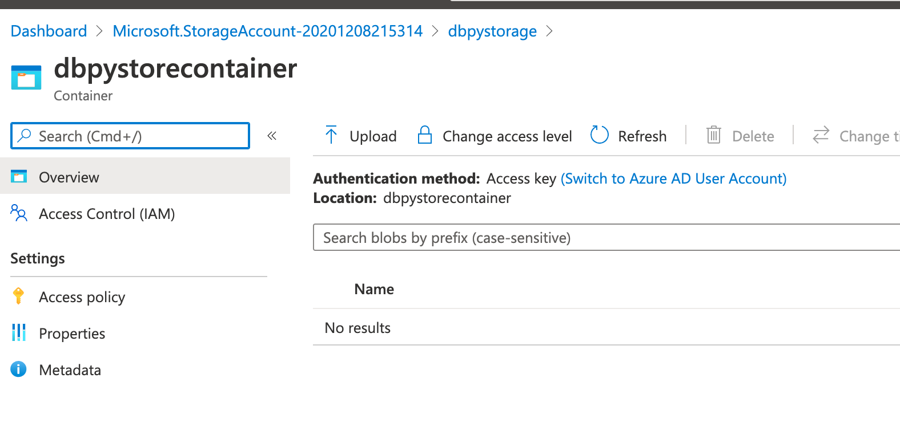

<!-- wp:paragraph -->

Your data will be stored in this container and later used with Azure Databricks Notebooks. you can also access the storage using <a href="https://docs.microsoft.com/en-us/azure/vs-azure-tools-storage-manage-with-storage-explorer?tabs=macos" target="_blank" rel="noreferrer noopener">Microsoft Azure Storage Explorer</a>. It is much more intuitive and and offers easier management, folder creation and binary files management.

<!-- /wp:paragraph -->

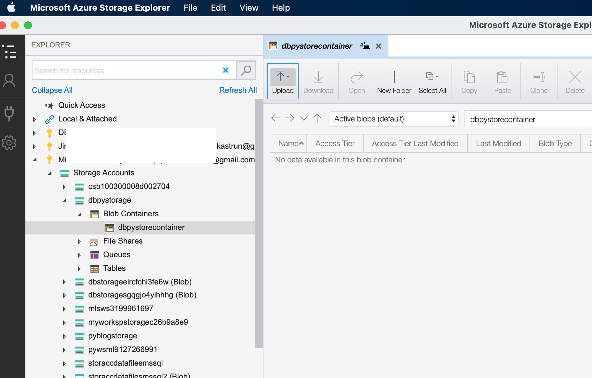

<!-- wp:paragraph -->

You can upload a file using Microsoft Azure Storage Explorer tool or directly on portal. But in organisation, you will have files and data being here copied automatically using many other Azure service. Upload a file that is available for you on Github repository (<a href="https://github.com/tomaztk/Azure-Databricks/tree/main/data" target="_blank" rel="noreferrer noopener">data/Day9_MLBPlayers.csv </a>- data file is licensed under GNU) to blob storage container in any desired way. I have used Storage explorer and simply drag and dropped the file to container.

<!-- /wp:paragraph -->

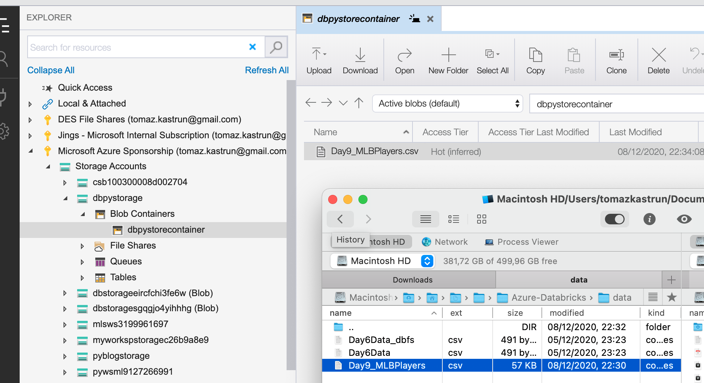

<!-- wp:paragraph -->
### 2. Shared access Signature (SAS)
<!-- /wp:paragraph -->

<!-- wp:paragraph -->

Before we go back to Azure Databricks, we need to set the access policy for this container. Select "Access Policy"

<!-- /wp:paragraph -->

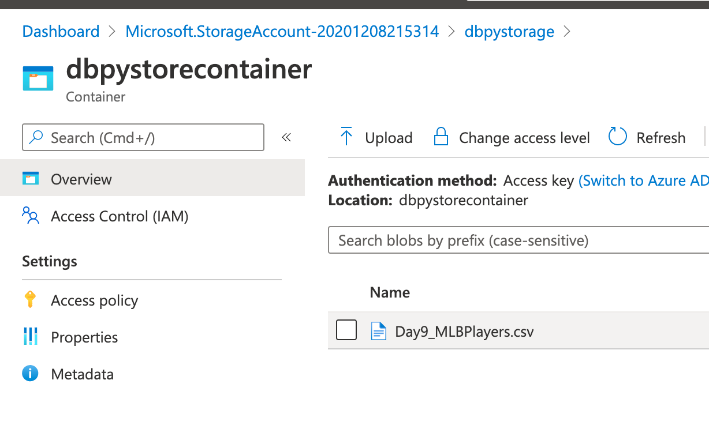

<!-- wp:paragraph -->

We need to create a Shared Access Signature which is a general Microsoft grant to access the storage account. Click on Access policy from left menu and once new site is loaded, select "+ Add Policy" under Shared access policies and give it a name, access and validity period:

<!-- /wp:paragraph -->

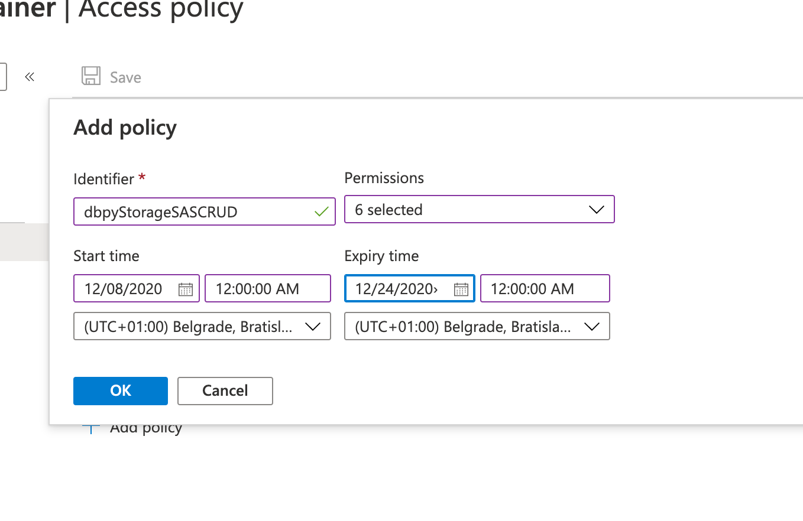

<!-- wp:paragraph -->

Click OK to confirm and click  Save (save icon).  Go back to Storage account and on the left select Shared Access Signature.

<!-- /wp:paragraph -->

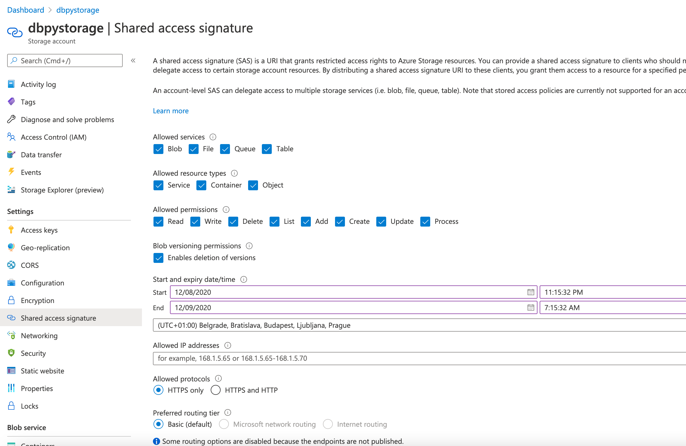

<!-- wp:paragraph -->

Under Allowed resource types, it is mandatory to select Container, but you can select all.  Set the Start and expiry date - 1 month in my case. Select button "Generate SAS and connection string" and copy paste the needed strings; connection string and SAS token should be enough (copy and paste it to a text editor)

<!-- /wp:paragraph -->

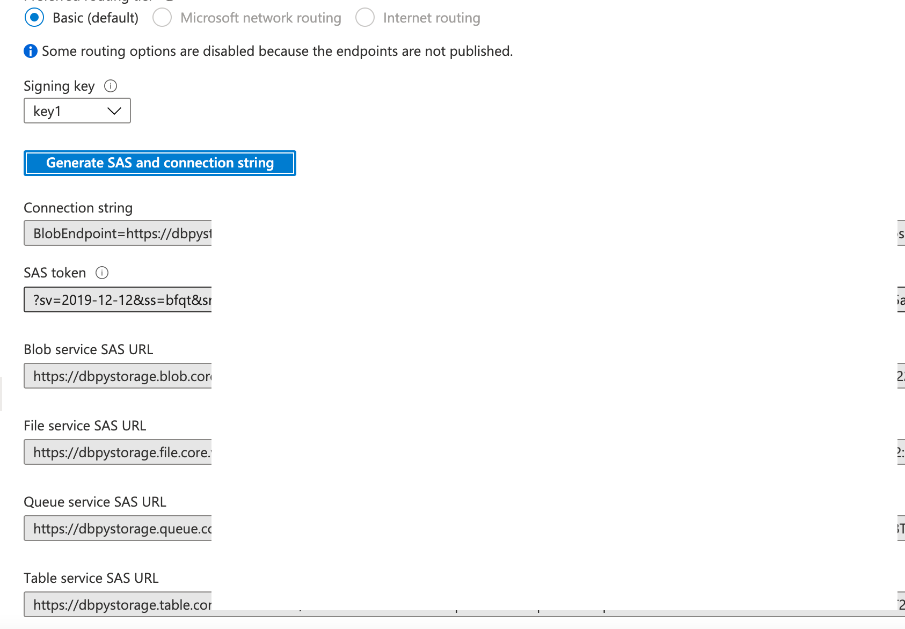

<!-- wp:paragraph -->

Once this is done, let's continue with Azure Databricks notebooks.

<!-- /wp:paragraph -->

<!-- wp:paragraph -->
### 3. Creating notebooks in Azure Databricks
<!-- /wp:paragraph -->

<!-- wp:paragraph -->

Start up a cluster and create new notebooks (as we have discussed on Day 4 and Day 7).  The notebook is available at Github.

<!-- /wp:paragraph -->

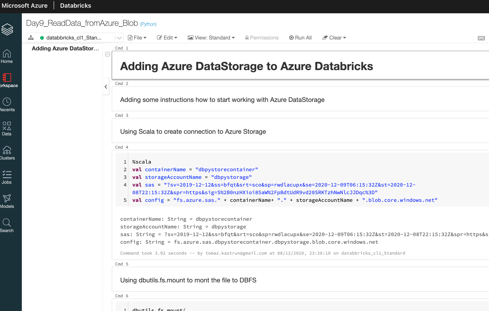

<!-- wp:paragraph -->

And the code is:

<!-- /wp:paragraph -->

<!-- wp:syntaxhighlighter/code -->
<pre class="wp-block-syntaxhighlighter-code">%scala 

val containerName = "dbpystorecontainer"
val storageAccountName = "dbpystorage"
val sas = "?sv=2019-12-12&amp;ss=bfqt&amp;srt=sco&amp;sp=rwdlacupx&amp;se=2020-12-09T06:15:32Z&amp;st=2020-12-08T22:15:32Z&amp;spr=https&amp;sig=S%2B0nzHXioi85aW%2FpBdtUdR9vd20SRKTzhNwNlcJJDqc%3D"
val config = "fs.azure.sas." + containerName+ "." + storageAccountName + ".blob.core.windows.net"</pre>
<!-- /wp:syntaxhighlighter/code -->

<!-- wp:paragraph -->

with the mount function.

<!-- /wp:paragraph -->

<!-- wp:syntaxhighlighter/code -->
<pre class="wp-block-syntaxhighlighter-code">dbutils.fs.mount(
  source = "wasbs://dbpystorecontainer@dbpystorage.blob.core.windows.net/Day9_MLBPlayers.csv",
  mount_point = "/mnt/storage1")</pre>
<!-- /wp:syntaxhighlighter/code -->

<!-- wp:paragraph -->

When you run a following scala command, it will generate a data.frame called mydf1 data.frame 

<!-- /wp:paragraph -->

<!-- wp:syntaxhighlighter/code -->
<pre class="wp-block-syntaxhighlighter-code">%scala

val mydf1 = spark.read
.option("header","true")
.option("inferSchema", "true")
.csv("/mnt/storage1")
display(mydf1)</pre>
<!-- /wp:syntaxhighlighter/code -->

<!-- wp:paragraph -->

And now we can start exploring the dataset. And I am using R language.

<!-- /wp:paragraph -->

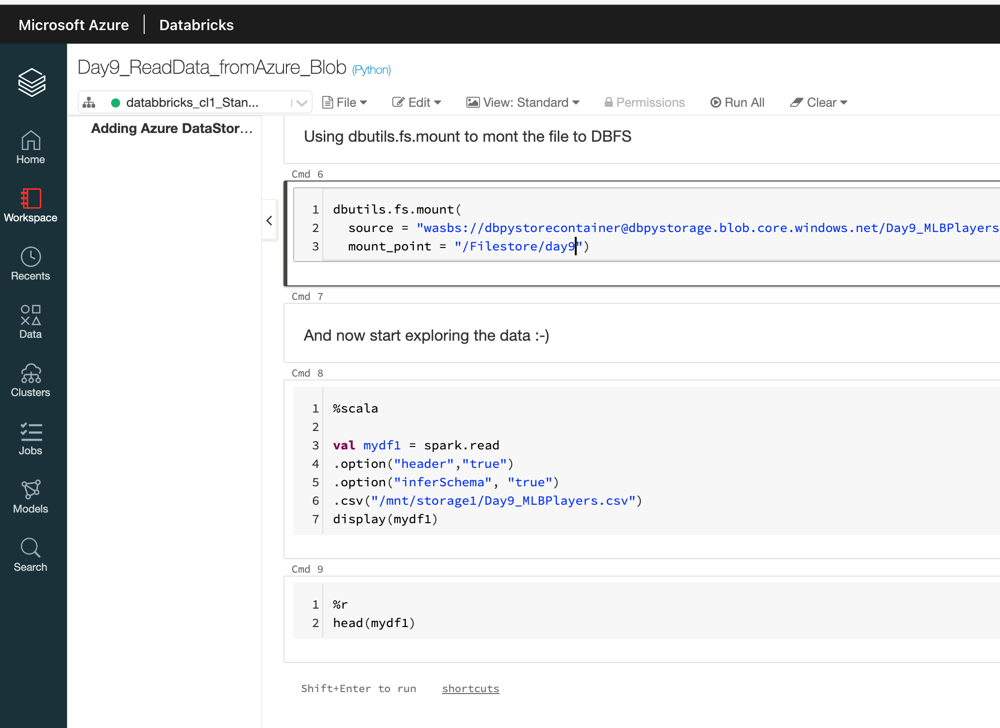

<!-- wp:paragraph -->

This was a long but important topic that we have addressed. Now you know how to addree and store data.

<!-- /wp:paragraph -->

<!-- wp:paragraph -->

Tomorrow we will check how to start using Notebooks and will be for now focusing more on analytics and less on infrastructure.

<!-- /wp:paragraph -->

<!-- wp:paragraph -->

Complete set of code and Notebooks will be available at the<a rel="noreferrer noopener" href="https://github.com/tomaztk/Azure-Databricks" target="_blank">&nbsp;Github repository</a>.

<!-- /wp:paragraph -->

<!-- wp:paragraph -->

Happy Coding and Stay Healthy!

<!-- /wp:paragraph -->