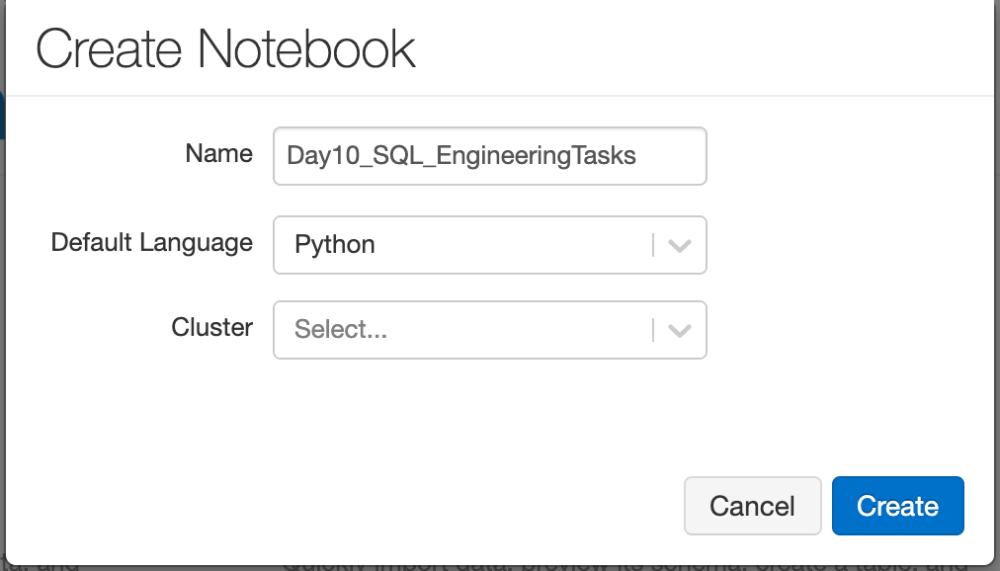
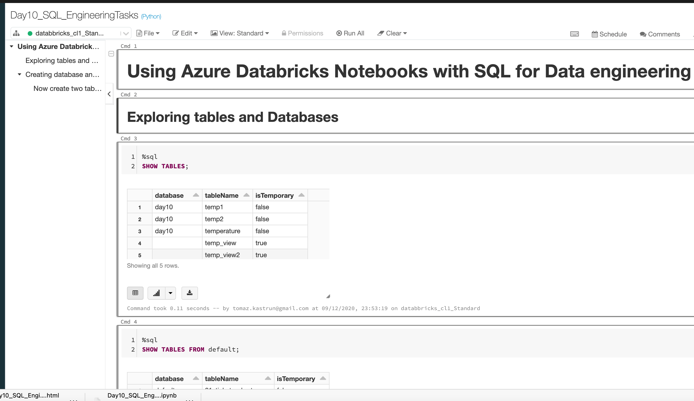
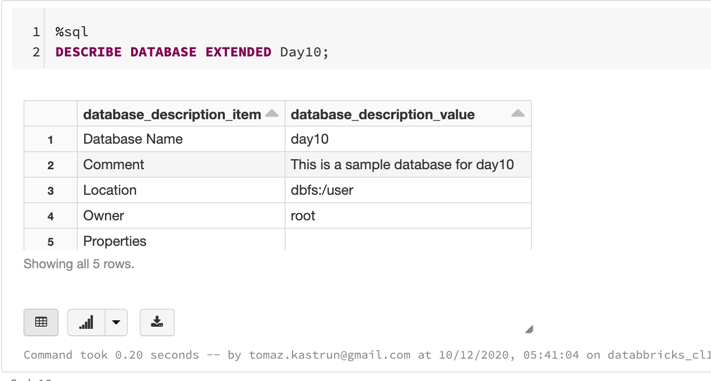
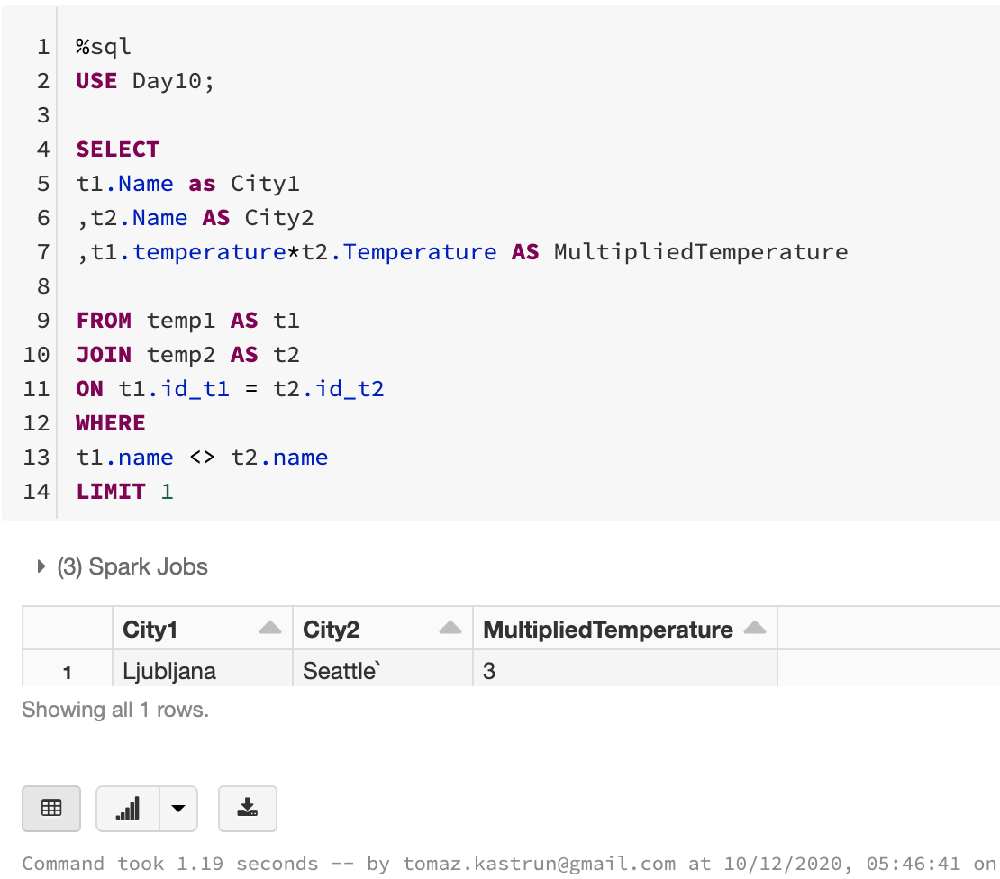

<!-- README.md was wriiten in beautiful MacDown  -->
# Dec 10 2020 - Using Azure Databricks Notebooks with SQL for Data engineering tasks

<!-- badges: start -->

<!-- badges: end -->

Azure Databricks repository is 
a set of blogposts as a Advent of 2020 present to readers for easier onboarding
to Azure Databricks! 

<!-- wp:paragraph -->

Series of Azure Databricks posts:

<!-- /wp:paragraph -->

<!-- wp:list -->
<ul><li>Dec 01: <a rel="noreferrer noopener" href="https://tomaztsql.wordpress.com/2020/12/01/advent-of-2020-day-1-what-is-azure-databricks/" target="_blank">What is Azure Databricks</a></li><li>Dec 02: <a rel="noreferrer noopener" href="https://tomaztsql.wordpress.com/2020/12/02/advent-of-2020-day-2-how-to-get-started-with-azure-databricks/" target="_blank">How to get started with Azure Databricks</a></li><li>Dec 03: <a href="https://tomaztsql.wordpress.com/2020/12/03/advent-of-2020-day-3-getting-to-know-the-workspace-and-azure-databricks-platform/" target="_blank" rel="noreferrer noopener">Getting to know the workspace and Azure Databricks platform</a></li>
<li>Dec 04: <a href="https://tomaztsql.wordpress.com/2020/12/04/advent-of-2020-day-4-creating-your-first-azure-databricks-cluster/" target="_blank" rel="noreferrer noopener">Creating your first Azure Databricks cluster</a></li>
<li>Dec 05: <a href="https://tomaztsql.wordpress.com/2020/12/05/advent-of-2020-day-5-understanding-azure-databricks-cluster-architecture-workers-drivers-and-jobs/" target="_blank" rel="noreferrer noopener">Understanding Azure Databricks cluster architecture, workers, drivers and jobs</a></li>
<li>Dec 06: <a href="https://tomaztsql.wordpress.com/2020/12/06/advent-of-2020-day-6-importing-and-storing-data-to-azure-databricks/" target="_blank" rel="noreferrer noopener">Importing and storing data to Azure Databricks</a></li>
<li>Dec 07: <a href="https://tomaztsql.wordpress.com/2020/12/07/advent-of-2020-day-7-starting-with-databricks-notebooks-and-loading-data-to-dbfs/" target="_blank" rel="noreferrer noopener">Starting with Databricks notebooks and loading data to DBFS</a></li>
<li>Dec 08: <a href="https://tomaztsql.wordpress.com/2020/12/08/advent-of-2020-day-8-using-databricks-cli-and-dbfs-cli-for-file-upload/" target="_blank" rel="noreferrer noopener"> Using Databricks CLI and DBFS CLI for file upload</a></li>

<li>Dec 09: <a href="https://tomaztsql.wordpress.com/2020/12/09/advent-of-2020-day-9-connect-to-azure-blob-storage-using-notebooks-in-azure-databricks/" target="_blank" rel="noreferrer noopener">Connect to Azure Blob storage using Notebooks in  Azure Databricks</a></li>

</ul>
<!-- /wp:list -->

<!-- wp:paragraph -->

Yesterday we were working our way to get data from Azure Storage to Azure Databricks using dbfs mount function and sorted credentials (secret, key).

<!-- /wp:paragraph -->

<!-- wp:paragraph -->

Log into Azure Databricks portal and create a new Notebook (<a rel="noreferrer noopener" href="https://tomaztsql.wordpress.com/2020/12/07/advent-of-2020-day-7-starting-with-databricks-notebooks-and-loading-data-to-dbfs/" target="_blank">day 7</a> explains how to create Notebook). In this notebook, we will use SQL to explore data engineering tasks. I have given my a name <em>Day10_SQL_EngineeringTasks</em> and selecting default Language <em>Python</em>. Attach a cluster to Notebook.

<!-- /wp:paragraph -->

<!-- wp:paragraph -->

And here is the Notebook, and how it looks:

<!-- /wp:paragraph -->

<!-- wp:list {"ordered":true} -->
### 1. Exploring Databases with SHOW
<!-- /wp:list -->

<!-- wp:paragraph -->

SHOW is a useful clause to see that your database holds. 

<!-- /wp:paragraph -->

<!-- wp:syntaxhighlighter/code -->
<pre class="wp-block-syntaxhighlighter-code">%sql
SHOW TABLES;</pre>
<!-- /wp:syntaxhighlighter/code -->

<!-- wp:syntaxhighlighter/code -->
<pre class="wp-block-syntaxhighlighter-code">%sql 
SHOW TABLES FROM default;</pre>
<!-- /wp:syntaxhighlighter/code -->

<!-- wp:syntaxhighlighter/code -->
<pre class="wp-block-syntaxhighlighter-code">%sql 
SHOW TABLES IN default LIKE 'day6*'</pre>
<!-- /wp:syntaxhighlighter/code -->

<!-- wp:paragraph -->
### 2. Creating database and getting information with DESCRIBE 
<!-- /wp:paragraph -->

<!-- wp:paragraph -->

Creating a database is simple, by defining the location and adding some information.

<!-- /wp:paragraph -->

<!-- wp:syntaxhighlighter/code -->
<pre class="wp-block-syntaxhighlighter-code">%sql 
CREATE DATABASE IF NOT EXISTS Day10 COMMENT 'This is a sample database for day10' LOCATION '/user';</pre>
<!-- /wp:syntaxhighlighter/code -->

<!-- wp:paragraph -->

Getting some additional information can be done with DESCRIBE clause.

<!-- /wp:paragraph -->

<!-- wp:syntaxhighlighter/code -->
<pre class="wp-block-syntaxhighlighter-code">%sql
DESCRIBE DATABASE EXTENDED Day10;</pre>
<!-- /wp:syntaxhighlighter/code -->

<!-- wp:paragraph -->
### 3. Creating tables and connecting it with CSV
<!-- /wp:paragraph -->

<!-- wp:paragraph -->

For the underlying CSV we will create a table. We will be using CSV file from <a rel="noreferrer noopener" href="https://tomaztsql.wordpress.com/2020/12/06/advent-of-2020-day-6-importing-and-storing-data-to-azure-databricks/" target="_blank">Day 6,</a> and it should be still available on location <em>dbfs:/FileStore/Day6_data_dbfs.csv</em>. This dataset has three columns (Date, Temperature and City) and it should be good starting example.

<!-- /wp:paragraph -->

<!-- wp:syntaxhighlighter/code -->
<pre class="wp-block-syntaxhighlighter-code">%sql
USE Day10;

DROP TABLE IF EXISTS temperature;
CREATE TABLE temperature (date STRING, mean_daily_temp STRING, city STRING)</pre>
<!-- /wp:syntaxhighlighter/code -->

<!-- wp:paragraph -->

And we can check the content of the table and the database:

<!-- /wp:paragraph -->

<!-- wp:syntaxhighlighter/code -->
<pre class="wp-block-syntaxhighlighter-code">%sql
USE Day10;

SELECT * FROM temperature</pre>
<!-- /wp:syntaxhighlighter/code -->

<!-- wp:syntaxhighlighter/code -->
<pre class="wp-block-syntaxhighlighter-code">%sql
SHOW TABLES IN Day10;</pre>
<!-- /wp:syntaxhighlighter/code -->

<!-- wp:paragraph -->

And now connect CSV with the table (or view):

<!-- /wp:paragraph -->

<!-- wp:syntaxhighlighter/code -->
<pre class="wp-block-syntaxhighlighter-code">%sql
USE Day10;

DROP VIEW IF EXISTS temp_view2;
CREATE TEMPORARY VIEW temp_view2
USING CSV
OPTIONS (path "/FileStore/Day6Data_dbfs.csv", header "true", mode "FAILFAST")</pre>
<!-- /wp:syntaxhighlighter/code -->

<!-- wp:paragraph -->

And check the content:

<!-- /wp:paragraph -->

<!-- wp:syntaxhighlighter/code -->
<pre class="wp-block-syntaxhighlighter-code">%sql
USE Day10;
SELECT * FROM temp_view2</pre>
<!-- /wp:syntaxhighlighter/code -->

<!-- wp:paragraph -->

IF you would want to change the data type of a particular column, you can also do it as:

<!-- /wp:paragraph -->

<!-- wp:syntaxhighlighter/code -->
<pre class="wp-block-syntaxhighlighter-code">%sql
USE Day10;

ALTER TABLE temperature CHANGE COLUMN mean_daily_temp INT</pre>
<!-- /wp:syntaxhighlighter/code -->

<!-- wp:paragraph -->

<strong>4. Creating a JOIN between two tables</strong>

<!-- /wp:paragraph -->

<!-- wp:paragraph -->

Let's create two sample tables :

<!-- /wp:paragraph -->

<!-- wp:syntaxhighlighter/code -->
<pre class="wp-block-syntaxhighlighter-code">%sql
USE Day10;

DROP TABLE IF EXISTS temp1;
DROP TABLE IF EXISTS temp2;

CREATE TABLE temp1 (id_t1 INT, name STRING, temperature INT);
CREATE TABLE temp2 (id_t2 INT, name STRING, temperature INT);</pre>
<!-- /wp:syntaxhighlighter/code -->

<!-- wp:paragraph -->

And add some insert statements:

<!-- /wp:paragraph -->

<!-- wp:syntaxhighlighter/code -->
<pre class="wp-block-syntaxhighlighter-code">%sql
USE Day10;

INSERT INTO temp1 VALUES    (2, 'Ljubljana', 1);
INSERT INTO temp1 VALUES    (3, 'Seattle', 5);
INSERT INTO temp2 VALUES    (1, 'Ljubljana', -3);
INSERT INTO temp2 VALUES    (2, 'Seattle`', 3);</pre>
<!-- /wp:syntaxhighlighter/code -->

<!-- wp:paragraph -->

And create an inner join

<!-- /wp:paragraph -->

<!-- wp:syntaxhighlighter/code -->
<pre class="wp-block-syntaxhighlighter-code">%sql
USE Day10;

SELECT 
t1.Name as City1
,t2.Name AS City2
,t1.temperature*t2.Temperature AS MultipliedTemperature

FROM temp1 AS t1
JOIN temp2 AS t2
ON t1.id_t1 = t2.id_t2
WHERE 
t1.name &lt;> t2.name
LIMIT 1</pre>
<!-- /wp:syntaxhighlighter/code -->

<!-- wp:paragraph -->

If you follow the notebook, you will find some additional information, but all in all, the HIVE SQL is ANSI compliant and getting started, should be no problem. When using notebook, each cell  must have a language defined at the beginning, unless it is a language of kernel. <strong>%sql </strong> for SQL language, <strong>%md </strong>for Markdown, <strong>%r</strong> for R language, <strong>%scala</strong> for Scala. Beware, these language pointers are case sensitive, so %sql will interpret as SQL script, where as %SQL will return an error.

<!-- /wp:paragraph -->

<!-- wp:paragraph -->

Tomorrow we will check and explore how to use R to do data engineering, but mostly the data analysis tasks. So, stay tuned.

<!-- /wp:paragraph -->

<!-- wp:paragraph -->

Complete set of code and Notebooks will be available at the<a rel="noreferrer noopener" href="https://github.com/tomaztk/Azure-Databricks" target="_blank">&nbsp;Github repository</a>.

<!-- /wp:paragraph -->

<!-- wp:paragraph -->

Happy Coding and Stay Healthy!

<!-- /wp:paragraph -->
