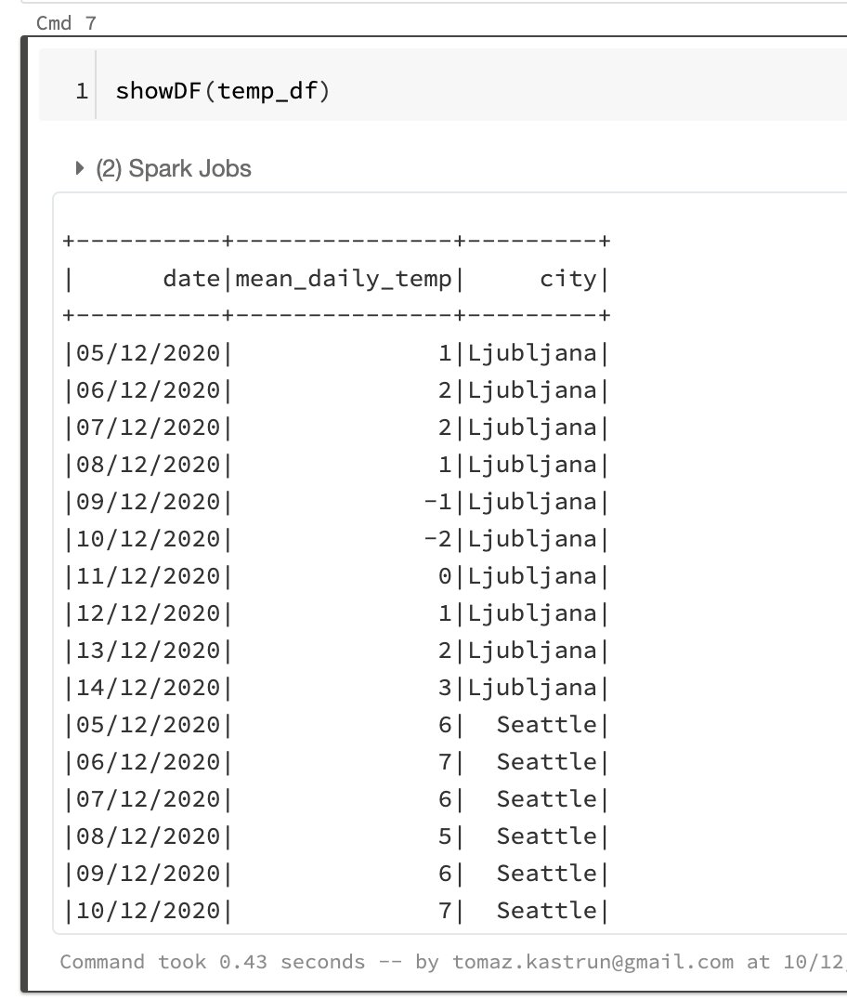
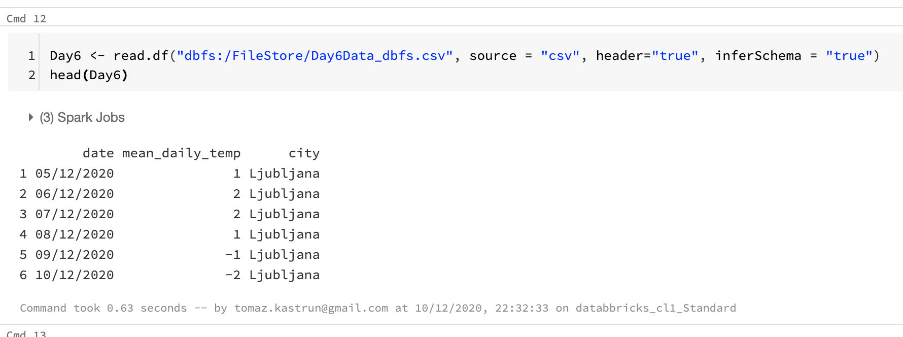
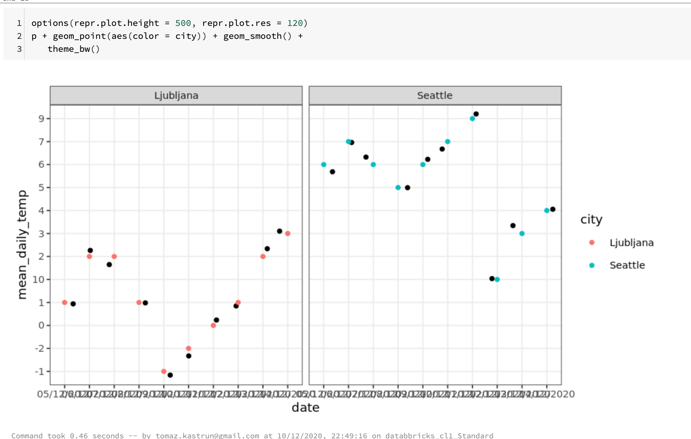
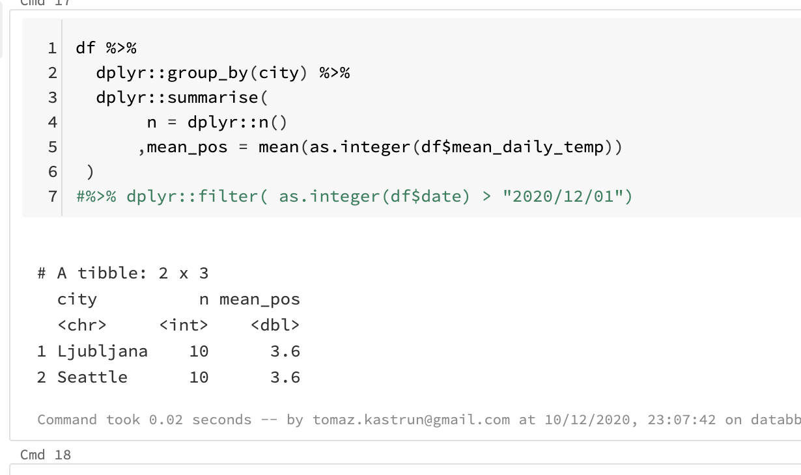
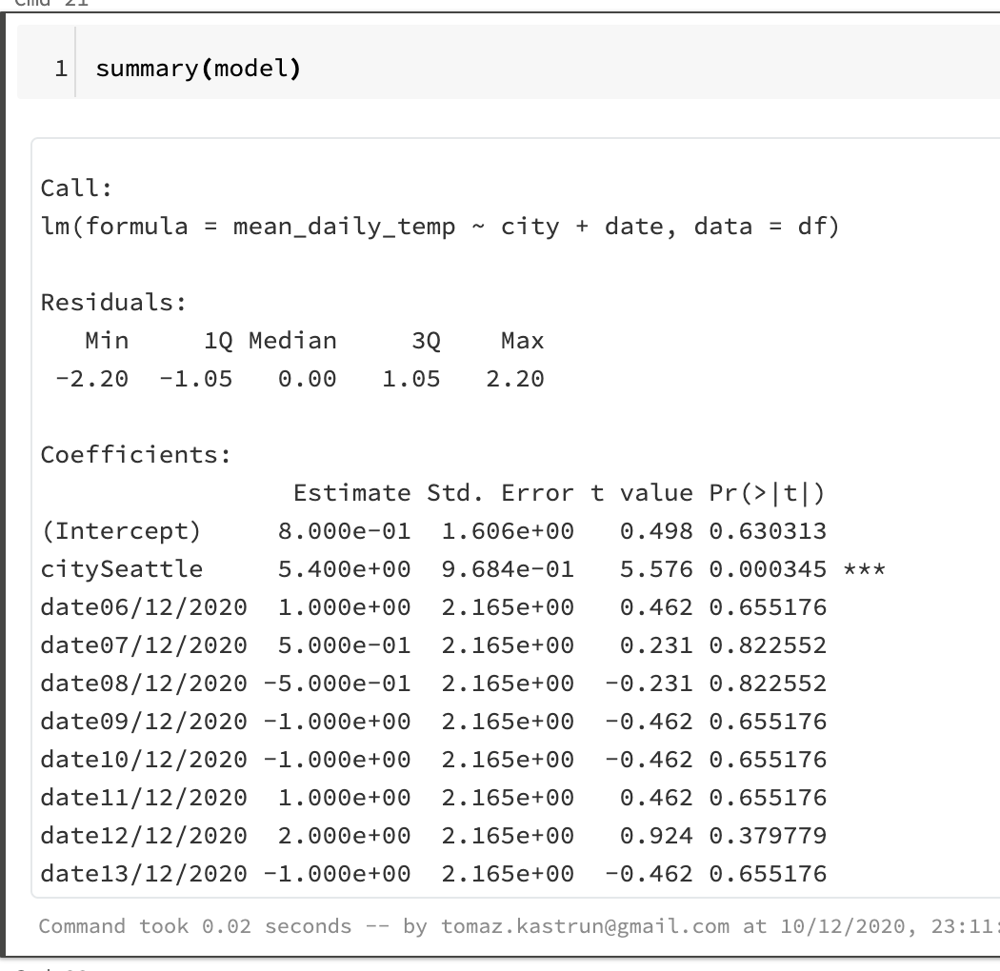
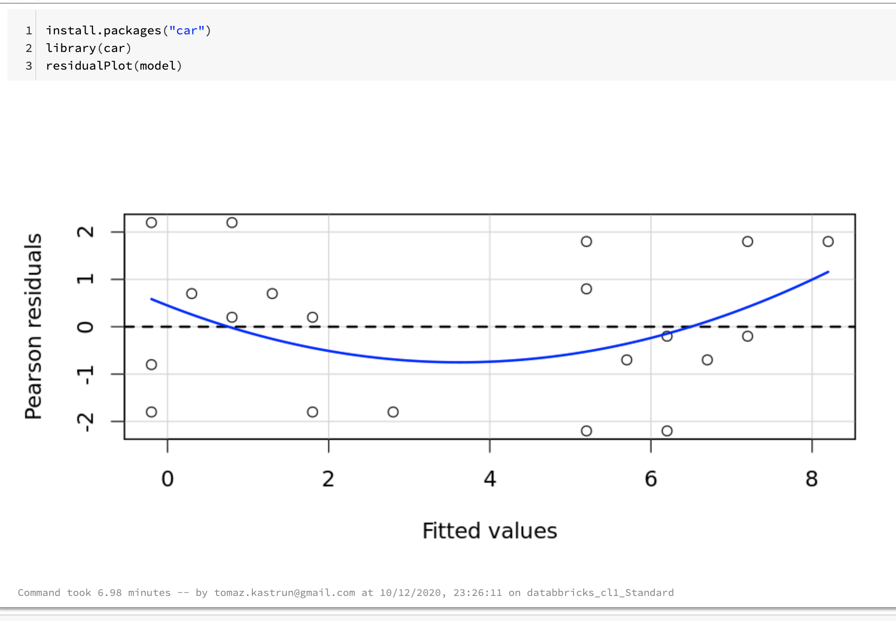

<!-- README.md was wriiten in beautiful MacDown  -->
# Dec 11 2020 - Using Azure Databricks Notebooks with R Language for data analytics

<!-- badges: start -->

<!-- badges: end -->

Azure Databricks repository is 
a set of blogposts as a Advent of 2020 present to readers for easier onboarding
to Azure Databricks! 

<!-- wp:paragraph -->

Series of Azure Databricks posts:

<!-- /wp:paragraph -->

<!-- wp:list -->
<ul><li>Dec 01: <a rel="noreferrer noopener" href="https://tomaztsql.wordpress.com/2020/12/01/advent-of-2020-day-1-what-is-azure-databricks/" target="_blank">What is Azure Databricks</a></li><li>Dec 02: <a rel="noreferrer noopener" href="https://tomaztsql.wordpress.com/2020/12/02/advent-of-2020-day-2-how-to-get-started-with-azure-databricks/" target="_blank">How to get started with Azure Databricks</a></li><li>Dec 03: <a href="https://tomaztsql.wordpress.com/2020/12/03/advent-of-2020-day-3-getting-to-know-the-workspace-and-azure-databricks-platform/" target="_blank" rel="noreferrer noopener">Getting to know the workspace and Azure Databricks platform</a></li>
<li>Dec 04: <a href="https://tomaztsql.wordpress.com/2020/12/04/advent-of-2020-day-4-creating-your-first-azure-databricks-cluster/" target="_blank" rel="noreferrer noopener">Creating your first Azure Databricks cluster</a></li>
<li>Dec 05: <a href="https://tomaztsql.wordpress.com/2020/12/05/advent-of-2020-day-5-understanding-azure-databricks-cluster-architecture-workers-drivers-and-jobs/" target="_blank" rel="noreferrer noopener">Understanding Azure Databricks cluster architecture, workers, drivers and jobs</a></li>
<li>Dec 06: <a href="https://tomaztsql.wordpress.com/2020/12/06/advent-of-2020-day-6-importing-and-storing-data-to-azure-databricks/" target="_blank" rel="noreferrer noopener">Importing and storing data to Azure Databricks</a></li>
<li>Dec 07: <a href="https://tomaztsql.wordpress.com/2020/12/07/advent-of-2020-day-7-starting-with-databricks-notebooks-and-loading-data-to-dbfs/" target="_blank" rel="noreferrer noopener">Starting with Databricks notebooks and loading data to DBFS</a></li>
<li>Dec 08: <a href="https://tomaztsql.wordpress.com/2020/12/08/advent-of-2020-day-8-using-databricks-cli-and-dbfs-cli-for-file-upload/" target="_blank" rel="noreferrer noopener"> Using Databricks CLI and DBFS CLI for file upload</a></li>
<li>Dec 09: <a href="https://tomaztsql.wordpress.com/2020/12/09/advent-of-2020-day-9-connect-to-azure-blob-storage-using-notebooks-in-azure-databricks/" target="_blank" rel="noreferrer noopener">Connect to Azure Blob storage using Notebooks in  Azure Databricks</a></li>

<li>Dec 10: <a href="https://tomaztsql.wordpress.com/2020/12/10/advent-of-2020-day-10-using-azure-databricks-notebooks-with-sql-for-data-engineering-tasks/" target="_blank" rel="noreferrer noopener">Using Azure Databricks Notebooks with SQL for Data engineering tasks</a></li>

</ul>
<!-- /wp:list -->

<!-- wp:paragraph -->

We looked into SQL language and how to get some basic data preparation done. Today we will look into R and how to get started with data analytics.

<!-- /wp:paragraph -->

<!-- wp:heading {"level":3} -->
### Creating a data.frame (or getting data from SQL Table) 
<!-- /wp:heading -->

<!-- wp:paragraph -->

Create a new notebook (Name: Day11_R_AnalyticsTasks, Language: R) and let's go. Now we will get data from SQL tables and DBFS files.

<!-- /wp:paragraph -->

<!-- wp:paragraph -->

We will be using a database from Day10 and the table called temperature.

<!-- /wp:paragraph -->

<!-- wp:syntaxhighlighter/code -->
<pre class="wp-block-syntaxhighlighter-code">%sql
USE Day10;

SELECT * FROM temperature</pre>
<!-- /wp:syntaxhighlighter/code -->

<!-- wp:paragraph -->

For getting SQL query result into R data.frame, we will use SparkR package.

<!-- /wp:paragraph -->

<!-- wp:syntaxhighlighter/code -->
<pre class="wp-block-syntaxhighlighter-code">library(SparkR)</pre>
<!-- /wp:syntaxhighlighter/code -->

<!-- wp:paragraph -->

Getting Query results in R data frame (using SparkR R library)

<!-- /wp:paragraph -->

<!-- wp:syntaxhighlighter/code -->
<pre class="wp-block-syntaxhighlighter-code">temp_df &lt;- sql("SELECT * FROM temperature")</pre>
<!-- /wp:syntaxhighlighter/code -->

<!-- wp:paragraph -->

With this <em>temp_df </em>data.frame we can start using R or SparkR functions. For example viewing the content of the data.frame.

<!-- /wp:paragraph -->

<!-- wp:syntaxhighlighter/code -->
<pre class="wp-block-syntaxhighlighter-code">showDF(temp_df)</pre>
<!-- /wp:syntaxhighlighter/code -->

<!-- wp:paragraph -->

This is a SparkR data.frame. you can aslo create a R data.frame by using <em>as.data.frame</em> function.

<!-- /wp:paragraph -->

<!-- wp:syntaxhighlighter/code -->
<pre class="wp-block-syntaxhighlighter-code">df &lt;- as.data.frame(temp_df)</pre>
<!-- /wp:syntaxhighlighter/code -->

<!-- wp:paragraph -->

Creating standard R data.frame and it can be used with any other R packages. 

<!-- /wp:paragraph -->

<!-- wp:heading -->
### Importing CSV file into R data.frame 
<!-- /wp:heading -->

<!-- wp:paragraph -->

Another way to get data into R data.frame is to feed data from CSV file. And in this case, SparkR library will again come in handy. Once data in data.frame, it can be used with other R libraries.

<!-- /wp:paragraph -->

<!-- wp:syntaxhighlighter/code -->
<pre class="wp-block-syntaxhighlighter-code">Day6 &lt;- read.df("dbfs:/FileStore/Day6Data_dbfs.csv", source = "csv", header="true", inferSchema = "true")
head(Day6)</pre>
<!-- /wp:syntaxhighlighter/code -->

<!-- wp:heading -->
### Doing simple analysis and visualisations
<!-- /wp:heading -->

<!-- wp:paragraph -->

Once data is available in data.frame and it can be used for analysis and visualisations. Let's load ggplot2.

<!-- /wp:paragraph -->

<!-- wp:syntaxhighlighter/code -->
<pre class="wp-block-syntaxhighlighter-code">library(ggplot2)
p &lt;- ggplot(df, aes(date, mean_daily_temp)) 
p &lt;- p + geom_jitter() + facet_wrap(~city)
p</pre>
<!-- /wp:syntaxhighlighter/code -->

<!-- wp:paragraph -->

And make the graph smaller and give it a theme.

<!-- /wp:paragraph -->

<!-- wp:syntaxhighlighter/code -->
<pre class="wp-block-syntaxhighlighter-code">options(repr.plot.height = 500, repr.plot.res = 120)
p + geom_point(aes(color = city)) + geom_smooth() + 
   theme_bw()</pre>
<!-- /wp:syntaxhighlighter/code -->

<!-- wp:paragraph -->

Once again, we can use other data wrangling packages. Both <em>dplyr</em> and <em>ggplot2</em> are preinstalled on Databricks Cluster.

<!-- /wp:paragraph -->

<!-- wp:syntaxhighlighter/code -->
<pre class="wp-block-syntaxhighlighter-code">library(dplyr)</pre>
<!-- /wp:syntaxhighlighter/code -->

<!-- wp:paragraph -->

When you load a library, nothing might be returned as a result. In case of warning, Databricks will display the warnings. Dplyr package can be used as any other package absolutely normally, without any limitations.

<!-- /wp:paragraph -->

<!-- wp:syntaxhighlighter/code -->
<pre class="wp-block-syntaxhighlighter-code">df %>%
  dplyr::group_by(city) %>%
  dplyr::summarise(
       n = dplyr::n()
      ,mean_pos = mean(as.integer(df$mean_daily_temp))
 ) 
#%>% dplyr::filter( as.integer(df$date) > "2020/12/01")</pre>
<!-- /wp:syntaxhighlighter/code -->

<!-- wp:paragraph -->

But note(!), dplyr functions might not work, and it is due to the collision of function names with SparkR library. SparkR has same functions (<em>arrange, between, coalesce, collect, contains, count, cume_dist, dense_rank, desc, distinct, explain, filter, first, group_by, intersect, lag, last, lead, mutate, n, n_distinct, ntile, percent_rank, rename, row_number, sample_frac, select, sql, summarize, union)</em>. In other to solve this collision, either  detach (<em>detach("package:dplyr")</em>) the dplyr package, or we instance the package by: dplyr::summarise instead of just summarise. 

<!-- /wp:paragraph -->

<!-- wp:heading -->
### Creating a simple linear regression
<!-- /wp:heading -->

<!-- wp:paragraph -->

We can also use many of the R packages for data analysis, and in this case I will run simple regression, trying to predict the daily temperature. Simply run the regression function lm().

<!-- /wp:paragraph -->

<!-- wp:syntaxhighlighter/code -->
<pre class="wp-block-syntaxhighlighter-code">model &lt;- lm(mean_daily_temp ~ city + date, data = df)
model</pre>
<!-- /wp:syntaxhighlighter/code -->

<!-- wp:paragraph -->

And run <em>base </em>r function summary() to get model insights.

<!-- /wp:paragraph -->

<!-- wp:syntaxhighlighter/code -->
<pre class="wp-block-syntaxhighlighter-code">summary(model)</pre>
<!-- /wp:syntaxhighlighter/code -->

<!-- wp:syntaxhighlighter/code -->
<pre class="wp-block-syntaxhighlighter-code">confint(model)</pre>
<!-- /wp:syntaxhighlighter/code -->

<!-- wp:paragraph -->

In addition, you can directly install any missing or needed package in notebook (R engine and Databricks Runtime environment version should be applied). In this case, I am running a <em>residualPlot() </em>function from extra installed package <em>car</em>.

<!-- /wp:paragraph -->

<!-- wp:syntaxhighlighter/code -->
<pre class="wp-block-syntaxhighlighter-code">install.packages("car")
library(car)
residualPlot(model)</pre>
<!-- /wp:syntaxhighlighter/code -->

<!-- wp:paragraph -->

Azure Databricks will generate RMarkdown notebook when using R Language as Kernel language. If you want to create a IPython notebook, make Python as Kernel language and use<strong> %r</strong> for switching to R Language. Both RMarkdown notebook and HTML file (with included results) are included and available on <a href="https://github.com/tomaztk/Azure-Databricks" target="_blank" rel="noreferrer noopener">Github</a>.

<!-- /wp:paragraph -->

<!-- wp:paragraph -->

Tomorrow we will check and explore how to use Python to do data engineering, but mostly the data analysis tasks. So, stay tuned.

<!-- /wp:paragraph -->

<!-- wp:paragraph -->

Complete set of code and Notebooks will be available at the<a rel="noreferrer noopener" href="https://github.com/tomaztk/Azure-Databricks" target="_blank">&nbsp;Github repository</a>.

<!-- /wp:paragraph -->

<!-- wp:paragraph -->

Happy Coding and Stay Healthy!

<!-- /wp:paragraph -->
