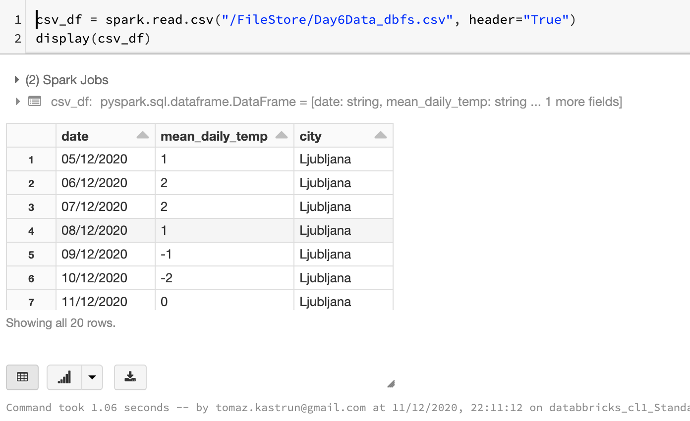
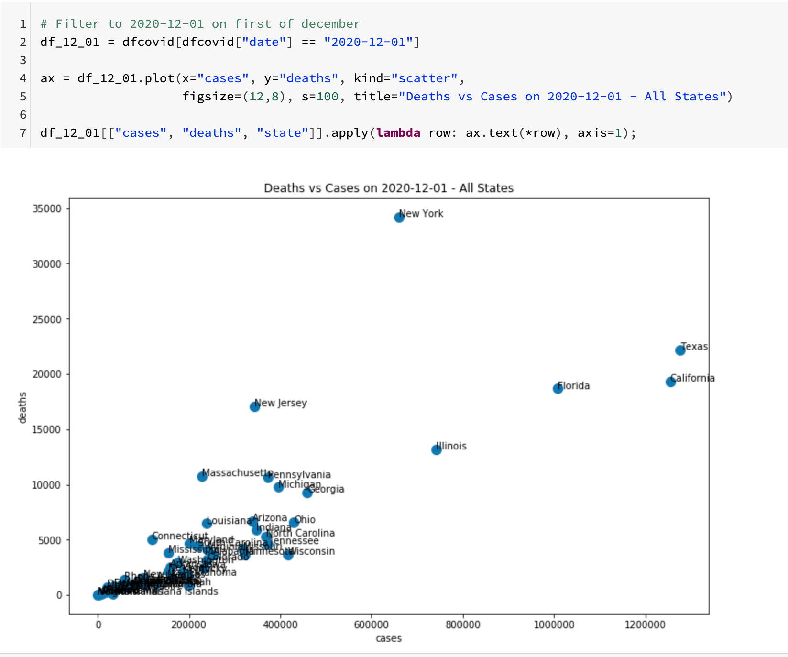
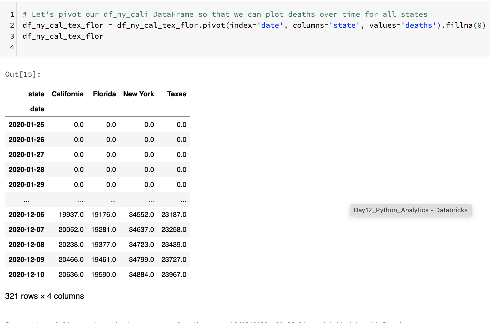
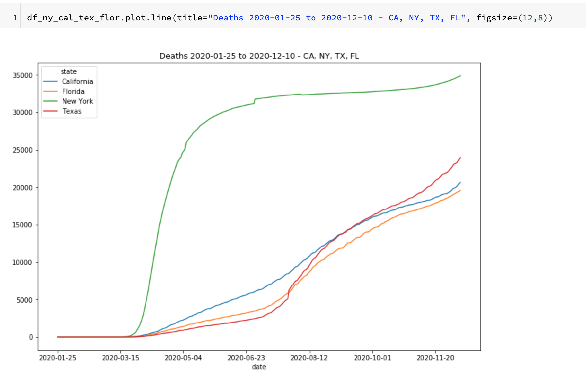
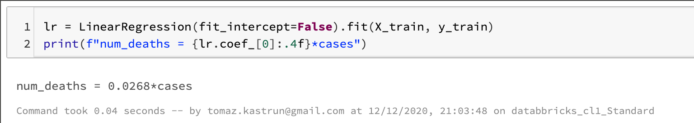

<!-- README.md was wriiten in beautiful MacDown  -->
# Dec 12 2020 - Using Azure Databricks Notebooks with Python Language for data analytics

<!-- badges: start -->

<!-- badges: end -->

Azure Databricks repository is 
a set of blogposts as a Advent of 2020 present to readers for easier onboarding
to Azure Databricks! 

<!-- wp:paragraph -->

Series of Azure Databricks posts:

<!-- /wp:paragraph -->

<!-- wp:list -->
<ul><li>Dec 01: <a rel="noreferrer noopener" href="https://tomaztsql.wordpress.com/2020/12/01/advent-of-2020-day-1-what-is-azure-databricks/" target="_blank">What is Azure Databricks</a></li><li>Dec 02: <a rel="noreferrer noopener" href="https://tomaztsql.wordpress.com/2020/12/02/advent-of-2020-day-2-how-to-get-started-with-azure-databricks/" target="_blank">How to get started with Azure Databricks</a></li><li>Dec 03: <a href="https://tomaztsql.wordpress.com/2020/12/03/advent-of-2020-day-3-getting-to-know-the-workspace-and-azure-databricks-platform/" target="_blank" rel="noreferrer noopener">Getting to know the workspace and Azure Databricks platform</a></li>
<li>Dec 04: <a href="https://tomaztsql.wordpress.com/2020/12/04/advent-of-2020-day-4-creating-your-first-azure-databricks-cluster/" target="_blank" rel="noreferrer noopener">Creating your first Azure Databricks cluster</a></li>
<li>Dec 05: <a href="https://tomaztsql.wordpress.com/2020/12/05/advent-of-2020-day-5-understanding-azure-databricks-cluster-architecture-workers-drivers-and-jobs/" target="_blank" rel="noreferrer noopener">Understanding Azure Databricks cluster architecture, workers, drivers and jobs</a></li>
<li>Dec 06: <a href="https://tomaztsql.wordpress.com/2020/12/06/advent-of-2020-day-6-importing-and-storing-data-to-azure-databricks/" target="_blank" rel="noreferrer noopener">Importing and storing data to Azure Databricks</a></li>
<li>Dec 07: <a href="https://tomaztsql.wordpress.com/2020/12/07/advent-of-2020-day-7-starting-with-databricks-notebooks-and-loading-data-to-dbfs/" target="_blank" rel="noreferrer noopener">Starting with Databricks notebooks and loading data to DBFS</a></li>
<li>Dec 08: <a href="https://tomaztsql.wordpress.com/2020/12/08/advent-of-2020-day-8-using-databricks-cli-and-dbfs-cli-for-file-upload/" target="_blank" rel="noreferrer noopener"> Using Databricks CLI and DBFS CLI for file upload</a></li>
<li>Dec 09: <a href="https://tomaztsql.wordpress.com/2020/12/09/advent-of-2020-day-9-connect-to-azure-blob-storage-using-notebooks-in-azure-databricks/" target="_blank" rel="noreferrer noopener">Connect to Azure Blob storage using Notebooks in  Azure Databricks</a></li>
<li>Dec 10: <a href="https://tomaztsql.wordpress.com/2020/12/10/advent-of-2020-day-10-using-azure-databricks-notebooks-with-sql-for-data-engineering-tasks/" target="_blank" rel="noreferrer noopener">Using Azure Databricks Notebooks with SQL for Data engineering tasks</a></li>

<li>Dec 11: <a href="https://tomaztsql.wordpress.com/2020/12/11/advent-of-2020-day-11-using-azure-databricks-notebooks-with-r-language-for-data-analytics/" target="_blank" rel="noreferrer noopener">Using Azure Databricks Notebooks with R Language for data analytics</a></li>

</ul>
<!-- /wp:list -->

<!-- wp:paragraph -->

We looked into SQL and R language and how to get some basic data preparation done. Today we will look into Python  and how to go about data analytics.

<!-- /wp:paragraph -->

<!-- wp:heading {"level":3} -->
### Using data frames and getting data from SQL and DBFS
<!-- /wp:heading -->

<!-- wp:paragraph -->

Create a new notebook with Name: <em>Day12_Py_Analytics</em> and  Language: <em>Python</em> and connect notebook to a cluster we have created on <a rel="noreferrer noopener" href="https://tomaztsql.wordpress.com/2020/12/04/advent-of-2020-day-4-creating-your-first-azure-databricks-cluster/" target="_blank">Day 4</a>.  And let’s go and add some data from FileStore and use data that we uploaded in Day 6.

<!-- /wp:paragraph -->

<!-- wp:syntaxhighlighter/code -->
<pre class="wp-block-syntaxhighlighter-code">csv_df = spark.read.csv("/FileStore/Day6Data_dbfs.csv", header="True")
display(csv_df)</pre>
<!-- /wp:syntaxhighlighter/code -->

<!-- wp:paragraph -->

We can also import data from SQL Table into data frame by simply writing an SQL statement.

<!-- /wp:paragraph -->

<!-- wp:syntaxhighlighter/code -->
<pre class="wp-block-syntaxhighlighter-code">#from pyspark.sql.functions import explode
from pyspark.sql import *
import pandas as pd

display(sql("select * from day10.temperature"))</pre>
<!-- /wp:syntaxhighlighter/code -->

<!-- wp:paragraph -->

Besides displaying dataset, you can store a result of a query to a variable and use it later.

<!-- /wp:paragraph -->

<!-- wp:syntaxhighlighter/code -->
<pre class="wp-block-syntaxhighlighter-code">#for display
display(sql("select * from day10.temperature"))

#to save to variable
df = sql("select * from day10.temperature")
</pre>
<!-- /wp:syntaxhighlighter/code -->

<!-- wp:paragraph -->

Let's get now some data from Databricks sample data (that is available to anybody). So you can insert data from dbfs store and use the sample datasets as well, by using Python Pandas.

<!-- /wp:paragraph -->

<!-- wp:syntaxhighlighter/code -->
<pre class="wp-block-syntaxhighlighter-code">import pandas as pd

dfcovid = pd.read_csv("/dbfs/databricks-datasets/COVID/covid-19-data/us-states.csv")
dfcovid.head()</pre>
<!-- /wp:syntaxhighlighter/code -->

<!-- wp:paragraph -->

and now let's scatter plot some number of cases and deaths per states and use the following Python code that can be simply used in Azure Databricks.

<!-- /wp:paragraph -->

<!-- wp:syntaxhighlighter/code -->
<pre class="wp-block-syntaxhighlighter-code"># Filter to 2020-12-01 on first of december
df_12_01 = dfcovid[dfcovid["date"] == "2020-12-01"] 

ax = df_12_01.plot(x="cases", y="deaths", kind="scatter", 
                   figsize=(12,8), s=100, title="Deaths vs Cases on 2020-12-01 - All States")

df_12_01[["cases", "deaths", "state"]].apply(lambda row: ax.text(*row), axis=1);</pre>
<!-- /wp:syntaxhighlighter/code -->

<!-- wp:paragraph -->

And now let's compare only couple of these extreme states (New York, Texas, California and Florida). And create a subset for only these four states:

<!-- /wp:paragraph -->

<!-- wp:syntaxhighlighter/code -->
<pre class="wp-block-syntaxhighlighter-code">df_ny_cal_tex_flor = dfcovid[(dfcovid["state"] == "New York") | (dfcovid["state"] == "California") | (dfcovid["state"] == "Florida") | (dfcovid["state"] == "Texas")]</pre>
<!-- /wp:syntaxhighlighter/code -->

<!-- wp:paragraph -->

And now to create an index for the plot of deaths over time

<!-- /wp:paragraph -->

<!-- wp:syntaxhighlighter/code -->
<pre class="wp-block-syntaxhighlighter-code">df_ny_cal_tex_flor = df_ny_cal_tex_flor.pivot(index='date', columns='state', values='deaths').fillna(0)
df_ny_cal_tex_flor
</pre>
<!-- /wp:syntaxhighlighter/code -->

<!-- wp:paragraph -->

and now plot this data using this dataset:

<!-- /wp:paragraph -->

<!-- wp:syntaxhighlighter/code -->
<pre class="wp-block-syntaxhighlighter-code">df_ny_cal_tex_flor.plot.line(title="Deaths 2020-01-25 to 2020-12-10 - CA, NY, TX, FL", figsize=(12,8))</pre>
<!-- /wp:syntaxhighlighter/code -->

<!-- wp:paragraph -->

And now for a simple regression analysis, we will split data from test and train. Since the first and second wave we will need to thing how to split the data. Let's split it until mid of November and after mid of November.

<!-- /wp:paragraph -->

<!-- wp:syntaxhighlighter/code -->
<pre class="wp-block-syntaxhighlighter-code">train_df = dfcovid[(dfcovid["date"] >= "2020-07-01") &amp; (dfcovid["date"] &lt;= "2020-11-15")]
test_df = dfcovid[dfcovid["date"] > "2020-11-16"]

X_train = train_df[["cases"]]
y_train = train_df["deaths"]

X_test = test_df[["cases"]]
y_test = test_df["deaths"]</pre>
<!-- /wp:syntaxhighlighter/code -->

<!-- wp:paragraph -->

We will use scikit-learn to do simple linear regression.

<!-- /wp:paragraph -->

<!-- wp:syntaxhighlighter/code -->
<pre class="wp-block-syntaxhighlighter-code">from sklearn.linear_model import LinearRegression

lr = LinearRegression().fit(X_train, y_train)
print(f"num_deaths = {lr.intercept_:.4f} + {lr.coef_[0]:.4f}*cases")</pre>
<!-- /wp:syntaxhighlighter/code -->

<!-- wp:paragraph -->

So if we have no cases, then there should be no deaths caused by COVID-19; this gives us a base line and assume that let's set the intercept to be 0.

<!-- /wp:paragraph -->

<!-- wp:syntaxhighlighter/code -->
<pre class="wp-block-syntaxhighlighter-code">lr = LinearRegression(fit_intercept=False).fit(X_train, y_train)
print(f"num_deaths = {lr.coef_[0]:.4f}*cases")</pre>
<!-- /wp:syntaxhighlighter/code -->

<!-- wp:paragraph -->

This model imposes that there is a 2.68% mortality rate in our dataset. But we know that some states have higher mortality rates and that linear model is absolutely not ideal for that, but it is just to showcase for using Python in Databricks.

<!-- /wp:paragraph -->

<!-- wp:paragraph -->

Tomorrow we will check and explore how to use Python Koalas to do data engineering, so stay tuned.

<!-- /wp:paragraph -->

<!-- wp:paragraph -->

Complete set of code and Notebooks will be available at the<a rel="noreferrer noopener" href="https://github.com/tomaztk/Azure-Databricks" target="_blank">&nbsp;Github repository</a>.

<!-- /wp:paragraph -->

<!-- wp:paragraph -->

Happy Coding and Stay Healthy!

<!-- /wp:paragraph -->