<!-- README.md was wriiten in beautiful MacDown  -->
# Dec 13 2020 - Using Python Databricks Koalas with Azure Databricks

<!-- badges: start -->

<!-- badges: end -->

Azure Databricks repository is 
a set of blogposts as a Advent of 2020 present to readers for easier onboarding
to Azure Databricks! 

<!-- wp:paragraph -->

Series of Azure Databricks posts:

<!-- /wp:paragraph -->

<!-- wp:list -->
<ul><li>Dec 01: <a rel="noreferrer noopener" href="https://tomaztsql.wordpress.com/2020/12/01/advent-of-2020-day-1-what-is-azure-databricks/" target="_blank">What is Azure Databricks</a></li><li>Dec 02: <a rel="noreferrer noopener" href="https://tomaztsql.wordpress.com/2020/12/02/advent-of-2020-day-2-how-to-get-started-with-azure-databricks/" target="_blank">How to get started with Azure Databricks</a></li><li>Dec 03: <a href="https://tomaztsql.wordpress.com/2020/12/03/advent-of-2020-day-3-getting-to-know-the-workspace-and-azure-databricks-platform/" target="_blank" rel="noreferrer noopener">Getting to know the workspace and Azure Databricks platform</a></li>
<li>Dec 04: <a href="https://tomaztsql.wordpress.com/2020/12/04/advent-of-2020-day-4-creating-your-first-azure-databricks-cluster/" target="_blank" rel="noreferrer noopener">Creating your first Azure Databricks cluster</a></li>
<li>Dec 05: <a href="https://tomaztsql.wordpress.com/2020/12/05/advent-of-2020-day-5-understanding-azure-databricks-cluster-architecture-workers-drivers-and-jobs/" target="_blank" rel="noreferrer noopener">Understanding Azure Databricks cluster architecture, workers, drivers and jobs</a></li>
<li>Dec 06: <a href="https://tomaztsql.wordpress.com/2020/12/06/advent-of-2020-day-6-importing-and-storing-data-to-azure-databricks/" target="_blank" rel="noreferrer noopener">Importing and storing data to Azure Databricks</a></li>
<li>Dec 07: <a href="https://tomaztsql.wordpress.com/2020/12/07/advent-of-2020-day-7-starting-with-databricks-notebooks-and-loading-data-to-dbfs/" target="_blank" rel="noreferrer noopener">Starting with Databricks notebooks and loading data to DBFS</a></li>
<li>Dec 08: <a href="https://tomaztsql.wordpress.com/2020/12/08/advent-of-2020-day-8-using-databricks-cli-and-dbfs-cli-for-file-upload/" target="_blank" rel="noreferrer noopener"> Using Databricks CLI and DBFS CLI for file upload</a></li>
<li>Dec 09: <a href="https://tomaztsql.wordpress.com/2020/12/09/advent-of-2020-day-9-connect-to-azure-blob-storage-using-notebooks-in-azure-databricks/" target="_blank" rel="noreferrer noopener">Connect to Azure Blob storage using Notebooks in  Azure Databricks</a></li>
<li>Dec 10: <a href="https://tomaztsql.wordpress.com/2020/12/10/advent-of-2020-day-10-using-azure-databricks-notebooks-with-sql-for-data-engineering-tasks/" target="_blank" rel="noreferrer noopener">Using Azure Databricks Notebooks with SQL for Data engineering tasks</a></li>
<li>Dec 11: <a href="https://tomaztsql.wordpress.com/2020/12/11/advent-of-2020-day-11-using-azure-databricks-notebooks-with-r-language-for-data-analytics/" target="_blank" rel="noreferrer noopener">Using Azure Databricks Notebooks with R Language for data analytics</a></li>

<li>Dec 12: <a href="https://tomaztsql.wordpress.com/2020/12/12/advent-of-2020-day-12-using-azure-databricks-notebooks-with-python-language-for-data-analytics/" target="_blank" rel="noreferrer noopener">Using Azure Databricks Notebooks with Python Language for data analytics</a></li>

</ul>
<!-- /wp:list -->

<!-- wp:paragraph -->

So far, we looked into SQL, R and Python and this post will be about Python Koalas package. A special implementation of pandas DataFrame API on Apache Spark. Data Engineers and data scientist love Python pandas, since it makes data preparation with pandas easier, faster and more productive. And Koalas is a direct "response" to make writing and coding on Spark, easier and more familiar. Also follow the <a rel="noreferrer noopener" href="https://koalas.readthedocs.io/en/latest/getting_started/index.html" target="_blank">official documentation</a> with full description of the package.

<!-- /wp:paragraph -->

<!-- wp:paragraph -->

Koalas come pre-installed on Databricks Runtine 7.1 and above and we can use package directly in the Azure Databricks notebook. Let us check the Runtime version. Launch your Azure Databricks environment, go to clusters and there you should see the version:

<!-- /wp:paragraph -->

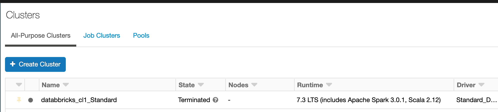

<!-- wp:paragraph -->

My cluster is rocking Databricks Runtime 7.3. So create a new notebook and &nbsp;name it:&nbsp;<em>Day13_Py_Koalas</em>&nbsp;and select the Language:&nbsp;<em>Python</em>. And attach the notebook to your cluster.

<!-- /wp:paragraph -->

<!-- wp:paragraph -->
## 1.Object Creation
<!-- /wp:paragraph -->

<!-- wp:paragraph -->

Before going into sample Python code, we must import the following packages: pandas and numpy so we can create from or convert from/to Databricks Koalas.

<!-- /wp:paragraph -->

<!-- wp:syntaxhighlighter/code -->
<pre class="wp-block-syntaxhighlighter-code">import databricks.koalas as ks
import pandas as pd
import numpy as np</pre>
<!-- /wp:syntaxhighlighter/code -->

<!-- wp:paragraph -->

Creating a Koalas Series by passing a list of values, letting Koalas create a default integer index:

<!-- /wp:paragraph -->

<!-- wp:syntaxhighlighter/code -->
<pre class="wp-block-syntaxhighlighter-code">s = ks.Series([1, 3, 5, np.nan, 6, 8])</pre>
<!-- /wp:syntaxhighlighter/code -->

<!-- wp:paragraph -->

Creating a Koalas DataFrame by passing a dict of objects that can be converted to series-like.

<!-- /wp:paragraph -->

<!-- wp:syntaxhighlighter/code -->
<pre class="wp-block-syntaxhighlighter-code">kdf = ks.DataFrame(
    {'a': [1, 2, 3, 4, 5, 6],
     'b': [100, 200, 300, 400, 500, 600],
     'c': ["one", "two", "three", "four", "five", "six"]},
    index=[10, 20, 30, 40, 50, 60])</pre>
<!-- /wp:syntaxhighlighter/code -->

<!-- wp:paragraph -->

with the result:

<!-- /wp:paragraph -->

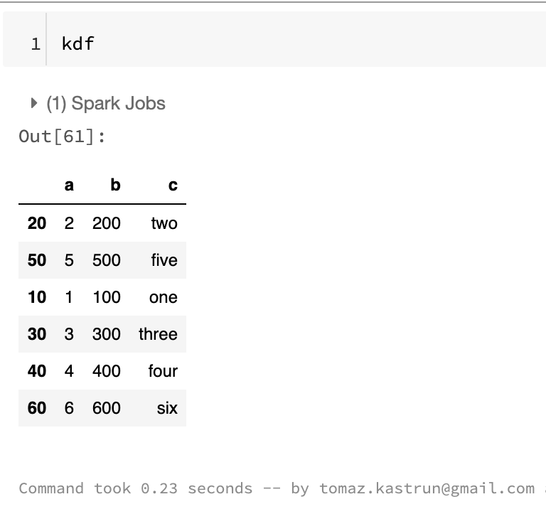

<!-- wp:paragraph -->

Now, let's create a pandas DataFrame by passing a numpy array, with a datetime index and labeled columns:

<!-- /wp:paragraph -->

<!-- wp:syntaxhighlighter/code -->
<pre class="wp-block-syntaxhighlighter-code">dates = pd.date_range('20200807', periods=6)
pdf = pd.DataFrame(np.random.randn(6, 4), index=dates, columns=list('ABCD'))</pre>
<!-- /wp:syntaxhighlighter/code -->

<!-- wp:paragraph -->

and getting the results as pandas dataframe:

<!-- /wp:paragraph -->

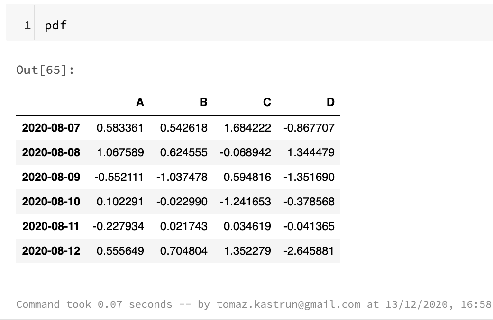

<!-- wp:paragraph -->

Pandas dataframe can easly be converted to Koalas dataframe:

<!-- /wp:paragraph -->

<!-- wp:syntaxhighlighter/code -->
<pre class="wp-block-syntaxhighlighter-code">kdf = ks.from_pandas(pdf)
type(kdf)</pre>
<!-- /wp:syntaxhighlighter/code -->

<!-- wp:paragraph -->

With type of: <em>Out[67]: databricks.koalas.frame.DataFrame</em>

<!-- /wp:paragraph -->

<!-- wp:paragraph -->

And we can output the dataframe to get the same result as with pandas dataframe:

<!-- /wp:paragraph -->

<!-- wp:syntaxhighlighter/code -->
<pre class="wp-block-syntaxhighlighter-code">kdf</pre>
<!-- /wp:syntaxhighlighter/code -->

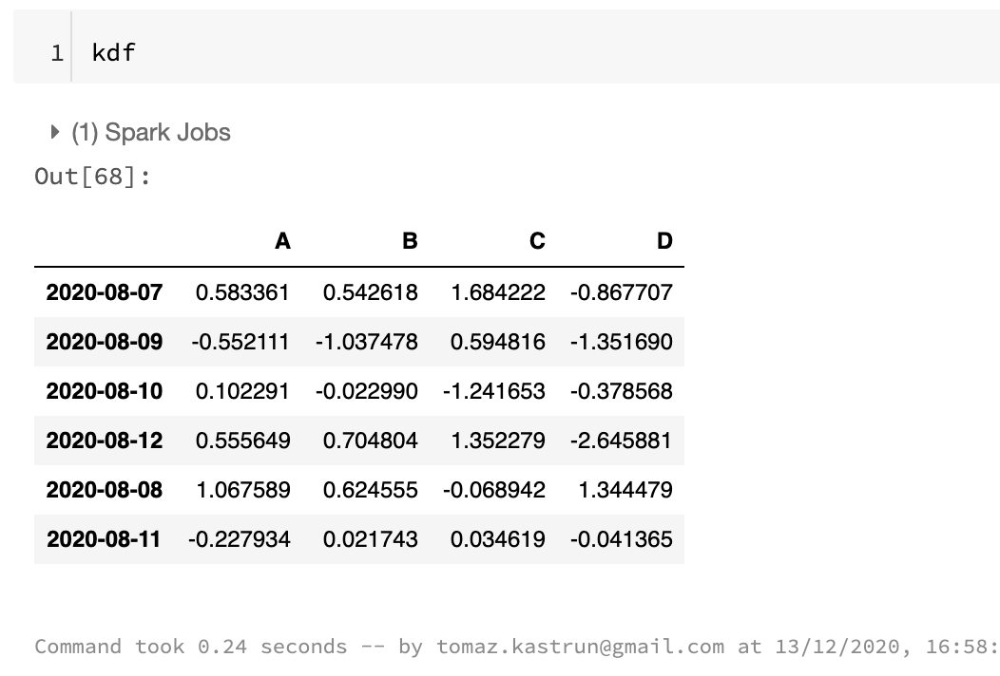

<!-- wp:paragraph -->

Also, it is possible to create a Koalas DataFrame from Spark DataFrame. We need to load additional  pyspark package first, then create a SparkSession and create a Spark Dataframe.

<!-- /wp:paragraph -->

<!-- wp:syntaxhighlighter/code -->
<pre class="wp-block-syntaxhighlighter-code">#Load package
from pyspark.sql import SparkSession
spark = SparkSession.builder.getOrCreate()
sdf = spark.createDataFrame(pdf)</pre>
<!-- /wp:syntaxhighlighter/code -->

<!-- wp:paragraph -->

Since spark is lazy we need to explicitly call the show function in order to see the spark dataframe.

<!-- /wp:paragraph -->

<!-- wp:syntaxhighlighter/code -->
<pre class="wp-block-syntaxhighlighter-code">sdf.show()</pre>
<!-- /wp:syntaxhighlighter/code -->

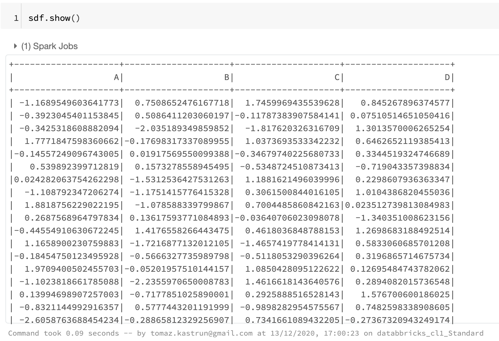

<!-- wp:paragraph -->

Creating Koalas DataFrame from Spark DataFrame.&nbsp;<code>to_koalas()</code>&nbsp;is automatically attached to Spark DataFrame and available as an API when Koalas is imported.

<!-- /wp:paragraph -->

<!-- wp:syntaxhighlighter/code -->
<pre class="wp-block-syntaxhighlighter-code">kdf = sdf.to_koalas()</pre>
<!-- /wp:syntaxhighlighter/code -->

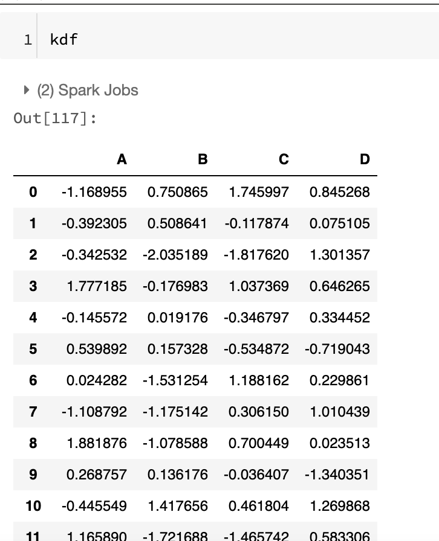

<!-- wp:paragraph -->
## 2. Viewing data 
<!-- /wp:paragraph -->

<!-- wp:paragraph -->

See the top rows of the frame. The results may not be the same as pandas though: unlike pandas, the data in a Spark dataframe is not&nbsp;<em>ordered</em>, it has no intrinsic notion of index. When asked for the head of a dataframe, Spark will just take the requested number of rows from a partition.

<!-- /wp:paragraph -->

<!-- wp:syntaxhighlighter/code -->
<pre class="wp-block-syntaxhighlighter-code">kdf.head()</pre>
<!-- /wp:syntaxhighlighter/code -->

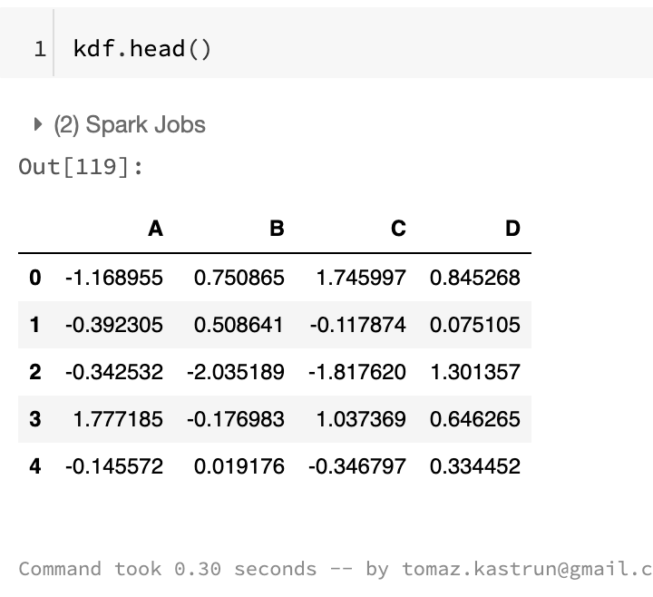

<!-- wp:paragraph -->

You can also display the index, columns, and the underlying numpy data.

<!-- /wp:paragraph -->

<!-- wp:syntaxhighlighter/code -->
<pre class="wp-block-syntaxhighlighter-code">kdf.index
kdf.columns
kdf.to_numpy()</pre>
<!-- /wp:syntaxhighlighter/code -->

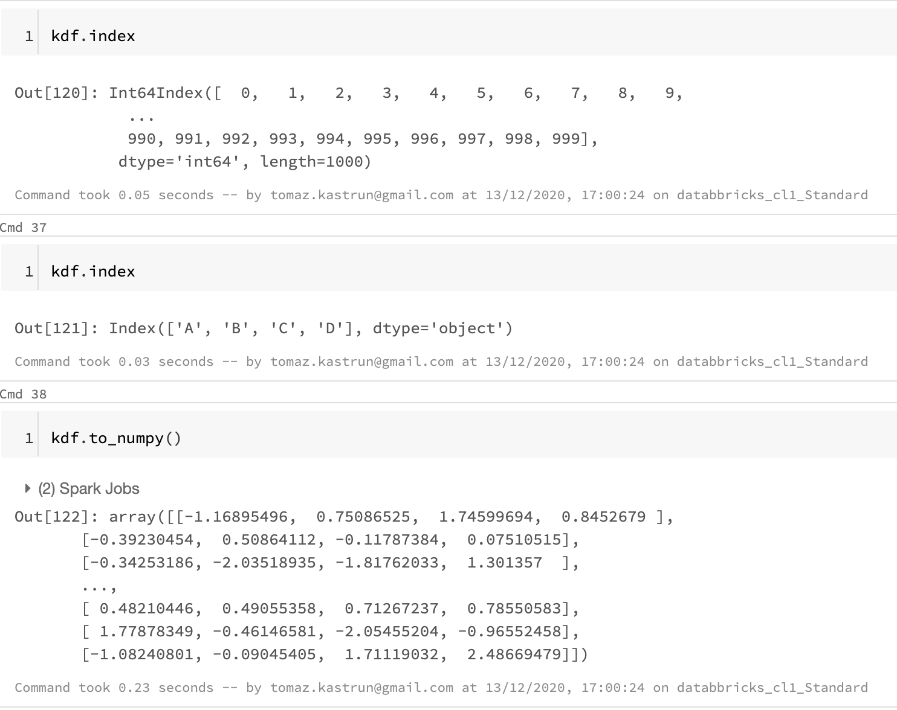

<!-- wp:paragraph -->

And you can also use describe function to get a&nbsp;statistic summary of your data:

<!-- /wp:paragraph -->

<!-- wp:syntaxhighlighter/code -->
<pre class="wp-block-syntaxhighlighter-code">kdf.describe()</pre>
<!-- /wp:syntaxhighlighter/code -->

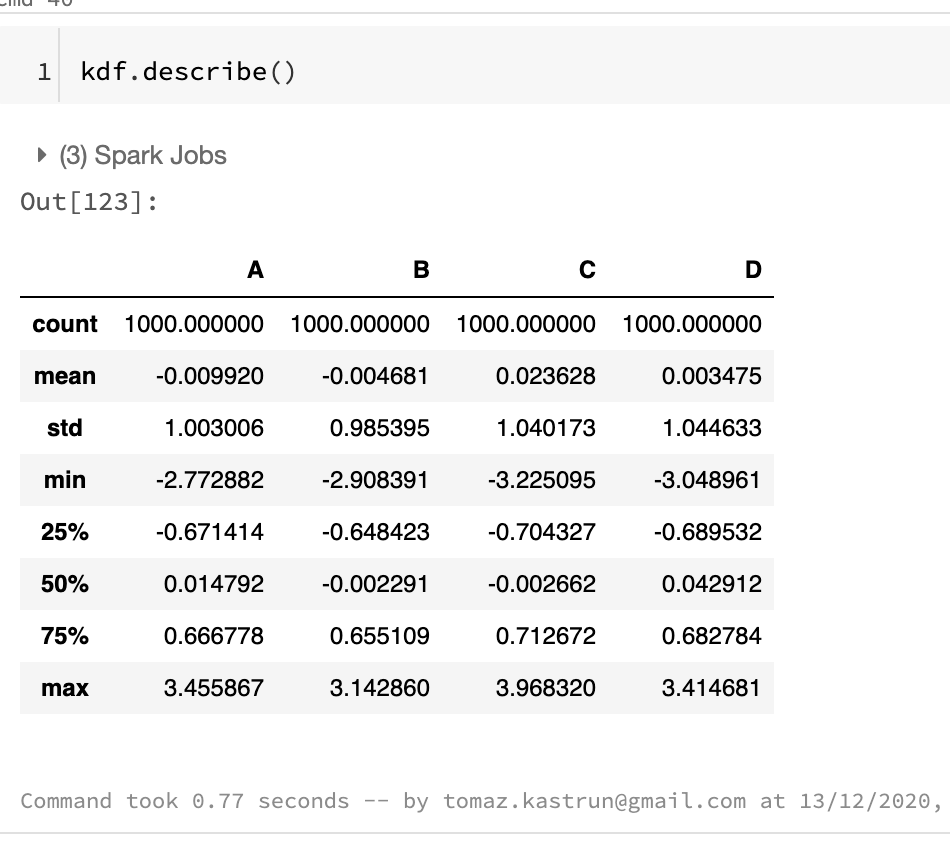

<!-- wp:paragraph -->

You can also transpose the data, by adding a T function:

<!-- /wp:paragraph -->

<!-- wp:syntaxhighlighter/code -->
<pre class="wp-block-syntaxhighlighter-code">kdf.T</pre>
<!-- /wp:syntaxhighlighter/code -->

<!-- wp:paragraph -->

and many other functions. Group is also another great way to get summary of your data. Grouping can be done by "chaining" or adding a group by clause. The internal process - when grouping is applied - happens in three steps:

<!-- /wp:paragraph -->

<!-- wp:list -->
<ul><li>Splitting data into groups (base on criteria)</li><li>applying the function and</li><li>combining the results back to data structure.</li></ul>
<!-- /wp:list -->

<!-- wp:syntaxhighlighter/code -->
<pre class="wp-block-syntaxhighlighter-code">kdf.groupby('A').sum()
#or 
kdf.groupby(['A', 'B']).sum()</pre>
<!-- /wp:syntaxhighlighter/code -->

<!-- wp:paragraph -->

Both are grouping data, first time on Column A and second time on both columns A and B:

<!-- /wp:paragraph -->

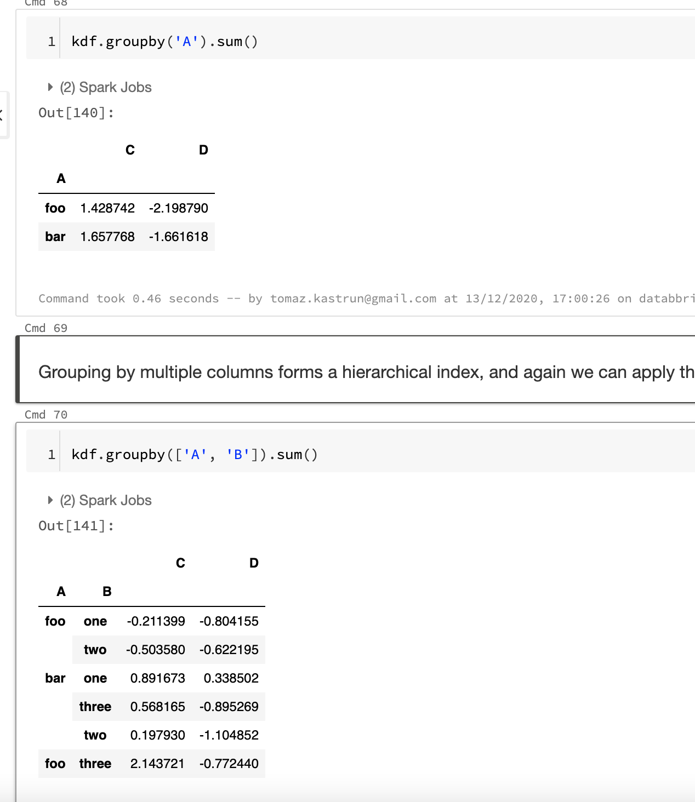

<!-- wp:paragraph -->
## 3. Plotting data 
<!-- /wp:paragraph -->

<!-- wp:paragraph -->

Databricks Koalas is also compatible with matplotlib and inline plotting. We need to load the package:

<!-- /wp:paragraph -->

<!-- wp:syntaxhighlighter/code -->
<pre class="wp-block-syntaxhighlighter-code">%matplotlib inline
from matplotlib import pyplot as plt</pre>
<!-- /wp:syntaxhighlighter/code -->

<!-- wp:paragraph -->

And can continue by creating a simple pandas series:

<!-- /wp:paragraph -->

<!-- wp:syntaxhighlighter/code -->
<pre class="wp-block-syntaxhighlighter-code">pser = pd.Series(np.random.randn(1000),
                 index=pd.date_range('1/1/2000', periods=1000))</pre>
<!-- /wp:syntaxhighlighter/code -->

<!-- wp:paragraph -->

that can be simply converted to Koalas series:

<!-- /wp:paragraph -->

<!-- wp:syntaxhighlighter/code -->
<pre class="wp-block-syntaxhighlighter-code">kser = ks.Series(pser)</pre>
<!-- /wp:syntaxhighlighter/code -->

<!-- wp:paragraph -->

After we have a series in Koalas, we can create cumulative sum of values using series and plot it:

<!-- /wp:paragraph -->

<!-- wp:syntaxhighlighter/code -->
<pre class="wp-block-syntaxhighlighter-code">kser = kser.cummax()
kser.plot()</pre>
<!-- /wp:syntaxhighlighter/code -->

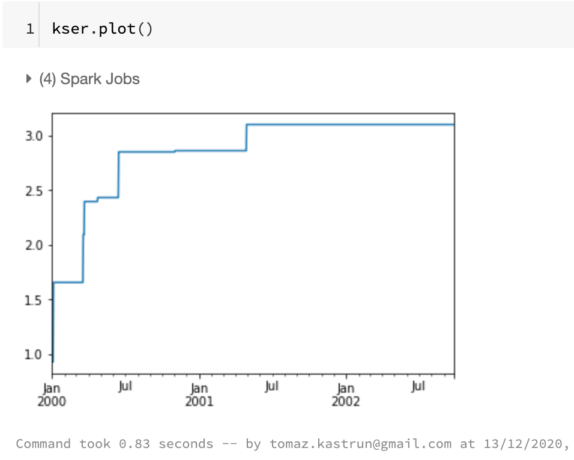

<!-- wp:paragraph -->

And many other variations of plot. You can also load the seaborn package, boket package and many others. 

<!-- /wp:paragraph -->

<!-- wp:paragraph -->

This blogpost is shorter version of a larger "Koalas in 10 minutes" notebook, and is available in the same <a rel="noreferrer noopener" href="https://github.com/tomaztk/Azure-Databricks" target="_blank">Azure Databricks repository </a>as all the samples from this Blogpost series.  Notebook briefly touches also data conversion to/from CSV, Parquet (*.parquet data format) and Spark IO (*.orc data format). All will be persistent and visible on DBFS.

<!-- /wp:paragraph -->

<!-- wp:paragraph -->

Tomorrow we will explore the Databricks jobs, from configuration to execution and troubleshooting., so stay tuned.

<!-- /wp:paragraph -->

<!-- wp:paragraph -->

Complete set of code and Notebooks will be available at the<a rel="noreferrer noopener" href="https://github.com/tomaztk/Azure-Databricks" target="_blank">&nbsp;Github repository</a>.

<!-- /wp:paragraph -->

<!-- wp:paragraph -->

Happy Coding and Stay Healthy!

<!-- /wp:paragraph -->

