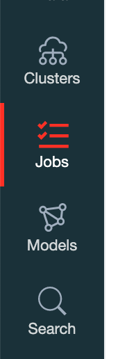
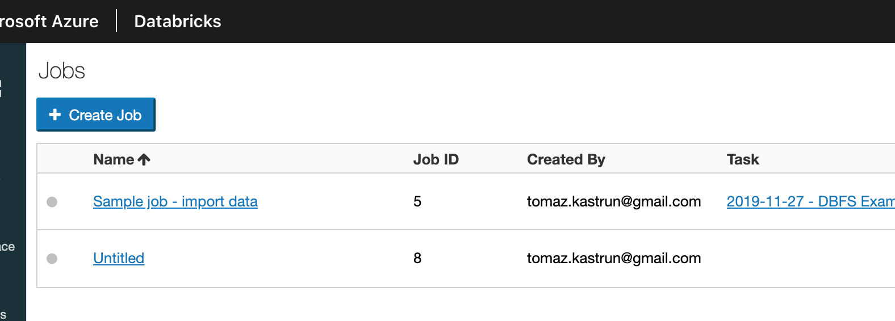
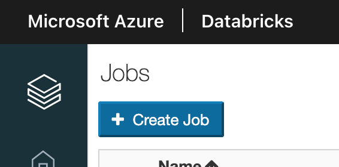
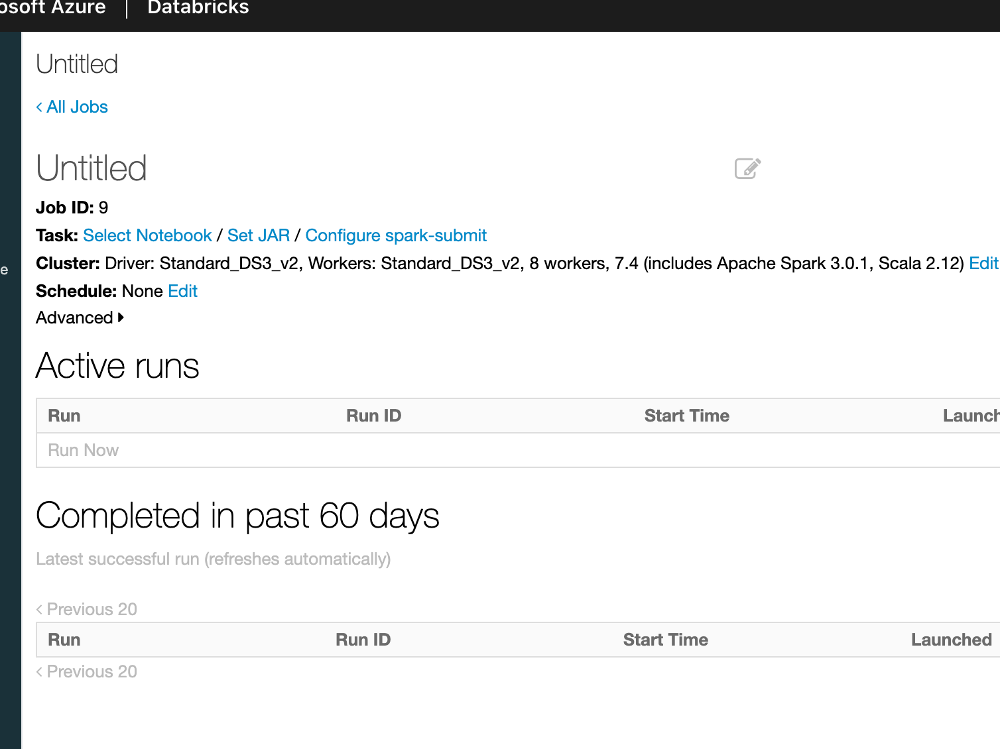
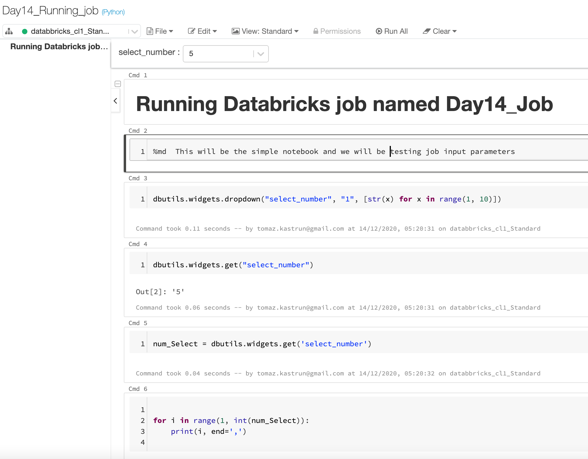
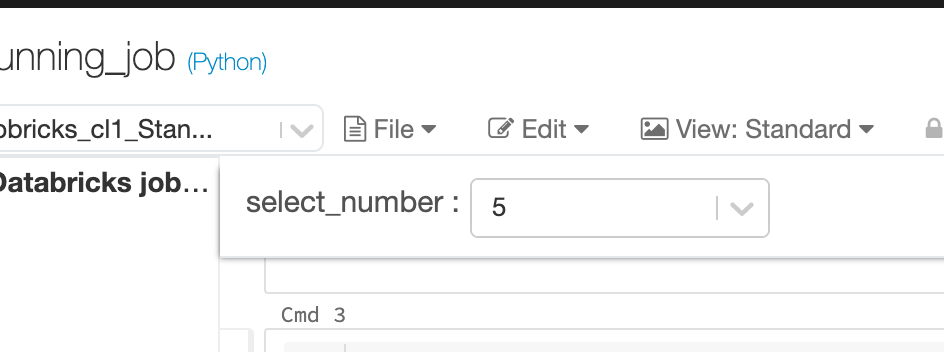
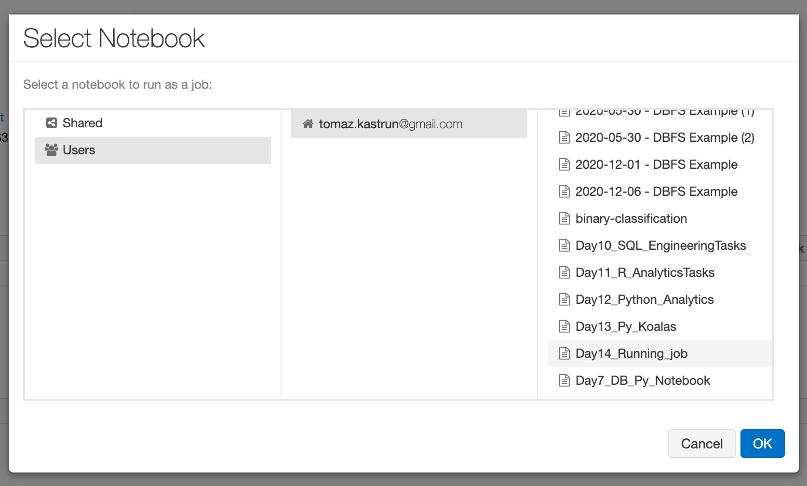
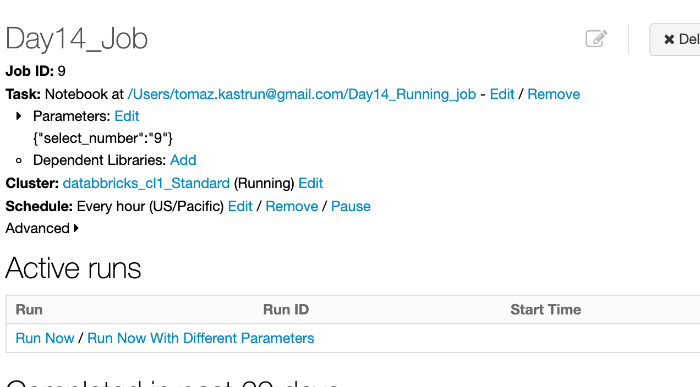
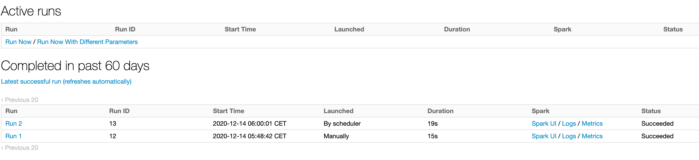
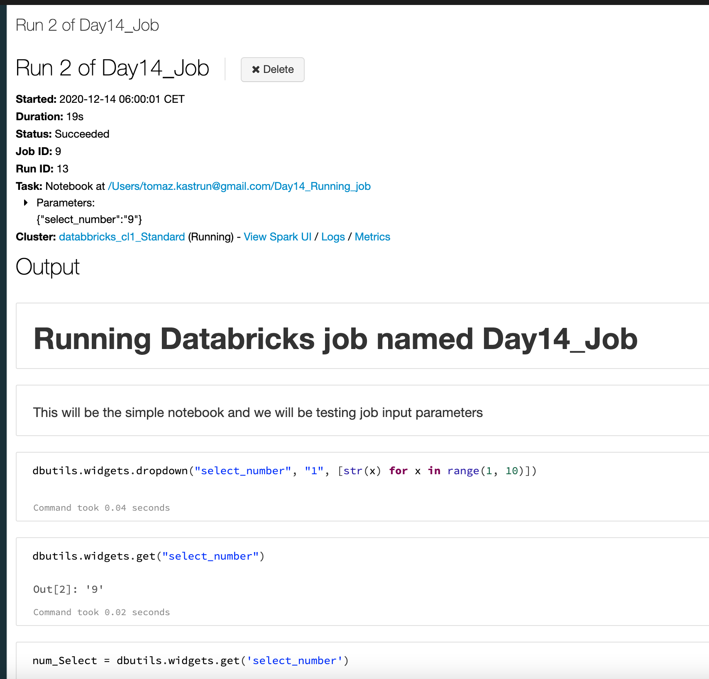

<!-- README.md was wriiten in beautiful MacDown  -->
# Dec 14 2020 - From configuration to execution of Databricks jobs

<!-- badges: start -->

<!-- badges: end -->

Azure Databricks repository is 
a set of blogposts as a Advent of 2020 present to readers for easier onboarding
to Azure Databricks! 

<!-- wp:paragraph -->

Series of Azure Databricks posts:

<!-- /wp:paragraph -->

<!-- wp:list -->
<ul><li>Dec 01: <a rel="noreferrer noopener" href="https://tomaztsql.wordpress.com/2020/12/01/advent-of-2020-day-1-what-is-azure-databricks/" target="_blank">What is Azure Databricks</a></li><li>Dec 02: <a rel="noreferrer noopener" href="https://tomaztsql.wordpress.com/2020/12/02/advent-of-2020-day-2-how-to-get-started-with-azure-databricks/" target="_blank">How to get started with Azure Databricks</a></li><li>Dec 03: <a href="https://tomaztsql.wordpress.com/2020/12/03/advent-of-2020-day-3-getting-to-know-the-workspace-and-azure-databricks-platform/" target="_blank" rel="noreferrer noopener">Getting to know the workspace and Azure Databricks platform</a></li>
<li>Dec 04: <a href="https://tomaztsql.wordpress.com/2020/12/04/advent-of-2020-day-4-creating-your-first-azure-databricks-cluster/" target="_blank" rel="noreferrer noopener">Creating your first Azure Databricks cluster</a></li>
<li>Dec 05: <a href="https://tomaztsql.wordpress.com/2020/12/05/advent-of-2020-day-5-understanding-azure-databricks-cluster-architecture-workers-drivers-and-jobs/" target="_blank" rel="noreferrer noopener">Understanding Azure Databricks cluster architecture, workers, drivers and jobs</a></li>
<li>Dec 06: <a href="https://tomaztsql.wordpress.com/2020/12/06/advent-of-2020-day-6-importing-and-storing-data-to-azure-databricks/" target="_blank" rel="noreferrer noopener">Importing and storing data to Azure Databricks</a></li>
<li>Dec 07: <a href="https://tomaztsql.wordpress.com/2020/12/07/advent-of-2020-day-7-starting-with-databricks-notebooks-and-loading-data-to-dbfs/" target="_blank" rel="noreferrer noopener">Starting with Databricks notebooks and loading data to DBFS</a></li>
<li>Dec 08: <a href="https://tomaztsql.wordpress.com/2020/12/08/advent-of-2020-day-8-using-databricks-cli-and-dbfs-cli-for-file-upload/" target="_blank" rel="noreferrer noopener"> Using Databricks CLI and DBFS CLI for file upload</a></li>
<li>Dec 09: <a href="https://tomaztsql.wordpress.com/2020/12/09/advent-of-2020-day-9-connect-to-azure-blob-storage-using-notebooks-in-azure-databricks/" target="_blank" rel="noreferrer noopener">Connect to Azure Blob storage using Notebooks in  Azure Databricks</a></li>
<li>Dec 10: <a href="https://tomaztsql.wordpress.com/2020/12/10/advent-of-2020-day-10-using-azure-databricks-notebooks-with-sql-for-data-engineering-tasks/" target="_blank" rel="noreferrer noopener">Using Azure Databricks Notebooks with SQL for Data engineering tasks</a></li>
<li>Dec 11: <a href="https://tomaztsql.wordpress.com/2020/12/11/advent-of-2020-day-11-using-azure-databricks-notebooks-with-r-language-for-data-analytics/" target="_blank" rel="noreferrer noopener">Using Azure Databricks Notebooks with R Language for data analytics</a></li>
<li>Dec 12: <a href="https://tomaztsql.wordpress.com/2020/12/12/advent-of-2020-day-12-using-azure-databricks-notebooks-with-python-language-for-data-analytics/" target="_blank" rel="noreferrer noopener">Using Azure Databricks Notebooks with Python Language for data analytics</a></li>

<li>Dec 13: <a href="https://tomaztsql.wordpress.com/2020/12/13/advent-of-2020-day-13-using-python-databricks-koalas-with-azure-databricks/" target="_blank" rel="noreferrer noopener">Using Python Databricks Koalas with Azure Databricks</a></li>

</ul>
<!-- /wp:list -->

<!-- wp:paragraph -->

Last four days we were exploring languages available in Azure Databricks. Today we will explore the Databricks jobs and what we can do with it, besides running a job.

<!-- /wp:paragraph -->

<!-- wp:paragraph -->
### 1.Viewing a job
<!-- /wp:paragraph -->

<!-- wp:paragraph -->

In the left vertical navigation bar, click the Job icon:

<!-- /wp:paragraph -->

<!-- wp:paragraph -->

And you will get to the screen where you will be able to view all your jobs:

<!-- /wp:paragraph -->

<!-- wp:paragraph -->

Jobs will have the following attributes (all are mostly self explanatory):

<!-- /wp:paragraph -->

<!-- wp:list -->
<ul><li>Name - Name of the Databricks job</li><li>Job ID - ID of the job and it is set automatically</li><li>Created By - Name of the user (AD Username) who created a job</li><li>Task - Name of the Notebook, that is attached and executed, when job is triggered. Task can also be a JAR file or  a spark-submit command.</li><li>Cluster - Name of the cluster, that is attached to this job. When job is fired, all the work will be done on this cluster.</li><li>Schedule - CRON expression written in "readable" manner</li><li>Last Run - Status of last run (E.g.: successful, failed, running)</li><li>Action - buttons available to start or terminate the job.</li></ul>
<!-- /wp:list -->

<!-- wp:paragraph -->
### 2.Creating a job
<!-- /wp:paragraph -->

<!-- wp:paragraph -->

If you would like to create a new job, use the "+Create job":

<!-- /wp:paragraph -->

<!-- wp:paragraph -->

And you will be prompted with a new site, to fill in all the needed information:

<!-- /wp:paragraph -->

<!-- wp:paragraph -->

Give job a name by renaming the "Untitled". I named my job to "Day14_Job". Next step is to make a task. A task can be:

<!-- /wp:paragraph -->

<!-- wp:list -->
<ul><li>Selected Notebook (is a notebook that we have learned to use and create on Day 7)</li><li>Set JAR file (is a program or function that can be executed using main class and arguments)</li><li>Configure spark-submit (Spark-submit is a Apache Spark script to execute other applications on a cluster)</li></ul>
<!-- /wp:list -->

<!-- wp:paragraph -->

We will use a "Selected Notebook. So jump to workspaces and create a new Notebook. I have named mine as <em>Day14_Running_job</em> and it is running on <em>Python</em>. This is the following code, I have used:

<!-- /wp:paragraph -->

<!-- wp:paragraph -->

Notebook is available in the same <a rel="noreferrer noopener" href="https://github.com/tomaztk/Azure-Databricks" target="_blank">Github</a> repository. And the code to this notebook is:

<!-- /wp:paragraph -->

<!-- wp:syntaxhighlighter/code -->
<pre class="wp-block-syntaxhighlighter-code">dbutils.widgets.dropdown("select_number", "1", [str(x) for x in range(1, 10)])

dbutils.widgets.get("select_number")

num_Select = dbutils.widgets.get('select_number')

for i in range(1, int(num_Select)):
    print(i, end=',')
</pre>
<!-- /wp:syntaxhighlighter/code -->

<!-- wp:paragraph -->

We have created a widget that looks like a dropdown menu in the head of notebook, a value (integer or string) that can be set once and called / used multiple-times in the notebook.

<!-- /wp:paragraph -->

<!-- wp:paragraph -->

You can copy and paste the code to code cells or use the notebook in the github repository. We wil use notebook: <strong>Day14_Running_job</strong> with job: <strong>Day14_job</strong>. 

<!-- /wp:paragraph -->

<!-- wp:paragraph -->

Navigate back to jobs and you will see that Azure Databricks automatically saves the work progress for you. in the this job (Day14_job), select a notebook you have created.

<!-- /wp:paragraph -->

<!-- wp:paragraph -->

We will need to add some additional parameters:

<!-- /wp:paragraph -->

<!-- wp:list -->
<ul><li>Task - Parameter</li><li>Dependent libraries</li><li>Cluster</li><li>Schedule</li></ul>
<!-- /wp:list -->

<!-- wp:paragraph -->

The Parameters, can be used with the Spark <em>dbutils.widget </em>command, the same we used in notebook. In this way we are giving notebook some external parametrization. Since We are not using any additional libraries, just attach the cluster. I am using an existing cluster and not creating new one (as offered by default) and select the schedule timing (my cron configuration is: <em>0 0 * * * ?</em>  and this is execute every full hour). At the end, my setup looks like:

<!-- /wp:paragraph -->

<!-- wp:paragraph -->

Under the advanced features, you can also set the following:

<!-- /wp:paragraph -->

<!-- wp:list -->
<ul><li>Alerts - set up the alerts on email (or multiple email addresses) on three event: <em>on start</em>, on <em>success</em> or <em>on failure</em>.</li><li>Maximum Concurrent Runs - is the upper limit of how many concurrent runs of this job can be executing at the same time</li><li>Timeout - specify the terminate time - the  timeout (in minutes) of the running job </li><li>Retries - number of retries if  a job has failed</li></ul>
<!-- /wp:list -->

<!-- wp:paragraph -->
### 3.Executing a job 
<!-- /wp:paragraph -->

<!-- wp:paragraph -->

We leave all advanced setting empty by default. You can run job manually or leave it as it is and check if the CRON schedule will do the work. Nevertheless, I have ran one manually and left one to be run automatically.

<!-- /wp:paragraph -->

<!-- wp:paragraph -->

You can also check the each run separately and see what has been executed. Each run has a specific ID and holds typical information, such as Duration, Start time, Status, Type and which Task was executed, end others.

<!-- /wp:paragraph -->

<!-- wp:paragraph -->

But the best part of it, you have the results of the notebook also available and persistent in the Log of the job. This is useful especially if you don't want to store results of your job to a file or table, but you need to only see them after run.

<!-- /wp:paragraph -->

<!-- wp:paragraph -->

Do not forget to stop the running jobs, when you don't needed any more. This is important due to several facts: jobs will be executed even if the clusters are not running. Thinking, that clusters are not started, but the job is still active, can generate some traffic and unwanted expenses. In addition, get the feeling, how long does the job run, so you can plan the cluster up/down time accordingly. 

<!-- /wp:paragraph -->

<!-- wp:paragraph -->

Tomorrow we will explore the Spark UI, metrics and logs that is available on Databricks cluster and job.

<!-- /wp:paragraph -->

<!-- wp:paragraph -->

Complete set of code and Notebooks will be available at the<a rel="noreferrer noopener" href="https://github.com/tomaztk/Azure-Databricks" target="_blank">&nbsp;Github repository</a>.

<!-- /wp:paragraph -->

<!-- wp:paragraph -->

Happy Coding and Stay Healthy!

<!-- /wp:paragraph -->

