<!-- README.md was wriiten in beautiful MacDown  -->
# Dec 16 2020 - Databricks experiments, models and MLFlow

<!-- badges: start -->

<!-- badges: end -->

Azure Databricks repository is 
a set of blogposts as a Advent of 2020 present to readers for easier onboarding
to Azure Databricks! 

<!-- wp:paragraph -->

Series of Azure Databricks posts:

<!-- /wp:paragraph -->

<!-- wp:list -->
<ul><li>Dec 01: <a rel="noreferrer noopener" href="https://tomaztsql.wordpress.com/2020/12/01/advent-of-2020-day-1-what-is-azure-databricks/" target="_blank">What is Azure Databricks</a></li><li>Dec 02: <a rel="noreferrer noopener" href="https://tomaztsql.wordpress.com/2020/12/02/advent-of-2020-day-2-how-to-get-started-with-azure-databricks/" target="_blank">How to get started with Azure Databricks</a></li><li>Dec 03: <a href="https://tomaztsql.wordpress.com/2020/12/03/advent-of-2020-day-3-getting-to-know-the-workspace-and-azure-databricks-platform/" target="_blank" rel="noreferrer noopener">Getting to know the workspace and Azure Databricks platform</a></li>
<li>Dec 04: <a href="https://tomaztsql.wordpress.com/2020/12/04/advent-of-2020-day-4-creating-your-first-azure-databricks-cluster/" target="_blank" rel="noreferrer noopener">Creating your first Azure Databricks cluster</a></li>
<li>Dec 05: <a href="https://tomaztsql.wordpress.com/2020/12/05/advent-of-2020-day-5-understanding-azure-databricks-cluster-architecture-workers-drivers-and-jobs/" target="_blank" rel="noreferrer noopener">Understanding Azure Databricks cluster architecture, workers, drivers and jobs</a></li>
<li>Dec 06: <a href="https://tomaztsql.wordpress.com/2020/12/06/advent-of-2020-day-6-importing-and-storing-data-to-azure-databricks/" target="_blank" rel="noreferrer noopener">Importing and storing data to Azure Databricks</a></li>
<li>Dec 07: <a href="https://tomaztsql.wordpress.com/2020/12/07/advent-of-2020-day-7-starting-with-databricks-notebooks-and-loading-data-to-dbfs/" target="_blank" rel="noreferrer noopener">Starting with Databricks notebooks and loading data to DBFS</a></li>
<li>Dec 08: <a href="https://tomaztsql.wordpress.com/2020/12/08/advent-of-2020-day-8-using-databricks-cli-and-dbfs-cli-for-file-upload/" target="_blank" rel="noreferrer noopener"> Using Databricks CLI and DBFS CLI for file upload</a></li>
<li>Dec 09: <a href="https://tomaztsql.wordpress.com/2020/12/09/advent-of-2020-day-9-connect-to-azure-blob-storage-using-notebooks-in-azure-databricks/" target="_blank" rel="noreferrer noopener">Connect to Azure Blob storage using Notebooks in  Azure Databricks</a></li>
<li>Dec 10: <a href="https://tomaztsql.wordpress.com/2020/12/10/advent-of-2020-day-10-using-azure-databricks-notebooks-with-sql-for-data-engineering-tasks/" target="_blank" rel="noreferrer noopener">Using Azure Databricks Notebooks with SQL for Data engineering tasks</a></li>
<li>Dec 11: <a href="https://tomaztsql.wordpress.com/2020/12/11/advent-of-2020-day-11-using-azure-databricks-notebooks-with-r-language-for-data-analytics/" target="_blank" rel="noreferrer noopener">Using Azure Databricks Notebooks with R Language for data analytics</a></li>
<li>Dec 12: <a href="https://tomaztsql.wordpress.com/2020/12/12/advent-of-2020-day-12-using-azure-databricks-notebooks-with-python-language-for-data-analytics/" target="_blank" rel="noreferrer noopener">Using Azure Databricks Notebooks with Python Language for data analytics</a></li>
<li>Dec 13: <a href="https://tomaztsql.wordpress.com/2020/12/13/adventof-2020-day-13-using-python-databricks-koalas-with-azure-databricks/" target="_blank" rel="noreferrer noopener">Using Python Databricks Koalas with Azure Databricks</a></li>
<li>Dec 14: <a href="https://tomaztsql.wordpress.com/2020/12/14/advent-of-2020-day-14-from-configuration-to-execution-of-databricks-jobs/" target="_blank" rel="noreferrer noopener">From configuration to execution of Databricks jobs</a></li>
<li>Dec 15: <a href="https://tomaztsql.wordpress.com/2020/12/15/advent-of-2020-day-15-databricks-spark-ui-event-logs-driver-logs-and-metrics/" target="_blank" rel="noreferrer noopener">Databricks Spark UI, Event Logs, Driver logs and Metrics</a></li>

</ul>
<!-- /wp:list -->

<!-- wp:paragraph -->

We have almost cover all the items on the left vertical bar, the last one is to check the Model.

<!-- /wp:paragraph -->

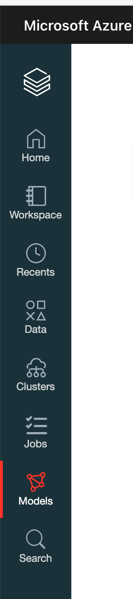

<!-- wp:paragraph -->

But before we click the models, I wanted to explain little of the background.

<!-- /wp:paragraph -->

<!-- wp:paragraph -->

<strong>1.What is MLflow?</strong>

<!-- /wp:paragraph -->

<!-- wp:paragraph -->

<a href="https://www.mlflow.org/">MLflow</a> is an open-source platform, vendor agnostic, for managing your machine learning experiments, models and artefacts. MLflow  consists of the  following components:

<!-- /wp:paragraph -->

<!-- wp:list -->
<ul><li>Models - gives you ability yo manage, deploy and track models and compare them between environments</li><li>Models Registry - allows you to centralize model store and manages all stages of model - from staging to production using also versioning. </li><li>Models Serving - for hosting MLflow models are REST API endpoint</li><li>Tracking - allows you to track experiments for comparison of experiment parameters and results</li><li>Projects - is a wrapper for ML code, models and package to be reusable, reproducible and repeatable by same or other group of data scientists</li></ul>
<!-- /wp:list -->

<!-- wp:paragraph -->

Azure Databricks manages and host the MLflow integration (AD/SSO), with all the features and gives end user to feature as experiment and run management within workspace. MLflow on Azure Databricks offers an integrated experience for tracking and securing machine learning model training runs and running machine learning projects.

<!-- /wp:paragraph -->

<!-- wp:paragraph -->

An MLflow <em>run</em> is a collection of parameters, metrics, tags, and artifacts associated with a machine learning model training process. it supports R, Python, Java and REST APIs. <em>Experiment</em> is a collection of  MLflow runs. Each experiment holds information about runs, that can be visualized and compered among each other or even dowloaded as artifacts to be used locally or else. Experiments are stored in MLflow tracking server.

<!-- /wp:paragraph -->

<!-- wp:paragraph -->

Experiment is available in your workspace and are stored as objects.

<!-- /wp:paragraph -->

<!-- wp:paragraph -->

<strong>2.Create a notebook and install the mlflow package</strong>

<!-- /wp:paragraph -->

<!-- wp:paragraph -->

Create new notebook, I have named mine <em>Day16_MLflow </em>and select <em>R</em> as main language. Attach the cluster to notebooks. MLflow comes pre-installed on Databricks Runtime for Machine Learning clusters. Check your cluster Runtime version. Mine is LTS but not ML. 

<!-- /wp:paragraph -->

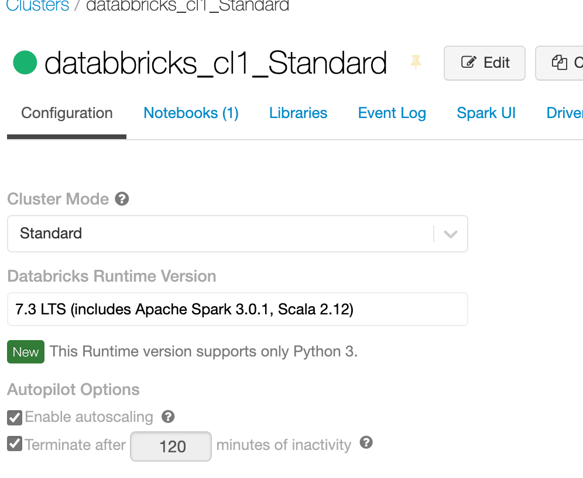

<!-- wp:paragraph -->

This means, that we need to install additional libraries to cluster. Under cluster, click on libraries.

<!-- /wp:paragraph -->

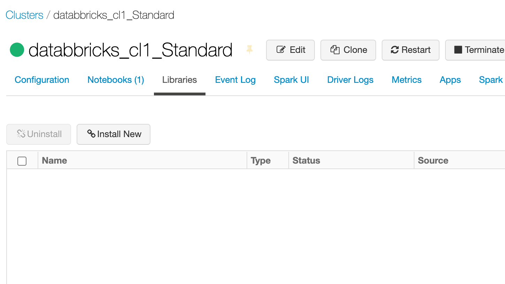

<!-- wp:paragraph -->

 And select "% Install New" to get:

<!-- /wp:paragraph -->

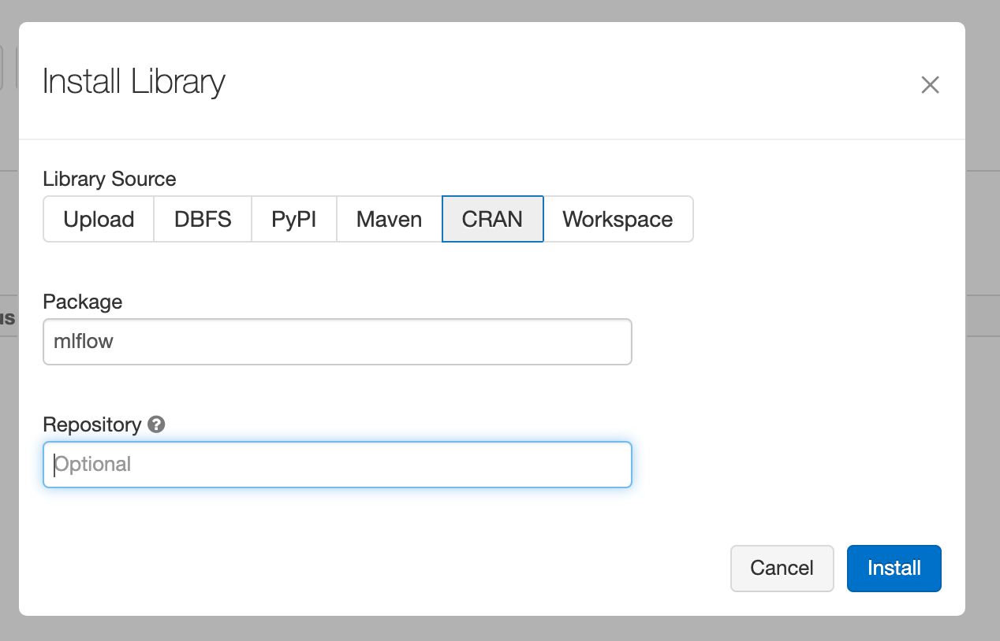

<!-- wp:paragraph -->

And Select Source: <strong>CRAN</strong> (famous R repository) and package name: <em>mlflow</em>. And after couple of minutes, you should see the package being installed:

<!-- /wp:paragraph -->

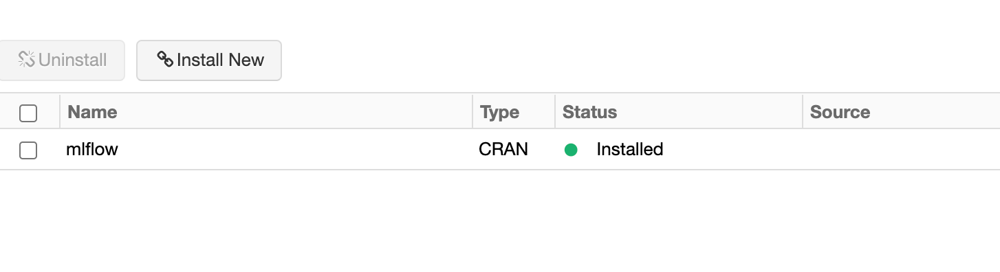

<!-- wp:paragraph -->

In the Notebook use the following command to start initialize mlflow:

<!-- /wp:paragraph -->

<!-- wp:syntaxhighlighter/code -->
<pre class="wp-block-syntaxhighlighter-code">library(mlflow)
install_mlflow()</pre>
<!-- /wp:syntaxhighlighter/code -->

<!-- wp:paragraph -->

and the conda environment and underlying packages will be installed. (Yes, Python)

<!-- /wp:paragraph -->

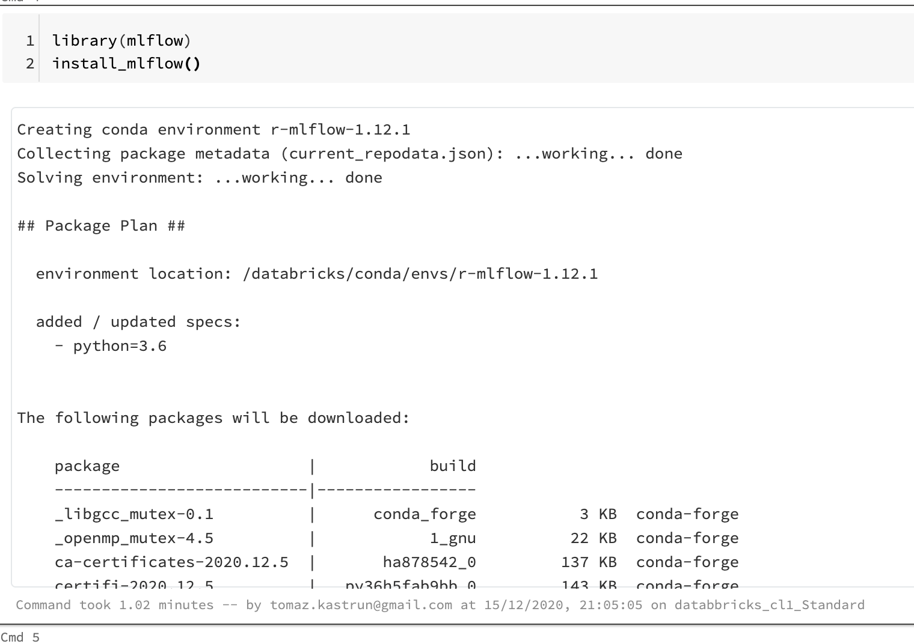

<!-- wp:paragraph -->

To start the tracking API for a particular run (on notebook), initiate it with:

<!-- /wp:paragraph -->

<!-- wp:syntaxhighlighter/code -->
<pre class="wp-block-syntaxhighlighter-code">run &lt;- mlflow_start_run()</pre>
<!-- /wp:syntaxhighlighter/code -->

<!-- wp:paragraph -->

and add all the code, calculations and functions you want to be tracked in MLflow. This is just the short dummy example how to pass parameters, logs and create artifacts for MLflow:

<!-- /wp:paragraph -->

<!-- wp:syntaxhighlighter/code -->
<pre class="wp-block-syntaxhighlighter-code"># Log a parameter (key-value pair)
mlflow_log_param("test_run_nof_runs_param1", 5)

# Log a metric; metrics can be updated throughout the run
mlflow_log_metric("RMSE", 2, step = 1)
mlflow_log_metric("RMSE", 4, step = 2)
mlflow_log_metric("RMSE", 6, step = 3)
mlflow_log_metric("RMSE", 8, step = 4)
mlflow_log_metric("RMSE", 1, step = 5)
# Log an artifact (output file)

write("This is R code from Azure Databricks notebook", file = "output.txt")

mlflow_log_artifact("output.txt")</pre>
<!-- /wp:syntaxhighlighter/code -->

<!-- wp:paragraph -->

When your code is completed, finish off with end run:

<!-- /wp:paragraph -->

<!-- wp:syntaxhighlighter/code -->
<pre class="wp-block-syntaxhighlighter-code">mlflow_end_run()</pre>
<!-- /wp:syntaxhighlighter/code -->

<!-- wp:paragraph -->

Within this block of code, each time you will run it, the run will documented and stored to experiment.

<!-- /wp:paragraph -->

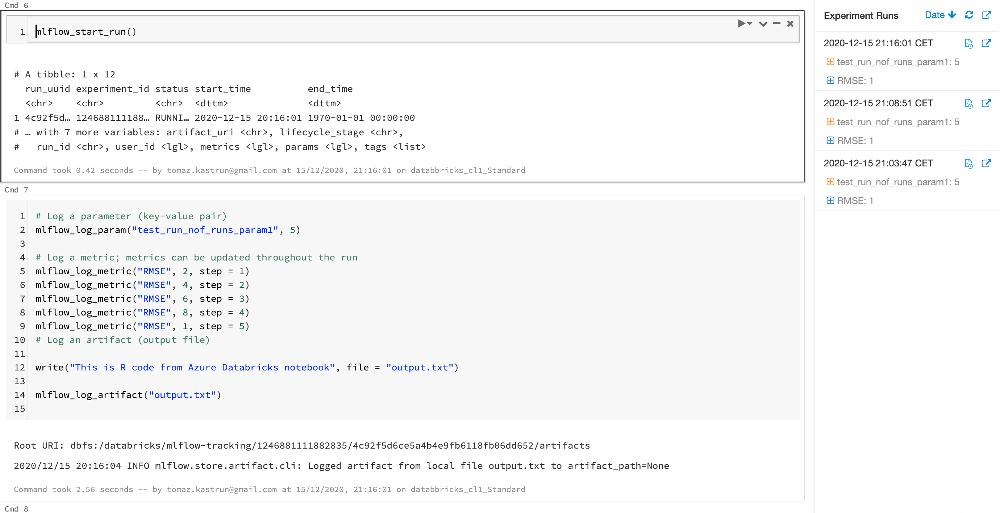

<!-- wp:paragraph -->

Now under the Experiments Run, click the "View run details":

<!-- /wp:paragraph -->

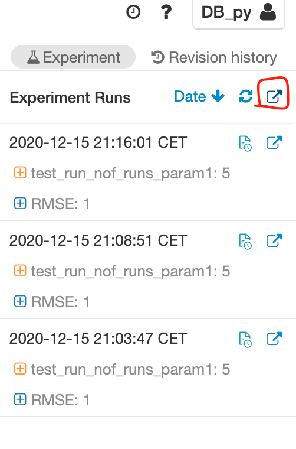

<!-- wp:paragraph -->

And you will get to the experiment page. This page

<!-- /wp:paragraph -->

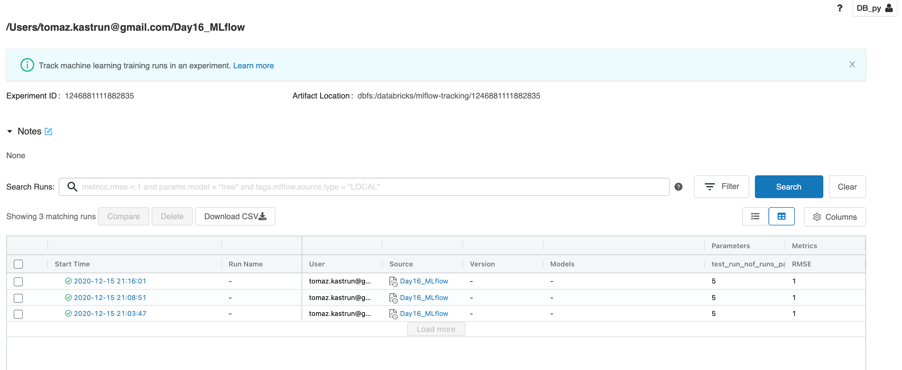

<!-- wp:paragraph -->

This page holds all the information on each run, with all the parameters, metrics and all the relevant information about the runs, or models. 

<!-- /wp:paragraph -->

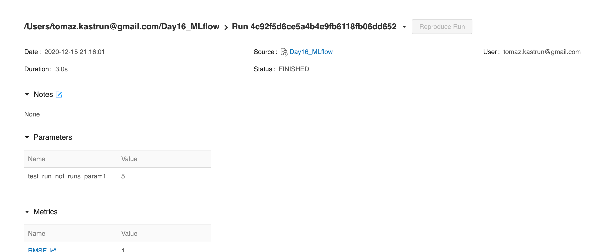

<!-- wp:paragraph -->

Scrolling down on this page, you will also find all the artifacts that you can store during the runs (that might be pickled files, logs, intermediate results, binary files, etc.)

<!-- /wp:paragraph -->

<!-- wp:paragraph -->

<strong>3. Create a model</strong>

<!-- /wp:paragraph -->

<!-- wp:paragraph -->

Once you have a data set ready and the experiment running, you want to register the model as well. Model registry is taking care of this. In the same notebook, what we will do, is add little experiment. Wine-quality experiment. Data is available at github repository and you will just add the file to your DBFS.

<!-- /wp:paragraph -->

<!-- wp:paragraph -->

Now use R standard packages:

<!-- /wp:paragraph -->

<!-- wp:syntaxhighlighter/code -->
<pre class="wp-block-syntaxhighlighter-code">library(mlflow)
library(glmnet)
library(carrier)</pre>
<!-- /wp:syntaxhighlighter/code -->

<!-- wp:paragraph -->

And load data to data.frame (please note, that file is on my FileStore DBFS location and path might vary based on your location).

<!-- /wp:paragraph -->

<!-- wp:syntaxhighlighter/code -->
<pre class="wp-block-syntaxhighlighter-code">library(SparkR)

data &lt;- read.df("/FileStore/Day16_wine_quality.csv", source = "csv", header="true")

display(data)
data &lt;- as.data.frame(data)</pre>
<!-- /wp:syntaxhighlighter/code -->

<!-- wp:paragraph -->

In addition, I will detach the SparkR package, for not causing any interference between data types:

<!-- /wp:paragraph -->

<!-- wp:syntaxhighlighter/code -->
<pre class="wp-block-syntaxhighlighter-code">#detaching the package due to data type conflicts
detach("package:SparkR", unload=TRUE)</pre>
<!-- /wp:syntaxhighlighter/code -->

<!-- wp:paragraph -->

And now do the typical train and test split.

<!-- /wp:paragraph -->

<!-- wp:syntaxhighlighter/code -->
<pre class="wp-block-syntaxhighlighter-code"># Split the data into training and test sets. (0.75, 0.25) split.
sampled &lt;- sample(1:nrow(data), 0.75 * nrow(data))
train &lt;- data[sampled, ]
test &lt;- data[-sampled, ]

# The predicted column is "quality" which is a scalar from [3, 9]
train_x &lt;- as.matrix(train[, !(names(train) == "quality")])
test_x &lt;- as.matrix(test[, !(names(train) == "quality")])
train_y &lt;- train[, "quality"]
test_y &lt;- test[, "quality"]

alpha &lt;- mlflow_param("alpha", 0.5, "numeric")
lambda &lt;- mlflow_param("lambda", 0.5, "numeric")</pre>
<!-- /wp:syntaxhighlighter/code -->

<!-- wp:paragraph -->

And now we register the model and all the parameter:

<!-- /wp:paragraph -->

<!-- wp:syntaxhighlighter/code -->
<pre class="wp-block-syntaxhighlighter-code">mlflow_start_run()

model &lt;- glmnet(train_x, train_y, alpha = alpha, lambda = lambda, family= "gaussian", standardize = FALSE)
predictor &lt;- crate(~ glmnet::predict.glmnet(!!model, as.matrix(.x)), !!model)
predicted &lt;- predictor(test_x)

rmse &lt;- sqrt(mean((predicted - test_y) ^ 2))
mae &lt;- mean(abs(predicted - test_y))
r2 &lt;- as.numeric(cor(predicted, test_y) ^ 2)

message("Elasticnet model (alpha=", alpha, ", lambda=", lambda, "):")
message("  RMSE: ", rmse)
message("  MAE: ", mae)
message("  R2: ", r2)

mlflow_log_param("alpha", alpha)
mlflow_log_param("lambda", lambda)
mlflow_log_metric("rmse", rmse)
mlflow_log_metric("r2", r2)
mlflow_log_metric("mae", mae)

mlflow_log_model(
predictor, 
artifact_path = "model", 
registered_model_name = "wine-quality")

mlflow_end_run()</pre>
<!-- /wp:syntaxhighlighter/code -->

<!-- wp:paragraph -->

And this should also cause additional runs in the same experiment. But in addition, it will create a model in model registry and this model you can later version and approve to be moved to next stage or environment.

<!-- /wp:paragraph -->

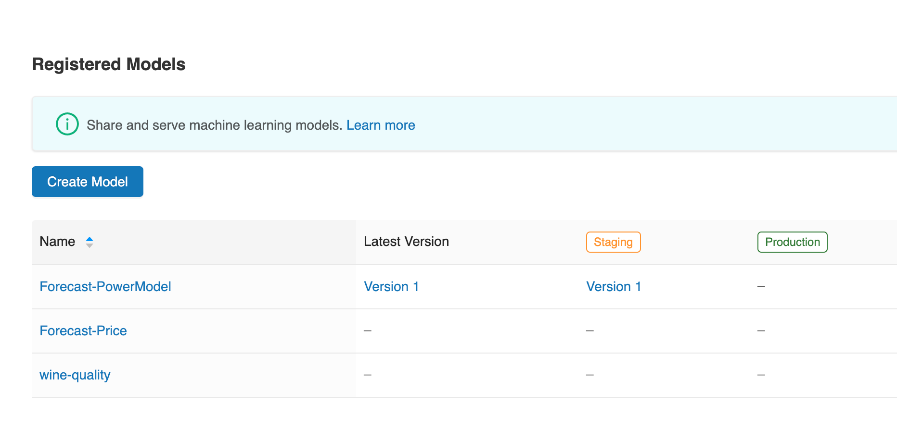

<!-- wp:paragraph -->

Tomorrow we will do end-to-end machine learning project using all three languages, R, Python and SQL.

<!-- /wp:paragraph -->

<!-- wp:paragraph -->

Complete set of code and Notebooks will be available at the<a rel="noreferrer noopener" href="https://github.com/tomaztk/Azure-Databricks" target="_blank">&nbsp;Github repository</a>.

<!-- /wp:paragraph -->

<!-- wp:paragraph -->

Happy Coding and Stay Healthy!

<!-- /wp:paragraph -->
