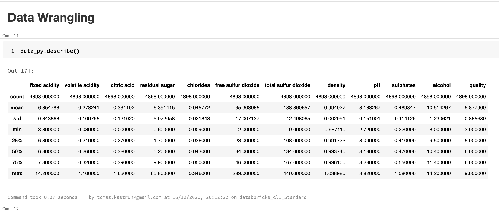
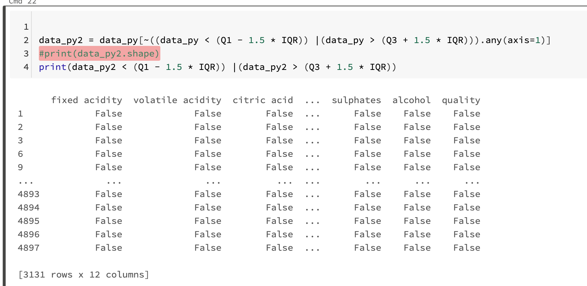
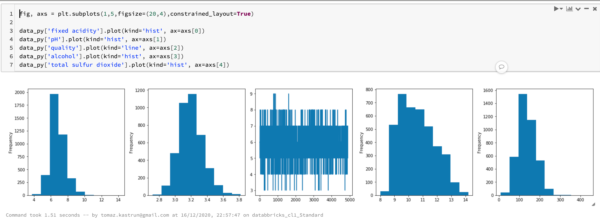
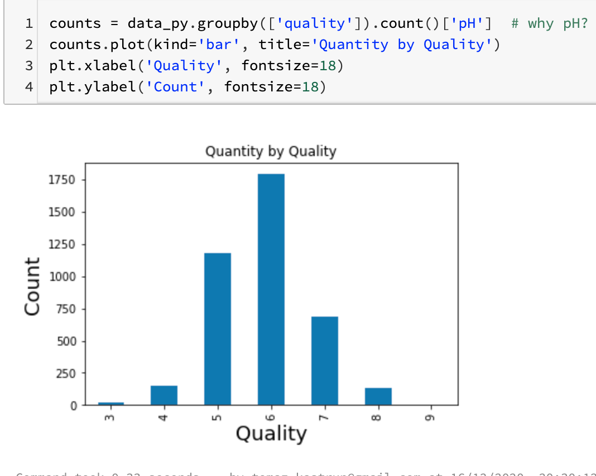
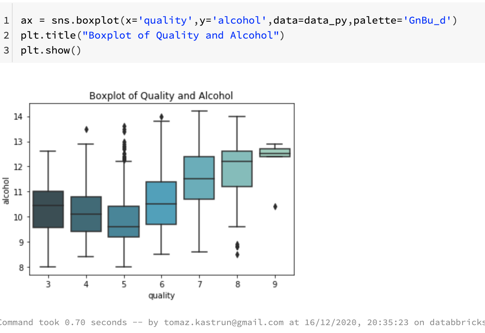
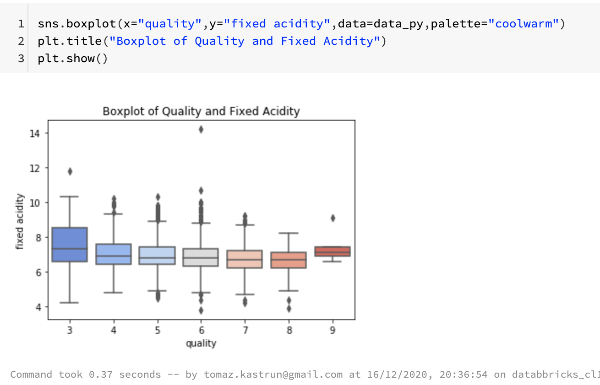
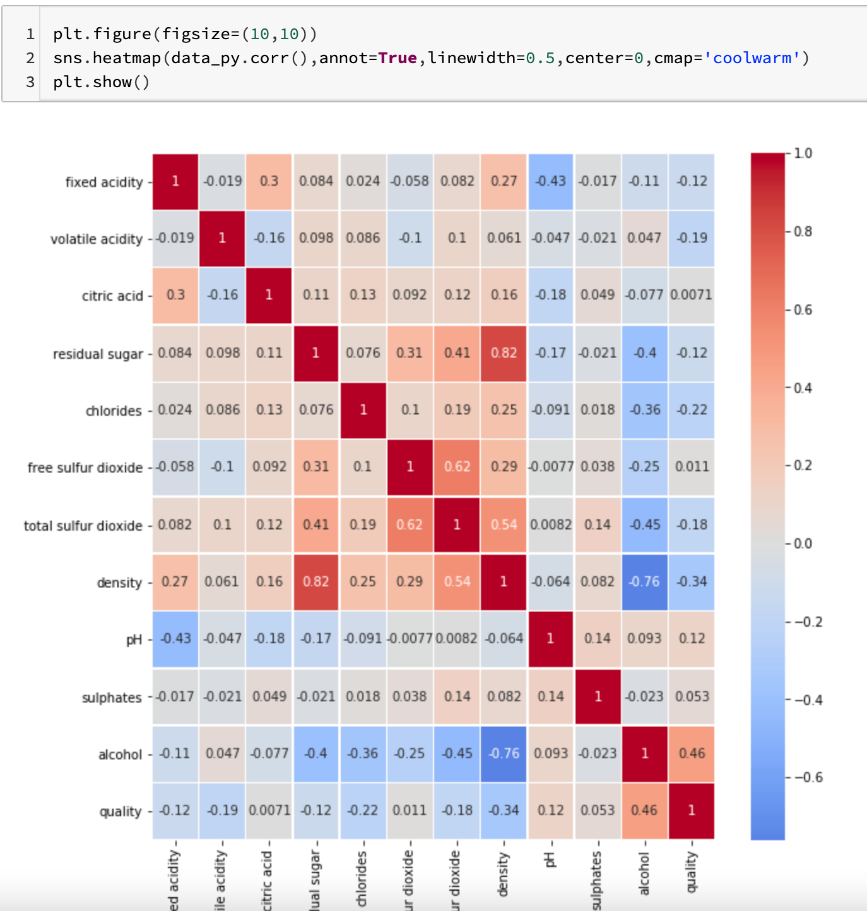
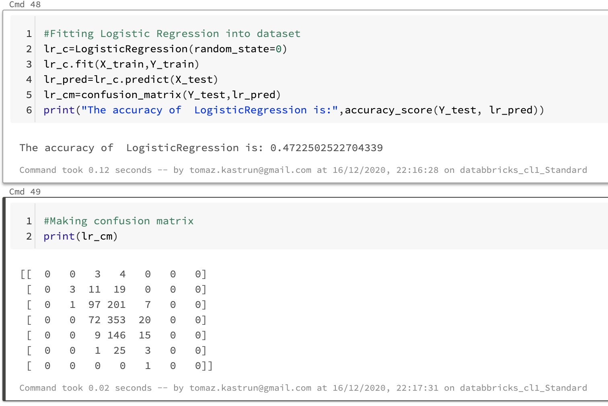

<!-- README.md was wriiten in beautiful MacDown  -->
# Dec 17 2020 - End-to-End Machine learning project in Azure Databricks

<!-- badges: start -->

<!-- badges: end -->

Azure Databricks repository is 
a set of blogposts as a Advent of 2020 present to readers for easier onboarding
to Azure Databricks! 

<!-- wp:paragraph -->

Series of Azure Databricks posts:

<!-- /wp:paragraph -->

<!-- wp:list -->
<ul><li>Dec 01: <a rel="noreferrer noopener" href="https://tomaztsql.wordpress.com/2020/12/01/advent-of-2020-day-1-what-is-azure-databricks/" target="_blank">What is Azure Databricks</a></li><li>Dec 02: <a rel="noreferrer noopener" href="https://tomaztsql.wordpress.com/2020/12/02/advent-of-2020-day-2-how-to-get-started-with-azure-databricks/" target="_blank">How to get started with Azure Databricks</a></li><li>Dec 03: <a href="https://tomaztsql.wordpress.com/2020/12/03/advent-of-2020-day-3-getting-to-know-the-workspace-and-azure-databricks-platform/" target="_blank" rel="noreferrer noopener">Getting to know the workspace and Azure Databricks platform</a></li>
<li>Dec 04: <a href="https://tomaztsql.wordpress.com/2020/12/04/advent-of-2020-day-4-creating-your-first-azure-databricks-cluster/" target="_blank" rel="noreferrer noopener">Creating your first Azure Databricks cluster</a></li>
<li>Dec 05: <a href="https://tomaztsql.wordpress.com/2020/12/05/advent-of-2020-day-5-understanding-azure-databricks-cluster-architecture-workers-drivers-and-jobs/" target="_blank" rel="noreferrer noopener">Understanding Azure Databricks cluster architecture, workers, drivers and jobs</a></li>
<li>Dec 06: <a href="https://tomaztsql.wordpress.com/2020/12/06/advent-of-2020-day-6-importing-and-storing-data-to-azure-databricks/" target="_blank" rel="noreferrer noopener">Importing and storing data to Azure Databricks</a></li>
<li>Dec 07: <a href="https://tomaztsql.wordpress.com/2020/12/07/advent-of-2020-day-7-starting-with-databricks-notebooks-and-loading-data-to-dbfs/" target="_blank" rel="noreferrer noopener">Starting with Databricks notebooks and loading data to DBFS</a></li>
<li>Dec 08: <a href="https://tomaztsql.wordpress.com/2020/12/08/advent-of-2020-day-8-using-databricks-cli-and-dbfs-cli-for-file-upload/" target="_blank" rel="noreferrer noopener"> Using Databricks CLI and DBFS CLI for file upload</a></li>
<li>Dec 09: <a href="https://tomaztsql.wordpress.com/2020/12/09/advent-of-2020-day-9-connect-to-azure-blob-storage-using-notebooks-in-azure-databricks/" target="_blank" rel="noreferrer noopener">Connect to Azure Blob storage using Notebooks in  Azure Databricks</a></li>
<li>Dec 10: <a href="https://tomaztsql.wordpress.com/2020/12/10/advent-of-2020-day-10-using-azure-databricks-notebooks-with-sql-for-data-engineering-tasks/" target="_blank" rel="noreferrer noopener">Using Azure Databricks Notebooks with SQL for Data engineering tasks</a></li>
<li>Dec 11: <a href="https://tomaztsql.wordpress.com/2020/12/11/advent-of-2020-day-11-using-azure-databricks-notebooks-with-r-language-for-data-analytics/" target="_blank" rel="noreferrer noopener">Using Azure Databricks Notebooks with R Language for data analytics</a></li>
<li>Dec 12: <a href="https://tomaztsql.wordpress.com/2020/12/12/advent-of-2020-day-12-using-azure-databricks-notebooks-with-python-language-for-data-analytics/" target="_blank" rel="noreferrer noopener">Using Azure Databricks Notebooks with Python Language for data analytics</a></li>
<li>Dec 13: <a href="https://tomaztsql.wordpress.com/2020/12/13/adventof-2020-day-13-using-python-databricks-koalas-with-azure-databricks/" target="_blank" rel="noreferrer noopener">Using Python Databricks Koalas with Azure Databricks</a></li>
<li>Dec 14: <a href="https://tomaztsql.wordpress.com/2020/12/14/advent-of-2020-day-14-from-configuration-to-execution-of-databricks-jobs/" target="_blank" rel="noreferrer noopener">From configuration to execution of Databricks jobs</a></li>
<li>Dec 15: <a href="https://tomaztsql.wordpress.com/2020/12/15/advent-of-2020-day-15-databricks-spark-ui-event-logs-driver-logs-and-metrics/" target="_blank" rel="noreferrer noopener">Databricks Spark UI, Event Logs, Driver logs and Metrics</a></li>

<li>Dec 16: <a href="https://tomaztsql.wordpress.com/2020/12/16/advent-of-2020-day-16-databricks-experiments-models-and-mlflow/" target="_blank" rel="noreferrer noopener">Databricks experiments, models and MLFlow</a></li>

</ul>
<!-- /wp:list -->

<!-- wp:paragraph -->

In the past couple of days we looked into configurations and infrastructure and today it is again time to do an analysis, let's call it end-to-end analysis using R or Python or SQL.

<!-- /wp:paragraph -->

<!-- wp:paragraph -->
## 1. Notebook, Cluster and Data
<!-- wp:paragraph -->

<!-- wp:paragraph -->

Create new notebook, I am calling my <em>Day17_Analysis</em> and selecting <em>Python</em> as kernel language. Attach cluster to your notebook and start the cluster (if it is not yet running). Import data using SparkR:

<!-- /wp:paragraph -->

<!-- wp:syntaxhighlighter/code -->
<pre class="wp-block-syntaxhighlighter-code">%r
library(SparkR)

data_r &lt;- read.df("/FileStore/Day16_wine_quality.csv", source = "csv", header="true")

display(data_r)
data_r &lt;- as.data.frame(data_r)</pre>
<!-- /wp:syntaxhighlighter/code -->

<!-- wp:paragraph -->

And we can also do the same for Python:

<!-- /wp:paragraph -->

<!-- wp:syntaxhighlighter/code -->
<pre class="wp-block-syntaxhighlighter-code">import pandas as pd
data_py = pd.read_csv("/dbfs/FileStore/Day16_wine_quality.csv", sep=';')</pre>
<!-- /wp:syntaxhighlighter/code -->

<!-- wp:paragraph -->

We can use also Python to insert the data and get the dataset insight.

<!-- /wp:paragraph -->

<!-- wp:syntaxhighlighter/code -->
<pre class="wp-block-syntaxhighlighter-code">import matplotlib.pyplot as plt
import seaborn as sns
data_py = pd.read_csv("/dbfs/FileStore/Day16_wine_quality.csv", sep=',')
data_py.info()</pre>
<!-- /wp:syntaxhighlighter/code -->

<!-- wp:paragraph -->

Importing also all other packages that will be relevant in following steps:

<!-- /wp:paragraph -->

<!-- wp:syntaxhighlighter/code -->
<pre class="wp-block-syntaxhighlighter-code">from sklearn.model_selection import train_test_split
from sklearn.preprocessing import StandardScaler
from sklearn.linear_model import LogisticRegression
from sklearn.metrics import confusion_matrix
from sklearn.metrics import accuracy_score
from sklearn.ensemble import RandomForestClassifier
from sklearn.neighbors import KNeighborsClassifier
from sklearn.naive_bayes import GaussianNB
from sklearn.svm import SVC</pre>
<!-- /wp:syntaxhighlighter/code -->

<!-- wp:paragraph -->
## 2.Data wrangling 
<!-- /wp:paragraph -->

<!-- wp:paragraph -->

So let's continue using Python. You can get the sense of the dataset by using Python describe function:

<!-- /wp:paragraph -->

<!-- wp:syntaxhighlighter/code -->
<pre class="wp-block-syntaxhighlighter-code">data_py.describe()</pre>
<!-- /wp:syntaxhighlighter/code -->

<!-- wp:syntaxhighlighter/code -->
<pre class="wp-block-syntaxhighlighter-code">%r
library(SparkR)

data_r &lt;- read.df("/FileStore/Day16_wine_quality.csv", source = "csv", header="true")

display(data_r)
data_r &lt;- as.data.frame(data_r)</pre>
<!-- /wp:syntaxhighlighter/code -->

<!-- wp:paragraph -->

And we can also do the same for Python:

<!-- /wp:paragraph -->

<!-- wp:syntaxhighlighter/code -->
<pre class="wp-block-syntaxhighlighter-code">import pandas as pd
data_py = pd.read_csv("/dbfs/FileStore/Day16_wine_quality.csv", sep=';')</pre>
<!-- /wp:syntaxhighlighter/code -->

<!-- wp:paragraph -->

We can use also Python to insert the data and get the dataset insight.

<!-- /wp:paragraph -->

<!-- wp:syntaxhighlighter/code -->
<pre class="wp-block-syntaxhighlighter-code">import matplotlib.pyplot as plt
import seaborn as sns
data_py = pd.read_csv("/dbfs/FileStore/Day16_wine_quality.csv", sep=',')
data_py.info()</pre>
<!-- /wp:syntaxhighlighter/code -->

<!-- wp:paragraph -->

Importing also all other packages that will be relevant in following steps:

<!-- /wp:paragraph -->

<!-- wp:syntaxhighlighter/code -->
<pre class="wp-block-syntaxhighlighter-code">from sklearn.model_selection import train_test_split
from sklearn.preprocessing import StandardScaler
from sklearn.linear_model import LogisticRegression
from sklearn.metrics import confusion_matrix
from sklearn.metrics import accuracy_score
from sklearn.ensemble import RandomForestClassifier
from sklearn.neighbors import KNeighborsClassifier
from sklearn.naive_bayes import GaussianNB
from sklearn.svm import SVC</pre>
<!-- /wp:syntaxhighlighter/code -->

<!-- wp:paragraph -->
## 2.Data wrangling 
<!-- /wp:paragraph -->

<!-- wp:paragraph -->

So let's continue using Python. You can get the sense of the dataset by using Python describe function:

<!-- /wp:paragraph -->

<!-- wp:syntaxhighlighter/code -->
<pre class="wp-block-syntaxhighlighter-code">data_py.describe()</pre>
<!-- /wp:syntaxhighlighter/code -->

<!-- wp:paragraph -->

And also work with duplicate values (remove them) and missing values (remove them or replace them with mean value):

<!-- /wp:paragraph -->

<!-- wp:syntaxhighlighter/code -->
<pre class="wp-block-syntaxhighlighter-code">#remove duplicates
sum(data_py.duplicated())
data_py.drop_duplicates(inplace=True)

#remove rows with empty values
data_py.isnull().sum(axis=0)
data_py.dropna(axis=0, how='any', inplace=True)

#fill the missing values with mean
data_py.fillna(0, inplace=True)
data_py['quality'].fillna(data_py['quality'].mean(), inplace=True)
data_py.apply(lambda x: x.fillna(x.mean(), inplace=True), axis=0)</pre>
<!-- /wp:syntaxhighlighter/code -->

<!-- wp:paragraph -->

You can also find and filter out the outlier by using IQR - Interquartile rang:

<!-- /wp:paragraph -->

<!-- wp:syntaxhighlighter/code -->
<pre class="wp-block-syntaxhighlighter-code">Q1 = data_py.quantile(0.25)
Q3 = data_py.quantile(0.75)
IQR = Q3 - Q1
data_py2 = data_py[~((data_py &lt; (Q1 - 1.5 * IQR)) |(data_py > (Q3 + 1.5 * IQR))).any(axis=1)]
#print(data_py2.shape)
print(data_py2 &lt; (Q1 - 1.5 * IQR)) |(data_py2 > (Q3 + 1.5 * IQR))</pre>
<!-- /wp:syntaxhighlighter/code -->

<!-- wp:paragraph -->

<strong>3.Exploring dataset</strong>

<!-- /wp:paragraph -->

<!-- wp:paragraph -->

We can check the distribution of some variables and best way is to show it with graphs:

<!-- /wp:paragraph -->

<!-- wp:syntaxhighlighter/code -->
<pre class="wp-block-syntaxhighlighter-code">fig, axs = plt.subplots(1,5,figsize=(20,4),constrained_layout=True)

data_py['fixed acidity'].plot(kind='hist', ax=axs[0])
data_py['pH'].plot(kind='hist', ax=axs[1])
data_py['quality'].plot(kind='line', ax=axs[2])
data_py['alcohol'].plot(kind='hist', ax=axs[3])
data_py['total sulfur dioxide'].plot(kind='hist', ax=axs[4])</pre>
<!-- /wp:syntaxhighlighter/code -->

<!-- wp:paragraph -->

Adding also a plot of counts per quality:

<!-- /wp:paragraph -->

<!-- wp:syntaxhighlighter/code -->
<pre class="wp-block-syntaxhighlighter-code">counts = data_py.groupby(['quality']).count()['pH']  # pH or anything else - just for count 
counts.plot(kind='bar', title='Quantity by Quality')
plt.xlabel('Quality', fontsize=18) 
plt.ylabel('Count', fontsize=18)</pre>
<!-- /wp:syntaxhighlighter/code -->

<!-- wp:paragraph -->

Adding some boxplots will also give a great understanding of the data and statistics of particular variable. So, let's take pH and Quality

<!-- /wp:paragraph -->

<!-- wp:syntaxhighlighter/code -->
<pre class="wp-block-syntaxhighlighter-code">sns.boxplot(x='quality',y='pH',data=data_py,palette='GnBu_d')
plt.title("Boxplot - Quality and pH")
plt.show()</pre>
<!-- /wp:syntaxhighlighter/code -->

<!-- wp:paragraph -->

or quality with fixed acidity:

<!-- /wp:paragraph -->

<!-- wp:syntaxhighlighter/code -->
<pre class="wp-block-syntaxhighlighter-code">sns.boxplot(x="quality",y="fixed acidity",data=data_py,palette="coolwarm")
plt.title("Boxplot of Quality and Fixed Acidity")
plt.show()</pre>
<!-- /wp:syntaxhighlighter/code -->

<!-- wp:paragraph -->

And also add some correlation among all the variables in dataset:

<!-- /wp:paragraph -->

<!-- wp:syntaxhighlighter/code -->
<pre class="wp-block-syntaxhighlighter-code">plt.figure(figsize=(10,10))
sns.heatmap(data_py.corr(),annot=True,linewidth=0.5,center=0,cmap='coolwarm')
plt.show()</pre>
<!-- /wp:syntaxhighlighter/code -->

<!-- wp:paragraph -->

<strong>4.Modeling</strong>

<!-- /wp:paragraph -->

<!-- wp:paragraph -->

We will split the dataset into Y-set - our predict variable and X-set - all the other variables. After that, we will do splitting of the y-set and x-set into train and test subset.

<!-- /wp:paragraph -->

<!-- wp:syntaxhighlighter/code -->
<pre class="wp-block-syntaxhighlighter-code">X = data_py.iloc[:,:11].values
Y = data_py.iloc[:,-1].values

#Splitting the dataset into training and test set
X_train,X_test,Y_train,Y_test = train_test_split(X,Y,test_size=0.25,random_state=0)</pre>
<!-- /wp:syntaxhighlighter/code -->

<!-- wp:paragraph -->

We will also to the feature scaling

<!-- /wp:paragraph -->

<!-- wp:syntaxhighlighter/code -->
<pre class="wp-block-syntaxhighlighter-code">#Feature scaling
from sklearn.preprocessing import StandardScaler
sc = StandardScaler()
X_train = sc.fit_transform(X_train)
X_test = sc.fit_transform(X_test)</pre>
<!-- /wp:syntaxhighlighter/code -->

<!-- wp:paragraph -->

And get the general understanding of explained variance:

<!-- /wp:paragraph -->

<!-- wp:syntaxhighlighter/code -->
<pre class="wp-block-syntaxhighlighter-code"># Applying PCA
from sklearn.decomposition import PCA
pca = PCA(n_components = 3)
X_train = pca.fit_transform(X_train)
X_test = pca.transform(X_test)
explained_variance = pca.explained_variance_ratio_</pre>
<!-- /wp:syntaxhighlighter/code -->

<!-- wp:paragraph -->

You will see, that three variables together contribute more than 50% of all variance of the model.

<!-- /wp:paragraph -->

<!-- wp:paragraph -->

Based on the train and test test, let us now fit the different type of model into the dataset. Using Logistic regression:

<!-- /wp:paragraph -->

<!-- wp:syntaxhighlighter/code -->
<pre class="wp-block-syntaxhighlighter-code">#Fitting Logistic Regression into dataset
lr_c=LogisticRegression(random_state=0)
lr_c.fit(X_train,Y_train)
lr_pred=lr_c.predict(X_test)
lr_cm=confusion_matrix(Y_test,lr_pred)
print("The accuracy of  LogisticRegression is:",accuracy_score(Y_test, lr_pred))</pre>
<!-- /wp:syntaxhighlighter/code -->

<!-- wp:paragraph -->

and create a confusion matrix to see the correctly predicted values per category.

<!-- /wp:paragraph -->

<!-- wp:syntaxhighlighter/code -->
<pre class="wp-block-syntaxhighlighter-code">#Making confusion matrix
print(lr_cm)</pre>
<!-- /wp:syntaxhighlighter/code -->

<!-- wp:paragraph -->

I will repeat this for the following algorithms: SVM, RandomForest, KNN, Naive Bayes and I will make a comparison at the end.

<!-- /wp:paragraph -->

<!-- wp:paragraph -->

SVM

<!-- /wp:paragraph -->

<!-- wp:syntaxhighlighter/code -->
<pre class="wp-block-syntaxhighlighter-code">#Fitting SVM into dataset
cl = SVC(kernel="rbf")
cl.fit(X_train,Y_train)
svm_pred=cl.predict(X_test)
svm_cm = confusion_matrix(Y_test,cl.predict(X_test))
print("The accuracy of  SVM is:",accuracy_score(Y_test, svm_pred))</pre>
<!-- /wp:syntaxhighlighter/code -->

<!-- wp:paragraph -->

RandomForest

<!-- /wp:paragraph -->

<!-- wp:syntaxhighlighter/code -->
<pre class="wp-block-syntaxhighlighter-code">#Fitting Randomforest into dataset
rdf_c=RandomForestClassifier(n_estimators=10,criterion='entropy',random_state=0)
rdf_c.fit(X_train,Y_train)
rdf_pred=rdf_c.predict(X_test)
rdf_cm=confusion_matrix(Y_test,rdf_pred)
print("The accuracy of RandomForestClassifier is:",accuracy_score(rdf_pred,Y_test))</pre>
<!-- /wp:syntaxhighlighter/code -->

<!-- wp:paragraph -->

KNN

<!-- /wp:paragraph -->

<!-- wp:syntaxhighlighter/code -->
<pre class="wp-block-syntaxhighlighter-code">#Fitting KNN into dataset
knn=KNeighborsClassifier(n_neighbors=3)
knn.fit(X_train,Y_train)
knn_pred=knn.predict(X_test)
knn_cm=confusion_matrix(Y_test,knn_pred)
print("The accuracy of KNeighborsClassifier is:",accuracy_score(knn_pred,Y_test))</pre>
<!-- /wp:syntaxhighlighter/code -->

<!-- wp:paragraph -->

and Naive Bayes

<!-- /wp:paragraph -->

<!-- wp:syntaxhighlighter/code -->
<pre class="wp-block-syntaxhighlighter-code">#Fitting Naive bayes into dataset
gaussian=GaussianNB()
gaussian.fit(X_train,Y_train)
bayes_pred=gaussian.predict(X_test)
bayes_cm=confusion_matrix(Y_test,bayes_pred)
print("The accuracy of naives bayes is:",accuracy_score(bayes_pred,Y_test))</pre>
<!-- /wp:syntaxhighlighter/code -->

<!-- wp:paragraph -->

And the accuracy for all the model fitting is the following:

<!-- /wp:paragraph -->

<!-- wp:list -->
<ul><li>LogisticRegression is: 0.4722502522704339</li><li>SVM is: <strong>0.48335015136226034</strong></li><li>KNeighborsClassifier is: 0.39455095862764883</li><li>naives bayes is: 0.46316851664984865</li></ul>
<!-- /wp:list -->

<!-- wp:paragraph -->

It is clear which model would give improvements,

<!-- /wp:paragraph -->

<!-- wp:paragraph -->

Tomorrow we will do use Azure Data Factory with Databricks.

<!-- /wp:paragraph -->

<!-- wp:paragraph -->

Complete set of code and Notebooks will be available at the<a rel="noreferrer noopener" href="https://github.com/tomaztk/Azure-Databricks" target="_blank">&nbsp;Github repository</a>.

<!-- /wp:paragraph -->

<!-- wp:paragraph -->

Happy Coding and Stay Healthy!

<!-- /wp:paragraph -->