<!-- README.md was wriiten in beautiful MacDown  -->
# Dec 18 2020 - Using Azure Data Factory with Azure Databricks

<!-- badges: start -->

<!-- badges: end -->

Azure Databricks repository is 
a set of blogposts as a Advent of 2020 present to readers for easier onboarding
to Azure Databricks! 

<!-- wp:paragraph -->

Series of Azure Databricks posts:

<!-- /wp:paragraph -->

<!-- wp:list -->
<ul><li>Dec 01: <a rel="noreferrer noopener" href="https://tomaztsql.wordpress.com/2020/12/01/advent-of-2020-day-1-what-is-azure-databricks/" target="_blank">What is Azure Databricks</a></li><li>Dec 02: <a rel="noreferrer noopener" href="https://tomaztsql.wordpress.com/2020/12/02/advent-of-2020-day-2-how-to-get-started-with-azure-databricks/" target="_blank">How to get started with Azure Databricks</a></li><li>Dec 03: <a href="https://tomaztsql.wordpress.com/2020/12/03/advent-of-2020-day-3-getting-to-know-the-workspace-and-azure-databricks-platform/" target="_blank" rel="noreferrer noopener">Getting to know the workspace and Azure Databricks platform</a></li>
<li>Dec 04: <a href="https://tomaztsql.wordpress.com/2020/12/04/advent-of-2020-day-4-creating-your-first-azure-databricks-cluster/" target="_blank" rel="noreferrer noopener">Creating your first Azure Databricks cluster</a></li>
<li>Dec 05: <a href="https://tomaztsql.wordpress.com/2020/12/05/advent-of-2020-day-5-understanding-azure-databricks-cluster-architecture-workers-drivers-and-jobs/" target="_blank" rel="noreferrer noopener">Understanding Azure Databricks cluster architecture, workers, drivers and jobs</a></li>
<li>Dec 06: <a href="https://tomaztsql.wordpress.com/2020/12/06/advent-of-2020-day-6-importing-and-storing-data-to-azure-databricks/" target="_blank" rel="noreferrer noopener">Importing and storing data to Azure Databricks</a></li>
<li>Dec 07: <a href="https://tomaztsql.wordpress.com/2020/12/07/advent-of-2020-day-7-starting-with-databricks-notebooks-and-loading-data-to-dbfs/" target="_blank" rel="noreferrer noopener">Starting with Databricks notebooks and loading data to DBFS</a></li>
<li>Dec 08: <a href="https://tomaztsql.wordpress.com/2020/12/08/advent-of-2020-day-8-using-databricks-cli-and-dbfs-cli-for-file-upload/" target="_blank" rel="noreferrer noopener"> Using Databricks CLI and DBFS CLI for file upload</a></li>
<li>Dec 09: <a href="https://tomaztsql.wordpress.com/2020/12/09/advent-of-2020-day-9-connect-to-azure-blob-storage-using-notebooks-in-azure-databricks/" target="_blank" rel="noreferrer noopener">Connect to Azure Blob storage using Notebooks in  Azure Databricks</a></li>
<li>Dec 10: <a href="https://tomaztsql.wordpress.com/2020/12/10/advent-of-2020-day-10-using-azure-databricks-notebooks-with-sql-for-data-engineering-tasks/" target="_blank" rel="noreferrer noopener">Using Azure Databricks Notebooks with SQL for Data engineering tasks</a></li>
<li>Dec 11: <a href="https://tomaztsql.wordpress.com/2020/12/11/advent-of-2020-day-11-using-azure-databricks-notebooks-with-r-language-for-data-analytics/" target="_blank" rel="noreferrer noopener">Using Azure Databricks Notebooks with R Language for data analytics</a></li>
<li>Dec 12: <a href="https://tomaztsql.wordpress.com/2020/12/12/advent-of-2020-day-12-using-azure-databricks-notebooks-with-python-language-for-data-analytics/" target="_blank" rel="noreferrer noopener">Using Azure Databricks Notebooks with Python Language for data analytics</a></li>
<li>Dec 13: <a href="https://tomaztsql.wordpress.com/2020/12/13/adventof-2020-day-13-using-python-databricks-koalas-with-azure-databricks/" target="_blank" rel="noreferrer noopener">Using Python Databricks Koalas with Azure Databricks</a></li>
<li>Dec 14: <a href="https://tomaztsql.wordpress.com/2020/12/14/advent-of-2020-day-14-from-configuration-to-execution-of-databricks-jobs/" target="_blank" rel="noreferrer noopener">From configuration to execution of Databricks jobs</a></li>
<li>Dec 15: <a href="https://tomaztsql.wordpress.com/2020/12/15/advent-of-2020-day-15-databricks-spark-ui-event-logs-driver-logs-and-metrics/" target="_blank" rel="noreferrer noopener">Databricks Spark UI, Event Logs, Driver logs and Metrics</a></li>

<li>Dec 16: <a href="https://tomaztsql.wordpress.com/2020/12/16/advent-of-2020-day-16-databricks-experiments-models-and-mlflow/" target="_blank" rel="noreferrer noopener">Databricks experiments, models and MLFlow</a></li>

<li>Dec 17: <a href="https://tomaztsql.wordpress.com/2020/12/17/advent-of-2020-day-17-end-to-end-machine-learning-project-in-azure-databricks/" target="_blank" rel="noreferrer noopener">DEnd-to-End Machine learning project in Azure Databricks</a></li>

</ul>
<!-- /wp:list -->

<!-- wp:paragraph -->

Yesterday we did end-to-end Machine Learning project. Almost, one can argue. What if we want to incorporate this notebook in larger data flow in Azure. In this case we would need Azure Data Factory (ADF). 

<!-- /wp:paragraph -->

<!-- wp:paragraph -->

Azure Data Factory is Azure service for  ETL operations. It is a serverless service for data transformation and data integration and orchestration across several different Azure services. There are also some resemblance to SSIS (SQL Server Integration Services) that can be found.

<!-- /wp:paragraph -->

<!-- wp:paragraph -->

On Azure portal (not on Azure Databricks portal) search for "data factory" or "data factories" and you should get the search recommendation services. Select "<strong>Data factories</strong>" is what we are looking for.

<!-- /wp:paragraph -->

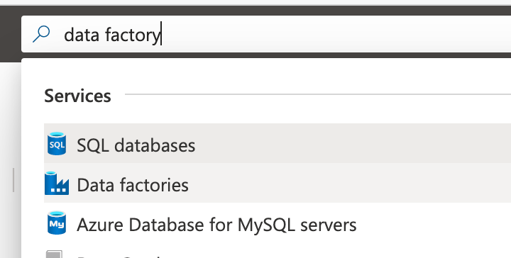

<!-- wp:paragraph -->

Once on tha page for Data factories, select "<strong>+ Add</strong>" to create new ADF. Insert the needed information:

<!-- /wp:paragraph -->

<!-- wp:list -->
<ul><li>Subscription</li><li>Resource Group</li><li>Region</li><li>Name</li><li>Version</li></ul>
<!-- /wp:list -->

<!-- wp:paragraph -->

I have selected the same resource group as the one for Databricks and name, I have given it <em>ADF-Databricks-day18</em>.

<!-- /wp:paragraph -->

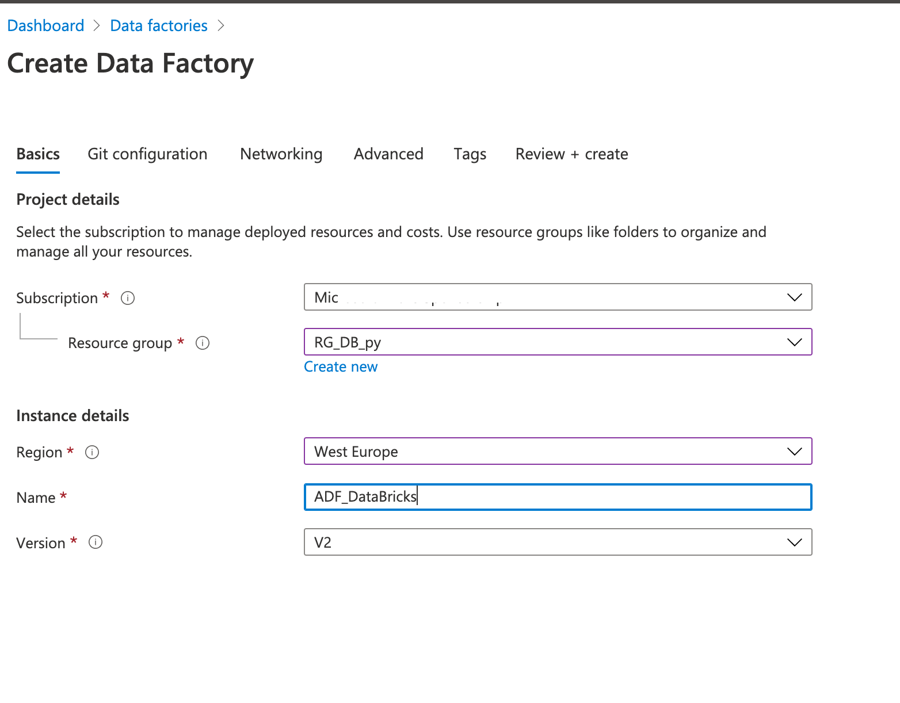

<!-- wp:paragraph -->

Select additional information such as Git configuration (you can also do this part later), Networking for special configurations, Advanced settings, add tags and create a ADF. Once the service is completed with creation and deployment, jump into the service and you should have the dashboard for this particular service

<!-- /wp:paragraph -->

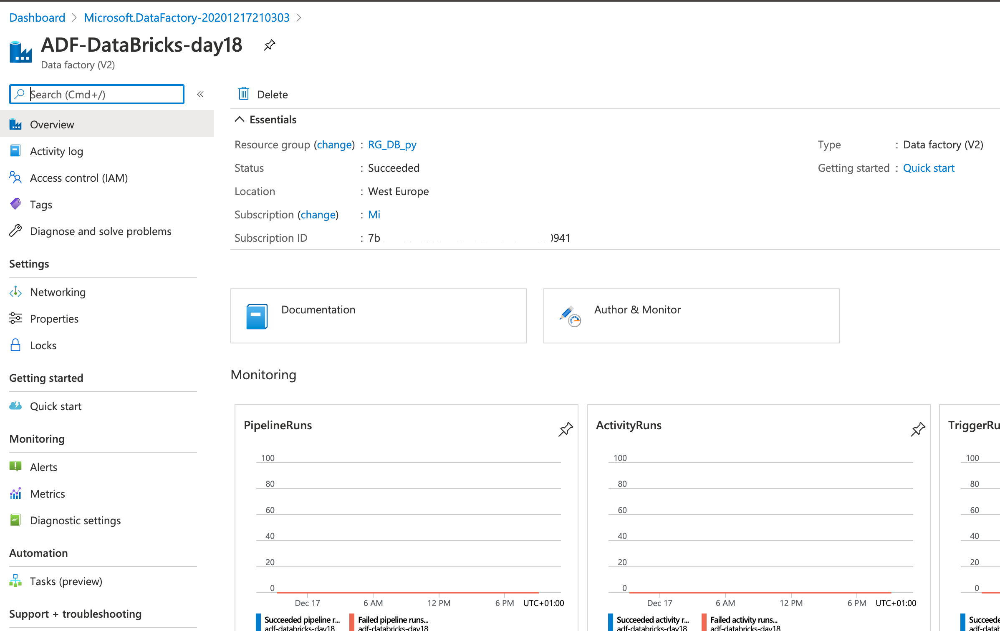

<!-- wp:paragraph -->

Select "Author &amp; Monitor" to get into the Azure Data Factory. You will be redirected to a new site:

<!-- /wp:paragraph -->

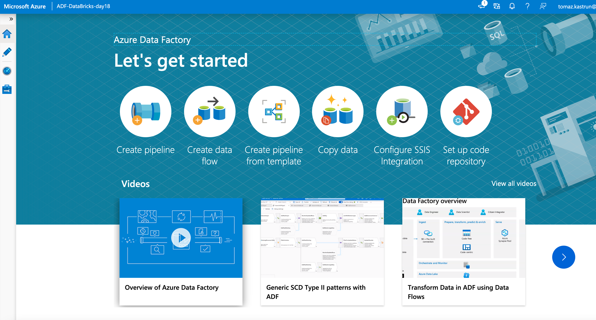

<!-- wp:paragraph -->

On the left-hand site, you will find a vertical navigation bar. Look for the bottom icon, that looks like a tool-box and is for managing the ADF:

<!-- /wp:paragraph -->

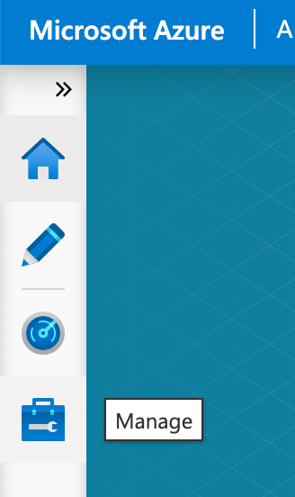

<!-- wp:paragraph -->

You will get to the setting site for this Data factory.

<!-- /wp:paragraph -->

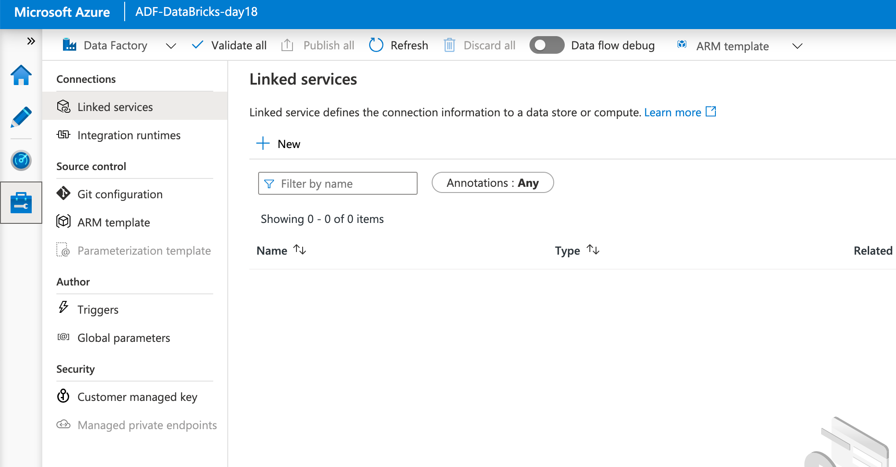

<!-- wp:paragraph -->

And we will be creating a new linked service. Linked service that will enable communication between Azure Data factory and Azure Databricks. Select "<strong>+ New</strong>" to add new Linked Services:

<!-- /wp:paragraph -->

<!-- wp:paragraph -->

On your right-hand side, the window will pop-up with available services that you want to link to ADF. Either search for Azure Databricks, or click "compute" (not "storage") and you should see Databricks logo immediately. 

<!-- /wp:paragraph -->

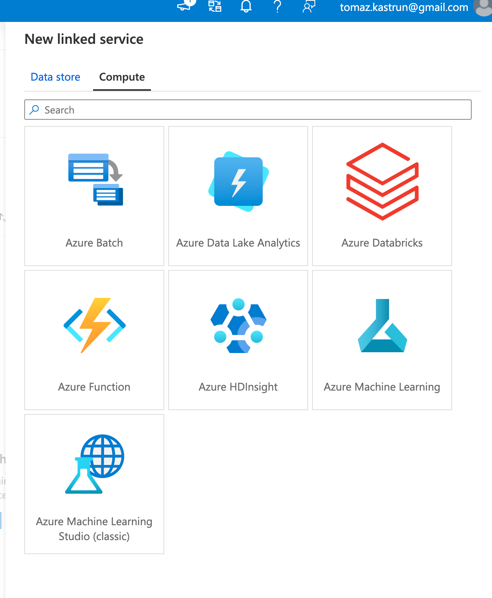

<!-- wp:paragraph -->

Click on Azure Databricks and click on "Continue". You will get a list of information you will need to fill-in.

<!-- /wp:paragraph -->

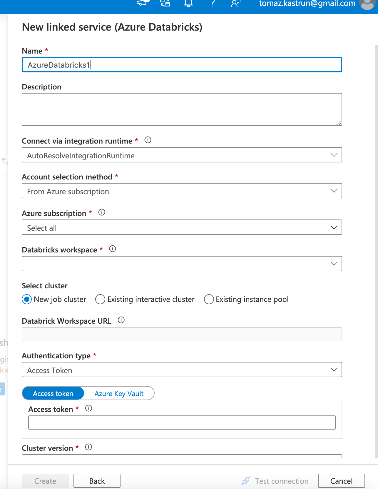

<!-- wp:paragraph -->

All needed information is relatively straight-forward. Yet, there is the authentication, we still need to fix. We will use access token. On <a rel="noreferrer noopener" href="https://tomaztsql.wordpress.com/2020/12/09/advent-of-2020-day-9-connect-to-azure-blob-storage-using-notebooks-in-azure-databricks/" target="_blank">Day 9</a> we have used Shared Access Signature (SAS), where we needed to make a Azure Databricks tokens. Open a new window (but do not close ADF Settings for creating a new linked service) in Azure Databricks and go to settings for this particular workspace.

<!-- /wp:paragraph -->

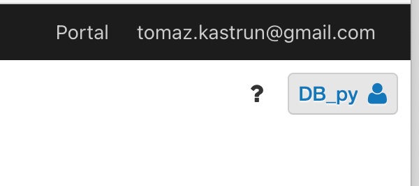

<!-- wp:paragraph -->

Click on the icon (mine is: "DB_py" and gliph) and select "User Settings". 

<!-- /wp:paragraph -->

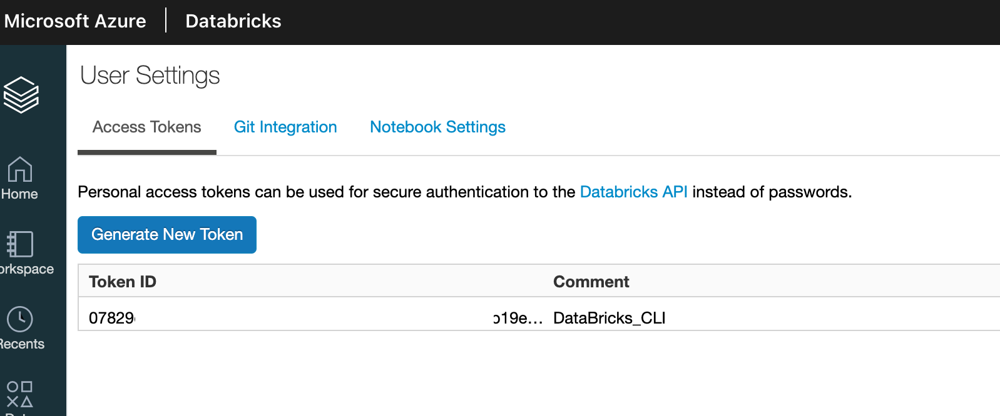

<!-- wp:paragraph -->

You can see, I have a Token ID and secret from Day 9 already in the Databricks system. So let's generate a new Token by clicking  "<strong>Generate New Token</strong>".

<!-- /wp:paragraph -->

<!-- wp:paragraph -->

Give token a name: "adf-db" and lifetime period. Once the token is generated, copy it somewhere, as you will never see it again. Of course, you can always generate a new one, but if you have multiple services bound to it, it is wise to store it somewhere secure. Generate it and copy the token (!).

<!-- /wp:paragraph -->

<!-- wp:paragraph -->

Go back to Azure Data Factory and paste the token in the settings. Select or fill-in the additional information.

<!-- /wp:paragraph -->

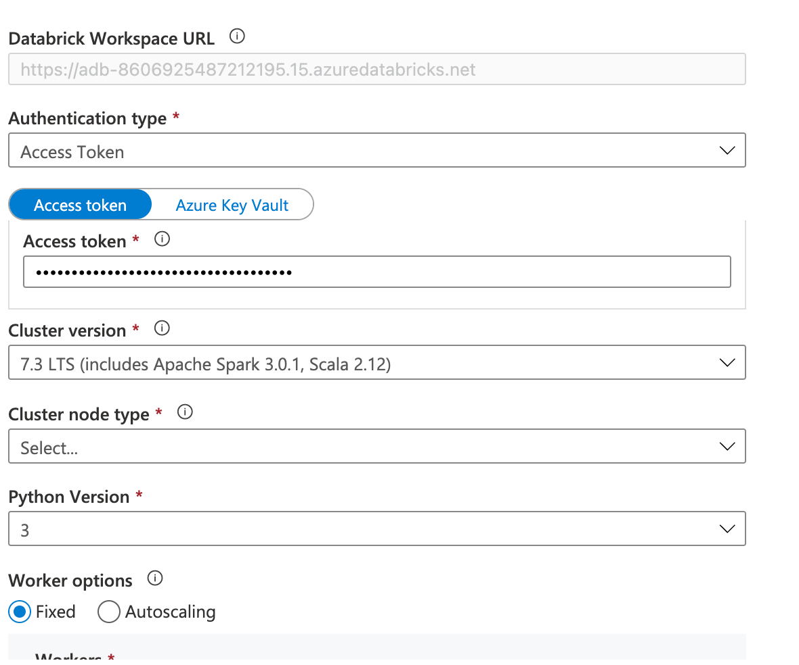

<!-- wp:paragraph -->

Once the linked server is created, select the Author in the left vertical menu in Azure Data Factory.

<!-- /wp:paragraph -->

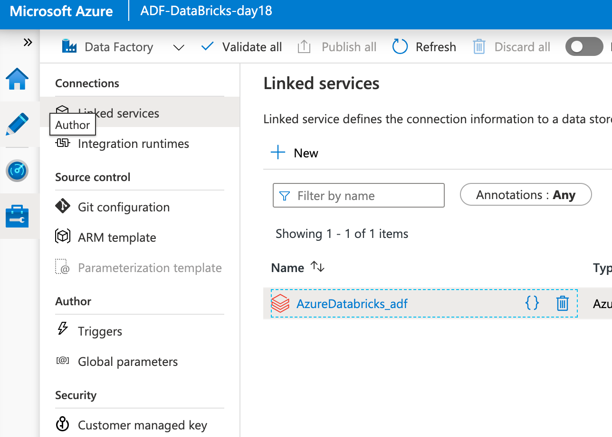

<!-- wp:paragraph -->

This will bring you a menu where you can start putting together a pipeline. But in addition, you can also register in ADF the datasets and data flows; this is especially useful when for large scale ETL or orchestration tasks.

<!-- /wp:paragraph -->

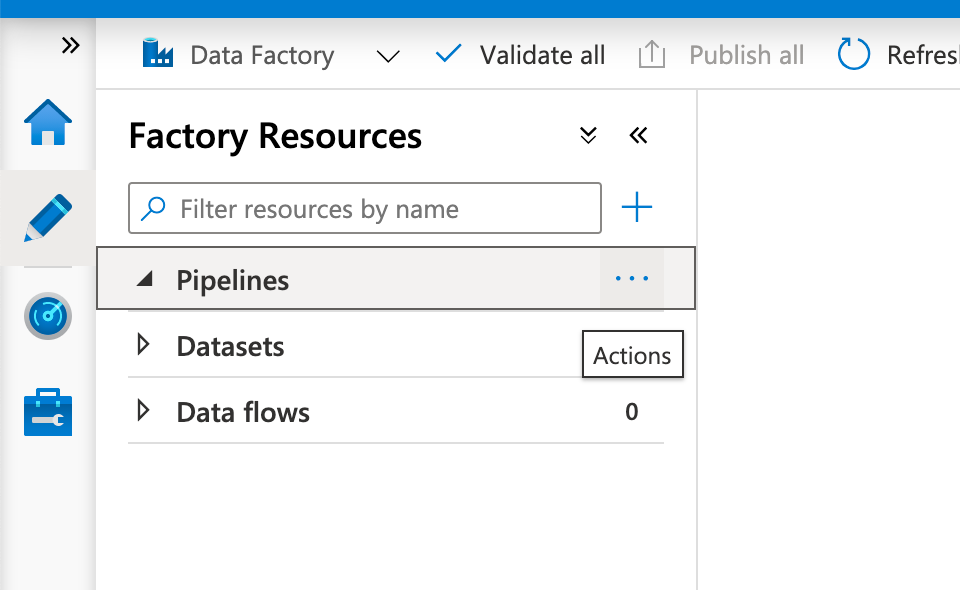

<!-- wp:paragraph -->

Select Pipeline and choose "New pipeline". You will be presented with a designer tool where you can start putting together the pipelines, flow and all the orchestrations.  

<!-- /wp:paragraph -->

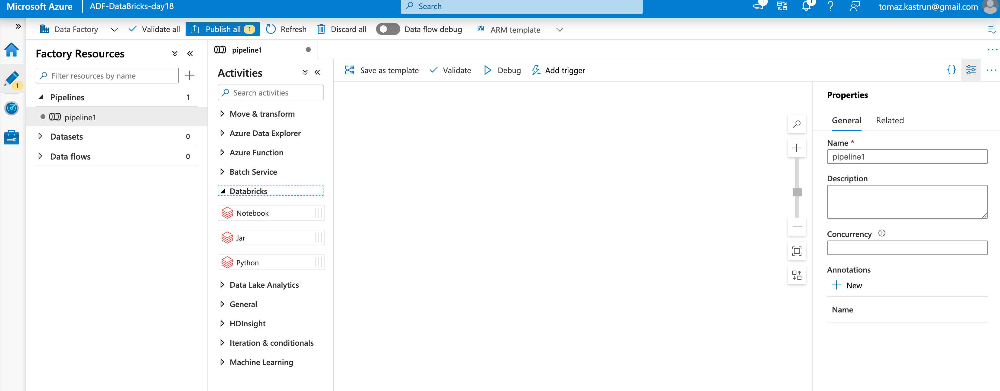

<!-- wp:paragraph -->

Under the section of Databricks, you will find:

<!-- /wp:paragraph -->

<!-- wp:list -->
<ul><li>Notebooks</li><li>Jar</li><li>Python</li></ul>
<!-- /wp:list -->

<!-- wp:paragraph -->

You can use Notebooks to build the whole pipelines and help you communicate between notebooks. You can add an application (Jar) or you can add a Python script for carrying a particular task.

<!-- /wp:paragraph -->

<!-- wp:paragraph -->

Drag and drop the elements on to the canvas. Select Notebook (Databricks notebook), drag the icon to canvas, and drop it.

<!-- /wp:paragraph -->

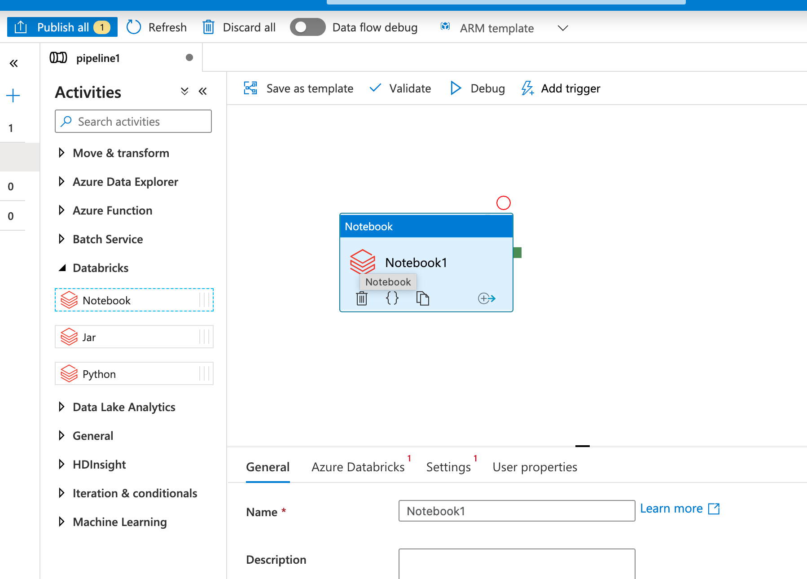

<!-- wp:paragraph -->

Under the settings for this particular Notebook, you have a tab "Azure Databricks" where you select the Linked server connection. Chose the one, we have created previously. Mine is named as "AzureDatabricks_adf". And under setting select the path to the notebook:

<!-- /wp:paragraph -->

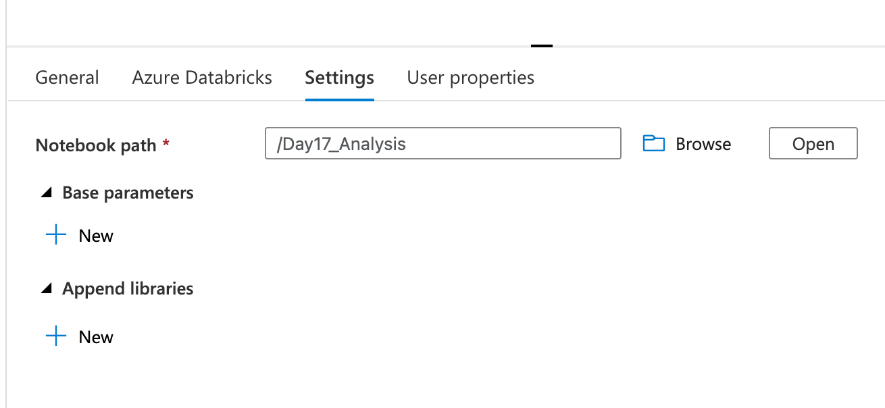

<!-- wp:paragraph -->

Once you finish with entering all the needed information, remember to hit "Publish all" and if there is any conflict between code, we can just and fix it immediately.

<!-- /wp:paragraph -->

<!-- wp:paragraph -->

You can now trigger the pipeline, you can schedule it or connect it to another notebook by selecting run or debbug.

<!-- /wp:paragraph -->

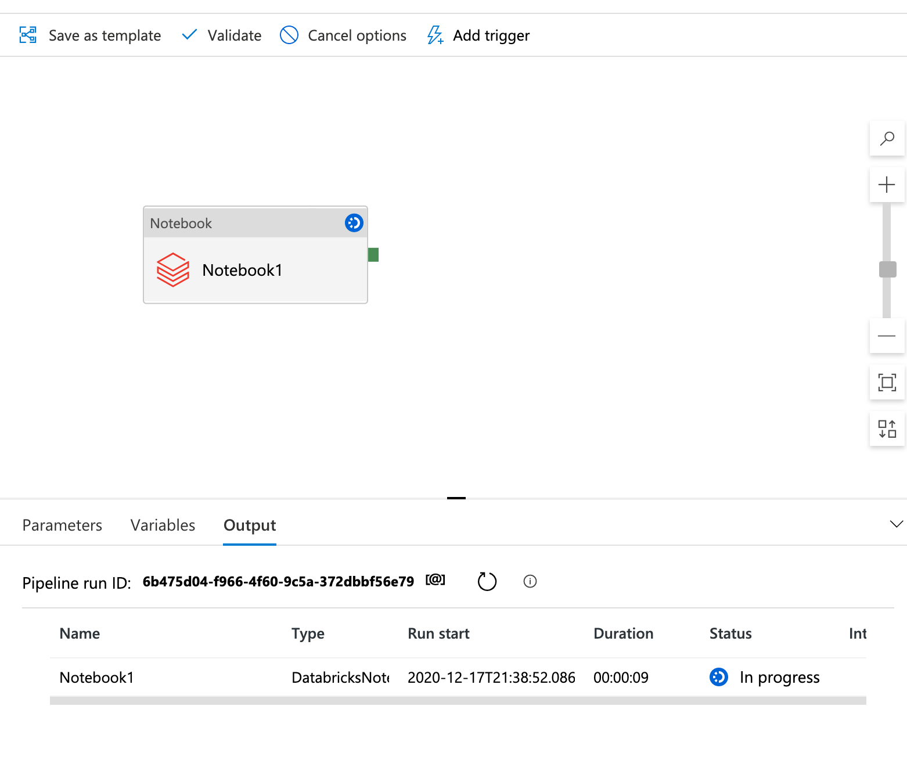

<!-- wp:paragraph -->

In this manner you can schedule and connect other services with Azure Databricks. Tomorrow, we will look into adding a Python element or another notebook to make more use of Azure Data factory.

<!-- /wp:paragraph -->

<!-- wp:paragraph -->

Complete set of code and Notebooks will be available at the<a rel="noreferrer noopener" href="https://github.com/tomaztk/Azure-Databricks" target="_blank">&nbsp;Github repository</a>.

<!-- /wp:paragraph -->

<!-- wp:paragraph -->

Happy Coding and Stay Healthy!

<!-- /wp:paragraph -->