<!-- README.md was wriiten in beautiful MacDown  -->
# Dec 19 2020 - Using Azure Data Factory with Azure Databricks for merging CSV files

<!-- badges: start -->

<!-- badges: end -->

Azure Databricks repository is 
a set of blogposts as a Advent of 2020 present to readers for easier onboarding
to Azure Databricks! 

<!-- wp:paragraph -->

Series of Azure Databricks posts:

<!-- /wp:paragraph -->

<!-- wp:list -->
<ul><li>Dec 01: <a rel="noreferrer noopener" href="https://tomaztsql.wordpress.com/2020/12/01/advent-of-2020-day-1-what-is-azure-databricks/" target="_blank">What is Azure Databricks</a></li><li>Dec 02: <a rel="noreferrer noopener" href="https://tomaztsql.wordpress.com/2020/12/02/advent-of-2020-day-2-how-to-get-started-with-azure-databricks/" target="_blank">How to get started with Azure Databricks</a></li><li>Dec 03: <a href="https://tomaztsql.wordpress.com/2020/12/03/advent-of-2020-day-3-getting-to-know-the-workspace-and-azure-databricks-platform/" target="_blank" rel="noreferrer noopener">Getting to know the workspace and Azure Databricks platform</a></li>
<li>Dec 04: <a href="https://tomaztsql.wordpress.com/2020/12/04/advent-of-2020-day-4-creating-your-first-azure-databricks-cluster/" target="_blank" rel="noreferrer noopener">Creating your first Azure Databricks cluster</a></li>
<li>Dec 05: <a href="https://tomaztsql.wordpress.com/2020/12/05/advent-of-2020-day-5-understanding-azure-databricks-cluster-architecture-workers-drivers-and-jobs/" target="_blank" rel="noreferrer noopener">Understanding Azure Databricks cluster architecture, workers, drivers and jobs</a></li>
<li>Dec 06: <a href="https://tomaztsql.wordpress.com/2020/12/06/advent-of-2020-day-6-importing-and-storing-data-to-azure-databricks/" target="_blank" rel="noreferrer noopener">Importing and storing data to Azure Databricks</a></li>
<li>Dec 07: <a href="https://tomaztsql.wordpress.com/2020/12/07/advent-of-2020-day-7-starting-with-databricks-notebooks-and-loading-data-to-dbfs/" target="_blank" rel="noreferrer noopener">Starting with Databricks notebooks and loading data to DBFS</a></li>
<li>Dec 08: <a href="https://tomaztsql.wordpress.com/2020/12/08/advent-of-2020-day-8-using-databricks-cli-and-dbfs-cli-for-file-upload/" target="_blank" rel="noreferrer noopener"> Using Databricks CLI and DBFS CLI for file upload</a></li>
<li>Dec 09: <a href="https://tomaztsql.wordpress.com/2020/12/09/advent-of-2020-day-9-connect-to-azure-blob-storage-using-notebooks-in-azure-databricks/" target="_blank" rel="noreferrer noopener">Connect to Azure Blob storage using Notebooks in  Azure Databricks</a></li>
<li>Dec 10: <a href="https://tomaztsql.wordpress.com/2020/12/10/advent-of-2020-day-10-using-azure-databricks-notebooks-with-sql-for-data-engineering-tasks/" target="_blank" rel="noreferrer noopener">Using Azure Databricks Notebooks with SQL for Data engineering tasks</a></li>
<li>Dec 11: <a href="https://tomaztsql.wordpress.com/2020/12/11/advent-of-2020-day-11-using-azure-databricks-notebooks-with-r-language-for-data-analytics/" target="_blank" rel="noreferrer noopener">Using Azure Databricks Notebooks with R Language for data analytics</a></li>
<li>Dec 12: <a href="https://tomaztsql.wordpress.com/2020/12/12/advent-of-2020-day-12-using-azure-databricks-notebooks-with-python-language-for-data-analytics/" target="_blank" rel="noreferrer noopener">Using Azure Databricks Notebooks with Python Language for data analytics</a></li>
<li>Dec 13: <a href="https://tomaztsql.wordpress.com/2020/12/13/adventof-2020-day-13-using-python-databricks-koalas-with-azure-databricks/" target="_blank" rel="noreferrer noopener">Using Python Databricks Koalas with Azure Databricks</a></li>
<li>Dec 14: <a href="https://tomaztsql.wordpress.com/2020/12/14/advent-of-2020-day-14-from-configuration-to-execution-of-databricks-jobs/" target="_blank" rel="noreferrer noopener">From configuration to execution of Databricks jobs</a></li>
<li>Dec 15: <a href="https://tomaztsql.wordpress.com/2020/12/15/advent-of-2020-day-15-databricks-spark-ui-event-logs-driver-logs-and-metrics/" target="_blank" rel="noreferrer noopener">Databricks Spark UI, Event Logs, Driver logs and Metrics</a></li>
<li>Dec 16: <a href="https://tomaztsql.wordpress.com/2020/12/16/advent-of-2020-day-16-databricks-experiments-models-and-mlflow/" target="_blank" rel="noreferrer noopener">Databricks experiments, models and MLFlow</a></li>
<li>Dec 17: <a href="https://tomaztsql.wordpress.com/2020/12/17/advent-of-2020-day-17-end-to-end-machine-learning-project-in-azure-databricks/" target="_blank" rel="noreferrer noopener">End-to-End Machine learning project in Azure Databricks</a></li>

<li>Dec 18: <a href="https://tomaztsql.wordpress.com/2020/12/18/advent-of-2020-day-18-using-azure-data-factory-with-azure-databricks/" target="_blank" rel="noreferrer noopener">Using Azure Data Factory with Azure Databricks</a></li>

</ul>
<!-- /wp:list -->

<!-- wp:paragraph -->

Yesterday we created data factory and started using the service, created linked service and our first pipeline.

<!-- /wp:paragraph -->

<!-- wp:paragraph -->

Today we will look how we can start using blob storage and Azure Databricks with Azure Data factory. 

<!-- /wp:paragraph -->

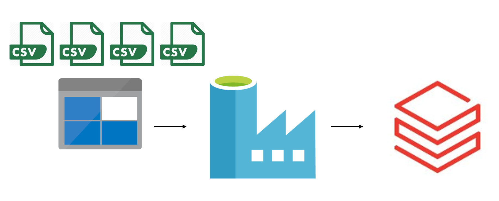

<!-- wp:paragraph -->

This would be a one of the  scenarios where you would have multiple csv files coming in to blob storage (particular folder) and we would want:

<!-- /wp:paragraph -->

<!-- wp:list -->
<ul><li>merge  CSV files</li><li>merge files with some transformation in between</li><li>transform the files  first and do the merge</li><li>copying files from one data lake zone to another zone and making transformation in between</li><li>or any other...</li></ul>
<!-- /wp:list -->

<!-- wp:paragraph -->

Regardless of the scenario, let's dive in.

<!-- /wp:paragraph -->

<!-- wp:paragraph -->
### 1.Create linked service for Azure Blob
<!-- /wp:paragraph -->

<!-- wp:paragraph -->

Yesterday (<a rel="noreferrer noopener" href="https://tomaztsql.wordpress.com/2020/12/18/advent-of-2020-day-18-using-azure-data-factory-with-azure-databricks/" target="_blank">day18</a>) we looked how to create a linked service for Azure Databricks. We will need another linked service for Azure Blob storage. Navigate to linked services and create a new one. We need a new linked service for Azure Blob Storage.

<!-- /wp:paragraph -->

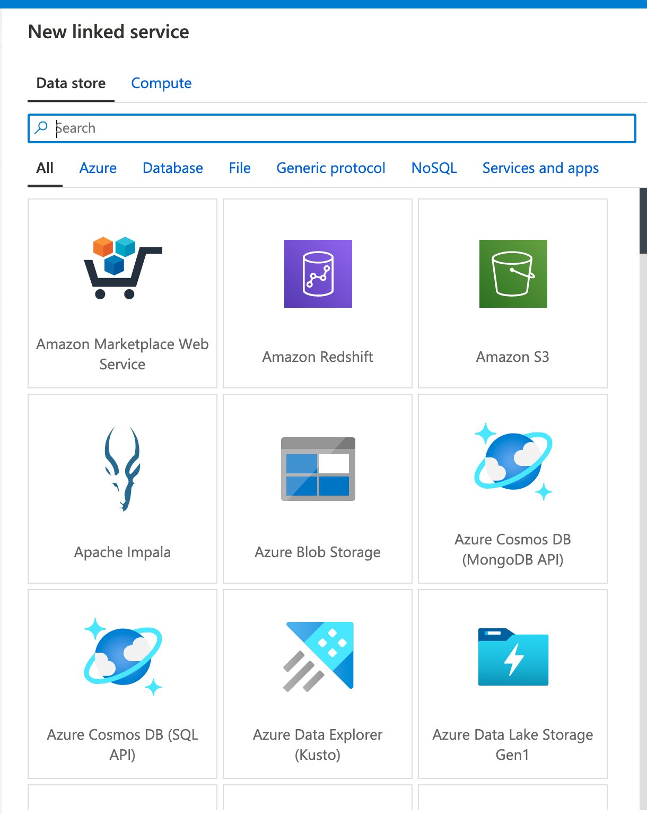

<!-- wp:paragraph -->

While configuring, select your Azure Subscription, and choose the Storage account, we have created on <a rel="noreferrer noopener" href="https://tomaztsql.wordpress.com/2020/12/09/advent-of-2020-day-9-connect-to-azure-blob-storage-using-notebooks-in-azure-databricks/" target="_blank">day9</a> and I called it dbpystorage. You should have something like this:

<!-- /wp:paragraph -->

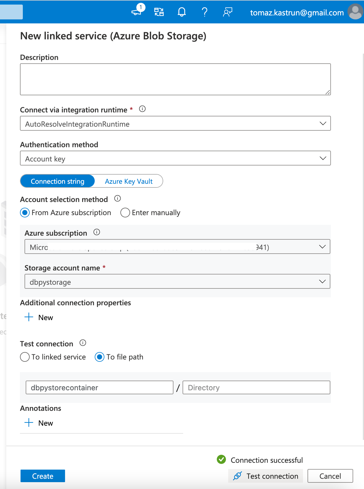

<!-- wp:paragraph -->

On day 9 we also copied a file into the blobstorage, called Day9MLB_players.csv (file is also available at the <a rel="noreferrer noopener" href="https://github.com/tomaztk/Azure-Databricks" target="_blank">Github repository</a>). Now you should have Azure Blob Storage and Azure Databricks services linked to Azure Data Factory.

<!-- /wp:paragraph -->

<!-- wp:paragraph -->

We will now need to create a dataset and a pipeline in ADF

<!-- /wp:paragraph -->

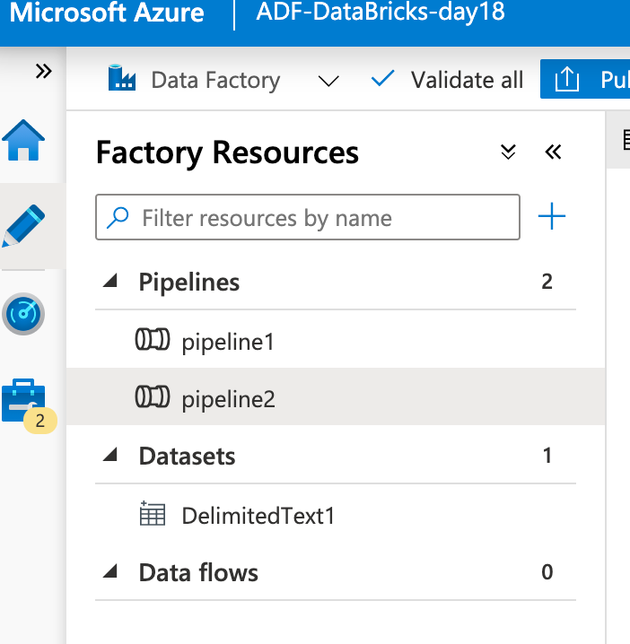

<!-- wp:paragraph -->
### 2.Creating a dataset
<!-- /wp:paragraph -->

<!-- wp:paragraph -->

By adding  a new dataset, go to Datasets and select "New Dataset". Window will pop-up asking for the location of the dataset. Select the <strong>Azure Blob Storage</strong>, because file is available in this service.

<!-- /wp:paragraph -->

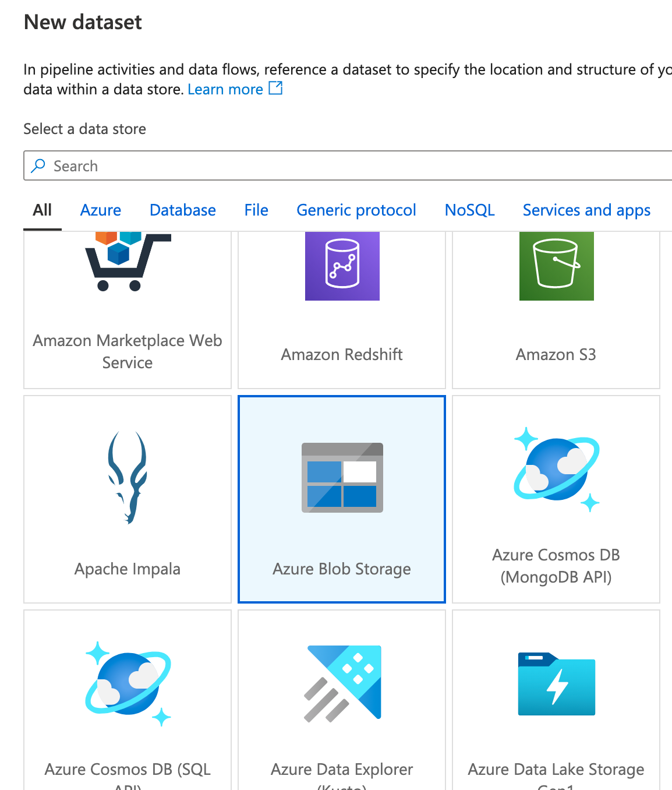

<!-- wp:paragraph -->

After selecting the storage type, you will be prompted with file type. Choose <strong>CSV - DelimitedText</strong> type.

<!-- /wp:paragraph -->

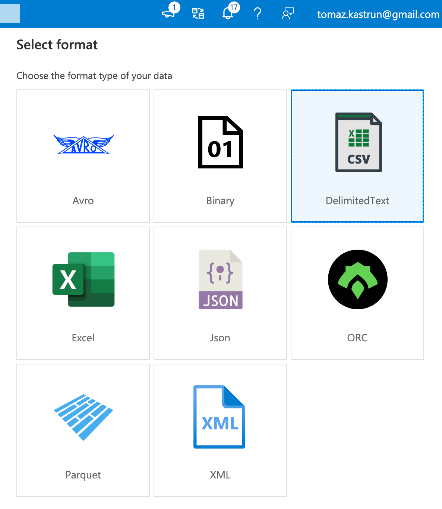

<!-- wp:paragraph -->

And after this, specify the path to the file. As I am using only one file, I am specifying the name. Otherwise, if this folder would have been a landing for multiple files (with same schema), I could use a wildcard, eg.: <strong>Day*.csv</strong> and all files following this patter would be read.

<!-- /wp:paragraph -->

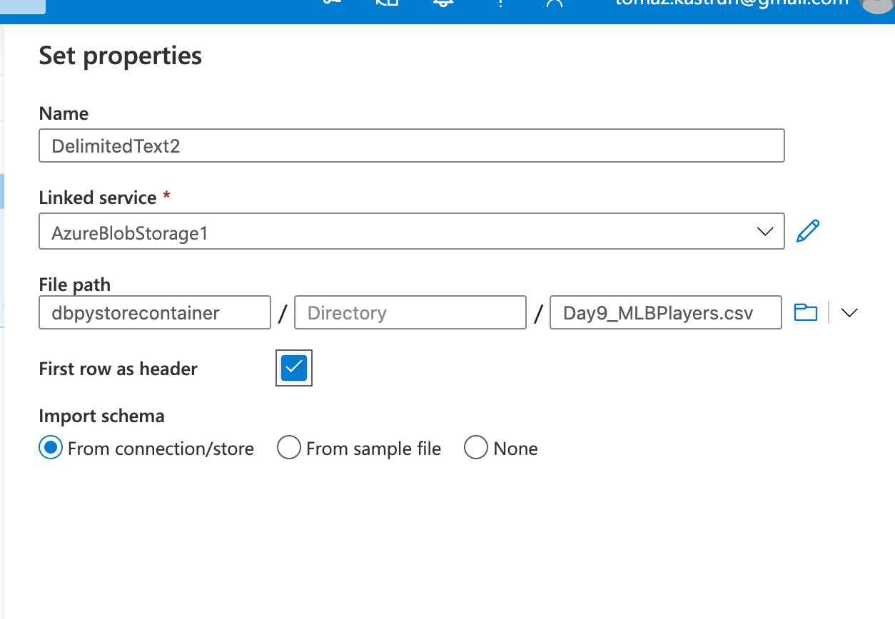

<!-- wp:paragraph -->

Once you have a dataset created, we will need a pipeline to connect the services.

<!-- /wp:paragraph -->

<!-- wp:paragraph -->
### 3. Creating Pipeline
<!-- /wp:paragraph -->

<!-- wp:paragraph -->

On the Author view in ADF, create a new Pipeline. A new canvas will appear for you to start working on data integration.

<!-- /wp:paragraph -->

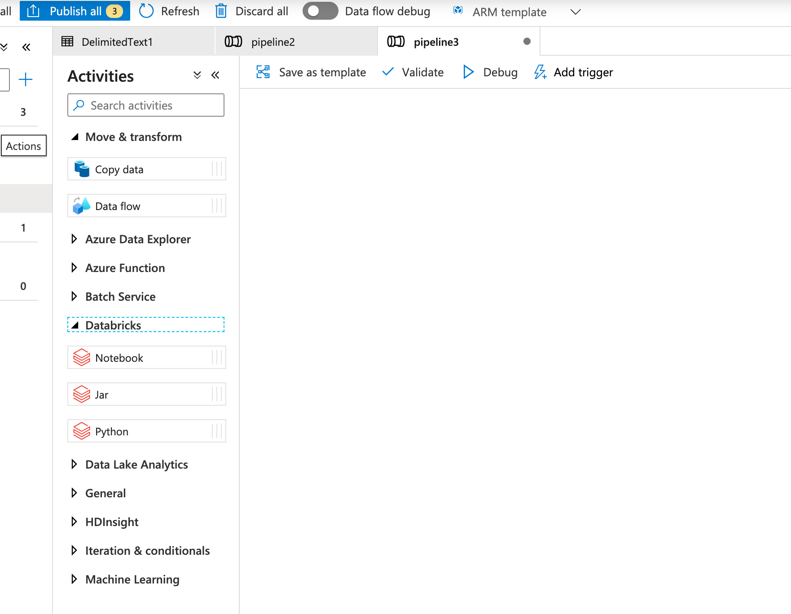

<!-- wp:paragraph -->

Select element "Copy Data" and element "Databricks". Element Copy Data will need the source and the sink data. It can copy a file from one location to another, it can merge files to another location or change format (going from CSV to Parquet). I will be using from CSV to merge into CSV.

<!-- /wp:paragraph -->

<!-- wp:paragraph -->

Select all the properties for Source.

<!-- /wp:paragraph -->

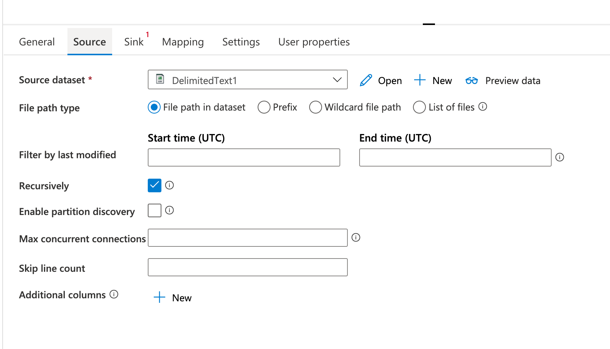

<!-- wp:paragraph -->

And for the Sink. For copy behaviour, I am selecting "merge files" to mimic the ETL job.

<!-- /wp:paragraph -->

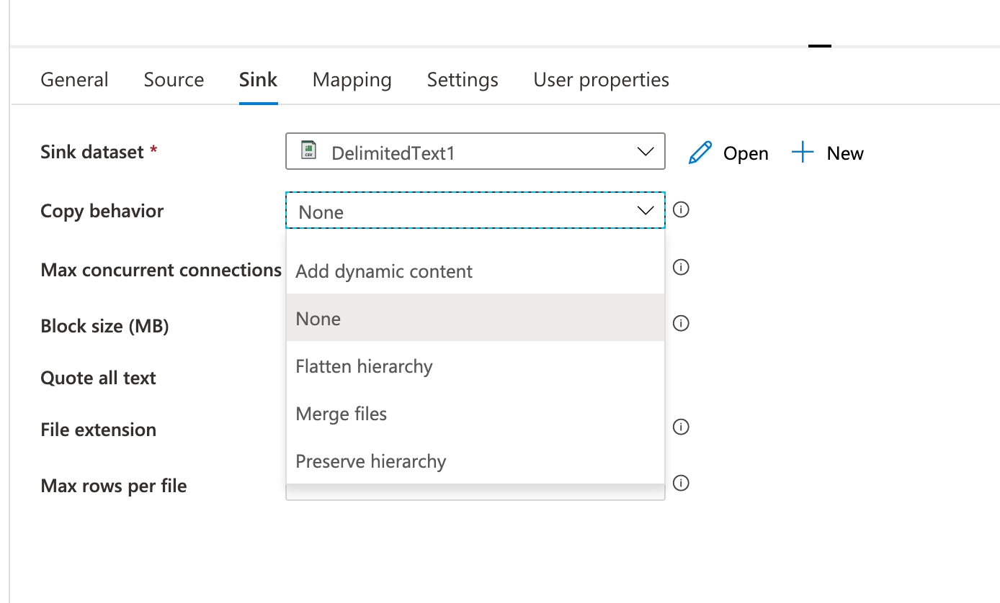

<!-- wp:paragraph -->

Once this part is completed, we need to look into the Databricks element:

<!-- /wp:paragraph -->

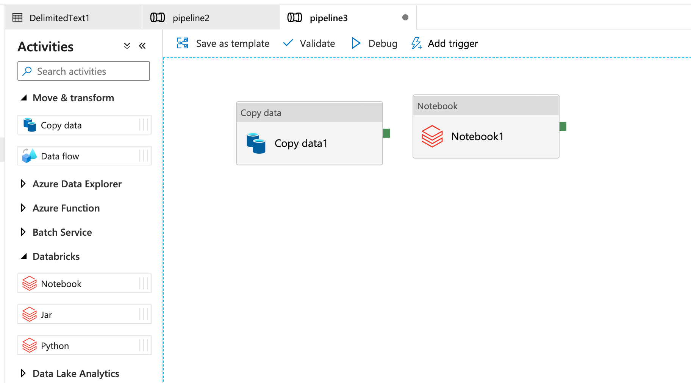

<!-- wp:paragraph -->

Azure Databricks notebook can hold literarily anything. From data transformation, to data merge, analytics, or it can even serve as a transformation element and connection to further other elements. In this case, Databricks element will hold only for reading activity and creating a table.

<!-- /wp:paragraph -->

<!-- wp:paragraph -->
### 4. Notebook
<!-- /wp:paragraph -->

<!-- wp:paragraph -->

Before connecting the elements in ADF, we need to give some instructions to Notebook. Head to Azure Databricks and create a new notebook. I have named mine: <strong>Day19_csv</strong> and choose language: Python.

<!-- /wp:paragraph -->

<!-- wp:paragraph -->

Set up the connection to file (this time using with  python - before we used Scala):

<!-- /wp:paragraph -->

<!-- wp:syntaxhighlighter/code -->
<pre class="wp-block-syntaxhighlighter-code">%python
storage_account_name = "dbpystorage"
storage_account_access_key = "YOUR_ACCOUNT_ACCESS_KEY"

file_location = "wasbs://dbpystorecontainer@dbpystorage.blob.core.windows.net/"
file_type = "csv"

spark.conf.set("fs.azure.account.key."+storage_account_name+".blob.core.windows.net",storage_account_access_key)</pre>
<!-- /wp:syntaxhighlighter/code -->

<!-- wp:paragraph -->

After the initial connection is set, we can load the data and create a SQL table:

<!-- /wp:paragraph -->

<!-- wp:syntaxhighlighter/code -->
<pre class="wp-block-syntaxhighlighter-code">%python
df = spark.read.format(file_type).option("header","true").option("inferSchema", "true").load(file_location)

df.createOrReplaceTempView("Day9data_view")</pre>
<!-- /wp:syntaxhighlighter/code -->

<!-- wp:paragraph -->

And the SQL query:

<!-- /wp:paragraph -->

<!-- wp:syntaxhighlighter/code -->
<pre class="wp-block-syntaxhighlighter-code">%sql
SELECT * FROM Day9data_view
--Check number of rows
SELECT COUNT(*) FROM Day9data_view</pre>
<!-- /wp:syntaxhighlighter/code -->

<!-- wp:paragraph -->

You can add many other data transformation or ETL scripts. Or you can harvest the Machine Learning script to do data analysis and data predictions. Normally, I would add analysis of merged dataset and save or expose the results to other services (via ADF), but to keep the post short, let's keep it as it is.

<!-- /wp:paragraph -->

<!-- wp:paragraph -->
### 5. Connecting the dots
<!-- /wp:paragraph -->

<!-- wp:paragraph -->

Back in Azure Data Factory, set the Notebook and select the Azure Databricks linked service and under setting, set the path to the notebook we have created in previous step.

<!-- /wp:paragraph -->

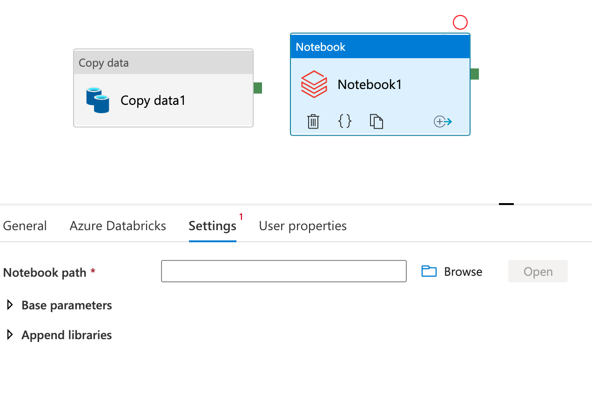

<!-- wp:paragraph -->

You can always browse through the path and select the correct path. 

<!-- /wp:paragraph -->

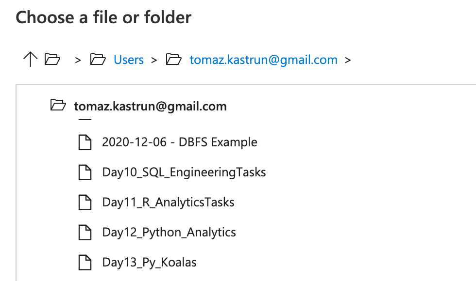

<!-- wp:paragraph -->

Once you set the path, you can connect the elements (or activities) together, debug and publish all the elements. Once published you can schedule and harvest the pipeline.

<!-- /wp:paragraph -->

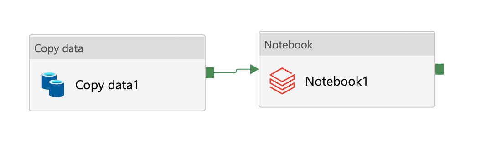

<!-- wp:paragraph -->

This pipeline can be scheduled, can be used as part of bigger ETL or it can be extended. You can have each notebook doing part of ETL and have the notebooks orchestrated in ADF, you can have data flows created in ADF and connect Python code (instead of Notebooks). The possibilities are endless.  Even if you want to capture streaming data, you can use ADF and Databricks, or only Databricks with Spark or you can use other services (Event hub, Azure functions, etc.).

<!-- /wp:paragraph -->

<!-- wp:paragraph -->

Tomorrow we will look this orchestration part using two notebooks with Scala and Python.

<!-- /wp:paragraph -->

<!-- wp:paragraph -->

Complete set of code and Notebooks will be available at the<a rel="noreferrer noopener" href="https://github.com/tomaztk/Azure-Databricks" target="_blank">&nbsp;Github repository</a>.

<!-- /wp:paragraph -->

<!-- wp:paragraph -->

Happy Coding and Stay Healthy!

<!-- /wp:paragraph -->
