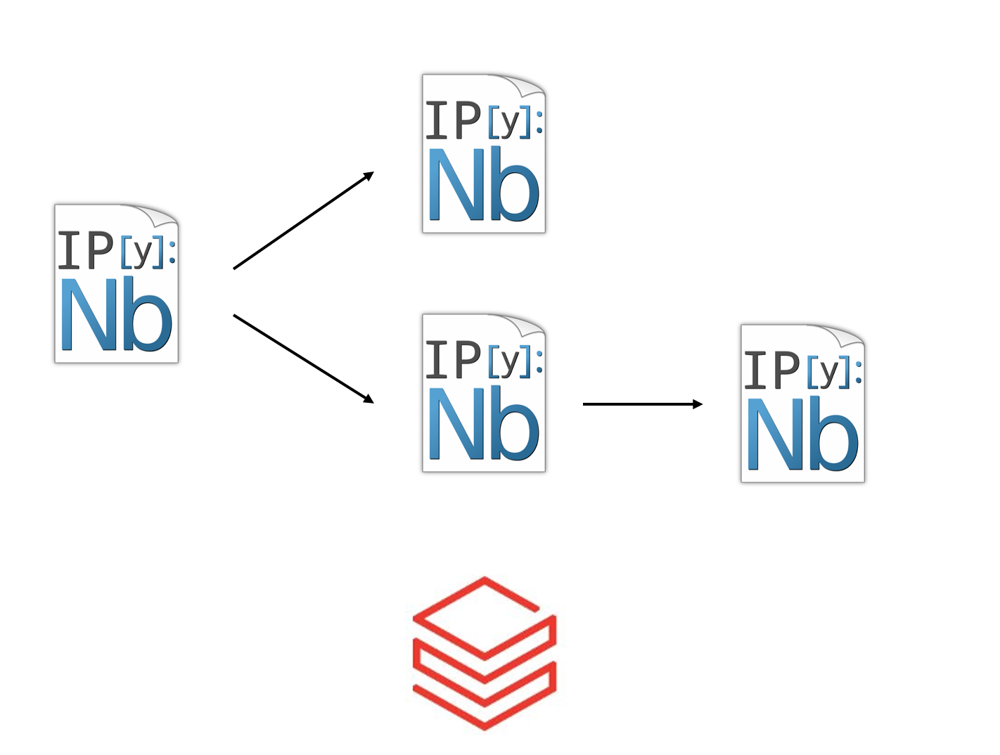
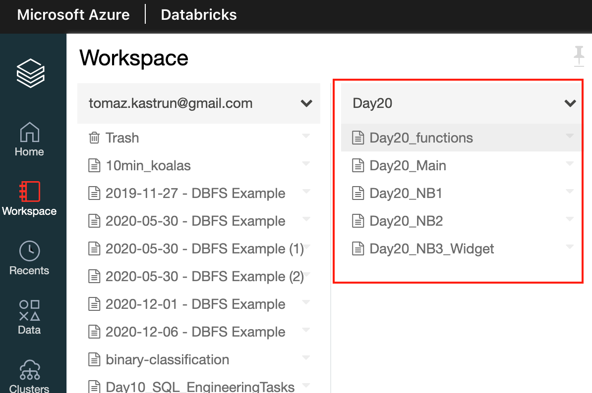
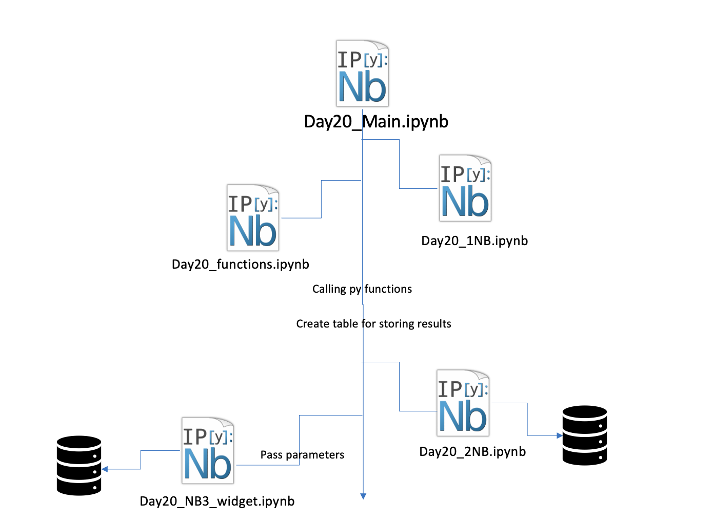
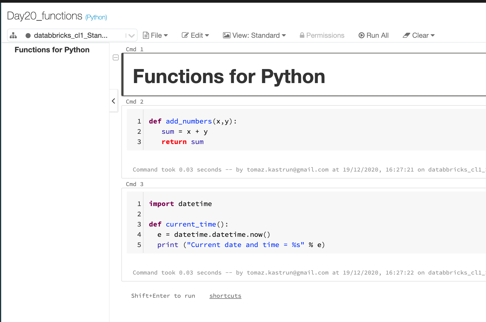
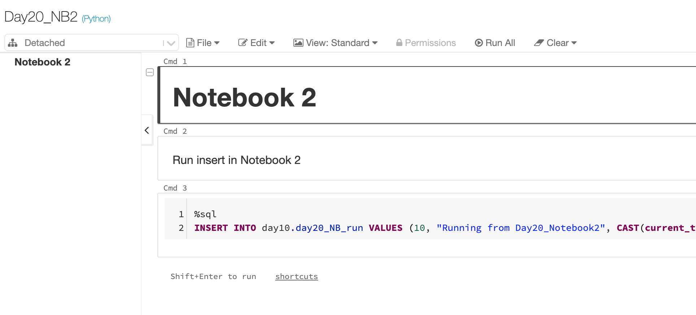
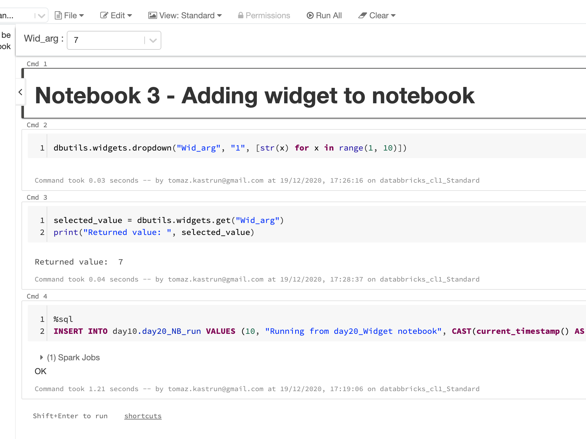
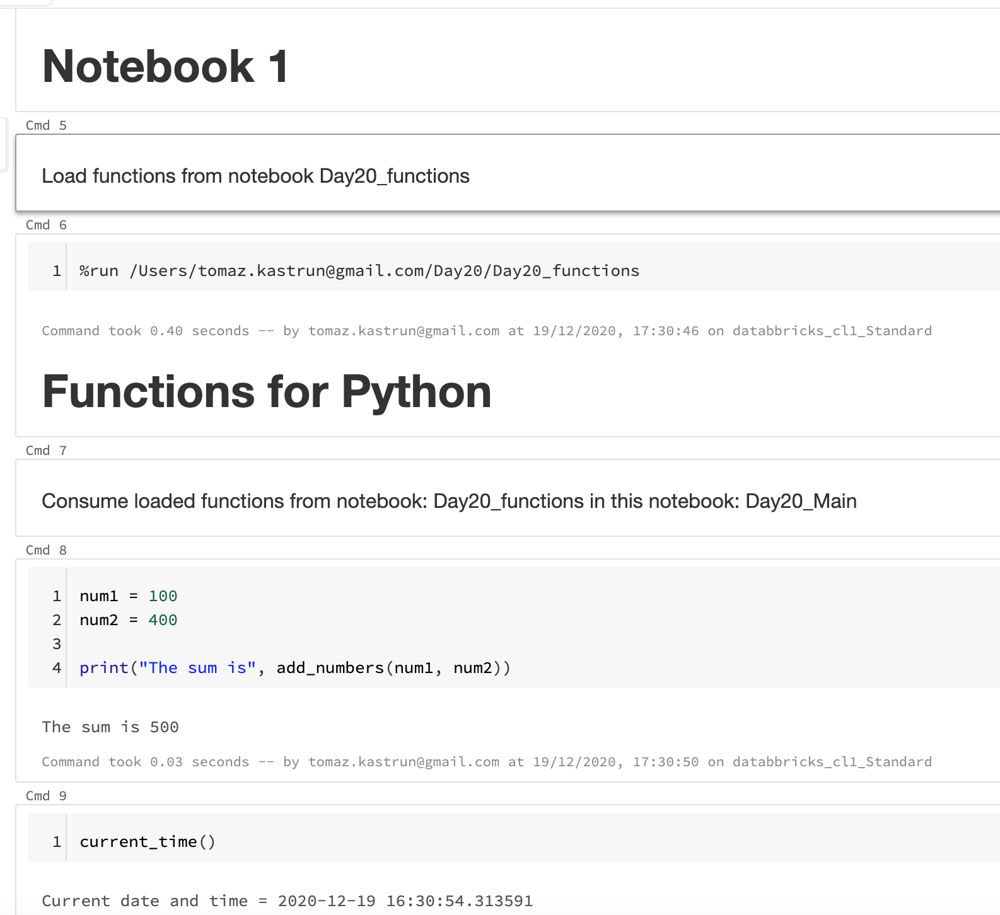
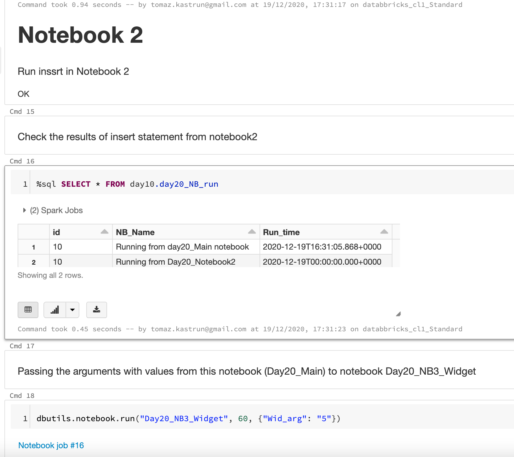

<!-- README.md was wriiten in beautiful MacDown  -->
# Dec 20 2020 - Orchestrating multiple notebooks with Azure Databricks

<!-- badges: start -->

<!-- badges: end -->

Azure Databricks repository is 
a set of blogposts as a Advent of 2020 present to readers for easier onboarding
to Azure Databricks! 

<!-- wp:paragraph -->

Series of Azure Databricks posts:

<!-- /wp:paragraph -->

<!-- wp:list -->
<ul><li>Dec 01: <a rel="noreferrer noopener" href="https://tomaztsql.wordpress.com/2020/12/01/advent-of-2020-day-1-what-is-azure-databricks/" target="_blank">What is Azure Databricks</a></li><li>Dec 02: <a rel="noreferrer noopener" href="https://tomaztsql.wordpress.com/2020/12/02/advent-of-2020-day-2-how-to-get-started-with-azure-databricks/" target="_blank">How to get started with Azure Databricks</a></li><li>Dec 03: <a href="https://tomaztsql.wordpress.com/2020/12/03/advent-of-2020-day-3-getting-to-know-the-workspace-and-azure-databricks-platform/" target="_blank" rel="noreferrer noopener">Getting to know the workspace and Azure Databricks platform</a></li>
<li>Dec 04: <a href="https://tomaztsql.wordpress.com/2020/12/04/advent-of-2020-day-4-creating-your-first-azure-databricks-cluster/" target="_blank" rel="noreferrer noopener">Creating your first Azure Databricks cluster</a></li>
<li>Dec 05: <a href="https://tomaztsql.wordpress.com/2020/12/05/advent-of-2020-day-5-understanding-azure-databricks-cluster-architecture-workers-drivers-and-jobs/" target="_blank" rel="noreferrer noopener">Understanding Azure Databricks cluster architecture, workers, drivers and jobs</a></li>
<li>Dec 06: <a href="https://tomaztsql.wordpress.com/2020/12/06/advent-of-2020-day-6-importing-and-storing-data-to-azure-databricks/" target="_blank" rel="noreferrer noopener">Importing and storing data to Azure Databricks</a></li>
<li>Dec 07: <a href="https://tomaztsql.wordpress.com/2020/12/07/advent-of-2020-day-7-starting-with-databricks-notebooks-and-loading-data-to-dbfs/" target="_blank" rel="noreferrer noopener">Starting with Databricks notebooks and loading data to DBFS</a></li>
<li>Dec 08: <a href="https://tomaztsql.wordpress.com/2020/12/08/advent-of-2020-day-8-using-databricks-cli-and-dbfs-cli-for-file-upload/" target="_blank" rel="noreferrer noopener"> Using Databricks CLI and DBFS CLI for file upload</a></li>
<li>Dec 09: <a href="https://tomaztsql.wordpress.com/2020/12/09/advent-of-2020-day-9-connect-to-azure-blob-storage-using-notebooks-in-azure-databricks/" target="_blank" rel="noreferrer noopener">Connect to Azure Blob storage using Notebooks in  Azure Databricks</a></li>
<li>Dec 10: <a href="https://tomaztsql.wordpress.com/2020/12/10/advent-of-2020-day-10-using-azure-databricks-notebooks-with-sql-for-data-engineering-tasks/" target="_blank" rel="noreferrer noopener">Using Azure Databricks Notebooks with SQL for Data engineering tasks</a></li>
<li>Dec 11: <a href="https://tomaztsql.wordpress.com/2020/12/11/advent-of-2020-day-11-using-azure-databricks-notebooks-with-r-language-for-data-analytics/" target="_blank" rel="noreferrer noopener">Using Azure Databricks Notebooks with R Language for data analytics</a></li>
<li>Dec 12: <a href="https://tomaztsql.wordpress.com/2020/12/12/advent-of-2020-day-12-using-azure-databricks-notebooks-with-python-language-for-data-analytics/" target="_blank" rel="noreferrer noopener">Using Azure Databricks Notebooks with Python Language for data analytics</a></li>
<li>Dec 13: <a href="https://tomaztsql.wordpress.com/2020/12/13/adventof-2020-day-13-using-python-databricks-koalas-with-azure-databricks/" target="_blank" rel="noreferrer noopener">Using Python Databricks Koalas with Azure Databricks</a></li>
<li>Dec 14: <a href="https://tomaztsql.wordpress.com/2020/12/14/advent-of-2020-day-14-from-configuration-to-execution-of-databricks-jobs/" target="_blank" rel="noreferrer noopener">From configuration to execution of Databricks jobs</a></li>
<li>Dec 15: <a href="https://tomaztsql.wordpress.com/2020/12/15/advent-of-2020-day-15-databricks-spark-ui-event-logs-driver-logs-and-metrics/" target="_blank" rel="noreferrer noopener">Databricks Spark UI, Event Logs, Driver logs and Metrics</a></li>
<li>Dec 16: <a href="https://tomaztsql.wordpress.com/2020/12/16/advent-of-2020-day-16-databricks-experiments-models-and-mlflow/" target="_blank" rel="noreferrer noopener">Databricks experiments, models and MLFlow</a></li>
<li>Dec 17: <a href="https://tomaztsql.wordpress.com/2020/12/17/advent-of-2020-day-17-end-to-end-machine-learning-project-in-azure-databricks/" target="_blank" rel="noreferrer noopener">End-to-End Machine learning project in Azure Databricks</a></li>
<li>Dec 18: <a href="https://tomaztsql.wordpress.com/2020/12/18/advent-of-2020-day-18-using-azure-data-factory-with-azure-databricks/" target="_blank" rel="noreferrer noopener">Using Azure Data Factory with Azure Databricks</a></li>

<li>Dec 18: <a href="https://tomaztsql.wordpress.com/2020/12/19/advent-of-2020-day-19-using-azure-data-factory-with-azure-databricks-for-merging-csv-files/" target="_blank" rel="noreferrer noopener">Using Azure Data Factory with Azure Databricks for merging CSV files</a></li>

</ul>
<!-- /wp:list -->
<!-- wp:paragraph -->

Yesterday we were looking into ADF and how to create a pipelines and connect different Azure services.

<!-- /wp:paragraph -->

<!-- wp:paragraph -->

Today, we will look into connecting multiple notebooks and trying to create orchestration or a workflow of several notebooks.

<!-- /wp:paragraph -->

<!-- wp:list {"ordered":true} -->
### 1. Creating a folder with multiple notebooks
<!-- /wp:list -->

<!-- wp:paragraph -->

In Azure Databricks workspace, create a new Folder, called Day20. Inside the folder, let's create couple of Notebooks:

<!-- /wp:paragraph -->

<!-- wp:list -->
<ul><li>Day20_NB1</li><li>Day20_NB2</li><li>Day20_functions</li><li>Day20_Main</li><li>Day20_NB3_Widget</li></ul>
<!-- /wp:list -->

<!-- wp:paragraph -->

And all are running Language: Python.

<!-- /wp:paragraph -->

<!-- wp:paragraph -->
### 2.Concept
<!-- /wp:paragraph -->

<!-- wp:paragraph -->

The outline of the notebooks is the following:

<!-- /wp:paragraph -->

<!-- wp:paragraph -->

Main notebook (<em>Day20_Main</em>) is the one, end user or job will be running all the commands from. 

<!-- /wp:paragraph -->

<!-- wp:paragraph -->

First step is to executed is to run notebook <em>Day20_1NB</em>, which is executed and until finished, the next code (or step) on the main notebook will not be executed. Notebook is deliberately empty, mimicking the notebook that does the task, that are independent from any other steps or notebooks.

<!-- /wp:paragraph -->

<!-- wp:paragraph -->

Second step is to load Python functions with notebook: <em>Day20_functions</em>. This notebook is just a collection (or class) of user defined functions. Once the notebooks is executed, all the functions will be declared and available in workspace for current user, through all notebooks.

<!-- /wp:paragraph -->

<!-- wp:paragraph -->

Third step is to try and run couple of Python functions in main notebook (Day20_Main). Nevertheless the simplicity of Python notebooks, they serve the purpose and show the ability how to use and run it.

<!-- /wp:paragraph -->

<!-- wp:paragraph -->

Fourth step is to create a persistent element for storing results in Notebooks. I created a table <em>day20_NB_run</em> where timestamp, ID, comments are stored and will be executed at the end of every non-main notebook (to serve for multiple purposes - feedback information for next step, triggering next step, logging, etc.) Table is created in database Day10 (created on <a rel="noreferrer noopener" href="https://tomaztsql.wordpress.com/2020/12/10/advent-of-2020-day-10-using-azure-databricks-notebooks-with-sql-for-data-engineering-tasks/" target="_blank">Day10</a>) and re-created (DROP and CREATE) every time the notebook is executed.

<!-- /wp:paragraph -->

<!-- wp:paragraph -->

Fifth step is executing notebook <em>Day20_2NB</em> that stores end result to table <em>day20_NB_run</em> for logging purposes or troubleshooting.

<!-- /wp:paragraph -->

<!-- wp:paragraph -->

Sixth step is a different one, because we want to have back and forth communication between main notebook (Day20_Main) and "child" notebook (<em>Day20_NB</em>3_Widget). This can be done using Scala Widgets. This notebook has a predefine set of possible values, that are called as argument-key entity from the main (Day20 main) notebook. Once the widget value is executed against the set of code, it can also be stored in database (what I did in demo) or return it (pass it) to main notebook in order to execute additional task based on new values.

<!-- /wp:paragraph -->

<!-- wp:paragraph -->

<!-- /wp:paragraph -->

<!-- wp:paragraph -->
### 3.Notebooks
<!-- /wp:paragraph -->

<!-- wp:paragraph -->

The insights of the notebooks.

<!-- /wp:paragraph -->

<!-- wp:paragraph -->

<strong>Day20_NB1</strong> - this one is no brainer.

<!-- /wp:paragraph -->

<!-- wp:paragraph -->

<strong>Day20_functions</strong> - is the collection of Python functions:

<!-- /wp:paragraph -->

<!-- wp:paragraph -->

with the sample code:

<!-- /wp:paragraph -->

<!-- wp:syntaxhighlighter/code -->
<pre class="wp-block-syntaxhighlighter-code">def add_numbers(x,y):
   sum = x + y
   return sum

import datetime

def current_time():
  e = datetime.datetime.now()
  print ("Current date and time = %s" % e)</pre>
<!-- /wp:syntaxhighlighter/code -->

<!-- wp:paragraph -->

<strong>Day20_NB2</strong> - is the notebook that outputs the results to SQL table.

<!-- /wp:paragraph -->

<!-- wp:paragraph -->

And the SQL code:

<!-- /wp:paragraph -->

<!-- wp:syntaxhighlighter/code -->
<pre class="wp-block-syntaxhighlighter-code">%sql
INSERT INTO day10.day20_NB_run VALUES (10, "Running from Day20_Notebook2", CAST(current_timestamp() AS TIMESTAMP))</pre>
<!-- /wp:syntaxhighlighter/code -->

<!-- wp:paragraph -->

<strong>Day20_NB3_Widget</strong> - is the notebook that receives the arguments from previous step (either notebook, or CRON or function) and executes the steps with this input information accordingly and stores results to SQL table.

<!-- /wp:paragraph -->

<!-- wp:paragraph -->

And the code from this notebook. This step creates a widget on the notebook.

<!-- /wp:paragraph -->

<!-- wp:syntaxhighlighter/code -->
<pre class="wp-block-syntaxhighlighter-code">dbutils.widgets.dropdown("Wid_arg", "1", [str(x) for x in range(1, 10)])</pre>
<!-- /wp:syntaxhighlighter/code -->

<!-- wp:paragraph -->

Each time a number is selected, you can run the command to get the value out:

<!-- /wp:paragraph -->

<!-- wp:syntaxhighlighter/code -->
<pre class="wp-block-syntaxhighlighter-code">selected_value = dbutils.widgets.get("Wid_arg")
print("Returned value: ", selected_value)</pre>
<!-- /wp:syntaxhighlighter/code -->

<!-- wp:paragraph -->

And the last step is to insert the values (and also the result of the widget) into SQL Table.

<!-- /wp:paragraph -->

<!-- wp:syntaxhighlighter/code -->
<pre class="wp-block-syntaxhighlighter-code">%sql
INSERT INTO day10.day20_NB_run VALUES (10, "Running from day20_Widget notebook", CAST(current_timestamp() AS TIMESTAMP))</pre>
<!-- /wp:syntaxhighlighter/code -->

<!-- wp:paragraph -->

<strong>Day20_Main</strong> - is the umbrella notebook or the main notebook, where all the orchestration is carried out. This notebook also holds the logic behind the steps and it's communication.

<!-- /wp:paragraph -->

<!-- wp:paragraph -->

Executing notebook from another (main) notebook, is in this notebook Day20_Main done by using this command (%run and path_to_notebook).

<!-- /wp:paragraph -->

<!-- wp:syntaxhighlighter/code -->
<pre class="wp-block-syntaxhighlighter-code">%run /Users/tomaz.kastrun@gmail.com/Day20/Day20_functions</pre>
<!-- /wp:syntaxhighlighter/code -->

<!-- wp:paragraph -->

SQL Table is the easier part, when defining table and roles.

<!-- /wp:paragraph -->

<!-- wp:syntaxhighlighter/code -->
<pre class="wp-block-syntaxhighlighter-code">%sql
DROP TABLE IF EXISTS day10.day20_NB_run;
CREATE TABLE day10.day20_NB_run (id INT, NB_Name STRING, Run_time TIMESTAMP)

%sql
INSERT INTO day10.day20_NB_run VALUES (10, "Running from day20_Main notebook", CAST(current_timestamp() AS TIMESTAMP))</pre>
<!-- /wp:syntaxhighlighter/code -->

<!-- wp:paragraph -->

For each step in between, I am checking the values in SQL Table, giving you the current status, and also logging all the steps on Main ntoebook.

<!-- /wp:paragraph -->

<!-- wp:paragraph -->

Command to execute notebook with input parameters, meaning that the command will run the Day20_NB3_Widget notebook. And this should have been trying to max 60 seconds. And the last part is the collection of parameters, that are executed.. 

<!-- /wp:paragraph -->

<!-- wp:syntaxhighlighter/code -->
<pre class="wp-block-syntaxhighlighter-code">dbutils.notebook.run("Day20_NB3_Widget", 60, {"Wid_arg": "5"})</pre>
<!-- /wp:syntaxhighlighter/code -->

<!-- wp:paragraph -->

We have seen that the orchestration has the capacity to run in multiple languages, use input or output parameters and can be part of larger ETL or ELT process.

<!-- /wp:paragraph -->

<!-- wp:paragraph -->

Tomorrow we will check and explore how to go about Scala, since we haven't yes discussed anything about Scala, but yet mentioned it on multiple occasions. 

<!-- /wp:paragraph -->

<!-- wp:paragraph -->

Complete set of code and Notebooks will be available at the<a rel="noreferrer noopener" href="https://github.com/tomaztk/Azure-Databricks" target="_blank">&nbsp;Github repository</a>.

<!-- /wp:paragraph -->

<!-- wp:paragraph -->

Happy Coding and Stay Healthy!

<!-- /wp:paragraph -->