<!-- README.md was wriiten in beautiful MacDown  -->
# Dec 21 2020 - Using Scala with Spark Core API in Azure Databricks

<!-- badges: start -->

<!-- badges: end -->

Azure Databricks repository is 
a set of blogposts as a Advent of 2020 present to readers for easier onboarding
to Azure Databricks! 

<!-- wp:paragraph -->

Series of Azure Databricks posts:

<!-- /wp:paragraph -->

<!-- wp:list -->
<ul><li>Dec 01: <a rel="noreferrer noopener" href="https://tomaztsql.wordpress.com/2020/12/01/advent-of-2020-day-1-what-is-azure-databricks/" target="_blank">What is Azure Databricks</a></li><li>Dec 02: <a rel="noreferrer noopener" href="https://tomaztsql.wordpress.com/2020/12/02/advent-of-2020-day-2-how-to-get-started-with-azure-databricks/" target="_blank">How to get started with Azure Databricks</a></li><li>Dec 03: <a href="https://tomaztsql.wordpress.com/2020/12/03/advent-of-2020-day-3-getting-to-know-the-workspace-and-azure-databricks-platform/" target="_blank" rel="noreferrer noopener">Getting to know the workspace and Azure Databricks platform</a></li>
<li>Dec 04: <a href="https://tomaztsql.wordpress.com/2020/12/04/advent-of-2020-day-4-creating-your-first-azure-databricks-cluster/" target="_blank" rel="noreferrer noopener">Creating your first Azure Databricks cluster</a></li>
<li>Dec 05: <a href="https://tomaztsql.wordpress.com/2020/12/05/advent-of-2020-day-5-understanding-azure-databricks-cluster-architecture-workers-drivers-and-jobs/" target="_blank" rel="noreferrer noopener">Understanding Azure Databricks cluster architecture, workers, drivers and jobs</a></li>
<li>Dec 06: <a href="https://tomaztsql.wordpress.com/2020/12/06/advent-of-2020-day-6-importing-and-storing-data-to-azure-databricks/" target="_blank" rel="noreferrer noopener">Importing and storing data to Azure Databricks</a></li>
<li>Dec 07: <a href="https://tomaztsql.wordpress.com/2020/12/07/advent-of-2020-day-7-starting-with-databricks-notebooks-and-loading-data-to-dbfs/" target="_blank" rel="noreferrer noopener">Starting with Databricks notebooks and loading data to DBFS</a></li>
<li>Dec 08: <a href="https://tomaztsql.wordpress.com/2020/12/08/advent-of-2020-day-8-using-databricks-cli-and-dbfs-cli-for-file-upload/" target="_blank" rel="noreferrer noopener"> Using Databricks CLI and DBFS CLI for file upload</a></li>
<li>Dec 09: <a href="https://tomaztsql.wordpress.com/2020/12/09/advent-of-2020-day-9-connect-to-azure-blob-storage-using-notebooks-in-azure-databricks/" target="_blank" rel="noreferrer noopener">Connect to Azure Blob storage using Notebooks in  Azure Databricks</a></li>
<li>Dec 10: <a href="https://tomaztsql.wordpress.com/2020/12/10/advent-of-2020-day-10-using-azure-databricks-notebooks-with-sql-for-data-engineering-tasks/" target="_blank" rel="noreferrer noopener">Using Azure Databricks Notebooks with SQL for Data engineering tasks</a></li>
<li>Dec 11: <a href="https://tomaztsql.wordpress.com/2020/12/11/advent-of-2020-day-11-using-azure-databricks-notebooks-with-r-language-for-data-analytics/" target="_blank" rel="noreferrer noopener">Using Azure Databricks Notebooks with R Language for data analytics</a></li>
<li>Dec 12: <a href="https://tomaztsql.wordpress.com/2020/12/12/advent-of-2020-day-12-using-azure-databricks-notebooks-with-python-language-for-data-analytics/" target="_blank" rel="noreferrer noopener">Using Azure Databricks Notebooks with Python Language for data analytics</a></li>
<li>Dec 13: <a href="https://tomaztsql.wordpress.com/2020/12/13/adventof-2020-day-13-using-python-databricks-koalas-with-azure-databricks/" target="_blank" rel="noreferrer noopener">Using Python Databricks Koalas with Azure Databricks</a></li>
<li>Dec 14: <a href="https://tomaztsql.wordpress.com/2020/12/14/advent-of-2020-day-14-from-configuration-to-execution-of-databricks-jobs/" target="_blank" rel="noreferrer noopener">From configuration to execution of Databricks jobs</a></li>
<li>Dec 15: <a href="https://tomaztsql.wordpress.com/2020/12/15/advent-of-2020-day-15-databricks-spark-ui-event-logs-driver-logs-and-metrics/" target="_blank" rel="noreferrer noopener">Databricks Spark UI, Event Logs, Driver logs and Metrics</a></li>
<li>Dec 16: <a href="https://tomaztsql.wordpress.com/2020/12/16/advent-of-2020-day-16-databricks-experiments-models-and-mlflow/" target="_blank" rel="noreferrer noopener">Databricks experiments, models and MLFlow</a></li>
<li>Dec 17: <a href="https://tomaztsql.wordpress.com/2020/12/17/advent-of-2020-day-17-end-to-end-machine-learning-project-in-azure-databricks/" target="_blank" rel="noreferrer noopener">End-to-End Machine learning project in Azure Databricks</a></li>
<li>Dec 18: <a href="https://tomaztsql.wordpress.com/2020/12/18/advent-of-2020-day-18-using-azure-data-factory-with-azure-databricks/" target="_blank" rel="noreferrer noopener">Using Azure Data Factory with Azure Databricks</a></li>
<li>Dec 19: <a href="https://tomaztsql.wordpress.com/2020/12/19/advent-of-2020-day-19-using-azure-data-factory-with-azure-databricks-for-merging-csv-files/" target="_blank" rel="noreferrer noopener">Using Azure Data Factory with Azure Databricks for merging CSV files</a></li>

<li>Dec 20: <a href="https://tomaztsql.wordpress.com/2020/12/20/advent-of-2020-day-20-orchestrating-multiple-notebooks-with-azure-databricks/" target="_blank" rel="noreferrer noopener">Orchestrating multiple notebooks with Azure Databricks</a></li>

</ul>
<!-- /wp:list -->

 <!-- wp:paragraph -->

Yesterday we explored the capabilities of orchestrating notebooks in Azure Databricks. Also in previous days we have seen that Spark is the main glue between the different languages. But today we will talk about Scala.

<!-- /wp:paragraph -->

<!-- wp:paragraph -->

And in the following blogposts we will explore the core engine and services on top:

<!-- /wp:paragraph -->

<!-- wp:list -->
<ul><li>Spark SQL+ Dataframes</li><li>Streaming</li><li>MLlib - Machine learning library</li><li>GraphX - Graph computations</li></ul>
<!-- /wp:list -->

<!-- wp:paragraph -->

Apache Spark is a powerful open-source processing engine built around speed, ease of use, and sophisticated analytics.

<!-- /wp:paragraph -->

<!-- wp:paragraph -->

Spark Core is underlying general execution engine for the Spark Platform with all other functionalities built-in. It is in memory computing engine that provides variety of language support, as Scala, R, Python for easier data engineering development and machine learning development. 

<!-- /wp:paragraph -->

<!-- wp:paragraph -->

Spark has three key interfaces:

<!-- /wp:paragraph -->

<!-- wp:list -->
<ul><li><strong>Resilient Distributed Dataset </strong> (RDD) -  It is an interface to a sequence of data objects that consist of one or more types that are located across a collection of machines (a cluster). RDDs can be created in a variety of ways and are the “lowest level” API available. While this is the original data structure for Apache Spark, you should focus on the DataFrame API, which is a superset of the RDD functionality. The RDD API is available in the Java, Python, and Scala languages.</li><li><strong>DataFrame</strong> - similar in concept to the DataFrame you will find with  the pandas Python library and the R language. The DataFrame API is available in the Java, Python, R, and Scala languages.</li><li><strong>Dataset</strong> - is combination of RDD and DataFrame. It proved typed interface of RDD and gives you the convenience of the DataFrame. The Dataset API si available only for Scala and Java. </li></ul>
<!-- /wp:list -->

<!-- wp:paragraph -->

In general, when you will be working with the performance optimisations, either DataFrames or Datasets should be enough. But when going into more advanced components of Spark, it may be necessary to use RDDs. Also the visualisation within Spark UI references directly RDDs.

<!-- /wp:paragraph -->

<!-- wp:paragraph -->
## 1.Datasets
<!-- /wp:paragraph -->

<!-- wp:paragraph -->

Let us start with Databricks datasets, that are available within every workspace and are here mainly for test purposes. This is nothing new; both Python and R come with sample datasets. For example the Iris dataset that is available with Base R engine and Seaborn Python package. Same goes with Databricks and sample dataset can be found in <em>/databricks-datasets</em> folder.

<!-- /wp:paragraph -->

<!-- wp:paragraph -->

Create a new notebook in your workspace and name it Day21_Scala. Language: Scala. And run the following Scala command.

<!-- /wp:paragraph -->

<!-- wp:syntaxhighlighter/code -->
<pre class="wp-block-syntaxhighlighter-code">display(dbutils.fs.ls("/databricks-datasets"))</pre>
<!-- /wp:syntaxhighlighter/code -->

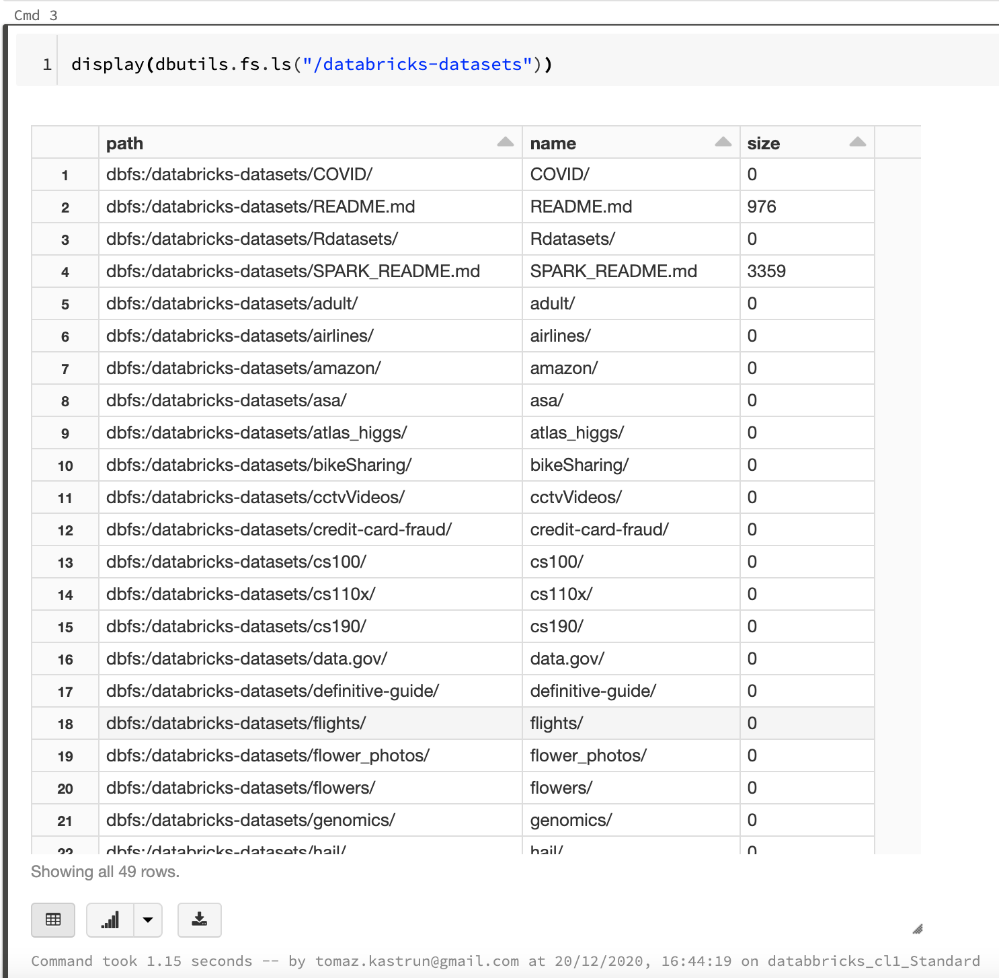

<!-- wp:paragraph -->

You can always store the results to variable and later use is multiple times:

<!-- /wp:paragraph -->

<!-- wp:syntaxhighlighter/code -->
<pre class="wp-block-syntaxhighlighter-code">// transformation
val textFile = spark.read.textFile("/databricks-datasets/samples/docs/README.md")</pre>
<!-- /wp:syntaxhighlighter/code -->

<!-- wp:paragraph -->

and listing the content of the variable by using <strong>show()</strong> function:

<!-- /wp:paragraph -->

<!-- wp:syntaxhighlighter/code -->
<pre class="wp-block-syntaxhighlighter-code">textFile.show()</pre>
<!-- /wp:syntaxhighlighter/code -->

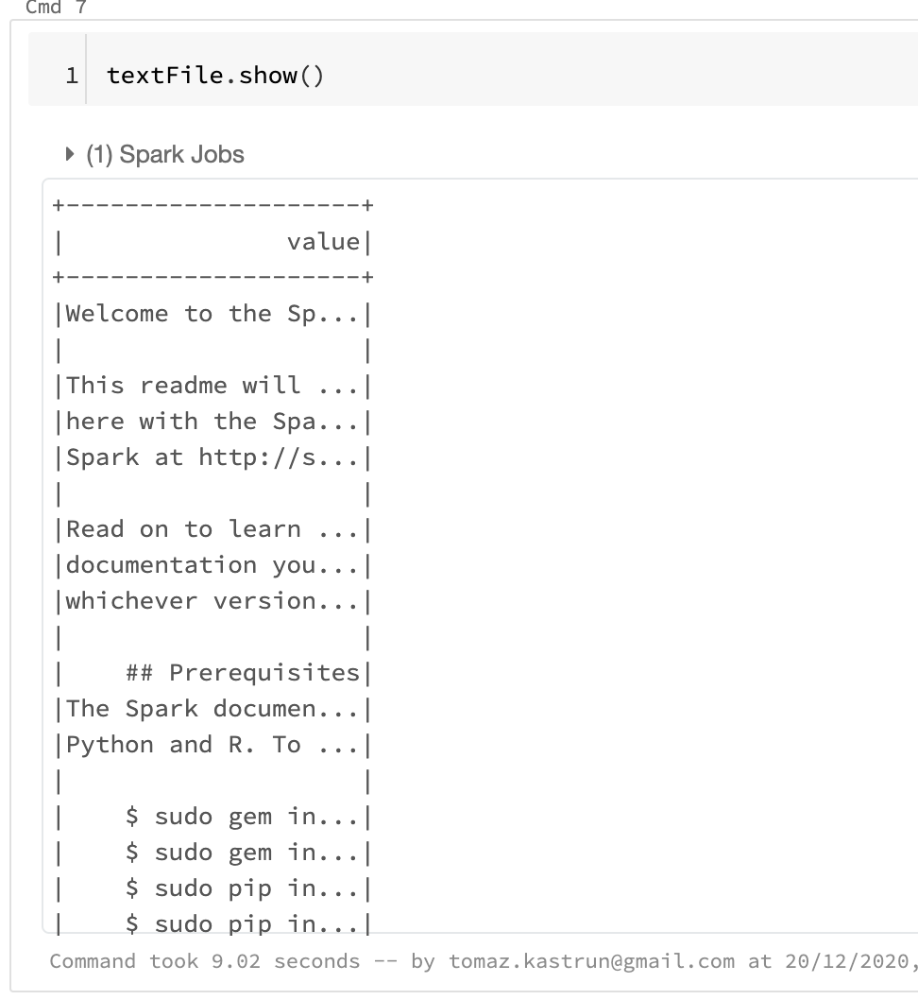

<!-- wp:paragraph -->

And some other useful functions; to count all the lines in textfile, to show the first line and to filter the text file showing only the lines containing the search argument (word sudo).

<!-- /wp:paragraph -->

<!-- wp:syntaxhighlighter/code -->
<pre class="wp-block-syntaxhighlighter-code">// Count number or lines in textFile
textFile.count()
// Show the first line of the textFile
textFile.first()
// show all the lines with word Sudo
val linesWithSudo = textFile.filter(line => line.contains("sudo"))</pre>
<!-- /wp:syntaxhighlighter/code -->

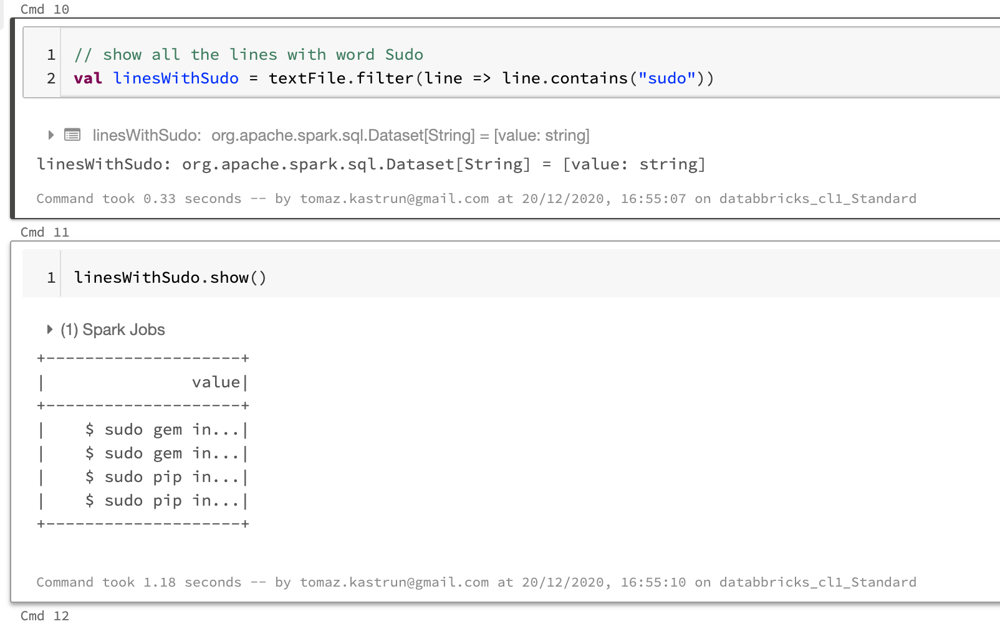

<!-- wp:paragraph -->

And also printing all (first four) lines of with the subset of text containing the word "sudo". In the second example finding the Line number with most words: 

<!-- /wp:paragraph -->

<!-- wp:syntaxhighlighter/code -->
<pre class="wp-block-syntaxhighlighter-code">// Output the all four lines
linesWithSudo.collect().take(4).foreach(println)
// find the lines with most words
textFile.map(line => line.split(" ").size).reduce((a, b) => if (a > b) a else b)</pre>
<!-- /wp:syntaxhighlighter/code -->

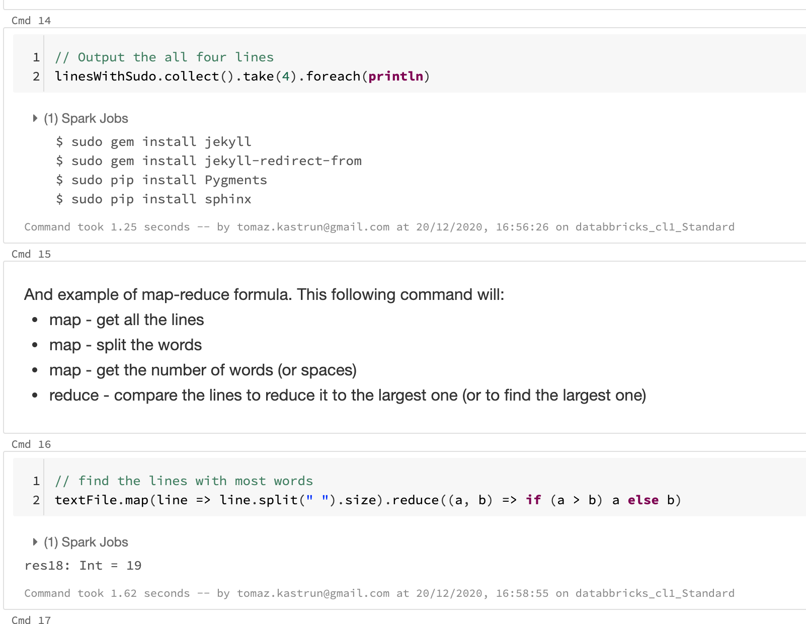

<!-- wp:paragraph -->
## 2. Create a dataset
<!-- /wp:paragraph -->

<!-- wp:paragraph -->

Now let's create a dataset (remember the difference between <em>Dataset</em> and <em>DataFrame</em>) and load some data from <em>/databricks-datasets </em>folder.

<!-- /wp:paragraph -->

<!-- wp:syntaxhighlighter/code -->
<pre class="wp-block-syntaxhighlighter-code">val df = spark.read.json("/databricks-datasets/samples/people/people.json")</pre>
<!-- /wp:syntaxhighlighter/code -->

<!-- wp:paragraph -->
## 3. Convert Dataset to DataFrame
<!-- /wp:paragraph -->

<!-- wp:paragraph -->

We can also convert Dataset to DataFrame for easier operation and usage. We must define a class that represents a type-specific Scala JVM object (like a schema) and now repeat the same process with definition.

<!-- /wp:paragraph -->

<!-- wp:syntaxhighlighter/code -->
<pre class="wp-block-syntaxhighlighter-code">case class Person (name: String, age: Long)
val ds = spark.read.json("/databricks-datasets/samples/people/people.json").as[Person]</pre>
<!-- /wp:syntaxhighlighter/code -->

<!-- wp:paragraph -->

We can also create and define another dataset, taken from the /databricks-datasets  folder that is in JSON (flattened) format:

<!-- /wp:paragraph -->

<!-- wp:syntaxhighlighter/code -->
<pre class="wp-block-syntaxhighlighter-code">// define a case class that represents the device data.
case class DeviceIoTData (
  battery_level: Long,
  c02_level: Long,
  cca2: String,
  cca3: String,
  cn: String,
  device_id: Long,
  device_name: String,
  humidity: Long,
  ip: String,
  latitude: Double,
  longitude: Double,
  scale: String,
  temp: Long,
  timestamp: Long
)

val ds = spark.read.json("/databricks-datasets/iot/iot_devices.json").as[DeviceIoTData]</pre>
<!-- /wp:syntaxhighlighter/code -->

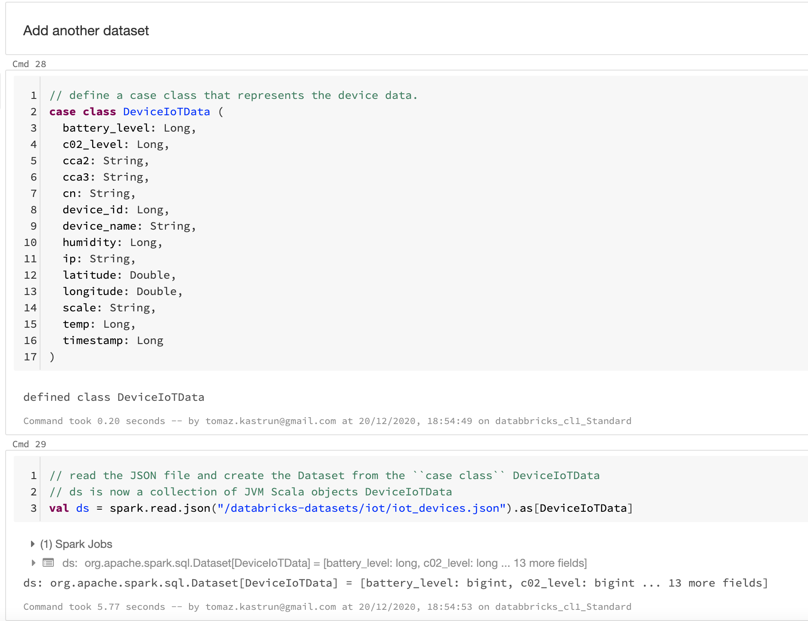

<!-- wp:paragraph -->

and run show() function to see the imported Dataset from JSON file:

<!-- /wp:paragraph -->

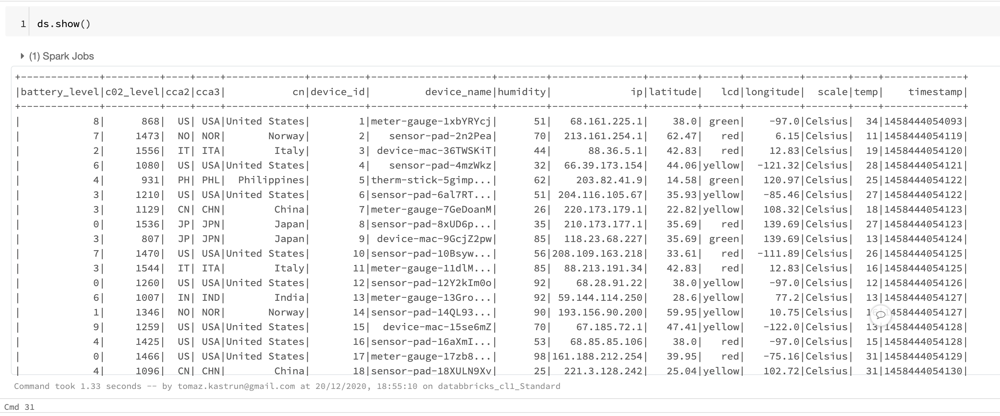

<!-- wp:paragraph -->

Now let's play with the dataset using Scala Dataset API with following frequently used functions:

<!-- /wp:paragraph -->

<!-- wp:list -->
<ul><li>display(),</li><li>describe(),</li><li>sum(),</li><li>count(),</li><li>select(),</li><li>avg(),</li><li>filter(),</li><li>map() or where(),</li><li>groupBy(),</li><li>join(), and</li><li>union().</li></ul>
<!-- /wp:list -->

<!-- wp:paragraph {"fontSize":"medium"} -->
### display()
<!-- /wp:paragraph -->

<!-- wp:paragraph -->

You can also view the dataset using display() (similar to .show() function):

<!-- /wp:paragraph -->

<!-- wp:syntaxhighlighter/code -->
<pre class="wp-block-syntaxhighlighter-code">display(ds)</pre>
<!-- /wp:syntaxhighlighter/code -->

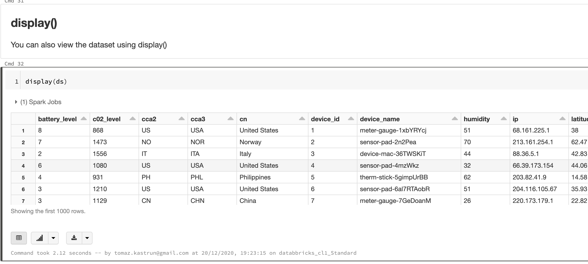

<!-- wp:paragraph {"fontSize":"medium"} -->
### describe()
<!-- /wp:paragraph -->

<!-- wp:paragraph -->

Describe() function is great for exploring the data and the structure of the data:

<!-- /wp:paragraph -->

<!-- wp:syntaxhighlighter/code -->
<pre class="wp-block-syntaxhighlighter-code">ds.describe()</pre>
<!-- /wp:syntaxhighlighter/code -->

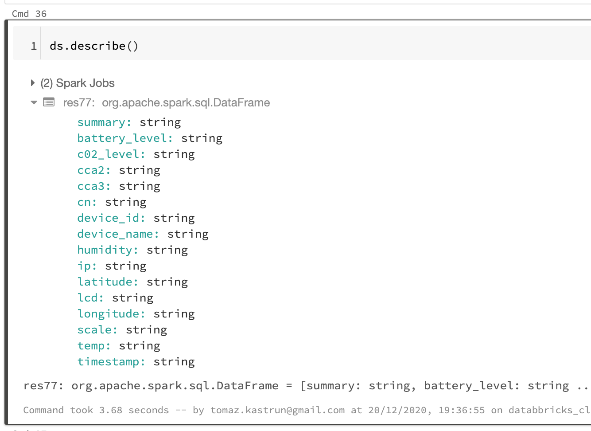

<!-- wp:paragraph -->

or for getting descriptive statistics of the Dataset or of particular column:

<!-- /wp:paragraph -->

<!-- wp:syntaxhighlighter/code -->
<pre class="wp-block-syntaxhighlighter-code">display(ds.describe())
// or for column
display(ds.describe("c02_level"))</pre>
<!-- /wp:syntaxhighlighter/code -->

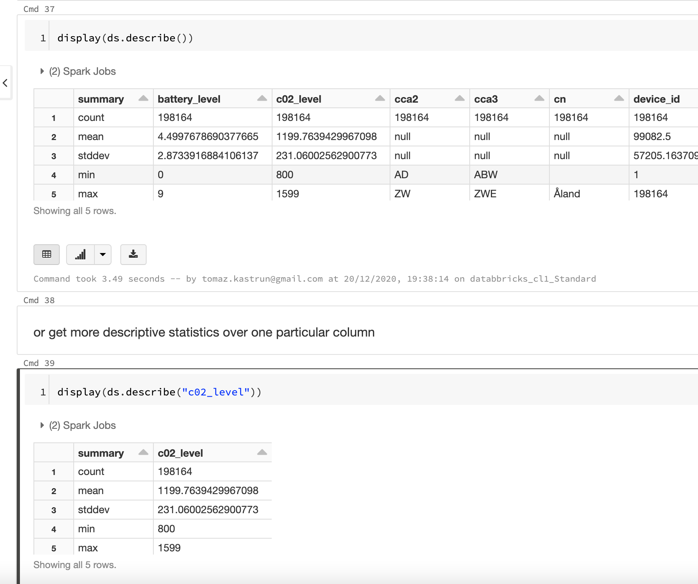

<!-- wp:paragraph {"fontSize":"medium"} -->
### sum()
<!-- /wp:paragraph -->

<!-- wp:paragraph -->

Let's sum all c02_level values:

<!-- /wp:paragraph -->

<!-- wp:syntaxhighlighter/code -->
<pre class="wp-block-syntaxhighlighter-code">//create a variable sum_c02_1 and sum_c02_2; 
// both are correct and return same results

val sum_c02_1 = ds.select("c02_level").groupBy().sum()
val sum_c02_2 = ds.groupBy().sum("c02_level")

display(sum_c02_1)</pre>
<!-- /wp:syntaxhighlighter/code -->

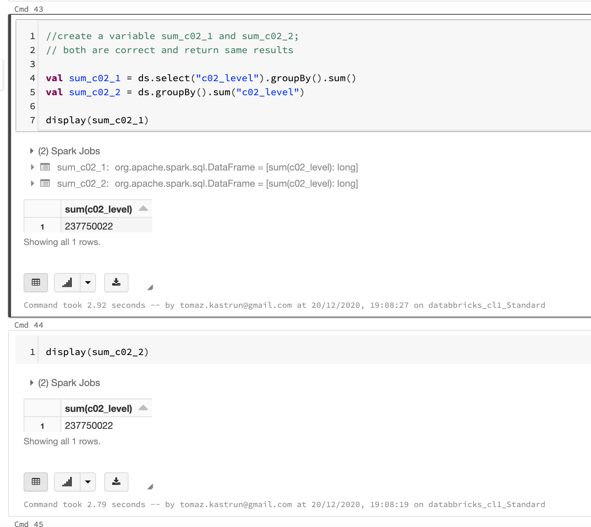

<!-- wp:paragraph -->

And we can also double check the result of this sum  with SQL. Just because it is fun. But first We need to create a SQL view (or it could be a table) from this dataset.

<!-- /wp:paragraph -->

<!-- wp:syntaxhighlighter/code -->
<pre class="wp-block-syntaxhighlighter-code">ds.createOrReplaceTempView("SQL_iot_table")</pre>
<!-- /wp:syntaxhighlighter/code -->

<!-- wp:paragraph -->

And then define cell as SQL statement, using <strong>%sql</strong>. Remember, complete code today is written in Scala, unless otherwise stated with <em>%{lang}</em> and the beginning. 

<!-- /wp:paragraph -->

<!-- wp:syntaxhighlighter/code -->
<pre class="wp-block-syntaxhighlighter-code">%sql
SELECT sum(c02_level) as Total_c02_level FROM SQL_iot_table</pre>
<!-- /wp:syntaxhighlighter/code -->

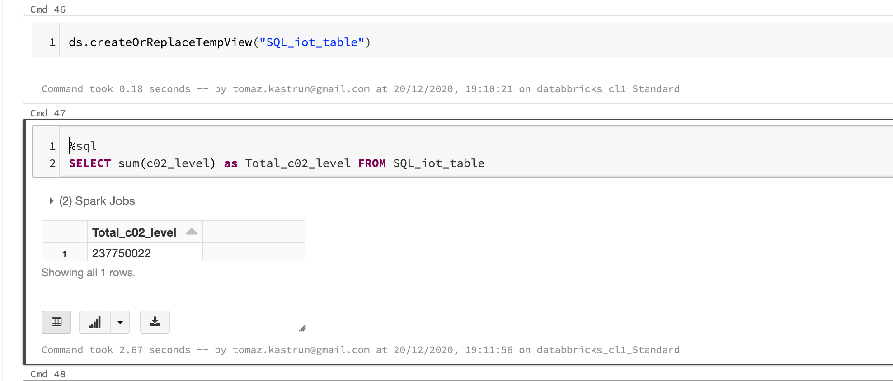

<!-- wp:paragraph -->

And for sure, we get the same result (!).

<!-- /wp:paragraph -->

<!-- wp:paragraph {"fontSize":"medium"} -->
### select()
<!-- /wp:paragraph -->

<!-- wp:paragraph -->

Select() function will let you show only the columns you want to see.

<!-- /wp:paragraph -->

<!-- wp:syntaxhighlighter/code -->
<pre class="wp-block-syntaxhighlighter-code">// Both will return same results
ds.select("cca2","cca3", "c02_level").show()
// or
display(ds.select("cca2","cca3","c02_level"))</pre>
<!-- /wp:syntaxhighlighter/code -->

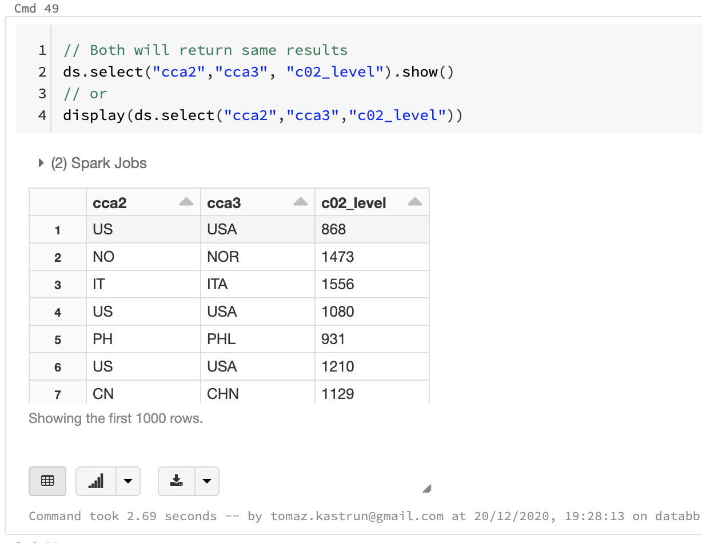

<!-- wp:paragraph {"fontSize":"medium"} -->
### avg()
<!-- /wp:paragraph -->

<!-- wp:paragraph -->

Avg() function will let you aggregate a column (let us take: c02_level) over another column (let us take: countries in variable cca3). First we want to calculate average value over the complete dataset:

<!-- /wp:paragraph -->

<!-- wp:syntaxhighlighter/code -->
<pre class="wp-block-syntaxhighlighter-code">val avg_c02 = ds.groupBy().avg("c02_level")

display(avg_c02)</pre>
<!-- /wp:syntaxhighlighter/code -->

<!-- wp:paragraph -->

And then also the average value for each country:

<!-- /wp:paragraph -->

<!-- wp:syntaxhighlighter/code -->
<pre class="wp-block-syntaxhighlighter-code">val avg_c02_byCountry = ds.groupBy("cca3").avg("c02_level")

display(avg_c02_byCountry)</pre>
<!-- /wp:syntaxhighlighter/code -->

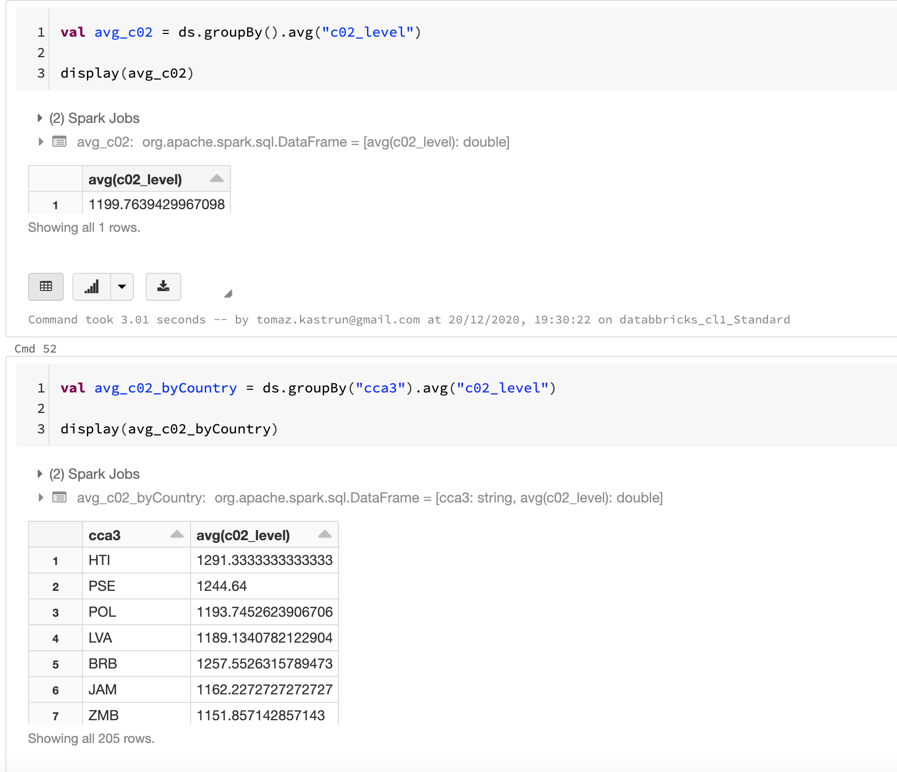

<!-- wp:paragraph {"fontSize":"medium"} -->
### filter()
<!-- /wp:paragraph -->

<!-- wp:paragraph -->

Filter() function will shorten or filter out the values that will not comply with the condition. Filter() function can also be replaced by where() function; they both have similar behaviour.

<!-- /wp:paragraph -->

<!-- wp:paragraph -->

Following command will return dataset that meet the condition where batter_level is greater than 7.

<!-- /wp:paragraph -->

<!-- wp:syntaxhighlighter/code -->
<pre class="wp-block-syntaxhighlighter-code">display(ds.filter(d => d.battery_level > 7)) </pre>
<!-- /wp:syntaxhighlighter/code -->

<!-- wp:paragraph -->

And the following command will filter the database on same condition, but only return the specify columns (in comparison with previous command which returned all columns):

<!-- /wp:paragraph -->

<!-- wp:syntaxhighlighter/code -->
<pre class="wp-block-syntaxhighlighter-code">display(ds.filter(d => d.battery_level > 7).select("battery_level", "c02_level", "cca3")) </pre>
<!-- /wp:syntaxhighlighter/code -->

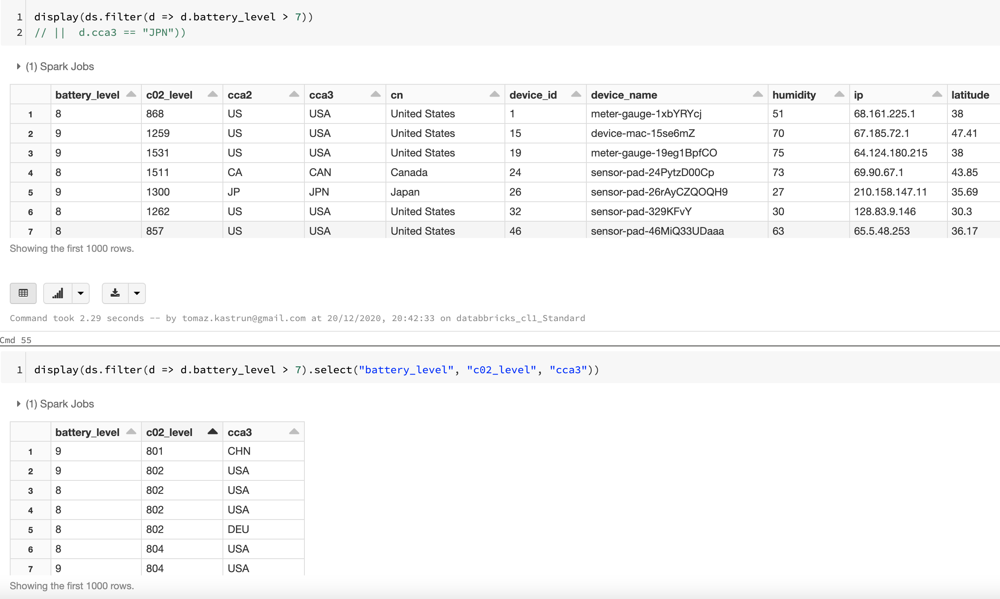

<!-- wp:paragraph {"fontSize":"medium"} -->
### groupBy()
<!-- /wp:paragraph -->

<!-- wp:paragraph -->

Adding aggregation to filtered data (<strong>avg()</strong> function) and grouping dataset based on cca3 variable:

<!-- /wp:paragraph -->

<!-- wp:syntaxhighlighter/code -->
<pre class="wp-block-syntaxhighlighter-code">display(ds.filter(d => d.battery_level > 7).select("c02_level", "cca3").groupBy("cca3").avg("c02_level"))</pre>
<!-- /wp:syntaxhighlighter/code -->

<!-- wp:paragraph -->

Note that there is explicit definition of internal subset in filter function. Part where "<em>d => d.battery_level>7</em>" is creating a separate subset of data that can also be used with map() function, as part of map-reduce Hadoop function.

<!-- /wp:paragraph -->

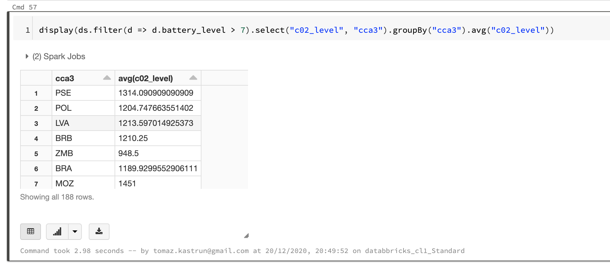

<!-- wp:paragraph {"fontSize":"medium"} -->
### join()
<!-- /wp:paragraph -->

<!-- wp:paragraph -->

Join() function will combine two objects. So let us create two simple DataFrames and create a join between them.

<!-- /wp:paragraph -->

<!-- wp:syntaxhighlighter/code -->
<pre class="wp-block-syntaxhighlighter-code">val df_1 = Seq((0, "Tom"), (1, "Jones")).toDF("id", "first")
val df_2 = Seq((0, "Tom"), (2, "Jones"), (3, "Martin")).toDF("id", "second")</pre>
<!-- /wp:syntaxhighlighter/code -->

<!-- wp:paragraph -->

Using function <em>Seq()</em> to create a sequence and <em>toDF()</em> to save it as DataFrame.

<!-- /wp:paragraph -->

<!-- wp:paragraph -->

To join two DataFrames, we use 

<!-- /wp:paragraph -->

<!-- wp:syntaxhighlighter/code -->
<pre class="wp-block-syntaxhighlighter-code">display(df_1.join(df_2, "id"))</pre>
<!-- /wp:syntaxhighlighter/code -->

<!-- wp:paragraph -->

Name of the first DataFrame - <em>df_1</em> (on left-hand side) joined by second DataFrame - <em>df_2</em> (on the right-hand side) by a column <em>"id"</em>.

<!-- /wp:paragraph -->

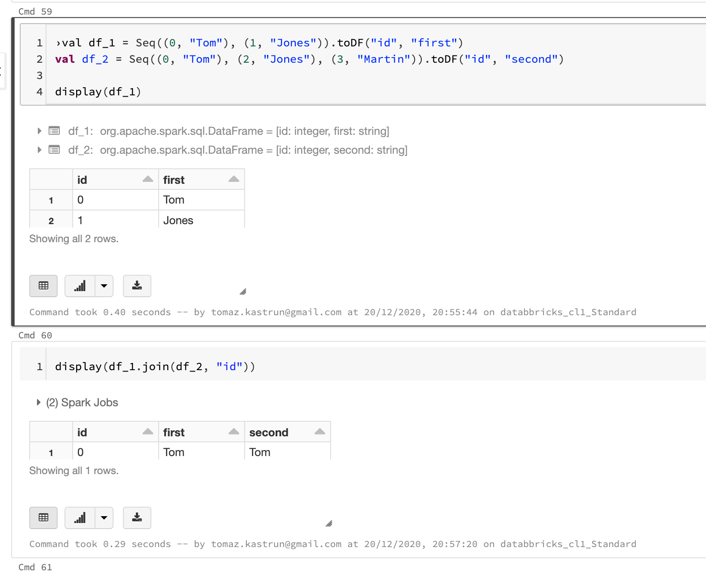

<!-- wp:paragraph -->

Join() implies inner.join and returns all the rows where there is a complete match. If interested, you can also explore the execution plan of this join by adding <em>explain</em> at the end of command:

<!-- /wp:paragraph -->

<!-- wp:syntaxhighlighter/code -->
<pre class="wp-block-syntaxhighlighter-code">df_1.join(df_2, "id").explain</pre>
<!-- /wp:syntaxhighlighter/code -->

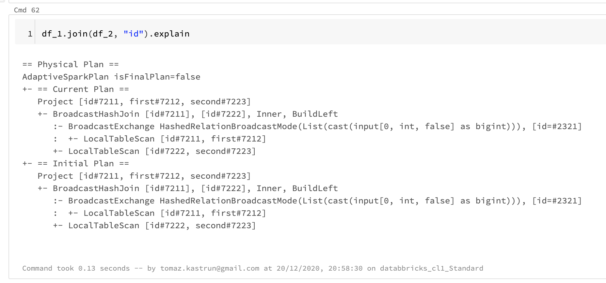

<!-- wp:paragraph -->

and also create left/right join or any other semi-, anti-, cross-  join.

<!-- /wp:paragraph -->

<!-- wp:syntaxhighlighter/code -->
<pre class="wp-block-syntaxhighlighter-code">df_1.join(df_2, Seq("id"), "LeftOuter").show
df_1.join(df_2, Seq("id"), "RightOuter").show</pre>
<!-- /wp:syntaxhighlighter/code -->

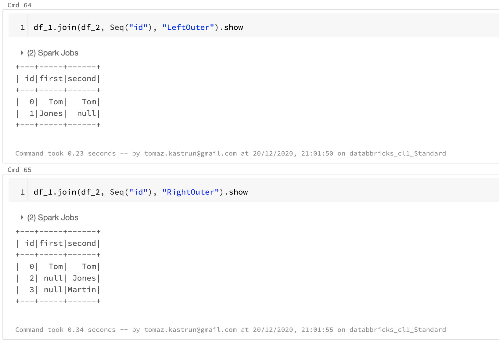

<!-- wp:paragraph {"fontSize":"medium"} -->
### union()
<!-- /wp:paragraph -->

<!-- wp:paragraph -->

To append two datasets (or DataFrames), union() function can be used. 

<!-- /wp:paragraph -->

<!-- wp:syntaxhighlighter/code -->
<pre class="wp-block-syntaxhighlighter-code"> val df3 = df_1.union(df_2)
 
display(df3) 
// df3.show(true)</pre>
<!-- /wp:syntaxhighlighter/code -->

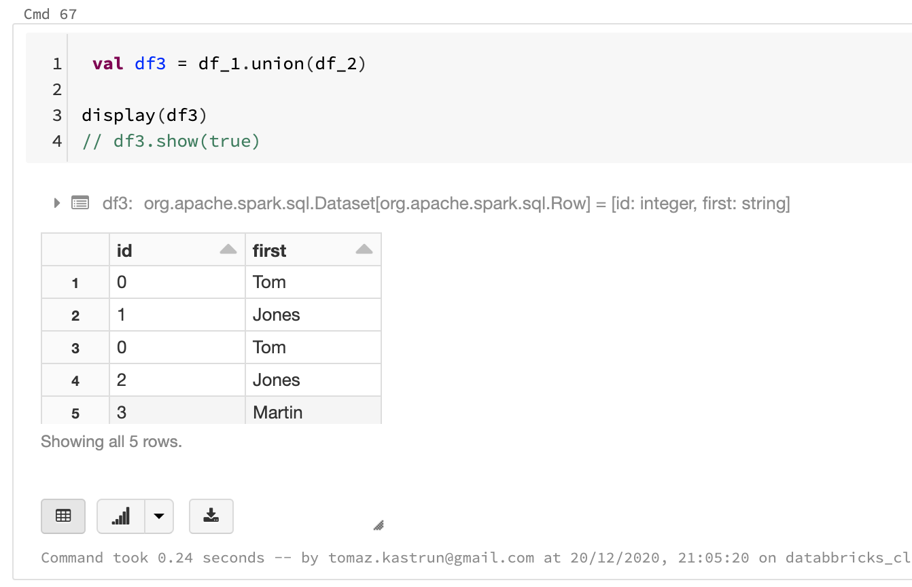

<!-- wp:paragraph {"fontSize":"medium"} -->

<strong>distinct()</strong>

<!-- /wp:paragraph -->

<!-- wp:paragraph -->

Distinct() function will return only the unique values, and it can also be used with union() function to achieve <em>union all</em> type of behaviour:

<!-- /wp:paragraph -->

<!-- wp:syntaxhighlighter/code -->
<pre class="wp-block-syntaxhighlighter-code">display(df3.distinct())</pre>
<!-- /wp:syntaxhighlighter/code -->

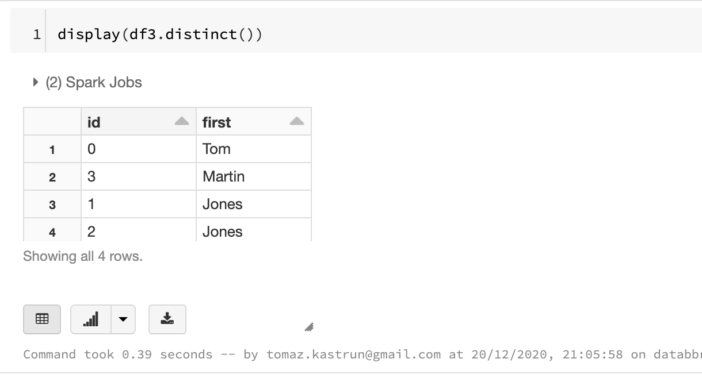

<!-- wp:paragraph -->

Tomorrow we will Spark SQL and DataFrames with  Spark  Core API  in Azure Databricks. Todays' post was little bit longer, but it is important to get a good understanding on Spark API, get your hands wrapped around Scala and start working with Azure Databricks.

<!-- /wp:paragraph -->

<!-- wp:paragraph -->

Complete set of code and Scala notebooks (including HTML)  will be available at the<a rel="noreferrer noopener" href="https://github.com/tomaztk/Azure-Databricks" target="_blank"> Github repository</a>.

<!-- /wp:paragraph -->

<!-- wp:paragraph -->

Happy Coding and Stay Healthy!

<!-- /wp:paragraph -->
