<!-- README.md was wriiten in beautiful MacDown  -->
# Dec 22 2020 - Using Spark SQL and DataFrames in Azure Databricks

<!-- badges: start -->

<!-- badges: end -->

Azure Databricks repository is 
a set of blogposts as a Advent of 2020 present to readers for easier onboarding
to Azure Databricks! 

<!-- wp:paragraph -->

Series of Azure Databricks posts:

<!-- /wp:paragraph -->

<!-- wp:list -->
<ul><li>Dec 01: <a rel="noreferrer noopener" href="https://tomaztsql.wordpress.com/2020/12/01/advent-of-2020-day-1-what-is-azure-databricks/" target="_blank">What is Azure Databricks</a></li><li>Dec 02: <a rel="noreferrer noopener" href="https://tomaztsql.wordpress.com/2020/12/02/advent-of-2020-day-2-how-to-get-started-with-azure-databricks/" target="_blank">How to get started with Azure Databricks</a></li><li>Dec 03: <a href="https://tomaztsql.wordpress.com/2020/12/03/advent-of-2020-day-3-getting-to-know-the-workspace-and-azure-databricks-platform/" target="_blank" rel="noreferrer noopener">Getting to know the workspace and Azure Databricks platform</a></li>
<li>Dec 04: <a href="https://tomaztsql.wordpress.com/2020/12/04/advent-of-2020-day-4-creating-your-first-azure-databricks-cluster/" target="_blank" rel="noreferrer noopener">Creating your first Azure Databricks cluster</a></li>
<li>Dec 05: <a href="https://tomaztsql.wordpress.com/2020/12/05/advent-of-2020-day-5-understanding-azure-databricks-cluster-architecture-workers-drivers-and-jobs/" target="_blank" rel="noreferrer noopener">Understanding Azure Databricks cluster architecture, workers, drivers and jobs</a></li>
<li>Dec 06: <a href="https://tomaztsql.wordpress.com/2020/12/06/advent-of-2020-day-6-importing-and-storing-data-to-azure-databricks/" target="_blank" rel="noreferrer noopener">Importing and storing data to Azure Databricks</a></li>
<li>Dec 07: <a href="https://tomaztsql.wordpress.com/2020/12/07/advent-of-2020-day-7-starting-with-databricks-notebooks-and-loading-data-to-dbfs/" target="_blank" rel="noreferrer noopener">Starting with Databricks notebooks and loading data to DBFS</a></li>
<li>Dec 08: <a href="https://tomaztsql.wordpress.com/2020/12/08/advent-of-2020-day-8-using-databricks-cli-and-dbfs-cli-for-file-upload/" target="_blank" rel="noreferrer noopener"> Using Databricks CLI and DBFS CLI for file upload</a></li>
<li>Dec 09: <a href="https://tomaztsql.wordpress.com/2020/12/09/advent-of-2020-day-9-connect-to-azure-blob-storage-using-notebooks-in-azure-databricks/" target="_blank" rel="noreferrer noopener">Connect to Azure Blob storage using Notebooks in  Azure Databricks</a></li>
<li>Dec 10: <a href="https://tomaztsql.wordpress.com/2020/12/10/advent-of-2020-day-10-using-azure-databricks-notebooks-with-sql-for-data-engineering-tasks/" target="_blank" rel="noreferrer noopener">Using Azure Databricks Notebooks with SQL for Data engineering tasks</a></li>
<li>Dec 11: <a href="https://tomaztsql.wordpress.com/2020/12/11/advent-of-2020-day-11-using-azure-databricks-notebooks-with-r-language-for-data-analytics/" target="_blank" rel="noreferrer noopener">Using Azure Databricks Notebooks with R Language for data analytics</a></li>
<li>Dec 12: <a href="https://tomaztsql.wordpress.com/2020/12/12/advent-of-2020-day-12-using-azure-databricks-notebooks-with-python-language-for-data-analytics/" target="_blank" rel="noreferrer noopener">Using Azure Databricks Notebooks with Python Language for data analytics</a></li>
<li>Dec 13: <a href="https://tomaztsql.wordpress.com/2020/12/13/adventof-2020-day-13-using-python-databricks-koalas-with-azure-databricks/" target="_blank" rel="noreferrer noopener">Using Python Databricks Koalas with Azure Databricks</a></li>
<li>Dec 14: <a href="https://tomaztsql.wordpress.com/2020/12/14/advent-of-2020-day-14-from-configuration-to-execution-of-databricks-jobs/" target="_blank" rel="noreferrer noopener">From configuration to execution of Databricks jobs</a></li>
<li>Dec 15: <a href="https://tomaztsql.wordpress.com/2020/12/15/advent-of-2020-day-15-databricks-spark-ui-event-logs-driver-logs-and-metrics/" target="_blank" rel="noreferrer noopener">Databricks Spark UI, Event Logs, Driver logs and Metrics</a></li>
<li>Dec 16: <a href="https://tomaztsql.wordpress.com/2020/12/16/advent-of-2020-day-16-databricks-experiments-models-and-mlflow/" target="_blank" rel="noreferrer noopener">Databricks experiments, models and MLFlow</a></li>
<li>Dec 17: <a href="https://tomaztsql.wordpress.com/2020/12/17/advent-of-2020-day-17-end-to-end-machine-learning-project-in-azure-databricks/" target="_blank" rel="noreferrer noopener">End-to-End Machine learning project in Azure Databricks</a></li>
<li>Dec 18: <a href="https://tomaztsql.wordpress.com/2020/12/18/advent-of-2020-day-18-using-azure-data-factory-with-azure-databricks/" target="_blank" rel="noreferrer noopener">Using Azure Data Factory with Azure Databricks</a></li>
<li>Dec 19: <a href="https://tomaztsql.wordpress.com/2020/12/19/advent-of-2020-day-19-using-azure-data-factory-with-azure-databricks-for-merging-csv-files/" target="_blank" rel="noreferrer noopener">Using Azure Data Factory with Azure Databricks for merging CSV files</a></li>
<li>Dec 20: <a href="https://tomaztsql.wordpress.com/2020/12/20/advent-of-2020-day-20-orchestrating-multiple-notebooks-with-azure-databricks/" target="_blank" rel="noreferrer noopener">Orchestrating multiple notebooks with Azure Databricks</a></li>

<li>Dec 21: <a href="https://tomaztsql.wordpress.com/2020/12/21/advent-of-2020-day-21-using-scala-with-spark-core-api-in-azure-databricks/" target="_blank" rel="noreferrer noopener">Using Scala with Spark Core API in Azure Databricks</a></li>

</ul>
<!-- /wp:list -->

<!-- wp:paragraph -->

Yesterday we took a closer look into Spark Scala with notebooks in Azure Databricks and how to handle data engineering. Today we will look into the Spark SQL and DataFrames that is using Spark Core API.

<!-- /wp:paragraph -->

<!-- wp:paragraph -->

"Spark SQL is a spark module for structured data processing and data querying. It provides programming abstraction called DataFrames and can also serve as distributed SQL query engine. It enables unmodified Hadoop Hive queries to run up to 100x faster on existing deployments and data. It also provides powerful integration with the rest of the Spark ecosystem (e.g.: integrating SQL query processing with machine learning)." (Apache Spark Tutorial).

<!-- /wp:paragraph -->

<!-- wp:paragraph -->

Start your Azure Databricks workspace and create new Notebook. I named mine as: <em>Day22_SparkSQL</em> and set the language: <em>SQL</em>. Now let's explore the functionalities of Spark SQL.

<!-- /wp:paragraph -->

<!-- wp:paragraph -->

<strong>1.Loading Data</strong>

<!-- /wp:paragraph -->

<!-- wp:paragraph -->

We will load data from <em>/databricks-datasets</em> using Spark SQL, R and Python languages. The CSV dataset will be <strong>data_geo.csv</strong>  in the following folder:

<!-- /wp:paragraph -->

<!-- wp:syntaxhighlighter/code -->
<pre class="wp-block-syntaxhighlighter-code">%scala
display(dbutils.fs.ls("/databricks-datasets/samples/population-vs-price"))</pre>
<!-- /wp:syntaxhighlighter/code -->

<!-- wp:paragraph -->

<strong>1.1. Loading using Python</strong>

<!-- /wp:paragraph -->

<!-- wp:syntaxhighlighter/code -->
<pre class="wp-block-syntaxhighlighter-code">%python
data = spark.read.csv("/databricks-datasets/samples/population-vs-price/data_geo.csv", header="true", inferSchema="true")</pre>
<!-- /wp:syntaxhighlighter/code -->

<!-- wp:paragraph -->

And materialize the data using to create a view with name <em>data_geo_py</em>:

<!-- /wp:paragraph -->

<!-- wp:syntaxhighlighter/code -->
<pre class="wp-block-syntaxhighlighter-code">%python
data.createOrReplaceTempView("data_geo_py")</pre>
<!-- /wp:syntaxhighlighter/code -->

<!-- wp:paragraph -->

And run the following SQL Statement:

<!-- /wp:paragraph -->

<!-- wp:syntaxhighlighter/code -->
<pre class="wp-block-syntaxhighlighter-code">SELECT * FROM data_geo_py LIMIT 10</pre>
<!-- /wp:syntaxhighlighter/code -->

<!-- wp:paragraph -->

<strong>1.2. Loading using SQL</strong>

<!-- /wp:paragraph -->

<!-- wp:syntaxhighlighter/code -->
<pre class="wp-block-syntaxhighlighter-code">DROP TABLE IF EXISTS data_geo;

CREATE TABLE data_geo
USING com.databricks.spark.csv
OPTIONS (path "/databricks-datasets/samples/population-vs-price/data_geo.csv", header "true", inferSchema "true")</pre>
<!-- /wp:syntaxhighlighter/code -->

<!-- wp:paragraph -->

And run the following SQL Statement:

<!-- /wp:paragraph -->

<!-- wp:syntaxhighlighter/code -->
<pre class="wp-block-syntaxhighlighter-code">SELECT * FROM data_geo LIMIT 10</pre>
<!-- /wp:syntaxhighlighter/code -->

<!-- wp:paragraph -->

<strong>1.3. Loading using R</strong>

<!-- /wp:paragraph -->

<!-- wp:syntaxhighlighter/code -->
<pre class="wp-block-syntaxhighlighter-code">%r 
library(SparkR)
data_geo_r &lt;- read.df("/databricks-datasets/samples/population-vs-price/data_geo.csv", source = "csv", header="true", inferSchema = "true")
registerTempTable(data_geo_r, "data_geo_r")</pre>
<!-- /wp:syntaxhighlighter/code -->

<!-- wp:paragraph -->

Cache the results:

<!-- /wp:paragraph -->

<!-- wp:syntaxhighlighter/code -->
<pre class="wp-block-syntaxhighlighter-code">CACHE TABLE data_geo_r</pre>
<!-- /wp:syntaxhighlighter/code -->

<!-- wp:paragraph -->

And run the following SQL Statement:

<!-- /wp:paragraph -->

<!-- wp:syntaxhighlighter/code -->
<pre class="wp-block-syntaxhighlighter-code">SELECT * FROM data_geo_r LIMIT 10</pre>
<!-- /wp:syntaxhighlighter/code -->

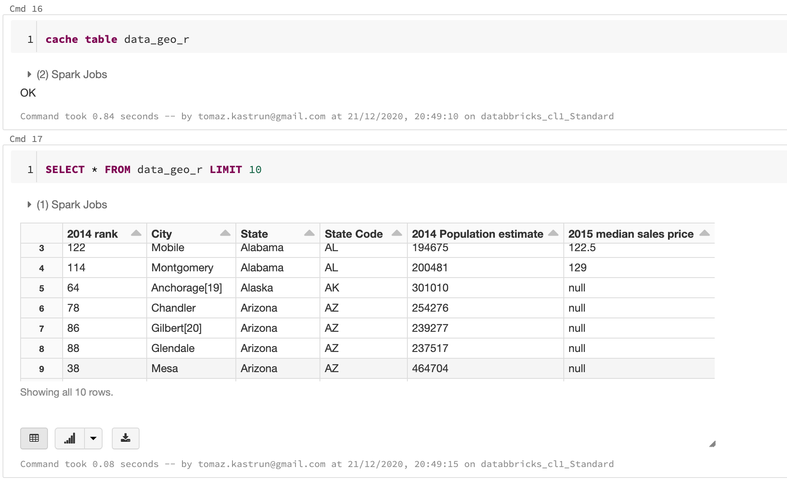

<!-- wp:paragraph -->

All three DataFrames are the same (unless additional modification are done; like: dropping rows with null values, etc). 

<!-- /wp:paragraph -->

<!-- wp:paragraph -->

<strong>2.Viewing DataFrame</strong>

<!-- /wp:paragraph -->

<!-- wp:paragraph -->

Viewing DataFrame is done by simple SELECT statement, the ANSI SQL Standard. E.g.:

<!-- /wp:paragraph -->

<!-- wp:syntaxhighlighter/code -->
<pre class="wp-block-syntaxhighlighter-code">SELECT City
,`2014 Population estimate` 
,`2015 median sales price`
,`State Code` AS State_Code
FROM data_geo 
WHERE `State Code` = 'AZ';</pre>
<!-- /wp:syntaxhighlighter/code -->

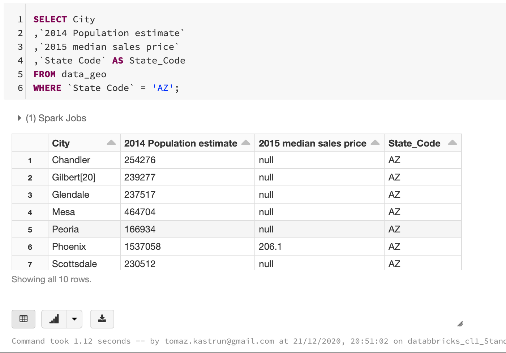

<!-- wp:paragraph -->

You can also combine all three DataFrames that were imported using three different languages (SQL, R, Python).

<!-- /wp:paragraph -->

<!-- wp:syntaxhighlighter/code -->
<pre class="wp-block-syntaxhighlighter-code">SELECT *, 'data_geo_SQL' AS dataset  FROM data_geo
UNION
SELECT *, 'data_geo_Python' AS dataset  FROM data_geo_py
UNION 
SELECT *, 'data_geo_R' AS dataset FROM data_geo_r
ORDER BY `2014 rank`, dataset
LIMIT 12</pre>
<!-- /wp:syntaxhighlighter/code -->

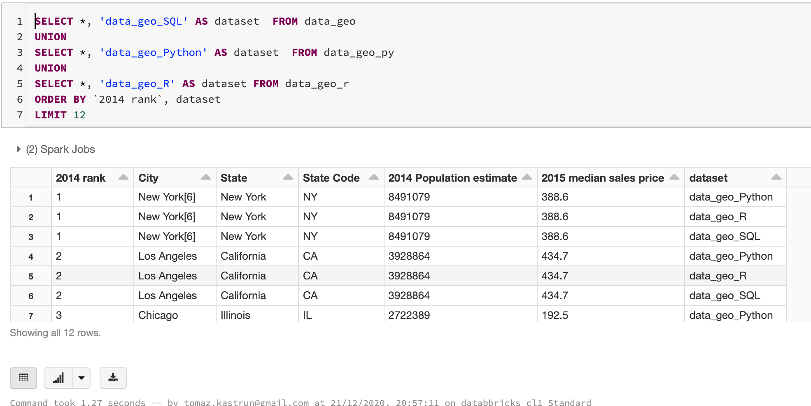

<!-- wp:paragraph -->

<strong>3.Running SQL </strong>

<!-- /wp:paragraph -->

<!-- wp:paragraph -->

<strong>3.1. Date and Time functions</strong>

<!-- /wp:paragraph -->

<!-- wp:syntaxhighlighter/code -->
<pre class="wp-block-syntaxhighlighter-code">SELECT
 CURRENT_TIMESTAMP() AS now
,date_format(CURRENT_TIMESTAMP(), "L") AS Month_
,date_format(CURRENT_TIMESTAMP(), "LL") AS Month_LeadingZero
,date_format(CURRENT_TIMESTAMP(), "y") AS Year_
,date_format(CURRENT_TIMESTAMP(), "d") AS Day_
,date_format(CURRENT_TIMESTAMP(), "E") AS DayOFTheWeek
,date_format(CURRENT_TIMESTAMP(), "H") AS Hour
,date_format(CURRENT_TIMESTAMP(), "m") AS Minute
,date_format(CURRENT_TIMESTAMP(), "s") AS Second</pre>
<!-- /wp:syntaxhighlighter/code -->

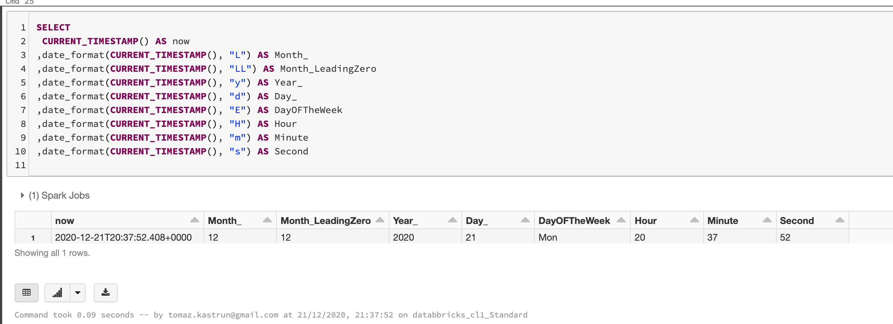

<!-- wp:paragraph -->

<strong>3.2. Built-in functions</strong>

<!-- /wp:paragraph -->

<!-- wp:syntaxhighlighter/code -->
<pre class="wp-block-syntaxhighlighter-code">SELECT 
 COUNT(*) AS Nof_rows
,SUM(`2014 rank`) AS Sum_Rank
,AVG(`2014 rank`) AS Avg_Rank
,SUM(CASE WHEN `2014 rank` > 150 THEN 1 ELSE -1 END) AS Sum_case
,STD(`2014 rank`) as stdev
,MAX(`2014 rank`) AS Max_Val
,MIN(`2014 rank`) AS Min_Val
,KURTOSIS (`2014 rank`) as Kurt
,SKEWNESS(`2014 rank`) AS Skew
,CAST(SKEWNESS(`2014 rank`) AS INT) AS Skew_cast
 FROM data_geo</pre>
<!-- /wp:syntaxhighlighter/code -->

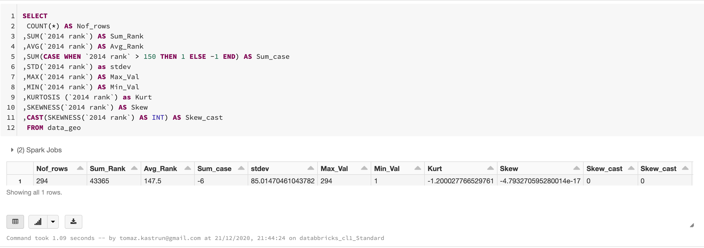

<!-- wp:paragraph -->

<strong>3.3. SELECT INTO </strong>

<!-- /wp:paragraph -->

<!-- wp:paragraph -->

You can also store results using SELECT INTO statement, with table being predifined:

<!-- /wp:paragraph -->

<!-- wp:syntaxhighlighter/code -->
<pre class="wp-block-syntaxhighlighter-code">DROP TABLE IF EXISTS tmp_data_geo;
CREATE TABLE tmp_data_geo (`2014 rank` INT, State VARCHAR(64), `State Code` VARCHAR(2));

INSERT INTO tmp_data_geo
     FROM data_geo SELECT 
                  `2014 rank`
                  ,State
                  ,`State Code`
WHERE   `2014 rank` >= 50 AND `2014 rank` &lt; 60 AND `State Code` = "C";

SELECT * FROM tmp_data_geo;</pre>
<!-- /wp:syntaxhighlighter/code -->

<!-- wp:paragraph -->

<strong>3.4. JOIN </strong>

<!-- /wp:paragraph -->

<!-- wp:syntaxhighlighter/code -->
<pre class="wp-block-syntaxhighlighter-code">SELECT 
  dg1.`State Code`
 ,dg1.`2014 rank`
 ,dg2.`State Code`
 ,dg2.`2014 rank`
FROM data_geo AS dg1
JOIN data_geo AS dg2
ON dg1.`2014 rank` = dg2.`2014 rank`+1
AND dg1.`State Code` = dg2.`State Code`
WHERE dg1.`State Code` = "CA"</pre>
<!-- /wp:syntaxhighlighter/code -->

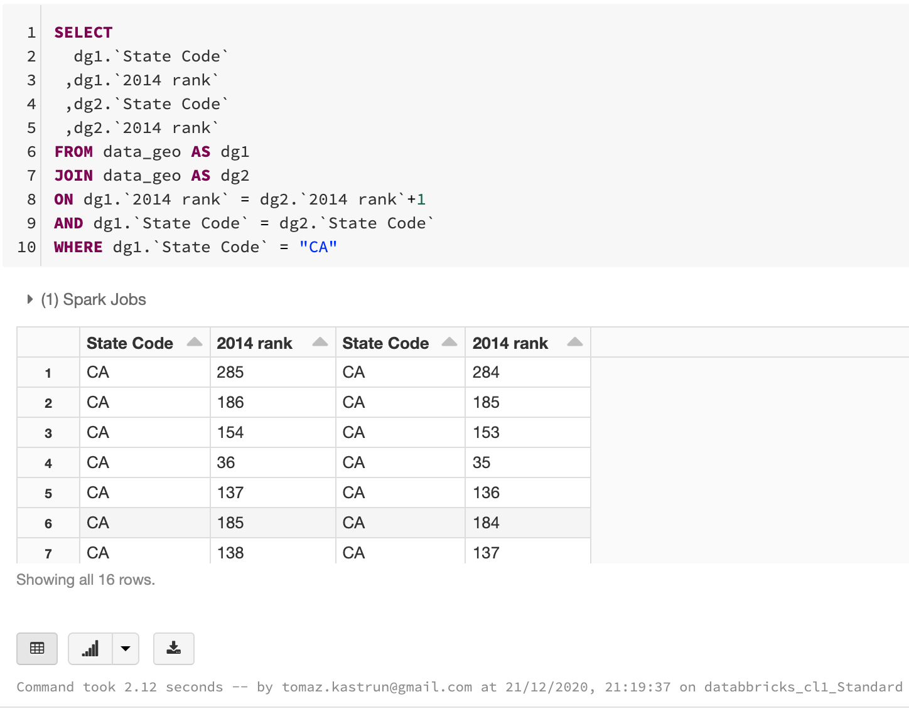

<!-- wp:paragraph -->

<strong>3.5. Common Table Expressions</strong>

<!-- /wp:paragraph -->

<!-- wp:syntaxhighlighter/code -->
<pre class="wp-block-syntaxhighlighter-code">WITH cte AS (
    SELECT * FROM data_geo 
    WHERE `2014 rank` >= 50 AND `2014 rank` &lt; 60
)
SELECT * FROM cte;</pre>
<!-- /wp:syntaxhighlighter/code -->

<!-- wp:paragraph -->

<strong>3.6.  Inline tables </strong>

<!-- /wp:paragraph -->

<!-- wp:syntaxhighlighter/code -->
<pre class="wp-block-syntaxhighlighter-code">SELECT * FROM  VALUES 
("WA", "Seattle"), 
("WA", "Tacoma"), 
("WA", "Spokane") AS data(StateName, CityName)</pre>
<!-- /wp:syntaxhighlighter/code -->

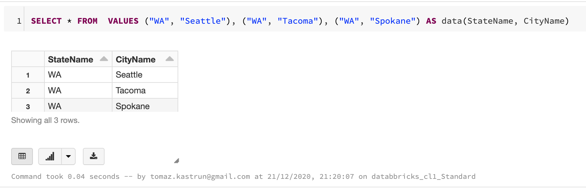

<!-- wp:paragraph -->

<strong>3.7. EXISTS</strong>

<!-- /wp:paragraph -->

<!-- wp:syntaxhighlighter/code -->
<pre class="wp-block-syntaxhighlighter-code">WITH cte AS (
    SELECT * FROM data_geo 
    WHERE `2014 rank` >= 50 AND `2014 rank` &lt; 60
)
SELECT * 
FROM data_geo as dg
WHERE
  EXISTS (SELECT * FROM cte WHERE cte.city = dg.city)
AND NOT EXISTS (SELECT * FROM cte WHERE cte.city = dg.city AND `2015 median sales price` IS NULL )</pre>
<!-- /wp:syntaxhighlighter/code -->

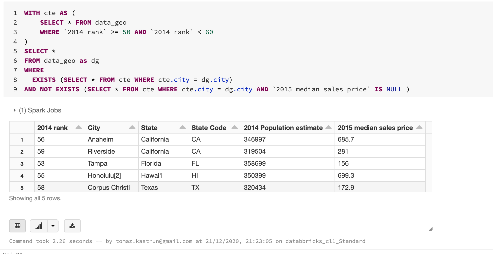

<!-- wp:paragraph -->

<strong>3.8.Window functions</strong>

<!-- /wp:paragraph -->

<!-- wp:syntaxhighlighter/code -->
<pre class="wp-block-syntaxhighlighter-code">SELECT 
 City
,State
,RANK() OVER (PARTITION BY State ORDER BY `2015 median sales price`) AS rank 
,`2015 median sales price` AS MedianPrice
FROM data_geo
WHERE
  `2015 median sales price` IS NOT NULL;</pre>
<!-- /wp:syntaxhighlighter/code -->

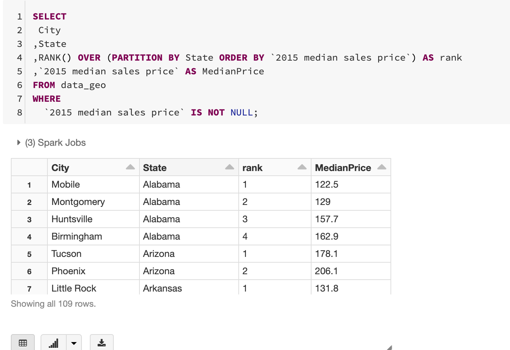

<!-- wp:paragraph -->

<strong>4. Exploring the visuals</strong>

<!-- /wp:paragraph -->

<!-- wp:paragraph -->

Results of a SQL SELECT statements that are returned as a table, can also be  visualised. Given the following SQL Statement:

<!-- /wp:paragraph -->

<!-- wp:syntaxhighlighter/code -->
<pre class="wp-block-syntaxhighlighter-code">SELECT `State Code`, `2015 median sales price` FROM data_geo</pre>
<!-- /wp:syntaxhighlighter/code -->

<!-- wp:paragraph -->

in the result cell you can select the plot icon and pick Map.

<!-- /wp:paragraph -->

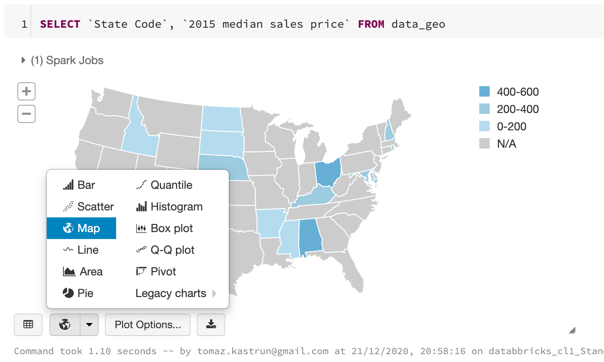

<!-- wp:paragraph -->

Furthermore, using "Plot Options..." you can change the settings of the variables on the graph, aggregations and  data series.

<!-- /wp:paragraph -->

<!-- wp:paragraph -->

With additional query:

<!-- /wp:paragraph -->

<!-- wp:syntaxhighlighter/code -->
<pre class="wp-block-syntaxhighlighter-code">SELECT 
  `State Code`
 , `2015 median sales price` 
FROM data_geo_SQL
ORDER BY `2015 median sales price` DESC;</pre>
<!-- /wp:syntaxhighlighter/code -->

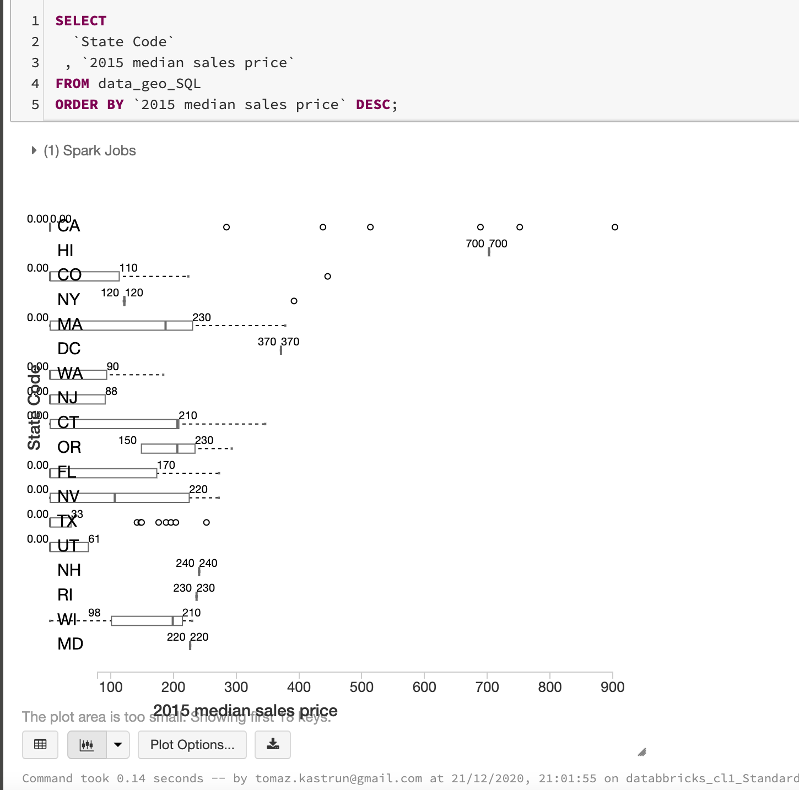

<!-- wp:paragraph -->

 There are also many other visuals available and much more SQL statements to explore and feel free to go a step further and beyond this blogpost.

<!-- /wp:paragraph -->

<!-- wp:paragraph -->

Tomorrow we will explore Streaming with Spark Core API in Azure Databricks. 

<!-- /wp:paragraph -->

<!-- wp:paragraph -->

Complete set of code and SQL notebooks (including HTML) will be available at the<a rel="noreferrer noopener" href="https://github.com/tomaztk/Azure-Databricks" target="_blank"> Github repository</a>.

<!-- /wp:paragraph -->

<!-- wp:paragraph -->

Happy Coding and Stay Healthy!

<!-- /wp:paragraph -->

