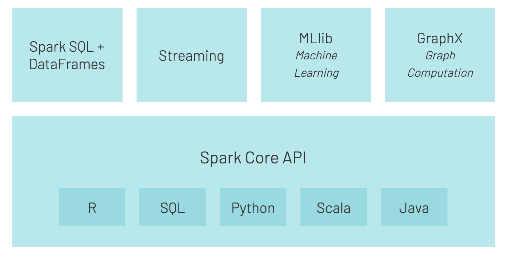
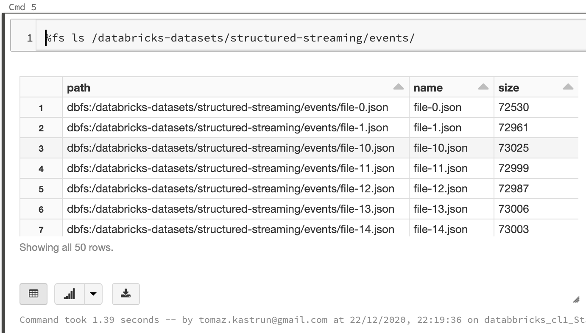
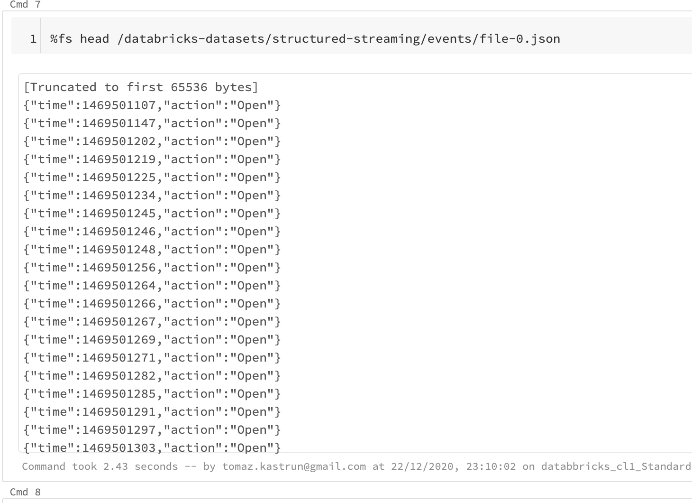
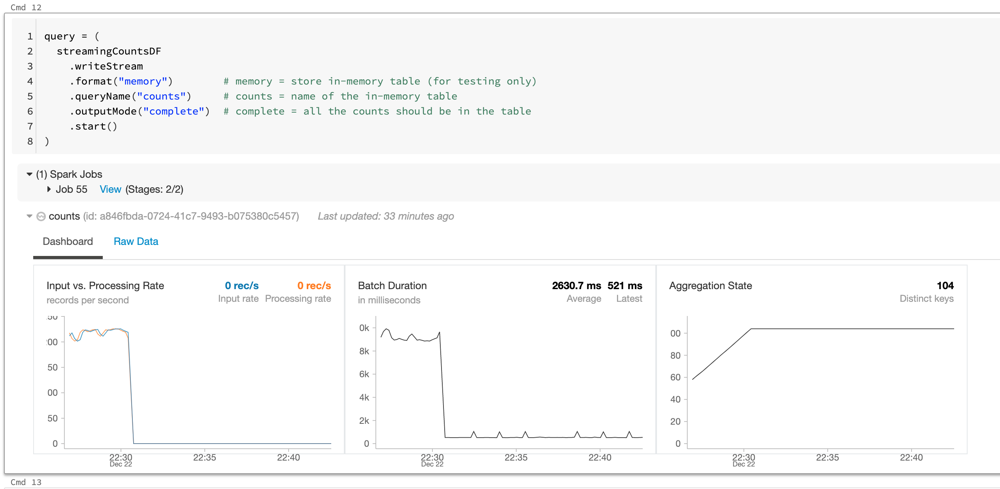

<!-- README.md was wriiten in beautiful MacDown  -->
# Dec 23 2020 - Using Spark Streaming in Azure Databricks

<!-- badges: start -->

<!-- badges: end -->

Azure Databricks repository is 
a set of blogposts as a Advent of 2020 present to readers for easier onboarding
to Azure Databricks! 

<!-- wp:paragraph -->

Series of Azure Databricks posts:

<!-- /wp:paragraph -->

<!-- wp:list -->
<ul><li>Dec 01: <a rel="noreferrer noopener" href="https://tomaztsql.wordpress.com/2020/12/01/advent-of-2020-day-1-what-is-azure-databricks/" target="_blank">What is Azure Databricks</a></li><li>Dec 02: <a rel="noreferrer noopener" href="https://tomaztsql.wordpress.com/2020/12/02/advent-of-2020-day-2-how-to-get-started-with-azure-databricks/" target="_blank">How to get started with Azure Databricks</a></li><li>Dec 03: <a href="https://tomaztsql.wordpress.com/2020/12/03/advent-of-2020-day-3-getting-to-know-the-workspace-and-azure-databricks-platform/" target="_blank" rel="noreferrer noopener">Getting to know the workspace and Azure Databricks platform</a></li>
<li>Dec 04: <a href="https://tomaztsql.wordpress.com/2020/12/04/advent-of-2020-day-4-creating-your-first-azure-databricks-cluster/" target="_blank" rel="noreferrer noopener">Creating your first Azure Databricks cluster</a></li>
<li>Dec 05: <a href="https://tomaztsql.wordpress.com/2020/12/05/advent-of-2020-day-5-understanding-azure-databricks-cluster-architecture-workers-drivers-and-jobs/" target="_blank" rel="noreferrer noopener">Understanding Azure Databricks cluster architecture, workers, drivers and jobs</a></li>
<li>Dec 06: <a href="https://tomaztsql.wordpress.com/2020/12/06/advent-of-2020-day-6-importing-and-storing-data-to-azure-databricks/" target="_blank" rel="noreferrer noopener">Importing and storing data to Azure Databricks</a></li>
<li>Dec 07: <a href="https://tomaztsql.wordpress.com/2020/12/07/advent-of-2020-day-7-starting-with-databricks-notebooks-and-loading-data-to-dbfs/" target="_blank" rel="noreferrer noopener">Starting with Databricks notebooks and loading data to DBFS</a></li>
<li>Dec 08: <a href="https://tomaztsql.wordpress.com/2020/12/08/advent-of-2020-day-8-using-databricks-cli-and-dbfs-cli-for-file-upload/" target="_blank" rel="noreferrer noopener"> Using Databricks CLI and DBFS CLI for file upload</a></li>
<li>Dec 09: <a href="https://tomaztsql.wordpress.com/2020/12/09/advent-of-2020-day-9-connect-to-azure-blob-storage-using-notebooks-in-azure-databricks/" target="_blank" rel="noreferrer noopener">Connect to Azure Blob storage using Notebooks in  Azure Databricks</a></li>
<li>Dec 10: <a href="https://tomaztsql.wordpress.com/2020/12/10/advent-of-2020-day-10-using-azure-databricks-notebooks-with-sql-for-data-engineering-tasks/" target="_blank" rel="noreferrer noopener">Using Azure Databricks Notebooks with SQL for Data engineering tasks</a></li>
<li>Dec 11: <a href="https://tomaztsql.wordpress.com/2020/12/11/advent-of-2020-day-11-using-azure-databricks-notebooks-with-r-language-for-data-analytics/" target="_blank" rel="noreferrer noopener">Using Azure Databricks Notebooks with R Language for data analytics</a></li>
<li>Dec 12: <a href="https://tomaztsql.wordpress.com/2020/12/12/advent-of-2020-day-12-using-azure-databricks-notebooks-with-python-language-for-data-analytics/" target="_blank" rel="noreferrer noopener">Using Azure Databricks Notebooks with Python Language for data analytics</a></li>
<li>Dec 13: <a href="https://tomaztsql.wordpress.com/2020/12/13/adventof-2020-day-13-using-python-databricks-koalas-with-azure-databricks/" target="_blank" rel="noreferrer noopener">Using Python Databricks Koalas with Azure Databricks</a></li>
<li>Dec 14: <a href="https://tomaztsql.wordpress.com/2020/12/14/advent-of-2020-day-14-from-configuration-to-execution-of-databricks-jobs/" target="_blank" rel="noreferrer noopener">From configuration to execution of Databricks jobs</a></li>
<li>Dec 15: <a href="https://tomaztsql.wordpress.com/2020/12/15/advent-of-2020-day-15-databricks-spark-ui-event-logs-driver-logs-and-metrics/" target="_blank" rel="noreferrer noopener">Databricks Spark UI, Event Logs, Driver logs and Metrics</a></li>
<li>Dec 16: <a href="https://tomaztsql.wordpress.com/2020/12/16/advent-of-2020-day-16-databricks-experiments-models-and-mlflow/" target="_blank" rel="noreferrer noopener">Databricks experiments, models and MLFlow</a></li>
<li>Dec 17: <a href="https://tomaztsql.wordpress.com/2020/12/17/advent-of-2020-day-17-end-to-end-machine-learning-project-in-azure-databricks/" target="_blank" rel="noreferrer noopener">End-to-End Machine learning project in Azure Databricks</a></li>
<li>Dec 18: <a href="https://tomaztsql.wordpress.com/2020/12/18/advent-of-2020-day-18-using-azure-data-factory-with-azure-databricks/" target="_blank" rel="noreferrer noopener">Using Azure Data Factory with Azure Databricks</a></li>
<li>Dec 19: <a href="https://tomaztsql.wordpress.com/2020/12/19/advent-of-2020-day-19-using-azure-data-factory-with-azure-databricks-for-merging-csv-files/" target="_blank" rel="noreferrer noopener">Using Azure Data Factory with Azure Databricks for merging CSV files</a></li>
<li>Dec 20: <a href="https://tomaztsql.wordpress.com/2020/12/20/advent-of-2020-day-20-orchestrating-multiple-notebooks-with-azure-databricks/" target="_blank" rel="noreferrer noopener">Orchestrating multiple notebooks with Azure Databricks</a></li>
<li>Dec 21: <a href="https://tomaztsql.wordpress.com/2020/12/21/advent-of-2020-day-21-using-scala-with-spark-core-api-in-azure-databricks/" target="_blank" rel="noreferrer noopener">Using Scala with Spark Core API in Azure Databricks</a></li>
	
<li>Dec 22: <a href="https://tomaztsql.wordpress.com/2020/12/22/advent-of-2020-day-22-using-spark-sql-and-dataframes-in-azure-databricks/" target="_blank" rel="noreferrer noopener">Using Spark SQL and DataFrames in Azure Databricks</a></li>

</ul>
<!-- /wp:list -->

<!-- wp:paragraph -->

Yesterday we took a closer look into the nuts and bolts of DataFrames using Spark SQL and the power of using SQL to query data.

<!-- /wp:paragraph -->

<!-- wp:paragraph -->

For today we will take a glimpse into Streaming with Spark Core API in Azure Databricks.

<!-- /wp:paragraph -->

<!-- wp:paragraph -->

Spark Streaming is the process that can analyse not only batches of data but also streams of data in near real-time. It gives the powerful interactive and analytical applications across both hot and cold data (streaming data and historical data). Spark Streaming is a fault tolerance system, meaning due to lineage of operations, Spark will always remember where you stopped and in case of a worker error, another worker can always recreate all the data transformation from partitioned RDD (assuming that all the RDD transformations are deterministic).

<!-- /wp:paragraph -->

<!-- wp:paragraph -->

Spark streaming has a native connectors to many data sources, such as HDFS, Kafka, S3, Kinesis and even Twitter.

<!-- /wp:paragraph -->

<!-- wp:paragraph -->

Start your Workspace in Azure Databricks. Create new notebook, name it: <em>Day23_streaming</em> and use the default language: <em>Python</em>. If you decide to use EventHubs from reading data from HDFS or other places, Scala language might be slightly better.

<!-- /wp:paragraph -->

<!-- wp:paragraph -->

If you will be using Spark context, otherwise just import pyspark.sql namespace.

<!-- /wp:paragraph -->

<!-- wp:syntaxhighlighter/code -->
<pre class="wp-block-syntaxhighlighter-code">from pyspark import SparkContext
from pyspark.streaming import StreamingContext
from pyspark.sql.types import *
from pyspark.sql.functions import *</pre>
<!-- /wp:syntaxhighlighter/code -->

<!-- wp:paragraph -->

We will be using the demo data from databricks-datasets folder:

<!-- /wp:paragraph -->

<!-- wp:syntaxhighlighter/code -->
<pre class="wp-block-syntaxhighlighter-code">%fs ls /databricks-datasets/structured-streaming/events/</pre>
<!-- /wp:syntaxhighlighter/code -->

<!-- wp:paragraph -->

And you can check the structure of one file, by using:

<!-- /wp:paragraph -->

<!-- wp:syntaxhighlighter/code -->
<pre class="wp-block-syntaxhighlighter-code">%fs head /databricks-datasets/structured-streaming/events/file-0.json</pre>
<!-- /wp:syntaxhighlighter/code -->

<!-- wp:paragraph -->

You must do the  initialisation of the stream with:

<!-- /wp:paragraph -->

<!-- wp:list -->
<ul><li>inputPath (where your files will be coming)</li><li>Schema of the input files</li><li>ReadStream function with a function if schema, input data additional options (As: picking one file at a time)</li><li>Aggregate function (for count of events in this particular case) and use of ReadStream function.</li></ul>
<!-- /wp:list -->

<!-- wp:syntaxhighlighter/code -->
<pre class="wp-block-syntaxhighlighter-code">inputPath = "/databricks-datasets/structured-streaming/events/"

# Define the schema to speed up processing
jsonSchema = StructType([ StructField("time", TimestampType(), True), StructField("action", StringType(), True) ])

streamingInputDF = (
  spark
    .readStream
    .schema(jsonSchema)               # Set the schema of the JSON data
    .option("maxFilesPerTrigger", 1)  # Treat a sequence of files as stream of one at a time
    .json(inputPath)
)

streamingCountsDF = (
  streamingInputDF
    .groupBy(
      streamingInputDF.action,
      window(streamingInputDF.time, "1 hour"))
    .count()
)</pre>
<!-- /wp:syntaxhighlighter/code -->

<!-- wp:paragraph -->

You start a streaming computation by defining a sink and starting it. In this case, to query the counts interactively, set the <em>complete</em>set of 1 hour counts to be in an in-memory table.

<!-- /wp:paragraph -->

<!-- wp:paragraph -->

Run the following command to examine the outcome of a query.

<!-- /wp:paragraph -->

<!-- wp:syntaxhighlighter/code -->
<pre class="wp-block-syntaxhighlighter-code">query = (
  streamingCountsDF
    .writeStream
    .format("memory")        # memory = store in-memory table (for testing only)
    .queryName("counts")     # counts = name of the in-memory table
    .outputMode("complete")  # complete = all the counts should be in the table
    .start()
)</pre>
<!-- /wp:syntaxhighlighter/code -->

<!-- wp:paragraph -->

And once the cluster is running, you can do variety of analysis.  The Key component is the ".start" method - embedded in the main function, that you can run the spark due to incoming poklikuc.

<!-- /wp:paragraph -->

<!-- wp:paragraph -->

You can also further shape the data by using Spark SQL:

<!-- /wp:paragraph -->

<!-- wp:syntaxhighlighter/code -->
<pre class="wp-block-syntaxhighlighter-code">%sql 
SELECT 
 action
,date_format(window.end, "MMM-dd HH:mm") as time
,count 
FROM counts 
ORDER BY time, action</pre>
<!-- /wp:syntaxhighlighter/code -->

<!-- wp:paragraph -->

Tomorrow we will explore Spark's own MLlib package for Machine Learning using Azure Databricks.

<!-- /wp:paragraph -->

<!-- wp:paragraph -->

Complete set of code and SQL notebooks (including HTML) will be available at the<a rel="noreferrer noopener" href="https://github.com/tomaztk/Azure-Databricks" target="_blank">&nbsp;Github repository</a>.

<!-- /wp:paragraph -->

<!-- wp:paragraph -->

Happy Coding and Stay Healthy!

<!-- /wp:paragraph -->

