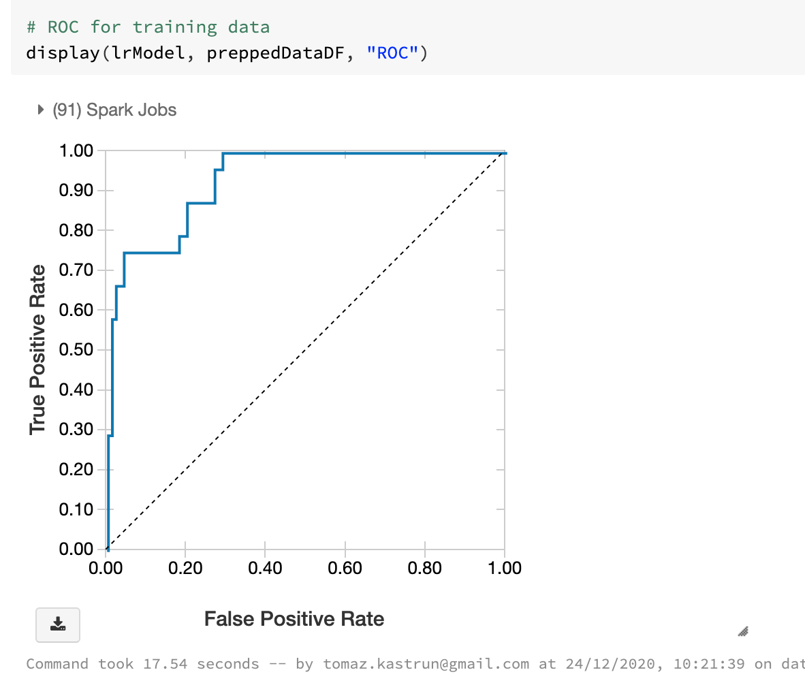
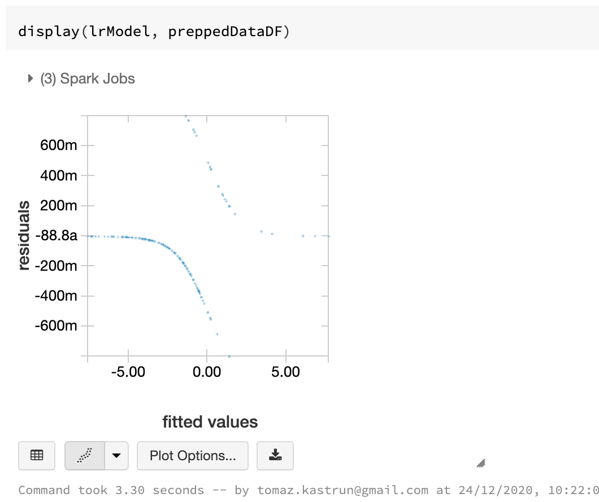
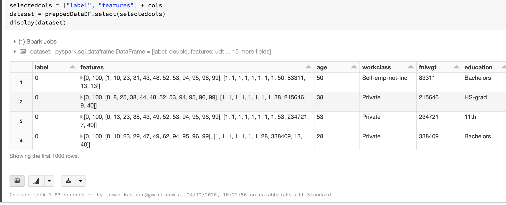
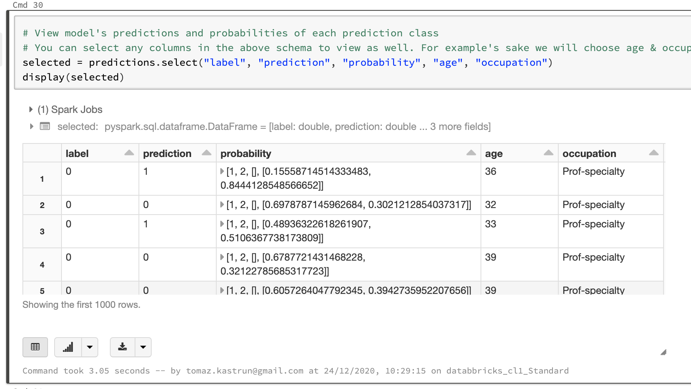
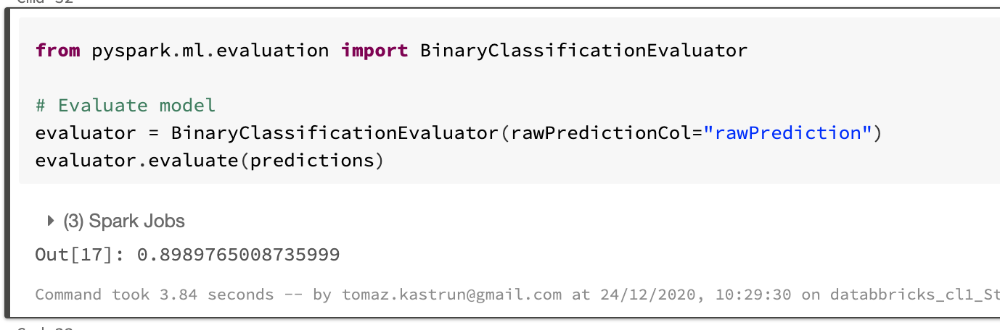
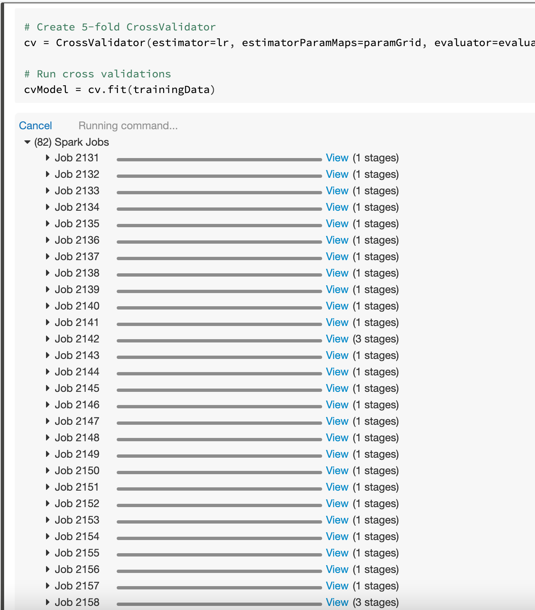
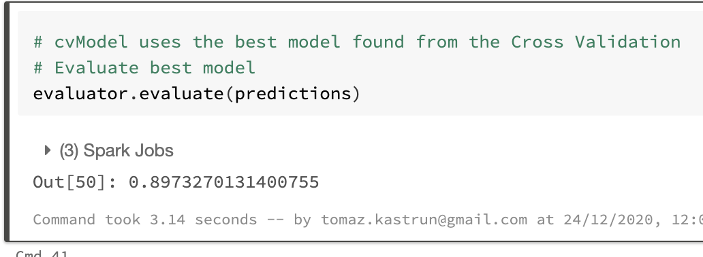
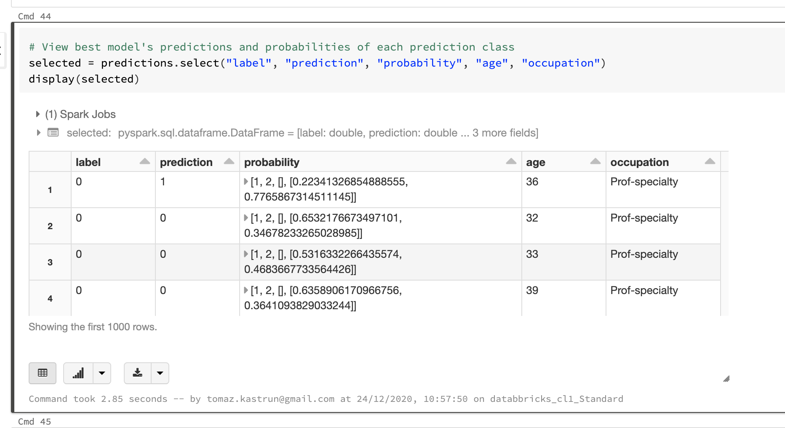
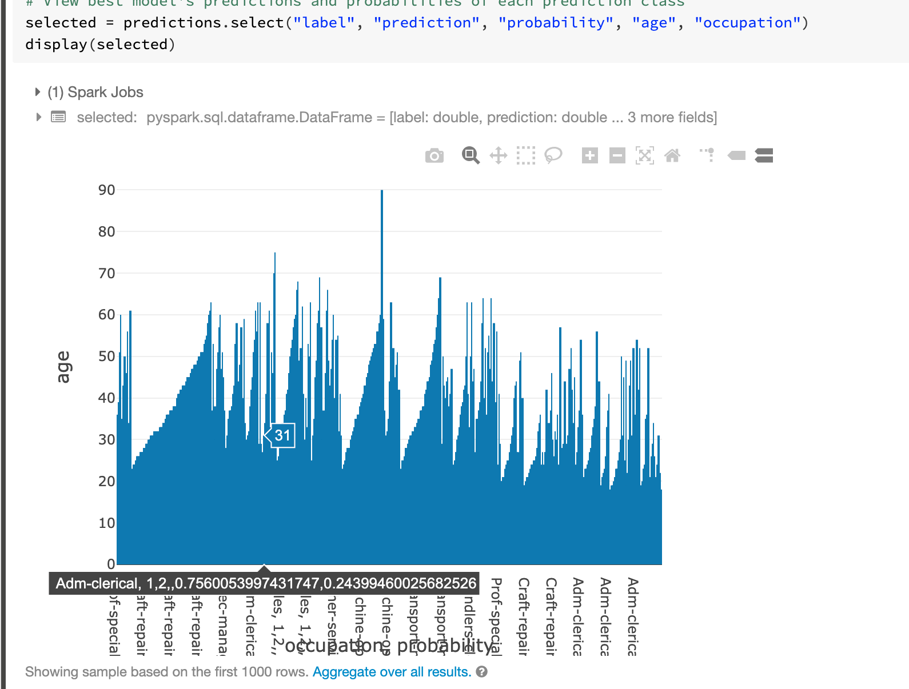

<!-- README.md was wriiten in beautiful MacDown  -->
# Dec 24 2020 - Using Spark MLlib for Machine Learning in Azure Databricks

<!-- badges: start -->

<!-- badges: end -->

Azure Databricks repository is 
a set of blogposts as a Advent of 2020 present to readers for easier onboarding
to Azure Databricks! 

<!-- wp:paragraph -->

Series of Azure Databricks posts:

<!-- /wp:paragraph -->

<!-- wp:list -->
<ul><li>Dec 01: <a rel="noreferrer noopener" href="https://tomaztsql.wordpress.com/2020/12/01/advent-of-2020-day-1-what-is-azure-databricks/" target="_blank">What is Azure Databricks</a></li><li>Dec 02: <a rel="noreferrer noopener" href="https://tomaztsql.wordpress.com/2020/12/02/advent-of-2020-day-2-how-to-get-started-with-azure-databricks/" target="_blank">How to get started with Azure Databricks</a></li><li>Dec 03: <a href="https://tomaztsql.wordpress.com/2020/12/03/advent-of-2020-day-3-getting-to-know-the-workspace-and-azure-databricks-platform/" target="_blank" rel="noreferrer noopener">Getting to know the workspace and Azure Databricks platform</a></li>
<li>Dec 04: <a href="https://tomaztsql.wordpress.com/2020/12/04/advent-of-2020-day-4-creating-your-first-azure-databricks-cluster/" target="_blank" rel="noreferrer noopener">Creating your first Azure Databricks cluster</a></li>
<li>Dec 05: <a href="https://tomaztsql.wordpress.com/2020/12/05/advent-of-2020-day-5-understanding-azure-databricks-cluster-architecture-workers-drivers-and-jobs/" target="_blank" rel="noreferrer noopener">Understanding Azure Databricks cluster architecture, workers, drivers and jobs</a></li>
<li>Dec 06: <a href="https://tomaztsql.wordpress.com/2020/12/06/advent-of-2020-day-6-importing-and-storing-data-to-azure-databricks/" target="_blank" rel="noreferrer noopener">Importing and storing data to Azure Databricks</a></li>
<li>Dec 07: <a href="https://tomaztsql.wordpress.com/2020/12/07/advent-of-2020-day-7-starting-with-databricks-notebooks-and-loading-data-to-dbfs/" target="_blank" rel="noreferrer noopener">Starting with Databricks notebooks and loading data to DBFS</a></li>
<li>Dec 08: <a href="https://tomaztsql.wordpress.com/2020/12/08/advent-of-2020-day-8-using-databricks-cli-and-dbfs-cli-for-file-upload/" target="_blank" rel="noreferrer noopener"> Using Databricks CLI and DBFS CLI for file upload</a></li>
<li>Dec 09: <a href="https://tomaztsql.wordpress.com/2020/12/09/advent-of-2020-day-9-connect-to-azure-blob-storage-using-notebooks-in-azure-databricks/" target="_blank" rel="noreferrer noopener">Connect to Azure Blob storage using Notebooks in  Azure Databricks</a></li>
<li>Dec 10: <a href="https://tomaztsql.wordpress.com/2020/12/10/advent-of-2020-day-10-using-azure-databricks-notebooks-with-sql-for-data-engineering-tasks/" target="_blank" rel="noreferrer noopener">Using Azure Databricks Notebooks with SQL for Data engineering tasks</a></li>
<li>Dec 11: <a href="https://tomaztsql.wordpress.com/2020/12/11/advent-of-2020-day-11-using-azure-databricks-notebooks-with-r-language-for-data-analytics/" target="_blank" rel="noreferrer noopener">Using Azure Databricks Notebooks with R Language for data analytics</a></li>
<li>Dec 12: <a href="https://tomaztsql.wordpress.com/2020/12/12/advent-of-2020-day-12-using-azure-databricks-notebooks-with-python-language-for-data-analytics/" target="_blank" rel="noreferrer noopener">Using Azure Databricks Notebooks with Python Language for data analytics</a></li>
<li>Dec 13: <a href="https://tomaztsql.wordpress.com/2020/12/13/adventof-2020-day-13-using-python-databricks-koalas-with-azure-databricks/" target="_blank" rel="noreferrer noopener">Using Python Databricks Koalas with Azure Databricks</a></li>
<li>Dec 14: <a href="https://tomaztsql.wordpress.com/2020/12/14/advent-of-2020-day-14-from-configuration-to-execution-of-databricks-jobs/" target="_blank" rel="noreferrer noopener">From configuration to execution of Databricks jobs</a></li>
<li>Dec 15: <a href="https://tomaztsql.wordpress.com/2020/12/15/advent-of-2020-day-15-databricks-spark-ui-event-logs-driver-logs-and-metrics/" target="_blank" rel="noreferrer noopener">Databricks Spark UI, Event Logs, Driver logs and Metrics</a></li>
<li>Dec 16: <a href="https://tomaztsql.wordpress.com/2020/12/16/advent-of-2020-day-16-databricks-experiments-models-and-mlflow/" target="_blank" rel="noreferrer noopener">Databricks experiments, models and MLFlow</a></li>
<li>Dec 17: <a href="https://tomaztsql.wordpress.com/2020/12/17/advent-of-2020-day-17-end-to-end-machine-learning-project-in-azure-databricks/" target="_blank" rel="noreferrer noopener">End-to-End Machine learning project in Azure Databricks</a></li>
<li>Dec 18: <a href="https://tomaztsql.wordpress.com/2020/12/18/advent-of-2020-day-18-using-azure-data-factory-with-azure-databricks/" target="_blank" rel="noreferrer noopener">Using Azure Data Factory with Azure Databricks</a></li>
<li>Dec 19: <a href="https://tomaztsql.wordpress.com/2020/12/19/advent-of-2020-day-19-using-azure-data-factory-with-azure-databricks-for-merging-csv-files/" target="_blank" rel="noreferrer noopener">Using Azure Data Factory with Azure Databricks for merging CSV files</a></li>
<li>Dec 20: <a href="https://tomaztsql.wordpress.com/2020/12/20/advent-of-2020-day-20-orchestrating-multiple-notebooks-with-azure-databricks/" target="_blank" rel="noreferrer noopener">Orchestrating multiple notebooks with Azure Databricks</a></li>
<li>Dec 21: <a href="https://tomaztsql.wordpress.com/2020/12/21/advent-of-2020-day-21-using-scala-with-spark-core-api-in-azure-databricks/" target="_blank" rel="noreferrer noopener">Using Scala with Spark Core API in Azure Databricks</a></li>
<li>Dec 22: <a href="https://tomaztsql.wordpress.com/2020/12/22/advent-of-2020-day-22-using-spark-sql-and-dataframes-in-azure-databricks/" target="_blank" rel="noreferrer noopener">Using Spark SQL and DataFrames in Azure Databricks</a></li>

<li>Dec 23: <a href="https://tomaztsql.wordpress.com/2020/12/23/advent-of-2020-day-23-using-spark-streaming-in-azure-databricks/" target="_blank" rel="noreferrer noopener">Using Spark Streaming in Azure Databricks</a></li>

</ul>
<!-- /wp:list -->

<!-- wp:paragraph -->

Yesterday we briefly touched Spark Streaming as part of Spark component on top of Spark Core.

<!-- /wp:paragraph -->

<!-- wp:paragraph -->

Another important component is Machine Learning Spark package called MLlib.

<!-- /wp:paragraph -->

<!-- wp:paragraph -->

MLlib is a scalable machine learning library bringing quality algorithms and giving you process speed. (due to upgradede functionality of Hadoops' map-reduce. Besides supporting several languages (Java, R, Scala, Python), it brings also the pipelines - for better data movement.

<!-- /wp:paragraph -->

<!-- wp:paragraph -->

MLlib package brings you several covered topics:

<!-- /wp:paragraph -->

<!-- wp:list -->
<ul><li>Basic statistics</li><li>Pipelines and data transformation</li><li>Classification and regression</li><li>Clustering</li><li>Collaborative filtering</li><li>Frequent pattern mining</li><li>Dimensionality reduction</li><li>Feature selection and transformation</li><li>Model Selection and tuning</li><li>Evaluation metrics</li></ul>
<!-- /wp:list -->

<!-- wp:paragraph -->

The Apache Spark machine learning library (MLlib) allows data scientists to focus on their data problems and models instead of solving the complexities surrounding distributed data (such as infrastructure, configurations, and so on).

<!-- /wp:paragraph -->

<!-- wp:paragraph -->

Now, let's create a new notebook. I named mine Day24_MLlib. And select Python Language.

<!-- /wp:paragraph -->

<!-- wp:paragraph -->

<strong>1.Load Data</strong>

<!-- /wp:paragraph -->

<!-- wp:paragraph -->

We will use the sample data that is available in <em>/databricks-datasets</em> folder.

<!-- /wp:paragraph -->

<!-- wp:syntaxhighlighter/code -->
<pre class="wp-block-syntaxhighlighter-code">%fs ls databricks-datasets/adult/adult.data</pre>
<!-- /wp:syntaxhighlighter/code -->

<!-- wp:paragraph -->

And we will use Spark SQL to import the dataset into Spark Table:

<!-- /wp:paragraph -->

<!-- wp:syntaxhighlighter/code -->
<pre class="wp-block-syntaxhighlighter-code">%sql DROP TABLE IF EXISTS adult
CREATE TABLE adult (
  age DOUBLE,
  workclass STRING,
  fnlwgt DOUBLE,
  education STRING,
  education_num DOUBLE,
  marital_status STRING,
  occupation STRING,
  relationship STRING,
  race STRING,
  sex STRING,
  capital_gain DOUBLE,
  capital_loss DOUBLE,
  hours_per_week DOUBLE,
  native_country STRING,
  income STRING)
USING CSV
OPTIONS (path "/databricks-datasets/adult/adult.data", header "true")</pre>
<!-- /wp:syntaxhighlighter/code -->

<!-- wp:paragraph -->

And get the data into DataSet from Spark SQL table:

<!-- /wp:paragraph -->

<!-- wp:syntaxhighlighter/code -->
<pre class="wp-block-syntaxhighlighter-code">dataset = spark.table("adult")
cols = dataset.columns</pre>
<!-- /wp:syntaxhighlighter/code -->

<!-- wp:paragraph -->

<strong>2.Data Preparation </strong>

<!-- /wp:paragraph -->

<!-- wp:paragraph -->

Since we are going to try algorithms like Logistic Regression, we will have to convert the categorical variables in the dataset into numeric variables.We will use one-hot encoding (and not categoy indexing)

<!-- /wp:paragraph -->

<!-- wp:paragraph -->

<em>One-Hot Encoding</em> - converts categories into binary vectors with at most one nonzero value: Blue: [1, 0], etc.

<!-- /wp:paragraph -->

<!-- wp:paragraph -->

In this dataset, we have ordinal variables like education (Preschool - Doctorate), and also nominal variables like relationship (Wife, Husband, Own-child, etc). For simplicity's sake, we will use One-Hot Encoding to convert all categorical variables into binary vectors. It is possible here to improve prediction accuracy by converting each categorical column with an appropriate method.

<!-- /wp:paragraph -->

<!-- wp:paragraph -->

Here, we will use a combination of <strong>StringIndexer</strong> and <strong>OneHotEncoder</strong> to convert the categorical variables. The <code>OneHotEncoder</code> will return a <strong>SparseVector</strong>.

<!-- /wp:paragraph -->

<!-- wp:paragraph -->

Since we will have more than 1 stage of feature transformations, we use a <em>Pipeline</em> to tie the stages together; similar to chaining with R <em>dplyr</em>.

<!-- /wp:paragraph -->

<!-- wp:paragraph -->

Predict variable will be&nbsp;<code>income</code>; binary variable with two values:

<!-- /wp:paragraph -->

<!-- wp:list -->
<ul><li>"&lt;=50K"</li><li>"&gt;50K"</li></ul>
<!-- /wp:list -->

<!-- wp:paragraph -->

All other variables will be used for feature selections.

<!-- /wp:paragraph -->

<!-- wp:paragraph -->

We will be using MLlib Spark for Python to continue the work. Let's load the packages for data pre-processing and data preparing. Pipelines for easier working with dataset and onehot encoding.

<!-- /wp:paragraph -->

<!-- wp:syntaxhighlighter/code -->
<pre class="wp-block-syntaxhighlighter-code">from pyspark.ml import Pipeline
from pyspark.ml.feature import OneHotEncoder, StringIndexer, VectorAssembler</pre>
<!-- /wp:syntaxhighlighter/code -->

<!-- wp:paragraph -->

We will indexes each categorical column using the <code>StringIndexer</code>, and then converts the indexed categories into one-hot encoded variables. The resulting output has the binary vectors appended to the end of each row.

<!-- /wp:paragraph -->

<!-- wp:paragraph -->

We use the&nbsp;<code>StringIndexer</code>&nbsp;again to encode our labels to label indices.

<!-- /wp:paragraph -->

<!-- wp:syntaxhighlighter/code -->
<pre class="wp-block-syntaxhighlighter-code">categoricalColumns = ["workclass", "education", "marital_status", "occupation", "relationship", "race", "sex", "native_country"]
stages = [] # stages in our Pipeline
for categoricalCol in categoricalColumns:
    stringIndexer = StringIndexer(inputCol=categoricalCol, outputCol=categoricalCol + "Index")
    encoder = OneHotEncoder(inputCols=[stringIndexer.getOutputCol()], outputCols=[categoricalCol + "classVec"])
    stages += [stringIndexer, encoder]
    
# Convert label into label indices using the StringIndexer
label_stringIdx = StringIndexer(inputCol="income", outputCol="label")
stages += [label_stringIdx]</pre>
<!-- /wp:syntaxhighlighter/code -->

<!-- wp:paragraph -->

Use a <code>VectorAssembler</code> to combine all the feature columns into a single vector column. This goes for all types: numeric and one-hot encoded variables.

<!-- /wp:paragraph -->

<!-- wp:syntaxhighlighter/code -->
<pre class="wp-block-syntaxhighlighter-code">numericCols = ["age", "fnlwgt", "education_num", "capital_gain", "capital_loss", "hours_per_week"]
assemblerInputs = [c + "classVec" for c in categoricalColumns] + numericCols
assembler = VectorAssembler(inputCols=assemblerInputs, outputCol="features")
stages += [assembler]</pre>
<!-- /wp:syntaxhighlighter/code -->

<!-- wp:paragraph -->

<strong>3. Running Pipelines</strong>

<!-- /wp:paragraph -->

<!-- wp:paragraph -->

Run the stages as a Pipeline. This puts the data through all of the feature transformations we described in a single call.

<!-- /wp:paragraph -->

<!-- wp:syntaxhighlighter/code -->
<pre class="wp-block-syntaxhighlighter-code">partialPipeline = Pipeline().setStages(stages)
pipelineModel = partialPipeline.fit(dataset)
preppedDataDF = pipelineModel.transform(dataset)</pre>
<!-- /wp:syntaxhighlighter/code -->

<!-- wp:paragraph -->

Now we can do a Logistic regression classification and fit the model on prepared data 

<!-- /wp:paragraph -->

<!-- wp:syntaxhighlighter/code -->
<pre class="wp-block-syntaxhighlighter-code">from pyspark.ml.classification import LogisticRegression
# Fit model to prepped data
lrModel = LogisticRegression().fit(preppedDataDF)</pre>
<!-- /wp:syntaxhighlighter/code -->

<!-- wp:paragraph -->

And run ROC 

<!-- /wp:paragraph -->

<!-- wp:syntaxhighlighter/code -->
<pre class="wp-block-syntaxhighlighter-code"># ROC for training data
display(lrModel, preppedDataDF, "ROC")</pre>
<!-- /wp:syntaxhighlighter/code -->

<!-- wp:paragraph -->

And check the fitted values (from the model) against the prepared dataset:

<!-- /wp:paragraph -->

<!-- wp:syntaxhighlighter/code -->
<pre class="wp-block-syntaxhighlighter-code">display(lrModel, preppedDataDF)</pre>
<!-- /wp:syntaxhighlighter/code -->

<!-- wp:paragraph -->

Now we can check the dataset with added labels and features:

<!-- /wp:paragraph -->

<!-- wp:syntaxhighlighter/code -->
<pre class="wp-block-syntaxhighlighter-code">selectedcols = ["label", "features"] + cols
dataset = preppedDataDF.select(selectedcols)
display(dataset)</pre>
<!-- /wp:syntaxhighlighter/code -->

<!-- wp:paragraph -->

<strong>4. Logistic Regression</strong>

<!-- /wp:paragraph -->

<!-- wp:paragraph -->

In the Pipelines API, we are now able to perform Elastic-Net Regularization with Logistic Regression, as well as other linear methods.

<!-- /wp:paragraph -->

<!-- wp:syntaxhighlighter/code -->
<pre class="wp-block-syntaxhighlighter-code">from pyspark.ml.classification import LogisticRegression

# Create initial LogisticRegression model
lr = LogisticRegression(labelCol="label", featuresCol="features", maxIter=10)

lrModel = lr.fit(trainingData)</pre>
<!-- /wp:syntaxhighlighter/code -->

<!-- wp:paragraph -->

And make predictions on test dataset. Using transform() method to use only the vector of features as a column:

<!-- /wp:paragraph -->

<!-- wp:syntaxhighlighter/code -->
<pre class="wp-block-syntaxhighlighter-code">predictions = lrModel.transform(testData)</pre>
<!-- /wp:syntaxhighlighter/code -->

<!-- wp:paragraph -->

We can check the dataset:

<!-- /wp:paragraph -->

<!-- wp:syntaxhighlighter/code -->
<pre class="wp-block-syntaxhighlighter-code">selected = predictions.select("label", "prediction", "probability", "age", "occupation")
display(selected)</pre>
<!-- /wp:syntaxhighlighter/code -->

<!-- wp:paragraph -->

<strong>5. Evaluating the model</strong>

<!-- /wp:paragraph -->

<!-- wp:paragraph -->

We want to evaluate the model, before doing anything else. This will give us the sense of not only the quality but also the under or over performance.

<!-- /wp:paragraph -->

<!-- wp:paragraph -->

We can use <code>BinaryClassificationEvaluator</code> to evaluate our model. We can set the required column names in <code>rawPredictionCol</code> and <code>labelCol</code> Param and the metric in <code>metricName</code> Param. The default metric for the <code>BinaryClassificationEvaluator</code> is <code>areaUnderROC</code>. Let's load the functions:

<!-- /wp:paragraph -->

<!-- wp:syntaxhighlighter/code -->
<pre class="wp-block-syntaxhighlighter-code">from pyspark.ml.evaluation import BinaryClassificationEvaluator</pre>
<!-- /wp:syntaxhighlighter/code -->

<!-- wp:paragraph -->

and start with evaluation:

<!-- /wp:paragraph -->

<!-- wp:syntaxhighlighter/code -->
<pre class="wp-block-syntaxhighlighter-code"># Evaluate model
evaluator = BinaryClassificationEvaluator(rawPredictionCol="rawPrediction")
evaluator.evaluate(predictions)</pre>
<!-- /wp:syntaxhighlighter/code -->

<!-- wp:paragraph -->

And the score of evaluated predictions is: <strong>0.898976</strong>. What we. want to do next is to fine tune the model with the <code>ParamGridBuilder</code> and the <code>CrossValidator</code>. You can use <code>explainParams()</code> to see the list of parameters and the definition. Set up the ParamGrid  with <em>Regularization Parametrs,</em> <em>ElasticNet Parameters </em>and number of <em>maximum iterations</em>.

<!-- /wp:paragraph -->

<!-- wp:syntaxhighlighter/code -->
<pre class="wp-block-syntaxhighlighter-code">from pyspark.ml.tuning import ParamGridBuilder, CrossValidator

# Create ParamGrid for Cross Validation
paramGrid = (ParamGridBuilder()
             .addGrid(lr.regParam, [0.01, 0.5, 2.0])
             .addGrid(lr.elasticNetParam, [0.0, 0.5, 1.0])
             .addGrid(lr.maxIter, [1, 5, 10])
             .build())</pre>
<!-- /wp:syntaxhighlighter/code -->

<!-- wp:paragraph -->

And run the cross validation.  I am taking 5-fold cross-validation. And you will see how Spark will distribute the loads among the workers using Spark Jobs. Since the matrix of ParamGrid is prepared in such way, that can be parallelised, the powerful and massive computations of Spark gives you the better and fastest compute time.

<!-- /wp:paragraph -->

<!-- wp:syntaxhighlighter/code -->
<pre class="wp-block-syntaxhighlighter-code">cv = CrossValidator(estimator=lr, estimatorParamMaps=paramGrid, evaluator=evaluator, numFolds=5)

# Run cross validations
cvModel = cv.fit(trainingData)</pre>
<!-- /wp:syntaxhighlighter/code -->

<!-- wp:paragraph -->

When the CV finished, check the results of model accuracy again:

<!-- /wp:paragraph -->

<!-- wp:syntaxhighlighter/code -->
<pre class="wp-block-syntaxhighlighter-code"># Use test set to measure the accuracy of our model on new data
predictions = cvModel.transform(testData)

# Evaluate best model
evaluator.evaluate(predictions)</pre>
<!-- /wp:syntaxhighlighter/code -->

<!-- wp:paragraph -->

The model accuracy, after cross validations, is <strong>0.89732,</strong> which is relatively the same as before CV.  So the model was stable and accurate from the beginning and CV only confirmed it.

<!-- /wp:paragraph -->

<!-- wp:paragraph -->

You can also display the dataset:

<!-- /wp:paragraph -->

<!-- wp:syntaxhighlighter/code -->
<pre class="wp-block-syntaxhighlighter-code">selected = predictions.select("label", "prediction", "probability", "age", "occupation")
display(selected)</pre>
<!-- /wp:syntaxhighlighter/code -->

<!-- wp:paragraph -->

You can also change the graphs here and explore each observation in the dataset:

<!-- /wp:paragraph -->

<!-- wp:paragraph -->

The advent is here :)  And I wish you all Merry Christmas and a Happy New Year 2021.

<!-- /wp:paragraph -->

<!-- wp:paragraph -->

The series will continue for couple of more days. And tomorrow we will explore Spark’s GraphX for Spark Core API.

<!-- /wp:paragraph -->

<!-- wp:paragraph -->

Complete set of code and the Notebook  is available at the<a rel="noreferrer noopener" href="https://github.com/tomaztk/Azure-Databricks" target="_blank"> Github repository</a>.

<!-- /wp:paragraph -->

<!-- wp:paragraph -->

Happy Coding and Stay Healthy!

<!-- /wp:paragraph -->

