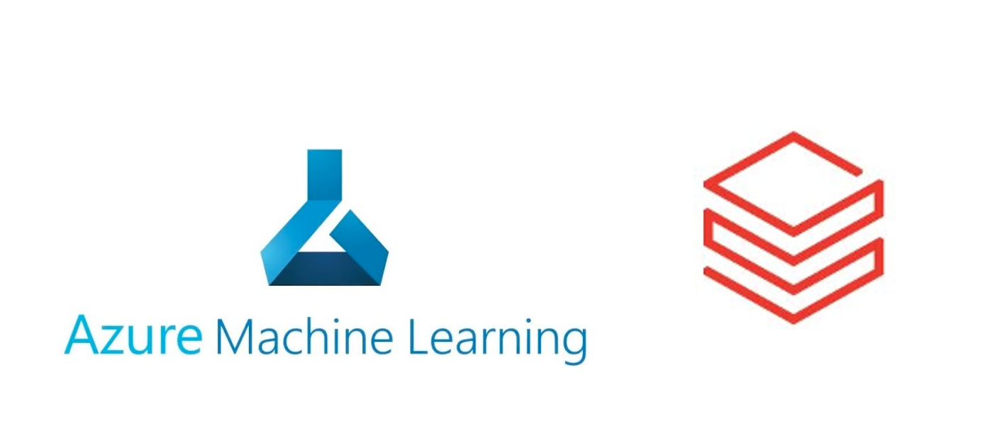
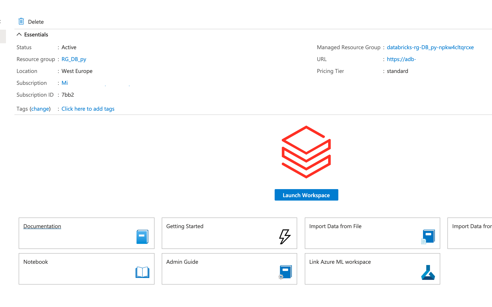
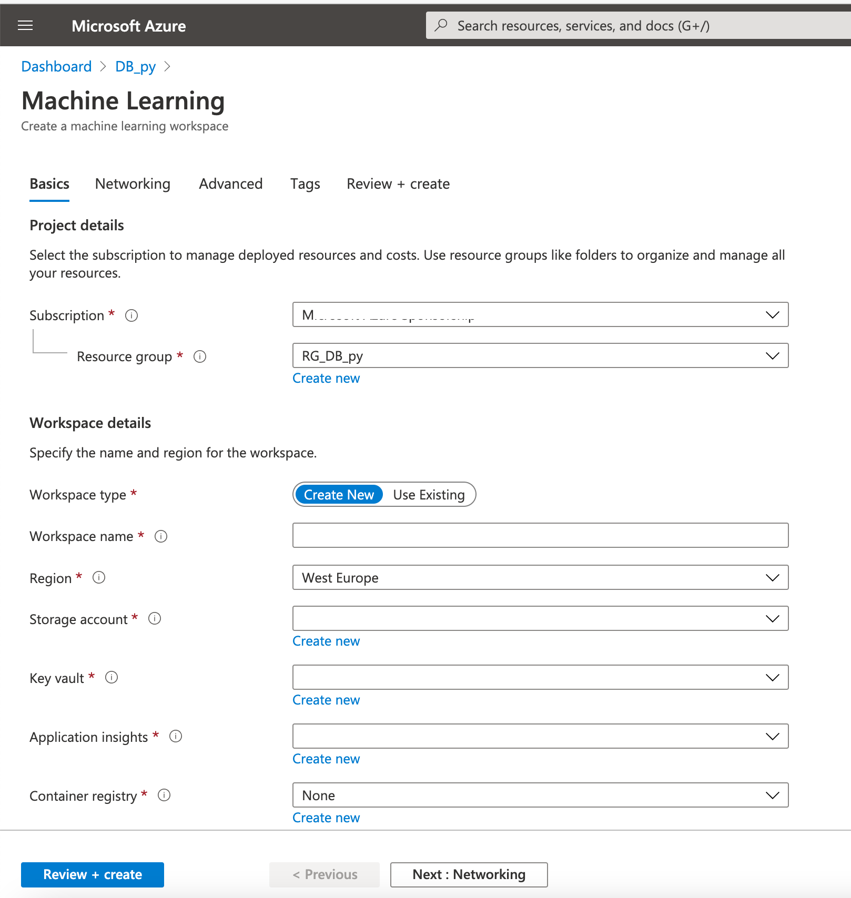
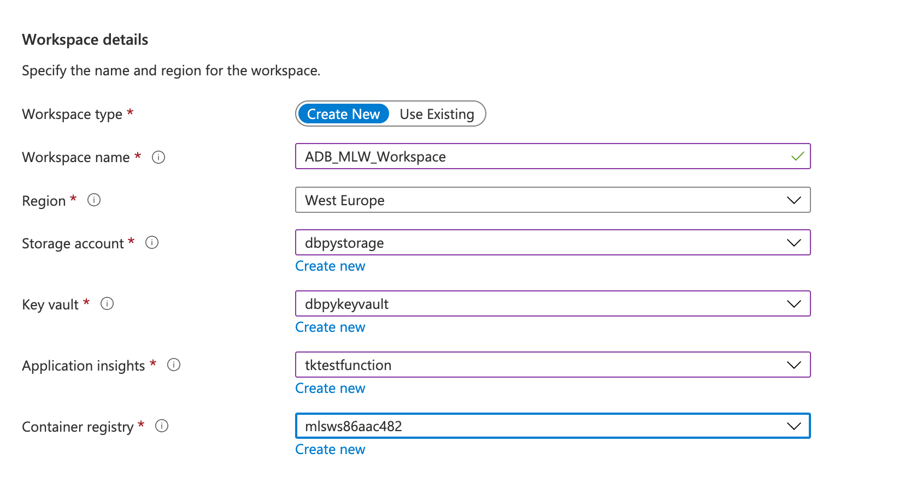
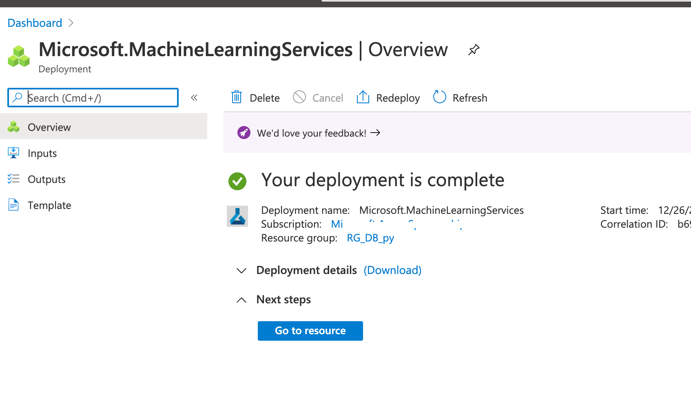
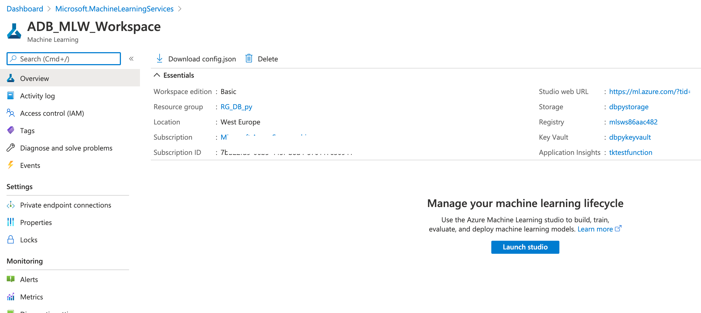
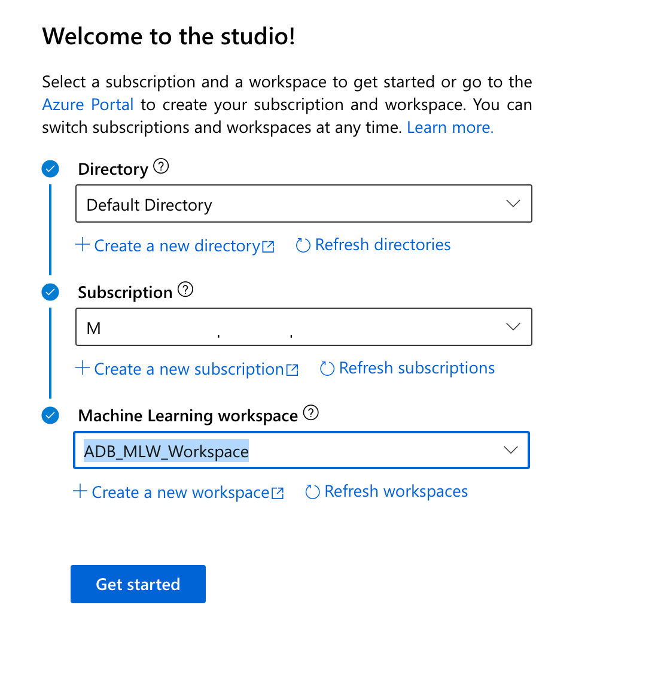
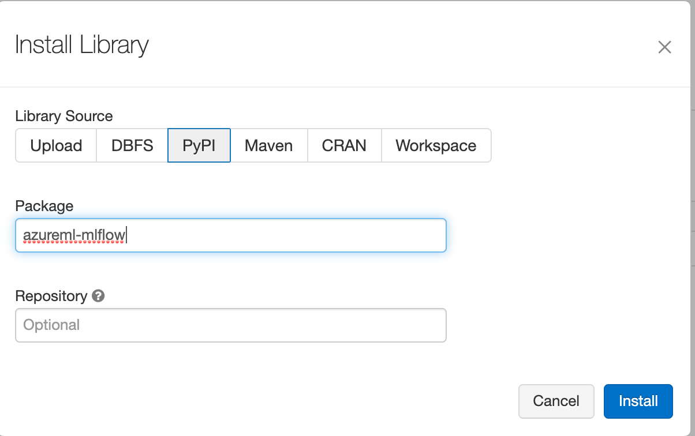

<!-- README.md was wriiten in beautiful MacDown  -->
# Dec 26 2020 - Connecting Azure Machine Learning Services Workspace and Azure Databricks

<!-- badges: start -->

<!-- badges: end -->

Azure Databricks repository is 
a set of blogposts as a Advent of 2020 present to readers for easier onboarding
to Azure Databricks! 

<!-- wp:paragraph -->

Series of Azure Databricks posts:

<!-- /wp:paragraph -->

<!-- wp:list -->
<ul><li>Dec 01: <a rel="noreferrer noopener" href="https://tomaztsql.wordpress.com/2020/12/01/advent-of-2020-day-1-what-is-azure-databricks/" target="_blank">What is Azure Databricks</a></li><li>Dec 02: <a rel="noreferrer noopener" href="https://tomaztsql.wordpress.com/2020/12/02/advent-of-2020-day-2-how-to-get-started-with-azure-databricks/" target="_blank">How to get started with Azure Databricks</a></li><li>Dec 03: <a href="https://tomaztsql.wordpress.com/2020/12/03/advent-of-2020-day-3-getting-to-know-the-workspace-and-azure-databricks-platform/" target="_blank" rel="noreferrer noopener">Getting to know the workspace and Azure Databricks platform</a></li>
<li>Dec 04: <a href="https://tomaztsql.wordpress.com/2020/12/04/advent-of-2020-day-4-creating-your-first-azure-databricks-cluster/" target="_blank" rel="noreferrer noopener">Creating your first Azure Databricks cluster</a></li>
<li>Dec 05: <a href="https://tomaztsql.wordpress.com/2020/12/05/advent-of-2020-day-5-understanding-azure-databricks-cluster-architecture-workers-drivers-and-jobs/" target="_blank" rel="noreferrer noopener">Understanding Azure Databricks cluster architecture, workers, drivers and jobs</a></li>
<li>Dec 06: <a href="https://tomaztsql.wordpress.com/2020/12/06/advent-of-2020-day-6-importing-and-storing-data-to-azure-databricks/" target="_blank" rel="noreferrer noopener">Importing and storing data to Azure Databricks</a></li>
<li>Dec 07: <a href="https://tomaztsql.wordpress.com/2020/12/07/advent-of-2020-day-7-starting-with-databricks-notebooks-and-loading-data-to-dbfs/" target="_blank" rel="noreferrer noopener">Starting with Databricks notebooks and loading data to DBFS</a></li>
<li>Dec 08: <a href="https://tomaztsql.wordpress.com/2020/12/08/advent-of-2020-day-8-using-databricks-cli-and-dbfs-cli-for-file-upload/" target="_blank" rel="noreferrer noopener"> Using Databricks CLI and DBFS CLI for file upload</a></li>
<li>Dec 09: <a href="https://tomaztsql.wordpress.com/2020/12/09/advent-of-2020-day-9-connect-to-azure-blob-storage-using-notebooks-in-azure-databricks/" target="_blank" rel="noreferrer noopener">Connect to Azure Blob storage using Notebooks in  Azure Databricks</a></li>
<li>Dec 10: <a href="https://tomaztsql.wordpress.com/2020/12/10/advent-of-2020-day-10-using-azure-databricks-notebooks-with-sql-for-data-engineering-tasks/" target="_blank" rel="noreferrer noopener">Using Azure Databricks Notebooks with SQL for Data engineering tasks</a></li>
<li>Dec 11: <a href="https://tomaztsql.wordpress.com/2020/12/11/advent-of-2020-day-11-using-azure-databricks-notebooks-with-r-language-for-data-analytics/" target="_blank" rel="noreferrer noopener">Using Azure Databricks Notebooks with R Language for data analytics</a></li>
<li>Dec 12: <a href="https://tomaztsql.wordpress.com/2020/12/12/advent-of-2020-day-12-using-azure-databricks-notebooks-with-python-language-for-data-analytics/" target="_blank" rel="noreferrer noopener">Using Azure Databricks Notebooks with Python Language for data analytics</a></li>
<li>Dec 13: <a href="https://tomaztsql.wordpress.com/2020/12/13/adventof-2020-day-13-using-python-databricks-koalas-with-azure-databricks/" target="_blank" rel="noreferrer noopener">Using Python Databricks Koalas with Azure Databricks</a></li>
<li>Dec 14: <a href="https://tomaztsql.wordpress.com/2020/12/14/advent-of-2020-day-14-from-configuration-to-execution-of-databricks-jobs/" target="_blank" rel="noreferrer noopener">From configuration to execution of Databricks jobs</a></li>
<li>Dec 15: <a href="https://tomaztsql.wordpress.com/2020/12/15/advent-of-2020-day-15-databricks-spark-ui-event-logs-driver-logs-and-metrics/" target="_blank" rel="noreferrer noopener">Databricks Spark UI, Event Logs, Driver logs and Metrics</a></li>
<li>Dec 16: <a href="https://tomaztsql.wordpress.com/2020/12/16/advent-of-2020-day-16-databricks-experiments-models-and-mlflow/" target="_blank" rel="noreferrer noopener">Databricks experiments, models and MLFlow</a></li>
<li>Dec 17: <a href="https://tomaztsql.wordpress.com/2020/12/17/advent-of-2020-day-17-end-to-end-machine-learning-project-in-azure-databricks/" target="_blank" rel="noreferrer noopener">End-to-End Machine learning project in Azure Databricks</a></li>
<li>Dec 18: <a href="https://tomaztsql.wordpress.com/2020/12/18/advent-of-2020-day-18-using-azure-data-factory-with-azure-databricks/" target="_blank" rel="noreferrer noopener">Using Azure Data Factory with Azure Databricks</a></li>
<li>Dec 19: <a href="https://tomaztsql.wordpress.com/2020/12/19/advent-of-2020-day-19-using-azure-data-factory-with-azure-databricks-for-merging-csv-files/" target="_blank" rel="noreferrer noopener">Using Azure Data Factory with Azure Databricks for merging CSV files</a></li>
<li>Dec 20: <a href="https://tomaztsql.wordpress.com/2020/12/20/advent-of-2020-day-20-orchestrating-multiple-notebooks-with-azure-databricks/" target="_blank" rel="noreferrer noopener">Orchestrating multiple notebooks with Azure Databricks</a></li>
<li>Dec 21: <a href="https://tomaztsql.wordpress.com/2020/12/21/advent-of-2020-day-21-using-scala-with-spark-core-api-in-azure-databricks/" target="_blank" rel="noreferrer noopener">Using Scala with Spark Core API in Azure Databricks</a></li>
<li>Dec 22: <a href="https://tomaztsql.wordpress.com/2020/12/22/advent-of-2020-day-22-using-spark-sql-and-dataframes-in-azure-databricks/" target="_blank" rel="noreferrer noopener">Using Spark SQL and DataFrames in Azure Databricks</a></li>
<li>Dec 23: <a href="https://tomaztsql.wordpress.com/2020/12/23/advent-of-2020-day-23-using-spark-streaming-in-azure-databricks/" target="_blank" rel="noreferrer noopener">Using Spark Streaming in Azure Databricks</a></li>
<li>Dec 24: <a href="https://tomaztsql.wordpress.com/2020/12/24/advent-of-2020-day-24-using-spark-mllib-for-machine-learning-in-azure-databricks/" target="_blank" rel="noreferrer noopener">Using Spark MLlib for Machine Learning in Azure Databricks</a></li>

<li>Dec 25: <a href="https://tomaztsql.wordpress.com/2020/12/25/advent-of-2020-day-25-using-spark-graphframes-in-azure-databricks/" target="_blank" rel="noreferrer noopener">Using Spark GraphFrames in Azure Databricks</a></li>

</ul>
<!-- /wp:list -->

<!-- wp:paragraph -->

Yesterday we looked into GraphFrames in Azure Databricks and the capabilities of calculating graph data.

<!-- /wp:paragraph -->

<!-- wp:paragraph -->

Today we will look into Azure Machine Learning services.

<!-- /wp:paragraph -->

<!-- wp:paragraph -->

What is Azure Machine Learning? It is  a cloud-based environment you can use to train, deploy, automate, manage, and track ML models. It can be used for any kind of machine learning, from classical ML to deep learning, supervised, and unsupervised learning. 

<!-- /wp:paragraph -->

<!-- wp:paragraph -->

It supports Python and R code with the SDK and also gives you possibility to use Azure Machine Learning studio designer for "drag&amp;drop" and no-code option. It supports also out-of-the-box tracking experiment, for prediction model workflow, managing, deploying and monitoring models with Azure Machine Learning.

<!-- /wp:paragraph -->

<!-- wp:paragraph -->

Login to your Azure Portal and select the Databricks services. On the main page of Databricks service in Azure Portal, select "Link Azure ML workspace"

<!-- /wp:paragraph -->

<!-- wp:paragraph -->

After selecting "Link Azure ML workspace", you will be prompted to add additional information, mainly because we are connecting two separate services.

<!-- /wp:paragraph -->

<!-- wp:paragraph -->

And many of these should already be available from previous days (Key Vault, Store Account, Container Registry). You should only create a new application insights.

<!-- /wp:paragraph -->

<!-- wp:paragraph -->

Click <em>Review + create</em> and <em>Create</em>. 

<!-- /wp:paragraph -->

<!-- wp:paragraph -->

Once completed you can download the deployment script or go directly to resource.

<!-- /wp:paragraph -->

<!-- wp:paragraph -->

Among the resources, one new resource will be created for you. Go to this resource. You will see, that you will be introduced to Machine Learning Workspace and you can <em>launch Studio</em>.

<!-- /wp:paragraph -->

<!-- wp:paragraph -->

Since this is the first time setup of this new workspace that has connection to Azure Databricks, you will be prompted additional information about the Active Directory account:

<!-- /wp:paragraph -->

<!-- wp:paragraph -->

Hit that "Get started" button to launch the Studio. 

<!-- /wp:paragraph -->

<!-- wp:paragraph -->

You will be presented with a brand new Machine Learning Workspace. After you instantiate your workspace, MLflow Tracking is automatically set to be tracked in all of the following places:

<!-- /wp:paragraph -->

<!-- wp:list -->
<ul><li>The linked Azure Machine Learning workspace.</li><li>Your original ADB workspace.</li></ul>
<!-- /wp:list -->

<!-- wp:paragraph -->

All your experiments land in the managed Azure Machine Learning tracking service.

<!-- /wp:paragraph -->

<!-- wp:paragraph -->

Now go to Azure Databricks and add some additional packages. In Azure Databricks under your cluster that we already used for MLflow, install package <em>azureml-mlflow</em> using PyPI.

<!-- /wp:paragraph -->

<!-- wp:paragraph -->

Linking your ADB workspace to your Azure Machine Learning workspace enables you to track your experiment data in the Azure Machine Learning workspace.

<!-- /wp:paragraph -->

<!-- wp:paragraph -->

The following code should be in your experiment notebook  IN AZURE DATABRICKS (!) to get your linked Azure Machine Learning workspace.

<!-- /wp:paragraph -->

<!-- wp:syntaxhighlighter/code -->
<pre class="wp-block-syntaxhighlighter-code">import mlflow
import mlflow.azureml
import azureml.mlflow
import azureml.core

from azureml.core import Workspace

#Your subscription ID that you are running both Databricks and ML Service
subscription_id = 'subscription_id'

# Azure Machine Learning resource group NOT the managed resource group
resource_group = 'resource_group_name' 

#Azure Machine Learning workspace name, NOT Azure Databricks workspace
workspace_name = 'workspace_name'  

# Instantiate Azure Machine Learning workspace
ws = Workspace.get(name=workspace_name,
                   subscription_id=subscription_id,
                   resource_group=resource_group)

#Set MLflow experiment. 
experimentName = "/Users/{user_name}/{experiment_folder}/{experiment_name}" 
mlflow.set_experiment(experimentName) </pre>
<!-- /wp:syntaxhighlighter/code -->

<!-- wp:paragraph -->

If you want your models to be tracked and monitored only in Azure Machine Learning service, add these two lines in Databricks notebook:

<!-- /wp:paragraph -->

<!-- wp:syntaxhighlighter/code -->
<pre class="wp-block-syntaxhighlighter-code">uri = ws.get_mlflow_tracking_uri()
mlflow.set_tracking_uri(uri)</pre>
<!-- /wp:syntaxhighlighter/code -->

<!-- wp:paragraph -->

Tomorrow we will look how to connect to your Azure databricks Service from your client machine or on-prem machine.

<!-- /wp:paragraph -->

<!-- wp:paragraph -->

<!-- /wp:paragraph -->

<!-- wp:paragraph -->

Complete set of code and the Notebook is available at the<a rel="noreferrer noopener" href="https://github.com/tomaztk/Azure-Databricks" target="_blank">&nbsp;Github repository</a>.

<!-- /wp:paragraph -->

<!-- wp:paragraph -->

Happy Coding and Stay Healthy!

<!-- /wp:paragraph -->

