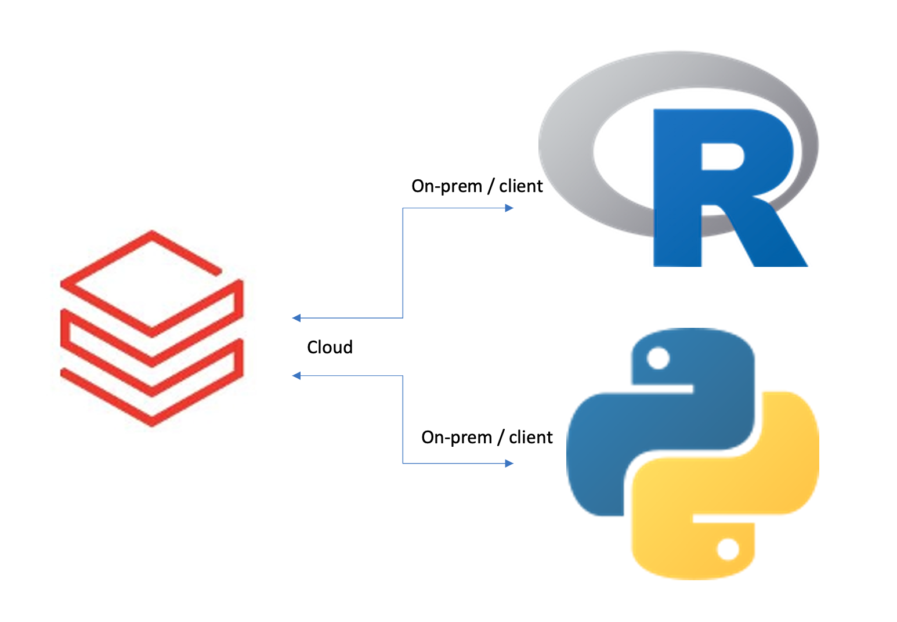
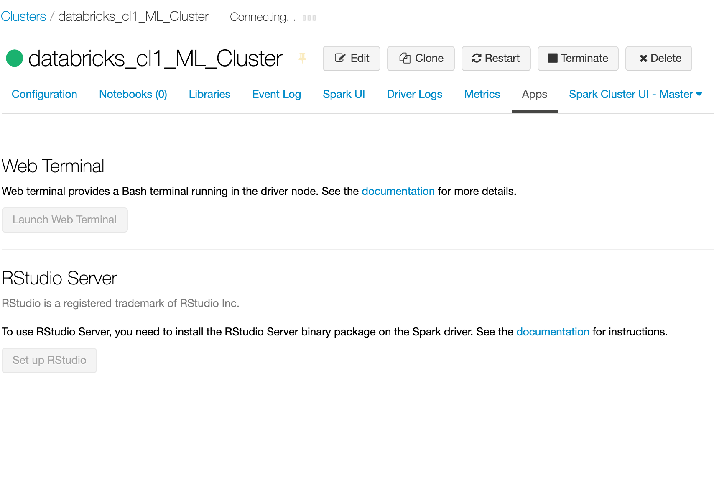
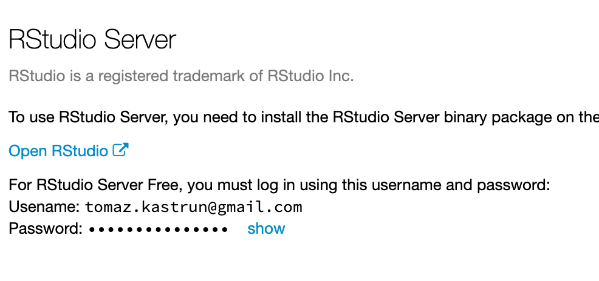
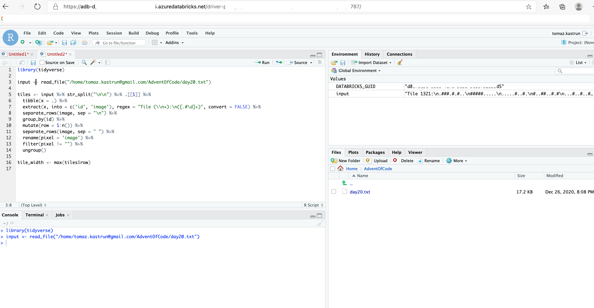
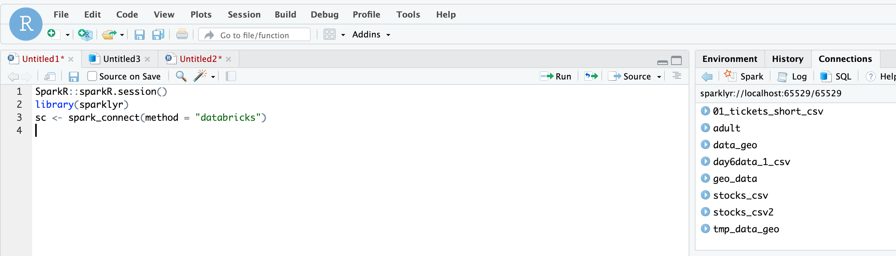
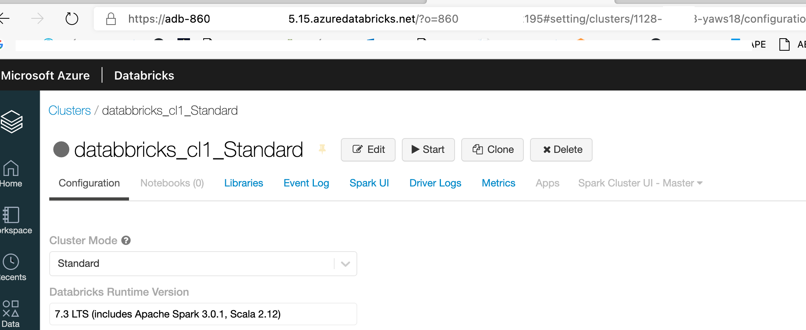
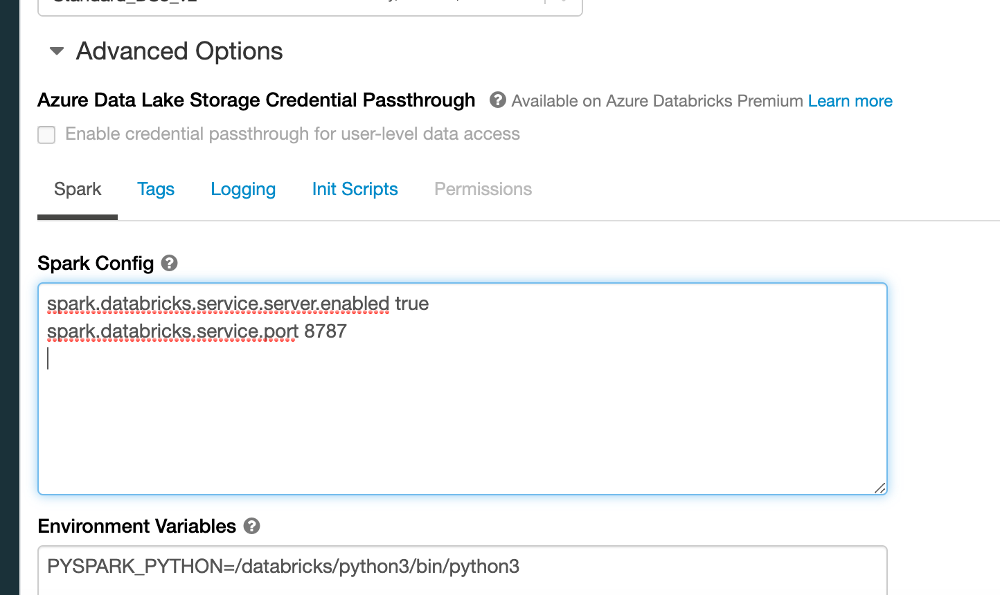
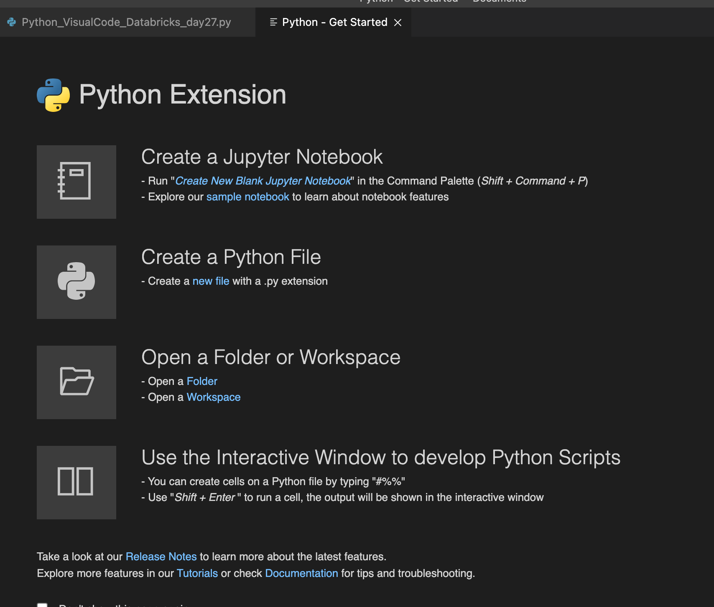
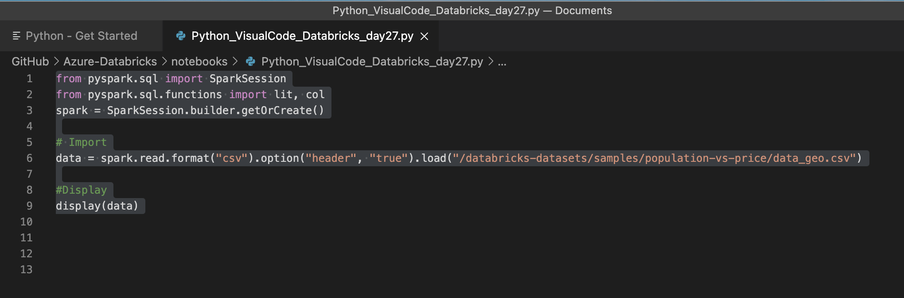
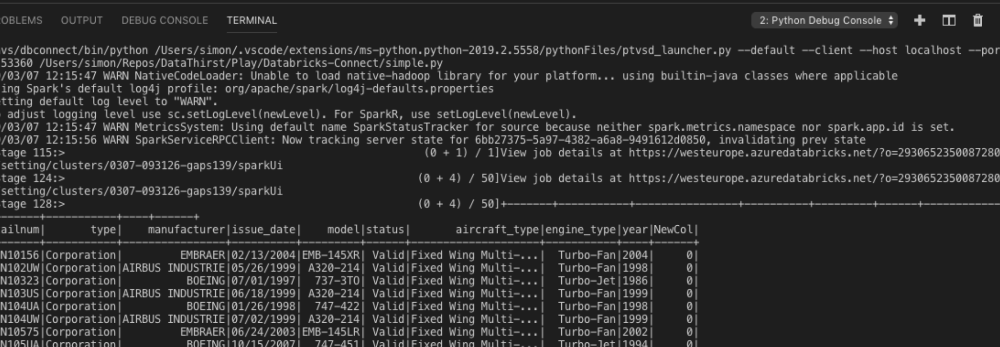

<!-- README.md was wriiten in beautiful MacDown  -->
# Dec 27 2020 - Connecting Azure Databricks with on premise environment

<!-- badges: start -->

<!-- badges: end -->

Azure Databricks repository is 
a set of blogposts as a Advent of 2020 present to readers for easier onboarding
to Azure Databricks! 

<!-- wp:paragraph -->

Series of Azure Databricks posts:

<!-- /wp:paragraph -->

<!-- wp:list -->
<ul><li>Dec 01: <a rel="noreferrer noopener" href="https://tomaztsql.wordpress.com/2020/12/01/advent-of-2020-day-1-what-is-azure-databricks/" target="_blank">What is Azure Databricks</a></li><li>Dec 02: <a rel="noreferrer noopener" href="https://tomaztsql.wordpress.com/2020/12/02/advent-of-2020-day-2-how-to-get-started-with-azure-databricks/" target="_blank">How to get started with Azure Databricks</a></li><li>Dec 03: <a href="https://tomaztsql.wordpress.com/2020/12/03/advent-of-2020-day-3-getting-to-know-the-workspace-and-azure-databricks-platform/" target="_blank" rel="noreferrer noopener">Getting to know the workspace and Azure Databricks platform</a></li>
<li>Dec 04: <a href="https://tomaztsql.wordpress.com/2020/12/04/advent-of-2020-day-4-creating-your-first-azure-databricks-cluster/" target="_blank" rel="noreferrer noopener">Creating your first Azure Databricks cluster</a></li>
<li>Dec 05: <a href="https://tomaztsql.wordpress.com/2020/12/05/advent-of-2020-day-5-understanding-azure-databricks-cluster-architecture-workers-drivers-and-jobs/" target="_blank" rel="noreferrer noopener">Understanding Azure Databricks cluster architecture, workers, drivers and jobs</a></li>
<li>Dec 06: <a href="https://tomaztsql.wordpress.com/2020/12/06/advent-of-2020-day-6-importing-and-storing-data-to-azure-databricks/" target="_blank" rel="noreferrer noopener">Importing and storing data to Azure Databricks</a></li>
<li>Dec 07: <a href="https://tomaztsql.wordpress.com/2020/12/07/advent-of-2020-day-7-starting-with-databricks-notebooks-and-loading-data-to-dbfs/" target="_blank" rel="noreferrer noopener">Starting with Databricks notebooks and loading data to DBFS</a></li>
<li>Dec 08: <a href="https://tomaztsql.wordpress.com/2020/12/08/advent-of-2020-day-8-using-databricks-cli-and-dbfs-cli-for-file-upload/" target="_blank" rel="noreferrer noopener"> Using Databricks CLI and DBFS CLI for file upload</a></li>
<li>Dec 09: <a href="https://tomaztsql.wordpress.com/2020/12/09/advent-of-2020-day-9-connect-to-azure-blob-storage-using-notebooks-in-azure-databricks/" target="_blank" rel="noreferrer noopener">Connect to Azure Blob storage using Notebooks in  Azure Databricks</a></li>
<li>Dec 10: <a href="https://tomaztsql.wordpress.com/2020/12/10/advent-of-2020-day-10-using-azure-databricks-notebooks-with-sql-for-data-engineering-tasks/" target="_blank" rel="noreferrer noopener">Using Azure Databricks Notebooks with SQL for Data engineering tasks</a></li>
<li>Dec 11: <a href="https://tomaztsql.wordpress.com/2020/12/11/advent-of-2020-day-11-using-azure-databricks-notebooks-with-r-language-for-data-analytics/" target="_blank" rel="noreferrer noopener">Using Azure Databricks Notebooks with R Language for data analytics</a></li>
<li>Dec 12: <a href="https://tomaztsql.wordpress.com/2020/12/12/advent-of-2020-day-12-using-azure-databricks-notebooks-with-python-language-for-data-analytics/" target="_blank" rel="noreferrer noopener">Using Azure Databricks Notebooks with Python Language for data analytics</a></li>
<li>Dec 13: <a href="https://tomaztsql.wordpress.com/2020/12/13/adventof-2020-day-13-using-python-databricks-koalas-with-azure-databricks/" target="_blank" rel="noreferrer noopener">Using Python Databricks Koalas with Azure Databricks</a></li>
<li>Dec 14: <a href="https://tomaztsql.wordpress.com/2020/12/14/advent-of-2020-day-14-from-configuration-to-execution-of-databricks-jobs/" target="_blank" rel="noreferrer noopener">From configuration to execution of Databricks jobs</a></li>
<li>Dec 15: <a href="https://tomaztsql.wordpress.com/2020/12/15/advent-of-2020-day-15-databricks-spark-ui-event-logs-driver-logs-and-metrics/" target="_blank" rel="noreferrer noopener">Databricks Spark UI, Event Logs, Driver logs and Metrics</a></li>
<li>Dec 16: <a href="https://tomaztsql.wordpress.com/2020/12/16/advent-of-2020-day-16-databricks-experiments-models-and-mlflow/" target="_blank" rel="noreferrer noopener">Databricks experiments, models and MLFlow</a></li>
<li>Dec 17: <a href="https://tomaztsql.wordpress.com/2020/12/17/advent-of-2020-day-17-end-to-end-machine-learning-project-in-azure-databricks/" target="_blank" rel="noreferrer noopener">End-to-End Machine learning project in Azure Databricks</a></li>
<li>Dec 18: <a href="https://tomaztsql.wordpress.com/2020/12/18/advent-of-2020-day-18-using-azure-data-factory-with-azure-databricks/" target="_blank" rel="noreferrer noopener">Using Azure Data Factory with Azure Databricks</a></li>
<li>Dec 19: <a href="https://tomaztsql.wordpress.com/2020/12/19/advent-of-2020-day-19-using-azure-data-factory-with-azure-databricks-for-merging-csv-files/" target="_blank" rel="noreferrer noopener">Using Azure Data Factory with Azure Databricks for merging CSV files</a></li>
<li>Dec 20: <a href="https://tomaztsql.wordpress.com/2020/12/20/advent-of-2020-day-20-orchestrating-multiple-notebooks-with-azure-databricks/" target="_blank" rel="noreferrer noopener">Orchestrating multiple notebooks with Azure Databricks</a></li>
<li>Dec 21: <a href="https://tomaztsql.wordpress.com/2020/12/21/advent-of-2020-day-21-using-scala-with-spark-core-api-in-azure-databricks/" target="_blank" rel="noreferrer noopener">Using Scala with Spark Core API in Azure Databricks</a></li>
<li>Dec 22: <a href="https://tomaztsql.wordpress.com/2020/12/22/advent-of-2020-day-22-using-spark-sql-and-dataframes-in-azure-databricks/" target="_blank" rel="noreferrer noopener">Using Spark SQL and DataFrames in Azure Databricks</a></li>
<li>Dec 23: <a href="https://tomaztsql.wordpress.com/2020/12/23/advent-of-2020-day-23-using-spark-streaming-in-azure-databricks/" target="_blank" rel="noreferrer noopener">Using Spark Streaming in Azure Databricks</a></li>
<li>Dec 24: <a href="https://tomaztsql.wordpress.com/2020/12/24/advent-of-2020-day-24-using-spark-mllib-for-machine-learning-in-azure-databricks/" target="_blank" rel="noreferrer noopener">Using Spark MLlib for Machine Learning in Azure Databricks</a></li>
<li>Dec 25: <a href="https://tomaztsql.wordpress.com/2020/12/25/advent-of-2020-day-25-using-spark-graphframes-in-azure-databricks/" target="_blank" rel="noreferrer noopener">Using Spark GraphFrames in Azure Databricks</a></li>
<li>Dec 26: <a href="https://tomaztsql.wordpress.com/2020/12/26/advent-of-2020-day-26-connecting-azure-machine-learning-services-workspace-and-azure-databricks/" target="_blank" rel="noreferrer noopener">Connecting Azure Machine Learning Services Workspace and Azure Databricks</a></li>

</ul>
<!-- /wp:list -->

<!-- wp:paragraph -->

Yesterday we connected the Azure Machine Learning services and Azure Databricks workspace for tracking and monitoring experiments and models in Azure Machine Learning.

<!-- /wp:paragraph -->

<!-- wp:paragraph -->

Today we will connect on premise development environment (R or Python) with resources in Azure Databricks. With other words, we will have running code on a client / on-prem machine and pushing all the workload to the cloud.

<!-- /wp:paragraph -->

<!-- wp:paragraph -->
### 1.Connecting with R-Studio and SparkR
<!-- /wp:paragraph -->

<!-- wp:paragraph -->

Launch your Azure Databricks workspace from Azure portal. Once the  Azure Databricks is launched, head to Clusters.

<!-- /wp:paragraph -->

<!-- wp:paragraph -->

 Start the cluster you will be using to connect to R Studio. Go to "Apps" tab under clusters:

<!-- /wp:paragraph -->

<!-- wp:paragraph -->

Before you click the  "Set up RStudio" button, you will need to disable the auto termination option. By default is enabled, making a cluster terminate itself after period of time of inactivity. Under configuration, select Edit and disable the termination. Cluster will restart. And then click the set up Rstudio. Beware, you should not stop the cluster yourself after finishing work (!).

<!-- /wp:paragraph -->

<!-- wp:paragraph -->

Click Set up RStudio and you will get the following credentials:

<!-- /wp:paragraph -->

<!-- wp:paragraph -->

And click the "Open RStudio" and you will get redirected to web portal with RStudio opening. 

<!-- /wp:paragraph -->

<!-- wp:paragraph -->

In order to get the Databricks cluster objects into R Studio, you must also run the spark_connect:

<!-- /wp:paragraph -->

<!-- wp:syntaxhighlighter/code -->
<pre class="wp-block-syntaxhighlighter-code">SparkR::sparkR.session()
library(sparklyr)
sc &lt;- spark_connect(method = "databricks")
</pre>
<!-- /wp:syntaxhighlighter/code -->

<!-- wp:paragraph -->

And you will see all the DataFrames or CSV Files from previous days:

<!-- /wp:paragraph -->

<!-- wp:paragraph -->

Please note, you can also connect to <strong>RStudio desktop version</strong> (!). If so, you would, there are the following steps:

<!-- /wp:paragraph -->

<!-- wp:paragraph -->

Open your RStudio Desktop and install:

<!-- /wp:paragraph -->

<!-- wp:syntaxhighlighter/code -->
<pre class="wp-block-syntaxhighlighter-code">install.packages("devtools")
devtools::install_github("sparklyr/sparklyr")
</pre>
<!-- /wp:syntaxhighlighter/code -->

<!-- wp:paragraph -->

Install Databricks-connect in CLI (it is a 250Mb Package):

<!-- /wp:paragraph -->

<!-- wp:syntaxhighlighter/code -->
<pre class="wp-block-syntaxhighlighter-code">pip uninstall pyspark
pip install -U databricks-connect</pre>
<!-- /wp:syntaxhighlighter/code -->

<!-- wp:paragraph -->

Now set the connections to Azure Databricks:

<!-- /wp:paragraph -->

<!-- wp:syntaxhighlighter/code -->
<pre class="wp-block-syntaxhighlighter-code">databricks-connect get-jar-dir</pre>
<!-- /wp:syntaxhighlighter/code -->

<!-- wp:paragraph -->

And after that run the command in CLI:

<!-- /wp:paragraph -->

<!-- wp:syntaxhighlighter/code -->
<pre class="wp-block-syntaxhighlighter-code">databricks-connect configure</pre>
<!-- /wp:syntaxhighlighter/code -->

<!-- wp:paragraph -->

CLI will look like a text input:

<!-- /wp:paragraph -->

<!-- wp:paragraph -->

And all the information you need to fill in the the CLI can find in URL:

<!-- /wp:paragraph -->

<!-- wp:paragraph -->

Databrick host: adb-860xxxxxxxxxx95.15.azuredatabricks.net

<!-- /wp:paragraph -->

<!-- wp:paragraph -->

Cluster Name: 1128-xxxx-yaws18/

<!-- /wp:paragraph -->

<!-- wp:paragraph -->

Organization: 860xxxxxxxxxx95

<!-- /wp:paragraph -->

<!-- wp:paragraph -->

Port: 15001

<!-- /wp:paragraph -->

<!-- wp:paragraph -->

Token: /////

<!-- /wp:paragraph -->

<!-- wp:paragraph -->

<strong>2.Connecting with Python</strong>

<!-- /wp:paragraph -->

<!-- wp:paragraph -->

Go to your Cluster in Azure Databricks and straight to configure.

<!-- /wp:paragraph -->

<!-- wp:paragraph -->

Cluster will need to have these two items added in the Advanced Options -> Spark Config section. Set these values to a cluster that you want to connect to from on-premise or client machine.

<!-- /wp:paragraph -->

<!-- wp:syntaxhighlighter/code -->
<pre class="wp-block-syntaxhighlighter-code">spark.databricks.service.server.enabled true
spark.databricks.service.port 8787
</pre>
<!-- /wp:syntaxhighlighter/code -->

<!-- wp:paragraph -->

It is a key-pair value so there must be a space between the key and it's value. Once you save this, the cluster will need to restart (click "Confirm &amp; Restart)"!

<!-- /wp:paragraph -->

<!-- wp:paragraph -->

You can create a virtual environment; it is up to you. I wil create a new environment for Databricks connections and python. In your CLI run the following command:

<!-- /wp:paragraph -->

<!-- wp:syntaxhighlighter/code -->
<pre class="wp-block-syntaxhighlighter-code">conda create --name databricksconnect python=3.7</pre>
<!-- /wp:syntaxhighlighter/code -->

<!-- wp:paragraph -->

And activate the environment:

<!-- /wp:paragraph -->

<!-- wp:syntaxhighlighter/code -->
<pre class="wp-block-syntaxhighlighter-code">conda activate databricksconnect</pre>
<!-- /wp:syntaxhighlighter/code -->

<!-- wp:paragraph -->

If you are using an existing Python environment, I strongly suggest you to first uninstall PySpark. This is due the fact that databricks-connect package will have it's own version of PySpark (same as with R).

<!-- /wp:paragraph -->

<!-- wp:paragraph -->

Now install the Databricks-Connect package. You can alos specify the version of databricks-connect by adding <em>=5.2</em> to have like <em>pip install -U databricks-connect=5.2</em>.  This depends on your Datatricks cluster version

<!-- /wp:paragraph -->

<!-- wp:syntaxhighlighter/code -->
<pre class="wp-block-syntaxhighlighter-code">#pip uninstall pyspark
pip install -U databricks-connect</pre>
<!-- /wp:syntaxhighlighter/code -->

<!-- wp:paragraph -->

After the installation, you will need to run the configurations again:

<!-- /wp:paragraph -->

<!-- wp:syntaxhighlighter/code -->
<pre class="wp-block-syntaxhighlighter-code">databricks-connect configure</pre>
<!-- /wp:syntaxhighlighter/code -->

<!-- wp:paragraph -->

Adding all the needed settings as explained in R section. And test your connection by using:

<!-- /wp:paragraph -->

<!-- wp:syntaxhighlighter/code -->
<pre class="wp-block-syntaxhighlighter-code">databricks-connect test</pre>
<!-- /wp:syntaxhighlighter/code -->

<!-- wp:paragraph -->

Once you have all the settings enabled you are ready to use Databricks on your on-premis / client machine.

<!-- /wp:paragraph -->

<!-- wp:paragraph -->

You have many ways to use it:

<!-- /wp:paragraph -->

<!-- wp:list -->
<ul><li>Anaconda notebooks / Jupyter notebooks</li><li>PyCharm</li><li>Atom</li><li>Visual Studio Code</li><li>etc.</li></ul>
<!-- /wp:list -->

<!-- wp:paragraph -->

In Visual Studio Code (lightweight, open-source, multi-platform) you can set up this connection. Make sure you have a Python extension installed.

<!-- /wp:paragraph -->

<!-- wp:paragraph -->

and run the following script:

<!-- /wp:paragraph -->

<!-- wp:syntaxhighlighter/code -->
<pre class="wp-block-syntaxhighlighter-code">from pyspark.sql import SparkSession
from pyspark.sql.functions import lit, col
spark = SparkSession.builder.getOrCreate()</pre>
<!-- /wp:syntaxhighlighter/code -->

<!-- wp:syntaxhighlighter/code -->
<pre class="wp-block-syntaxhighlighter-code"># Import
data = spark.read.format("csv").option("header", "true").load("/databricks-datasets/samples/population-vs-price/data_geo.csv")

#Display
display(data)</pre>
<!-- /wp:syntaxhighlighter/code -->

<!-- wp:paragraph -->

And once you run this, you should have the results.

<!-- /wp:paragraph -->

<!-- wp:paragraph -->

Make sure you also choose the correct Python interpreter in Visual Studio Code.

<!-- /wp:paragraph -->

<!-- wp:paragraph -->
### 3. Connecting to Azure Databricks with ODBC 
<!-- /wp:paragraph -->

<!-- wp:paragraph -->

You can also connect Azure Databricks SQL tables using ODBC to your on-premise Excel or to Python or to R.

<!-- /wp:paragraph -->

<!-- wp:paragraph -->

It will only see the SQL tables and connections. but it can also be done. This will require some ODBC installation, but I will not go into it.

<!-- /wp:paragraph -->

<!-- wp:paragraph -->

Tomorrow we will look into Infrastructure as Code and how to automate, script and  deploy Azure Databricks.

<!-- /wp:paragraph -->

<!-- wp:paragraph -->

Complete set of code and the Notebook is available at the<a rel="noreferrer noopener" href="https://github.com/tomaztk/Azure-Databricks" target="_blank">&nbsp;Github repository</a>.

<!-- /wp:paragraph -->

<!-- wp:paragraph -->

Happy Coding and Stay Healthy!

<!-- /wp:paragraph -->