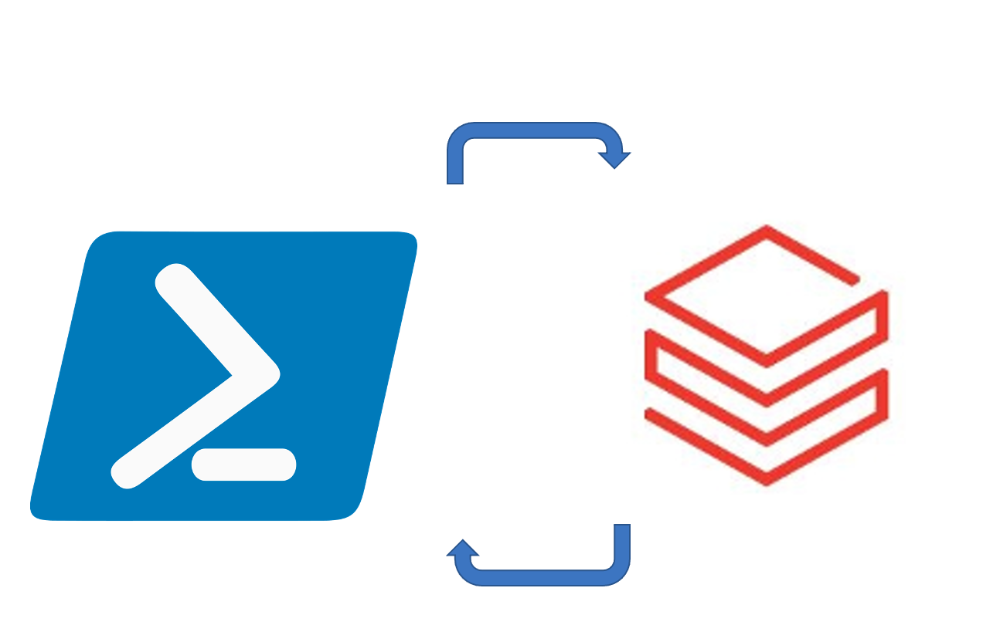
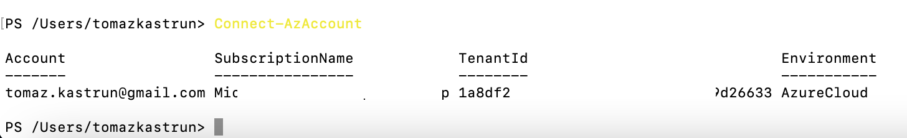
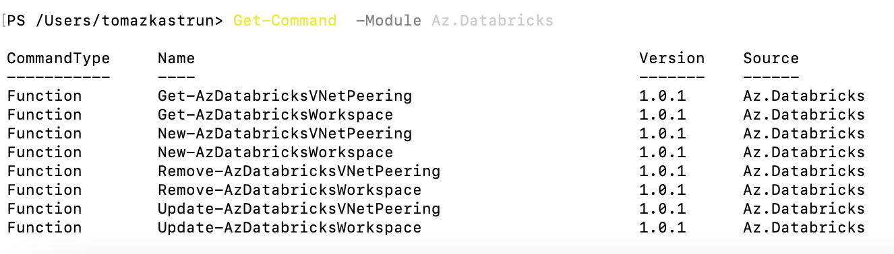
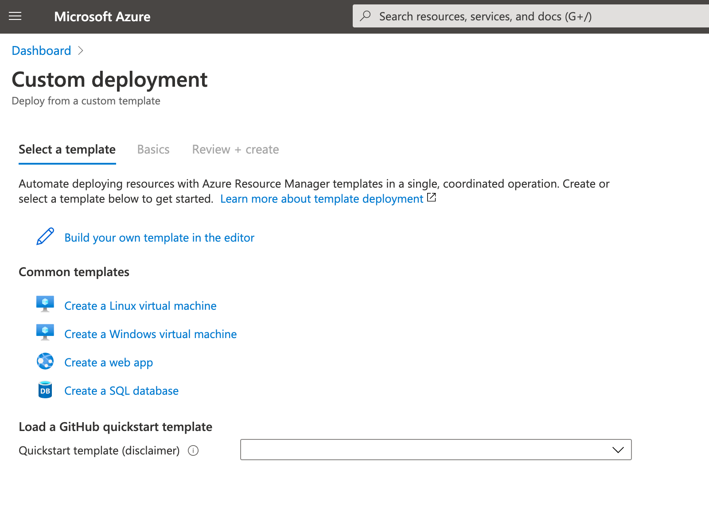
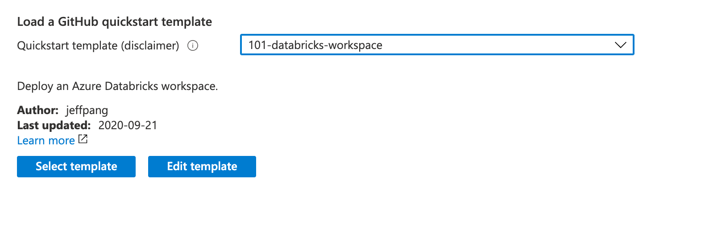
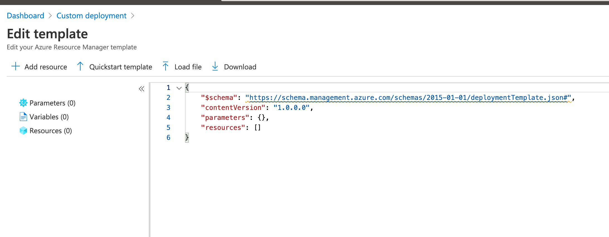
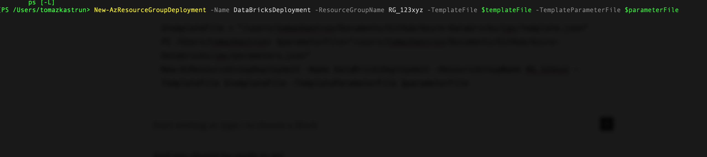
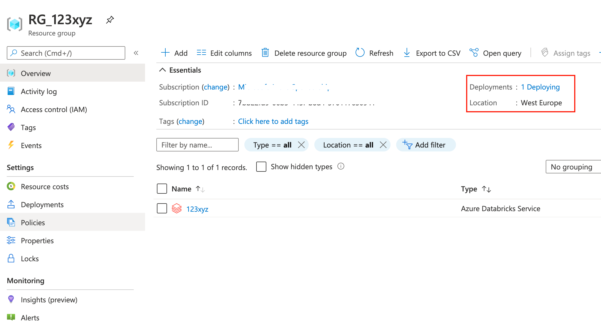
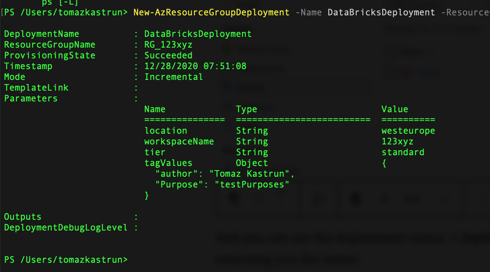

<!-- README.md was wriiten in beautiful MacDown  -->
# Dec 28 2020 - Infrastructure as Code and how to automate, script and deploy Azure Databricks with Powershell

<!-- badges: start -->

<!-- badges: end -->

Azure Databricks repository is 
a set of blogposts as a Advent of 2020 present to readers for easier onboarding
to Azure Databricks! 

<!-- wp:paragraph -->

Series of Azure Databricks posts:

<!-- /wp:paragraph -->

<!-- wp:list -->
<ul><li>Dec 01: <a rel="noreferrer noopener" href="https://tomaztsql.wordpress.com/2020/12/01/advent-of-2020-day-1-what-is-azure-databricks/" target="_blank">What is Azure Databricks</a></li><li>Dec 02: <a rel="noreferrer noopener" href="https://tomaztsql.wordpress.com/2020/12/02/advent-of-2020-day-2-how-to-get-started-with-azure-databricks/" target="_blank">How to get started with Azure Databricks</a></li><li>Dec 03: <a href="https://tomaztsql.wordpress.com/2020/12/03/advent-of-2020-day-3-getting-to-know-the-workspace-and-azure-databricks-platform/" target="_blank" rel="noreferrer noopener">Getting to know the workspace and Azure Databricks platform</a></li>
<li>Dec 04: <a href="https://tomaztsql.wordpress.com/2020/12/04/advent-of-2020-day-4-creating-your-first-azure-databricks-cluster/" target="_blank" rel="noreferrer noopener">Creating your first Azure Databricks cluster</a></li>
<li>Dec 05: <a href="https://tomaztsql.wordpress.com/2020/12/05/advent-of-2020-day-5-understanding-azure-databricks-cluster-architecture-workers-drivers-and-jobs/" target="_blank" rel="noreferrer noopener">Understanding Azure Databricks cluster architecture, workers, drivers and jobs</a></li>
<li>Dec 06: <a href="https://tomaztsql.wordpress.com/2020/12/06/advent-of-2020-day-6-importing-and-storing-data-to-azure-databricks/" target="_blank" rel="noreferrer noopener">Importing and storing data to Azure Databricks</a></li>
<li>Dec 07: <a href="https://tomaztsql.wordpress.com/2020/12/07/advent-of-2020-day-7-starting-with-databricks-notebooks-and-loading-data-to-dbfs/" target="_blank" rel="noreferrer noopener">Starting with Databricks notebooks and loading data to DBFS</a></li>
<li>Dec 08: <a href="https://tomaztsql.wordpress.com/2020/12/08/advent-of-2020-day-8-using-databricks-cli-and-dbfs-cli-for-file-upload/" target="_blank" rel="noreferrer noopener"> Using Databricks CLI and DBFS CLI for file upload</a></li>
<li>Dec 09: <a href="https://tomaztsql.wordpress.com/2020/12/09/advent-of-2020-day-9-connect-to-azure-blob-storage-using-notebooks-in-azure-databricks/" target="_blank" rel="noreferrer noopener">Connect to Azure Blob storage using Notebooks in  Azure Databricks</a></li>
<li>Dec 10: <a href="https://tomaztsql.wordpress.com/2020/12/10/advent-of-2020-day-10-using-azure-databricks-notebooks-with-sql-for-data-engineering-tasks/" target="_blank" rel="noreferrer noopener">Using Azure Databricks Notebooks with SQL for Data engineering tasks</a></li>
<li>Dec 11: <a href="https://tomaztsql.wordpress.com/2020/12/11/advent-of-2020-day-11-using-azure-databricks-notebooks-with-r-language-for-data-analytics/" target="_blank" rel="noreferrer noopener">Using Azure Databricks Notebooks with R Language for data analytics</a></li>
<li>Dec 12: <a href="https://tomaztsql.wordpress.com/2020/12/12/advent-of-2020-day-12-using-azure-databricks-notebooks-with-python-language-for-data-analytics/" target="_blank" rel="noreferrer noopener">Using Azure Databricks Notebooks with Python Language for data analytics</a></li>
<li>Dec 13: <a href="https://tomaztsql.wordpress.com/2020/12/13/adventof-2020-day-13-using-python-databricks-koalas-with-azure-databricks/" target="_blank" rel="noreferrer noopener">Using Python Databricks Koalas with Azure Databricks</a></li>
<li>Dec 14: <a href="https://tomaztsql.wordpress.com/2020/12/14/advent-of-2020-day-14-from-configuration-to-execution-of-databricks-jobs/" target="_blank" rel="noreferrer noopener">From configuration to execution of Databricks jobs</a></li>
<li>Dec 15: <a href="https://tomaztsql.wordpress.com/2020/12/15/advent-of-2020-day-15-databricks-spark-ui-event-logs-driver-logs-and-metrics/" target="_blank" rel="noreferrer noopener">Databricks Spark UI, Event Logs, Driver logs and Metrics</a></li>
<li>Dec 16: <a href="https://tomaztsql.wordpress.com/2020/12/16/advent-of-2020-day-16-databricks-experiments-models-and-mlflow/" target="_blank" rel="noreferrer noopener">Databricks experiments, models and MLFlow</a></li>
<li>Dec 17: <a href="https://tomaztsql.wordpress.com/2020/12/17/advent-of-2020-day-17-end-to-end-machine-learning-project-in-azure-databricks/" target="_blank" rel="noreferrer noopener">End-to-End Machine learning project in Azure Databricks</a></li>
<li>Dec 18: <a href="https://tomaztsql.wordpress.com/2020/12/18/advent-of-2020-day-18-using-azure-data-factory-with-azure-databricks/" target="_blank" rel="noreferrer noopener">Using Azure Data Factory with Azure Databricks</a></li>
<li>Dec 19: <a href="https://tomaztsql.wordpress.com/2020/12/19/advent-of-2020-day-19-using-azure-data-factory-with-azure-databricks-for-merging-csv-files/" target="_blank" rel="noreferrer noopener">Using Azure Data Factory with Azure Databricks for merging CSV files</a></li>
<li>Dec 20: <a href="https://tomaztsql.wordpress.com/2020/12/20/advent-of-2020-day-20-orchestrating-multiple-notebooks-with-azure-databricks/" target="_blank" rel="noreferrer noopener">Orchestrating multiple notebooks with Azure Databricks</a></li>
<li>Dec 21: <a href="https://tomaztsql.wordpress.com/2020/12/21/advent-of-2020-day-21-using-scala-with-spark-core-api-in-azure-databricks/" target="_blank" rel="noreferrer noopener">Using Scala with Spark Core API in Azure Databricks</a></li>
<li>Dec 22: <a href="https://tomaztsql.wordpress.com/2020/12/22/advent-of-2020-day-22-using-spark-sql-and-dataframes-in-azure-databricks/" target="_blank" rel="noreferrer noopener">Using Spark SQL and DataFrames in Azure Databricks</a></li>
<li>Dec 23: <a href="https://tomaztsql.wordpress.com/2020/12/23/advent-of-2020-day-23-using-spark-streaming-in-azure-databricks/" target="_blank" rel="noreferrer noopener">Using Spark Streaming in Azure Databricks</a></li>
<li>Dec 24: <a href="https://tomaztsql.wordpress.com/2020/12/24/advent-of-2020-day-24-using-spark-mllib-for-machine-learning-in-azure-databricks/" target="_blank" rel="noreferrer noopener">Using Spark MLlib for Machine Learning in Azure Databricks</a></li>
<li>Dec 25: <a href="https://tomaztsql.wordpress.com/2020/12/25/advent-of-2020-day-25-using-spark-graphframes-in-azure-databricks/" target="_blank" rel="noreferrer noopener">Using Spark GraphFrames in Azure Databricks</a></li>
<li>Dec 26: <a href="https://tomaztsql.wordpress.com/2020/12/26/advent-of-2020-day-26-connecting-azure-machine-learning-services-workspace-and-azure-databricks/" target="_blank" rel="noreferrer noopener">Connecting Azure Machine Learning Services Workspace and Azure Databricks</a></li>

<li>Dec 27: <a href="https://tomaztsql.wordpress.com/2020/12/27/advent-of-2020-day-27-connecting-azure-databricks-with-on-premise-environment/" target="_blank" rel="noreferrer noopener">Connecting Azure Databricks with on premise environment</a></li>

</ul>
<!-- /wp:list -->

<!-- wp:paragraph -->

Yesterday we looked into bringing the capabilities of Databricks closer to your client machine. And making that coding, data wrangling and data science little bit more convenient. 

<!-- /wp:paragraph -->

<!-- wp:paragraph -->

Today we will look into deploying Databricks workspace using Powershell.

<!-- /wp:paragraph -->

<!-- wp:paragraph -->

You will need nothing CLI, Powershell and all that you already have. So, let's go into CLI and get the Azure Powershell Module. 

<!-- /wp:paragraph -->

<!-- wp:paragraph -->

In CLI type:

<!-- /wp:paragraph -->

<!-- wp:syntaxhighlighter/code -->
<pre class="wp-block-syntaxhighlighter-code">if ($PSVersionTable.PSEdition -eq 'Desktop' -and (Get-Module -Name AzureRM -ListAvailable)) {
    Write-Warning -Message ('Az module not installed. Having both the AzureRM and ' +
      'Az modules installed at the same time is not supported.')
} else {
    Install-Module -Name Az -AllowClobber -Scope CurrentUser
}</pre>
<!-- /wp:syntaxhighlighter/code -->

<!-- wp:paragraph -->

After that, you can connect to your Azure subscription:

<!-- /wp:paragraph -->

<!-- wp:syntaxhighlighter/code -->
<pre class="wp-block-syntaxhighlighter-code">Connect-AzAccount</pre>
<!-- /wp:syntaxhighlighter/code -->

<!-- wp:paragraph -->

You will be prompted to add your credentials. And once you enter them, you will get the results on your <em>Account</em>, <em>tenantID</em>, <em>Environment</em> and <em>Subscription Name.</em>

<!-- /wp:paragraph -->

<!-- wp:paragraph -->

Once connected, we will look into Databricks module. To list all the modules:

<!-- /wp:paragraph -->

<!-- wp:syntaxhighlighter/code -->
<pre class="wp-block-syntaxhighlighter-code">Get-Module -ListAvailable</pre>
<!-- /wp:syntaxhighlighter/code -->

<!-- wp:paragraph -->

To explore what is available for Az.Databricks, lets see with the following PS command:

<!-- /wp:paragraph -->

<!-- wp:syntaxhighlighter/code -->
<pre class="wp-block-syntaxhighlighter-code">Get-Command -Module Az.Databricks</pre>
<!-- /wp:syntaxhighlighter/code -->

<!-- wp:paragraph -->

Now we can create a new Workspace. In this manner, you can also create "semi" automation, but ARM will make this next steps even easier.

<!-- /wp:paragraph -->

<!-- wp:syntaxhighlighter/code -->
<pre class="wp-block-syntaxhighlighter-code">New-AzDatabricksWorkspace  `
   -Name databricks-test  `
   -ResourceGroupName testgroup  `
   -Location eastus  `
   -ManagedResourceGroupName databricks-group  `
   -Sku standard
</pre>
<!-- /wp:syntaxhighlighter/code -->

<!-- wp:paragraph -->

Or we can use ARM (Azure Resource Manager) deployment:

<!-- /wp:paragraph -->

<!-- wp:syntaxhighlighter/code -->
<pre class="wp-block-syntaxhighlighter-code">$templateFile = "/users/template.json"
New-AzResourceGroupDeployment `
  -Name blanktemplate `
  -ResourceGroupName myResourceGroup `
  -TemplateFile $templateFile</pre>
<!-- /wp:syntaxhighlighter/code -->

<!-- wp:paragraph -->

Or you can go through Deployment process in Azure Portal:

<!-- /wp:paragraph -->

<!-- wp:paragraph -->

And select a Github template to create a new Azure Databricks workspace:

<!-- /wp:paragraph -->

<!-- wp:paragraph -->

Or you can go under "Build your own template" and get my <a rel="noreferrer noopener" href="https://github.com/tomaztk/Azure-Databricks/tree/main/iac" target="_blank">Github Repository  IaC folder </a>with template.json and Parameters.json files and paste the content in here.

<!-- /wp:paragraph -->

<!-- wp:paragraph -->

Add First the new resource group:

<!-- /wp:paragraph -->

<!-- wp:syntaxhighlighter/code -->
<pre class="wp-block-syntaxhighlighter-code">New-AzResourceGroup -Name RG_123xyz  -Location “westeurope”</pre>
<!-- /wp:syntaxhighlighter/code -->

<!-- wp:paragraph -->

And at the end generate the JSON files for your automated deployment. Adding with parameters file:

<!-- /wp:paragraph -->

<!-- wp:syntaxhighlighter/code -->
<pre class="wp-block-syntaxhighlighter-code">$templateFile = "/users/tomazkastrun/Documents/GitHub/Azure-Databricks/iac/template.json"
PS /Users/tomazkastrun> $parameterFile=“/users/tomazkastrun/Documents/GitHub/Azure-Databricks/iac/parameters.json”
New-AzResourceGroupDeployment -Name DataBricksDeployment -ResourceGroupName RG_123xyz -TemplateFile $templateFile -TemplateParameterFile $parameterFile</pre>
<!-- /wp:syntaxhighlighter/code -->

<!-- wp:paragraph -->

This will take some time:

<!-- /wp:paragraph -->

<!-- wp:paragraph -->

But you can always check the happening in Azure Portal:

<!-- /wp:paragraph -->

<!-- wp:paragraph -->

And you can see the deployment status: <em>1 Deploying</em>. And once you are finished, you will have the PowerShell returning you the status:

<!-- /wp:paragraph -->

<!-- wp:paragraph -->

These values will be same as the one in parameters.JSON file. In this manner you can automate your deployment and continuous integration (CI) and continuous deployment (CD). 

<!-- /wp:paragraph -->

<!-- wp:paragraph -->

Tomorrow we will dig into Apache Spark.

<!-- /wp:paragraph -->

<!-- wp:paragraph -->

Complete set of code and the Notebook is available at the<a rel="noreferrer noopener" href="https://github.com/tomaztk/Azure-Databricks" target="_blank">&nbsp;Github repository</a>.

<!-- /wp:paragraph -->

<!-- wp:paragraph -->

Happy Coding and Stay Healthy!

<!-- /wp:paragraph -->
