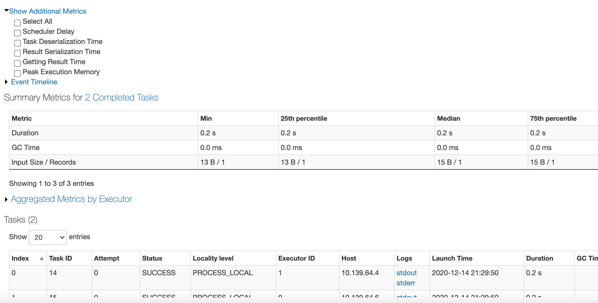
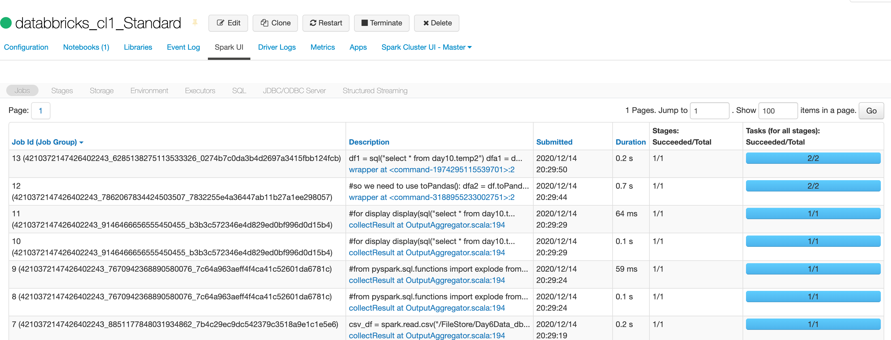
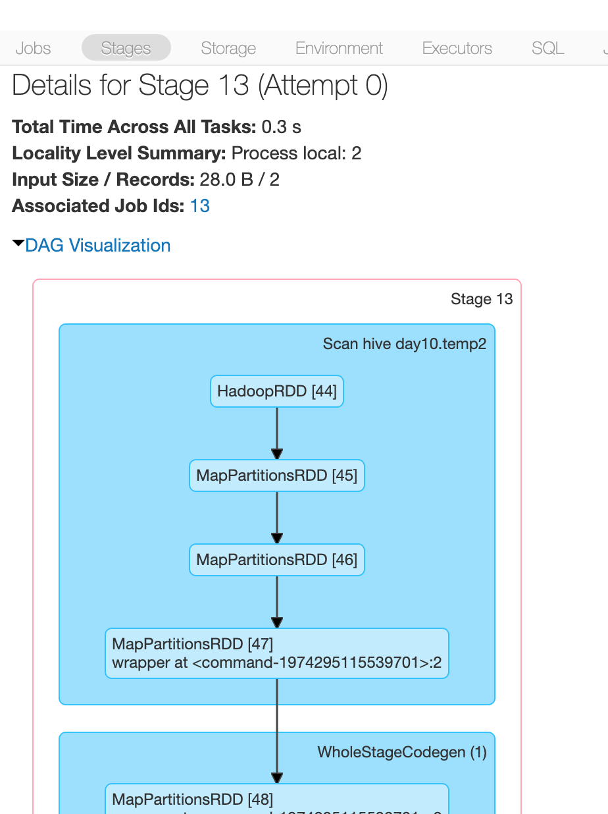

<!-- README.md was wriiten in beautiful MacDown  -->
# Dec 30 2020 - Monitoring and troubleshooting of Apache Spark

<!-- badges: start -->

<!-- badges: end -->

Azure Databricks repository is 
a set of blogposts as a Advent of 2020 present to readers for easier onboarding
to Azure Databricks! 

<!-- wp:paragraph -->

Series of Azure Databricks posts:

<!-- /wp:paragraph -->

<!-- wp:list -->
<ul><li>Dec 01: <a rel="noreferrer noopener" href="https://tomaztsql.wordpress.com/2020/12/01/advent-of-2020-day-1-what-is-azure-databricks/" target="_blank">What is Azure Databricks</a></li><li>Dec 02: <a rel="noreferrer noopener" href="https://tomaztsql.wordpress.com/2020/12/02/advent-of-2020-day-2-how-to-get-started-with-azure-databricks/" target="_blank">How to get started with Azure Databricks</a></li><li>Dec 03: <a href="https://tomaztsql.wordpress.com/2020/12/03/advent-of-2020-day-3-getting-to-know-the-workspace-and-azure-databricks-platform/" target="_blank" rel="noreferrer noopener">Getting to know the workspace and Azure Databricks platform</a></li>
<li>Dec 04: <a href="https://tomaztsql.wordpress.com/2020/12/04/advent-of-2020-day-4-creating-your-first-azure-databricks-cluster/" target="_blank" rel="noreferrer noopener">Creating your first Azure Databricks cluster</a></li>
<li>Dec 05: <a href="https://tomaztsql.wordpress.com/2020/12/05/advent-of-2020-day-5-understanding-azure-databricks-cluster-architecture-workers-drivers-and-jobs/" target="_blank" rel="noreferrer noopener">Understanding Azure Databricks cluster architecture, workers, drivers and jobs</a></li>
<li>Dec 06: <a href="https://tomaztsql.wordpress.com/2020/12/06/advent-of-2020-day-6-importing-and-storing-data-to-azure-databricks/" target="_blank" rel="noreferrer noopener">Importing and storing data to Azure Databricks</a></li>
<li>Dec 07: <a href="https://tomaztsql.wordpress.com/2020/12/07/advent-of-2020-day-7-starting-with-databricks-notebooks-and-loading-data-to-dbfs/" target="_blank" rel="noreferrer noopener">Starting with Databricks notebooks and loading data to DBFS</a></li>
<li>Dec 08: <a href="https://tomaztsql.wordpress.com/2020/12/08/advent-of-2020-day-8-using-databricks-cli-and-dbfs-cli-for-file-upload/" target="_blank" rel="noreferrer noopener"> Using Databricks CLI and DBFS CLI for file upload</a></li>
<li>Dec 09: <a href="https://tomaztsql.wordpress.com/2020/12/09/advent-of-2020-day-9-connect-to-azure-blob-storage-using-notebooks-in-azure-databricks/" target="_blank" rel="noreferrer noopener">Connect to Azure Blob storage using Notebooks in  Azure Databricks</a></li>
<li>Dec 10: <a href="https://tomaztsql.wordpress.com/2020/12/10/advent-of-2020-day-10-using-azure-databricks-notebooks-with-sql-for-data-engineering-tasks/" target="_blank" rel="noreferrer noopener">Using Azure Databricks Notebooks with SQL for Data engineering tasks</a></li>
<li>Dec 11: <a href="https://tomaztsql.wordpress.com/2020/12/11/advent-of-2020-day-11-using-azure-databricks-notebooks-with-r-language-for-data-analytics/" target="_blank" rel="noreferrer noopener">Using Azure Databricks Notebooks with R Language for data analytics</a></li>
<li>Dec 12: <a href="https://tomaztsql.wordpress.com/2020/12/12/advent-of-2020-day-12-using-azure-databricks-notebooks-with-python-language-for-data-analytics/" target="_blank" rel="noreferrer noopener">Using Azure Databricks Notebooks with Python Language for data analytics</a></li>
<li>Dec 13: <a href="https://tomaztsql.wordpress.com/2020/12/13/adventof-2020-day-13-using-python-databricks-koalas-with-azure-databricks/" target="_blank" rel="noreferrer noopener">Using Python Databricks Koalas with Azure Databricks</a></li>
<li>Dec 14: <a href="https://tomaztsql.wordpress.com/2020/12/14/advent-of-2020-day-14-from-configuration-to-execution-of-databricks-jobs/" target="_blank" rel="noreferrer noopener">From configuration to execution of Databricks jobs</a></li>
<li>Dec 15: <a href="https://tomaztsql.wordpress.com/2020/12/15/advent-of-2020-day-15-databricks-spark-ui-event-logs-driver-logs-and-metrics/" target="_blank" rel="noreferrer noopener">Databricks Spark UI, Event Logs, Driver logs and Metrics</a></li>
<li>Dec 16: <a href="https://tomaztsql.wordpress.com/2020/12/16/advent-of-2020-day-16-databricks-experiments-models-and-mlflow/" target="_blank" rel="noreferrer noopener">Databricks experiments, models and MLFlow</a></li>
<li>Dec 17: <a href="https://tomaztsql.wordpress.com/2020/12/17/advent-of-2020-day-17-end-to-end-machine-learning-project-in-azure-databricks/" target="_blank" rel="noreferrer noopener">End-to-End Machine learning project in Azure Databricks</a></li>
<li>Dec 18: <a href="https://tomaztsql.wordpress.com/2020/12/18/advent-of-2020-day-18-using-azure-data-factory-with-azure-databricks/" target="_blank" rel="noreferrer noopener">Using Azure Data Factory with Azure Databricks</a></li>
<li>Dec 19: <a href="https://tomaztsql.wordpress.com/2020/12/19/advent-of-2020-day-19-using-azure-data-factory-with-azure-databricks-for-merging-csv-files/" target="_blank" rel="noreferrer noopener">Using Azure Data Factory with Azure Databricks for merging CSV files</a></li>
<li>Dec 20: <a href="https://tomaztsql.wordpress.com/2020/12/20/advent-of-2020-day-20-orchestrating-multiple-notebooks-with-azure-databricks/" target="_blank" rel="noreferrer noopener">Orchestrating multiple notebooks with Azure Databricks</a></li>
<li>Dec 21: <a href="https://tomaztsql.wordpress.com/2020/12/21/advent-of-2020-day-21-using-scala-with-spark-core-api-in-azure-databricks/" target="_blank" rel="noreferrer noopener">Using Scala with Spark Core API in Azure Databricks</a></li>
<li>Dec 22: <a href="https://tomaztsql.wordpress.com/2020/12/22/advent-of-2020-day-22-using-spark-sql-and-dataframes-in-azure-databricks/" target="_blank" rel="noreferrer noopener">Using Spark SQL and DataFrames in Azure Databricks</a></li>
<li>Dec 23: <a href="https://tomaztsql.wordpress.com/2020/12/23/advent-of-2020-day-23-using-spark-streaming-in-azure-databricks/" target="_blank" rel="noreferrer noopener">Using Spark Streaming in Azure Databricks</a></li>
<li>Dec 24: <a href="https://tomaztsql.wordpress.com/2020/12/24/advent-of-2020-day-24-using-spark-mllib-for-machine-learning-in-azure-databricks/" target="_blank" rel="noreferrer noopener">Using Spark MLlib for Machine Learning in Azure Databricks</a></li>
<li>Dec 25: <a href="https://tomaztsql.wordpress.com/2020/12/25/advent-of-2020-day-25-using-spark-graphframes-in-azure-databricks/" target="_blank" rel="noreferrer noopener">Using Spark GraphFrames in Azure Databricks</a></li>
<li>Dec 26: <a href="https://tomaztsql.wordpress.com/2020/12/26/advent-of-2020-day-26-connecting-azure-machine-learning-services-workspace-and-azure-databricks/" target="_blank" rel="noreferrer noopener">Connecting Azure Machine Learning Services Workspace and Azure Databricks</a></li>
<li>Dec 27: <a href="https://tomaztsql.wordpress.com/2020/12/27/advent-of-2020-day-27-connecting-azure-databricks-with-on-premise-environment/" target="_blank" rel="noreferrer noopener">Connecting Azure Databricks with on premise environment</a></li>
<li>Dec 28: <a href="https://tomaztsql.wordpress.com/2020/12/28/advent-of-2020-day-28-infrastructure-as-code-and-how-to-automate-script-and-deploy-azure-databricks-with-powershell/" target="_blank" rel="noreferrer noopener">Infrastructure as Code and how to automate, script and deploy Azure Databricks with Powershell</a></li>

<li>Dec 29: <a href="https://tomaztsql.wordpress.com/2020/12/29/advent-of-2020-day-29-performance-tuning-of-apache-spark/" target="_blank" rel="noreferrer noopener">Performance tuning for Apache Spark</a></li>

</ul>
<!-- /wp:list -->

<!-- wp:paragraph -->

Yesterday we looked into performance tuning for improving day to day usage of Spark and Azure Databricks. And today we will look explore monitoring (as we have started on <a rel="noreferrer noopener" href="https://tomaztsql.wordpress.com/2020/12/15/advent-of-2020-day-15-databricks-spark-ui-event-logs-driver-logs-and-metrics/" target="_blank">Day 15</a>)  and troubleshooting for most common mistakes or error a user in Azure Databricks will encounter.

<!-- /wp:paragraph -->

<!-- wp:paragraph -->
## 1.Monitoring
<!-- /wp:paragraph -->

<!-- wp:paragraph -->

Spark in Databricks is relatively taken care of and can be monitored from Spark UI. Since Databricks is a encapsulated platform, in a way Azure is managing many of the components for you, from Network, to JVM (Java Virtual Machine), hosting operating system and many of the cluster components, Mesos, YARN and any other spark cluster application.

<!-- /wp:paragraph -->

<!-- wp:paragraph -->

As we have seen on the Day 15 post, you can monitor Query, tasks, jobs, Spark Logs and Spark UI in Azure Databricks. Spark Logs will help you pinpoint the problem that you are encountering. It is also good for creating a history logs to understand the behaviour of the job or the task over time and for possible future troubleshooting.

<!-- /wp:paragraph -->

<!-- wp:paragraph -->

Spark UI is a good visual way to monitor what is happening to your cluster and offers a great value of metrics for troubleshooting.

<!-- /wp:paragraph -->

<!-- wp:paragraph -->

It also gives you detailed information on Spark Tasks and great visual presentation of the task run, SQL run and detailed run of all the stages.

<!-- /wp:paragraph -->

<!-- wp:paragraph -->

All of the tasks can be visualized also as DAG:

<!-- /wp:paragraph -->

<!-- wp:paragraph -->
## 2. Troubleshooting
<!-- /wp:paragraph -->

<!-- wp:paragraph -->

Approaching Spark debugging, let me give you some causes or views and symptoms of problems in your Spark Jobs and Spark engine itself. There are many issues one can account, I will try to tackle couple of those that can be found as a return message in Databricks notebooks or in Spark UI in general.

<!-- /wp:paragraph -->

<!-- wp:paragraph -->
### 2.1. Spark job not started
<!-- /wp:paragraph -->

<!-- wp:paragraph -->

This issue can appear frequently, especially if you are beginner but can also happen when there is Spark running standalone (not in Azure Databricks).

<!-- /wp:paragraph -->

<!-- wp:paragraph -->

<em>Sign and symptoms: </em> - Spark job don't start - Spark UI does not show any nodes on cluster (except the driver) - Spark UI is reporting vague information

<!-- /wp:paragraph -->

<!-- wp:paragraph -->

<em>Potential Solution:</em> - Cluster is not started or is starting up, - This often happens with poorly configured cluster (usually when running Spark applications and (almost) never with Azure Databricks), either IP or network or VNet, - It can be a memory configuration issue and should be reconfigured in the start up scripts.

<!-- /wp:paragraph -->

<!-- wp:paragraph -->
### 2.2. Error during execution of notebook
<!-- /wp:paragraph -->

<!-- wp:paragraph -->

During work in notebooks on a cluster that is already running, it can happen that some part of the code or the Spark Job, that was previously running ok, started to fail. 

<!-- /wp:paragraph -->

<!-- wp:paragraph -->

<em>Sign and symptoms:</em> - a job on a Cluster runs successfully over all clusters, but on one fails - code blocks in notebook runs normally in sequences, but one run fails - HiveSQL table or R/Python Dataframe, that used to to be created  normally, can not be created

<!-- /wp:paragraph -->

<!-- wp:paragraph -->

<em>Potential Solution:</em> - check if your data still exists on the expected location or if the data is still in the  same  file format - if you are running a SQL query, check if the query is valid and all the column names are correct - try to go through stack trace and try to figure out which component is failing

<!-- /wp:paragraph -->

<!-- wp:paragraph -->
### 2.3. Cluster unresponsive
<!-- /wp:paragraph -->

<!-- wp:paragraph -->

When running notebook commands or using Spark Apps (widgets, etc), you can get a message that cluster. This is a severe error and should be 

<!-- /wp:paragraph -->

<!-- wp:paragraph -->

<em>Sign and symptoms:</em> - code block is not executed and fails with loads of JVM responses - you get a error message, that cluster is unresponsive - Spark job is running, with no return or error message.

<!-- /wp:paragraph -->

<!-- wp:paragraph -->

<em>Potential Solution:</em> - restart the cluster and attach the notebook to a cluster - check the dataset for any inconsistencies, data size (limitations of the file uploaded or distribution of the files over DBFS), - check the compatibility of the installed libraries and spark version on your cluster. - change the cluster setting from standard, GPU, ML to LTS. Long-Term Support Spark installation tend to have greater span of compatibility. - if you are using high-concurrency cluster, check who and what they are doing, it there is a potential "dead-lock" in some tasks that consume too many resources.

<!-- /wp:paragraph -->

<!-- wp:paragraph -->
### 2.4. Fail to load data
<!-- /wp:paragraph -->

<!-- wp:paragraph -->

Loading data is probably the most important task in Azure Databricks. And there can be many ways, that data can not be presented in the notebook.

<!-- /wp:paragraph -->

<!-- wp:paragraph -->

Sign and symptoms: - data is stored in blob storage and can not be accessed or loaded to Databricks - data is taking too long to load, and I stop the load process - data should be at the location, but it is not

<!-- /wp:paragraph -->

<!-- wp:paragraph -->

Potential Solution: - if you are reading the data from Azure blob storage, check that Azure Databricks have all the needed credentials for access - loading data files that are wide (have 1000+ columns) might cause some problems with Spark. Load schema first and create a DataFrame with Scala and later insert the data into the frame - check if the persistent data (DBFS) is on the correct location and in expected data format. It can also happen that different sample files are used, which in this case might be missing from standard DBFS path - DataFrame or Dataset was created in different language that the one, you are trying to read it from. Languages sit on top of Structured API and should be interchangeable, so you should check your code for some inconsistencies.

<!-- /wp:paragraph -->

<!-- wp:paragraph -->
### 2.5. Unexpected Null in Results
<!-- /wp:paragraph -->

<!-- wp:paragraph -->

Sign and symptoms: - unexpected Null values in Spark transformations - scheduled jobs that use to work no longer work, or no longer produce the correct result

<!-- /wp:paragraph -->

<!-- wp:paragraph -->

Potential Solution: - it can be the cause of underlying data that has had format changed, - use accumulator to run and try to count the number of rows (or records or observations) or try to parse or process the error where a row (record/observation) is missing, - check and ensure that transformations in data return a valid SQL query plan; check for some implicit data type conversions (a "15" is a string and not a number, respectively) and Spark can return a strange result or no result.

<!-- /wp:paragraph -->

<!-- wp:paragraph -->
### 2.6. Slow Aggregations
<!-- /wp:paragraph -->

<!-- wp:paragraph -->

This is somehow common problem and also hardest to tackle. Usually happen because of unevenly distributed workload across cluster or because of hardware failure (one disk / VM is unresponsive).

<!-- /wp:paragraph -->

<!-- wp:paragraph -->

<em>Sign and symptoms:</em> - slow task by .groupBy() call - after data aggregation, jobs are still slow

<!-- /wp:paragraph -->

<!-- wp:paragraph -->

<em>Potential Solution:</em> - try changing the partitioning of the data, to have less data per partition. - try changing the partition key on your dataset - check that your SELECT statement is gaining performance from the partitions - if you are using RDD, try to create a DataFrame or Dataset to get the aggregations done faster 

<!-- /wp:paragraph -->

<!-- wp:paragraph -->

Tomorrow we will finish with series with looking into sources, documentations and next learning steps and it should be a nice way to wrap up the series.

<!-- /wp:paragraph -->

<!-- wp:paragraph -->

Complete set of code and the Notebook is available at the<a rel="noreferrer noopener" href="https://github.com/tomaztk/Azure-Databricks" target="_blank">&nbsp;Github repository</a>.

<!-- /wp:paragraph -->

<!-- wp:paragraph -->

Happy Coding and Stay Healthy!

<!-- /wp:paragraph -->
